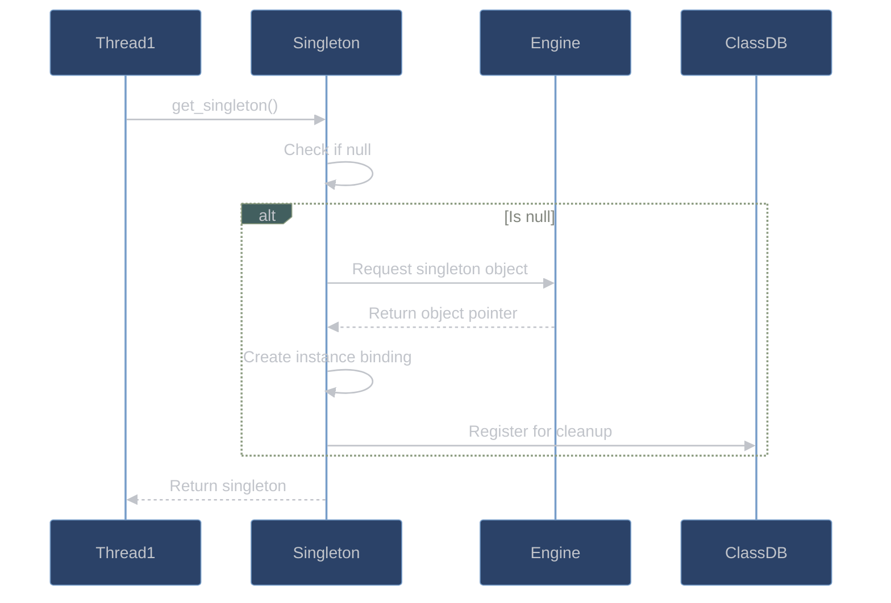
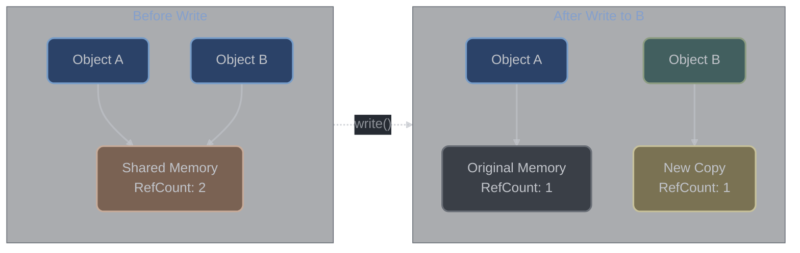

# Complex Patterns

## Table of Contents
1. [Thread-Safe Singletons](#thread-safe-singletons)
2. [Lock-Free Data Structures](#lock-free-data-structures)
3. [Copy-on-Write (COW) Implementation](#copy-on-write-cow-implementation)
4. [Memory Pool Management](#memory-pool-management)
5. [Custom Server Patterns](#custom-server-patterns)
6. [Thread Synchronization](#thread-synchronization)
7. [Performance Patterns](#performance-patterns)

## Overview

This document covers advanced implementation patterns used throughout godot-cpp for performance, thread safety, and memory efficiency. These patterns are essential for understanding how godot-cpp achieves high performance while maintaining safety across the binary boundary.

## Thread-Safe Singletons

### Engine Singleton Pattern

> **Singleton Strategy**: Engine singletons use double-checked locking with `unlikely()` branch prediction hints. The first check avoids lock overhead in the common case (singleton already initialized), while the engine handles thread safety for the actual initialization. This pattern achieves near-zero overhead after first access.

godot-cpp implements thread-safe lazy initialization for engine singletons:



```cpp
// Generated singleton pattern (from binding generator)
class Engine : public Object {
    static Engine *singleton;

public:
    static Engine *get_singleton() {
        // Thread-safe lazy initialization without explicit locks
        if (unlikely(singleton == nullptr)) {
            // Get singleton from engine (thread-safe on engine side)
            GDExtensionObjectPtr singleton_obj =
                internal::gdextension_interface_global_get_singleton(
                    Engine::get_class_static()._native_ptr()
                );

            // Create binding (potential race handled by assignment)
            singleton = reinterpret_cast<Engine *>(
                internal::gdextension_interface_object_get_instance_binding(
                    singleton_obj,
                    internal::token,
                    &Engine::_gde_binding_callbacks
                )
            );

            // Register for cleanup
            if (likely(singleton)) {
                ClassDB::_register_engine_singleton(
                    Engine::get_class_static(),
                    singleton
                );
            }
        }
        return singleton;
    }
};
```

### Thread-Safe Class Registration

ClassDB uses internal synchronization for thread-safe class registration:

| Registration Phase | Thread Safety | Performance Impact |
|-------------------|---------------|--------------------|
| Initialization (startup) | Single-threaded | No locks needed |
| Runtime (hot reload) | Engine locks | ~100ns overhead |
| Access (method calls) | Lock-free | Zero overhead |

```cpp
// ClassDB singleton management
class ClassDB {
    // Engine handles synchronization internally
    static std::unordered_map<StringName, ClassInfo> classes;
    static std::vector<StringName> class_register_order;
    static std::unordered_map<StringName, Object *> engine_singletons;

    template <typename T>
    static void register_class(bool p_virtual = false) {
        // Registration happens during initialization (single-threaded)
        // Runtime registration uses engine's internal locks
        T::initialize_class();
        ClassInfo &info = classes[T::get_class_static()];
        info.name = T::get_class_static();
        info.parent_name = T::get_parent_class_static();

        // Engine handles thread safety for runtime registration
        if (p_runtime) {
            internal::gdextension_interface_classdb_register_extension_class(
                internal::library,
                &info.name,
                &info.parent_name,
                &T::_gde_binding_callbacks
            );
        }
    }
};
```

## Lock-Free Data Structures

### SpinLock Implementation

> **When to Use SpinLock**: Use for critical sections shorter than 100 CPU cycles where contention is rare. SpinLocks avoid OS kernel transitions (unlike mutex) but burn CPU cycles while waiting. Perfect for updating a single pointer or incrementing a counter. Never use if the critical section might block or take more than 1 microsecond.

Ultra-lightweight spinlock for short critical sections:

| Property | SpinLock | std::mutex | Use Case |
|----------|----------|------------|----------|
| **Overhead** | ~5 cycles | ~50 cycles | SpinLock for tiny sections |
| **Blocking** | Busy wait | OS sleep | SpinLock wastes CPU |
| **Fairness** | None | FIFO queue | Mutex for fairness |
| **Memory** | 1 byte | 40+ bytes | SpinLock is cache-friendly |

```cpp
// include/godot_cpp/templates/spin_lock.hpp:37-49
class SpinLock {
    std::atomic_flag locked = ATOMIC_FLAG_INIT;

public:
    _ALWAYS_INLINE_ void lock() {
        // Busy-wait with test-and-set
        while (locked.test_and_set(std::memory_order_acquire)) {
            // Spin until lock is available
            ;
        }
    }

    _ALWAYS_INLINE_ void unlock() {
        // Release lock with memory barrier
        locked.clear(std::memory_order_release);
    }
};
```

### Atomic Reference Counting

SafeRefCount provides lock-free reference counting:

> **Memory Ordering Choice**: The implementation uses `memory_order_acquire` for reads and `memory_order_release` for writes to ensure proper synchronization without full memory barriers. This is ~2x faster than `memory_order_seq_cst` while still preventing use-after-free bugs. The atomic operations compile to single CPU instructions on x86-64.

```cpp
// include/godot_cpp/templates/safe_refcount.hpp
class SafeRefCount {
    std::atomic<uint32_t> count{0};

public:
    _ALWAYS_INLINE_ bool ref() {
        // Atomic increment with relaxed ordering
        return ++count != 1;
    }

    _ALWAYS_INLINE_ uint32_t refval() const {
        // Atomic read with acquire semantics
        return count.load(std::memory_order_acquire);
    }

    _ALWAYS_INLINE_ bool unref() {
        // Atomic decrement with release-acquire ordering
        return --count == 0;
    }

    _ALWAYS_INLINE_ uint32_t unrefval() {
        // Return value after decrement
        return --count;
    }
};
```

## Copy-on-Write (COW) Implementation

### COW Data Structure

> **COW Benefits**: Copy-on-write eliminates unnecessary memory allocations when data is shared but not modified. A copied Array/String shares the same memory until one is modified, then it's cloned. This makes passing containers by value nearly free (just reference count increment) while maintaining value semantics.

CowData implements efficient copy-on-write semantics:



```cpp
// include/godot_cpp/templates/cowdata.hpp:65-200
template <typename T>
class CowData {
private:
    // Memory layout:
    // [RefCount][Size][Data...]
    static constexpr size_t REF_COUNT_OFFSET = 0;
    static constexpr size_t SIZE_OFFSET = /* aligned after refcount */;
    static constexpr size_t DATA_OFFSET = /* aligned after size */;

    mutable T *_ptr = nullptr;

    _FORCE_INLINE_ SafeNumeric<USize> *_get_refcount() const {
        if (!_ptr) return nullptr;
        return (SafeNumeric<USize> *)((uint8_t *)_ptr - DATA_OFFSET + REF_COUNT_OFFSET);
    }

    USize _copy_on_write() {
        if (!_ptr) return 0;

        SafeNumeric<USize> *refc = _get_refcount();
        USize rc = refc->get();

        if (likely(rc > 1)) {
            // Multiple references - need to copy
            USize current_size = *_get_size();

            // Allocate new buffer
            uint8_t *mem_new = (uint8_t *)Memory::alloc_static(
                DATA_OFFSET + _get_alloc_size(current_size)
            );

            // Initialize new refcount
            SafeNumeric<USize> *refc_new = _get_refcount_ptr(mem_new);
            refc_new->set(1);

            // Copy size
            USize *size_new = _get_size_ptr(mem_new);
            *size_new = current_size;

            // Copy data
            T *_data_new = _get_data_ptr(mem_new);
            for (USize i = 0; i < current_size; i++) {
                memnew_placement(&_data_new[i], T(_ptr[i]));
            }

            // Decrement old refcount
            if (refc->decrement() == 0) {
                // We were the last one, free old buffer
                _free_data();
            }

            // Switch to new buffer
            _ptr = _data_new;
        }

        return rc;
    }

public:
    _FORCE_INLINE_ T *ptrw() {
        // Get writable pointer (triggers COW if needed)
        _copy_on_write();
        return _ptr;
    }

    _FORCE_INLINE_ const T *ptr() const {
        // Read-only access doesn't trigger COW
        return _ptr;
    }
};
```

### COW Usage in Containers

Vector and String use COW for efficient copying:

```cpp
// Example: Vector COW behavior
Vector<int> a;
a.push_back(1);
a.push_back(2);

Vector<int> b = a;  // Shallow copy, shares data
// Both a and b point to same data, refcount = 2

const int *read_ptr = b.ptr();  // Read doesn't trigger COW
int value = read_ptr[0];  // OK, reading shared data

int *write_ptr = b.ptrw();  // Write triggers COW
write_ptr[0] = 5;  // b now has its own copy, a unchanged
```

## Memory Pool Management

### Memory Allocation Strategy

godot-cpp uses custom memory allocation with pooling:

```cpp
// include/godot_cpp/core/memory.hpp
class Memory {
    // Static allocation functions use engine's memory pools
    static void *alloc_static(size_t p_bytes, bool p_pad_align = false) {
        return internal::gdextension_interface_mem_alloc(p_bytes);
    }

    static void *realloc_static(void *p_memory, size_t p_bytes, bool p_pad_align = false) {
        return internal::gdextension_interface_mem_realloc(p_memory, p_bytes);
    }

    static void free_static(void *p_ptr, bool p_pad_align = false) {
        internal::gdextension_interface_mem_free(p_ptr);
    }
};

// Placement new operators for memory pool allocation
template <typename T>
T *memnew() {
    // Allocate from pool
    void *mem = Memory::alloc_static(sizeof(T));
    // Construct in-place
    return memnew_placement(mem, T);
}

template <typename T>
void memdelete(T *p_class) {
    // Destruct
    if (p_class) {
        p_class->~T();
        // Return to pool
        Memory::free_static(p_class);
    }
}
```

### Aligned Memory Allocation

Platform-specific alignment for SIMD operations:

```cpp
// Memory alignment for different platforms
#ifdef _MSC_VER
    #define GD_ALIGNMENT(x) __declspec(align(x))
#else
    #define GD_ALIGNMENT(x) __attribute__((aligned(x)))
#endif

// SIMD-aligned structures
struct GD_ALIGNMENT(16) AlignedData {
    float values[4];  // 16-byte aligned for SSE
};

// Pool allocation with alignment
void *alloc_aligned(size_t size, size_t alignment) {
    size_t padded = size + alignment - 1;
    void *mem = Memory::alloc_static(padded + sizeof(void*));

    // Store original pointer for free
    void **result = (void**)((uintptr_t(mem) + sizeof(void*) + alignment - 1) & ~(alignment - 1));
    result[-1] = mem;

    return result;
}
```

## Custom Server Patterns

### Server Registration Pattern

Custom servers integrate with Godot's server architecture:

```cpp
// Example: Custom physics server
class CustomPhysicsServer : public PhysicsServer3D {
    static CustomPhysicsServer *singleton;

    // Thread pool for parallel processing
    WorkerThreadPool::TaskID current_task = WorkerThreadPool::INVALID_TASK_ID;

public:
    static void register_server() {
        // Register with engine during initialization
        ClassDB::register_class<CustomPhysicsServer>();

        // Create instance
        singleton = memnew(CustomPhysicsServer);

        // Register as physics singleton
        PhysicsServer3D::singleton = singleton;
        Engine::get_singleton()->register_singleton(
            "PhysicsServer3D",
            singleton
        );
    }

    // Parallel processing pattern
    void step(real_t p_delta) override {
        // Submit parallel work
        current_task = WorkerThreadPool::get_singleton()->add_native_group_task(
            &CustomPhysicsServer::_thread_step,
            this,
            island_count,
            -1,  // Use all available threads
            true,  // High priority
            "PhysicsStep"
        );

        // Wait for completion
        WorkerThreadPool::get_singleton()->wait_for_task_completion(current_task);
    }

private:
    static void _thread_step(void *p_userdata, uint32_t p_index) {
        CustomPhysicsServer *server = (CustomPhysicsServer *)p_userdata;
        server->process_island(p_index);
    }
};
```

## Thread Synchronization

### Mutex Wrapper Pattern

RAII mutex locking for exception safety:

```cpp
// include/godot_cpp/core/mutex_lock.hpp:37-49
class MutexLock {
    const Mutex &mutex;

public:
    _ALWAYS_INLINE_ explicit MutexLock(const Mutex &p_mutex) :
            mutex(p_mutex) {
        // Lock on construction
        const_cast<Mutex *>(&mutex)->lock();
    }

    _ALWAYS_INLINE_ ~MutexLock() {
        // Unlock on destruction (exception-safe)
        const_cast<Mutex *>(&mutex)->unlock();
    }
};

// Convenience macros for thread-safe classes
#define _THREAD_SAFE_CLASS_ mutable Mutex _thread_safe_;
#define _THREAD_SAFE_METHOD_ MutexLock _thread_safe_method_(_thread_safe_);
#define _THREAD_SAFE_LOCK_ _thread_safe_.lock();
#define _THREAD_SAFE_UNLOCK_ _thread_safe_.unlock();
```

### Thread-Safe Class Pattern

```cpp
class ThreadSafeContainer {
    _THREAD_SAFE_CLASS_  // Adds mutable Mutex _thread_safe_

    Vector<int> data;

public:
    void add(int value) {
        _THREAD_SAFE_METHOD_  // Locks for entire method scope
        data.push_back(value);
    }

    int get(int index) const {
        _THREAD_SAFE_METHOD_  // Works with const methods
        return data[index];
    }

    void complex_operation() {
        _THREAD_SAFE_LOCK_  // Manual lock

        // Do first part
        data.push_back(1);

        _THREAD_SAFE_UNLOCK_  // Unlock for expensive operation

        int result = expensive_calculation();

        _THREAD_SAFE_LOCK_  // Re-lock
        data.push_back(result);
        _THREAD_SAFE_UNLOCK_
    }
};
```

## Performance Patterns

### Branch Prediction Hints

Optimize hot paths with branch hints:

```cpp
// include/godot_cpp/core/defs.hpp
#ifdef __GNUC__
    #define likely(x) __builtin_expect(!!(x), 1)
    #define unlikely(x) __builtin_expect(!!(x), 0)
#else
    #define likely(x) (x)
    #define unlikely(x) (x)
#endif

// Usage in performance-critical code
void process_data(T *data, size_t count) {
    if (unlikely(data == nullptr)) {
        // Error path (rare)
        ERR_FAIL_MSG("Null data");
    }

    if (likely(count > 0)) {
        // Common case - optimized for prediction
        for (size_t i = 0; i < count; i++) {
            process_item(data[i]);
        }
    }
}
```

### Force Inlining

Critical path optimization:

```cpp
// Platform-specific force inline
#ifdef _MSC_VER
    #define _FORCE_INLINE_ __forceinline
#elif defined(__GNUC__)
    #define _FORCE_INLINE_ __attribute__((always_inline)) inline
#else
    #define _FORCE_INLINE_ inline
#endif

// Applied to hot path functions
_FORCE_INLINE_ int fast_mul(int a, int b) {
    return a * b;  // Always inlined
}

// Template methods automatically considered for inlining
template <typename T>
_FORCE_INLINE_ T *_call_native_mb_ret_obj(
    GDExtensionMethodBindPtr p_method_bind,
    void *p_instance) {

    GDExtensionObjectPtr ret_obj;
    p_method_bind(p_instance, nullptr, &ret_obj, 0);
    return reinterpret_cast<T *>(
        internal::get_object_instance_binding(ret_obj)
    );
}
```

### Cache-Friendly Data Layout

Structure-of-Arrays optimization:

```cpp
// Array-of-Structures (AoS) - poor cache utilization
struct Particle_AoS {
    Vector3 position;
    Vector3 velocity;
    Color color;
    float lifetime;
};
Vector<Particle_AoS> particles_aos;

// Structure-of-Arrays (SoA) - better cache utilization
struct ParticleSystem_SoA {
    PackedVector3Array positions;
    PackedVector3Array velocities;
    PackedColorArray colors;
    PackedFloat32Array lifetimes;

    void update(float delta) {
        // Process positions together (cache-friendly)
        float *pos_ptr = positions.ptrw();
        float *vel_ptr = velocities.ptr();

        for (int i = 0; i < positions.size(); i++) {
            // Contiguous memory access
            pos_ptr[i * 3 + 0] += vel_ptr[i * 3 + 0] * delta;
            pos_ptr[i * 3 + 1] += vel_ptr[i * 3 + 1] * delta;
            pos_ptr[i * 3 + 2] += vel_ptr[i * 3 + 2] * delta;
        }
    }
};
```

### Zero-Cost Abstractions

Template metaprogramming for compile-time optimization:

```cpp
// Compile-time type selection
template <typename T>
struct OptimalInt {
    using type = std::conditional_t<
        sizeof(T) <= 4,
        int32_t,
        int64_t
    >;
};

// Compile-time string hashing
constexpr uint32_t hash_djb2(const char *str) {
    uint32_t hash = 5381;
    while (*str) {
        hash = ((hash << 5) + hash) + *str++;
    }
    return hash;
}

// Usage: Zero runtime cost
constexpr uint32_t method_hash = hash_djb2("get_position");

// SFINAE for optimal overload selection
template <typename T>
typename std::enable_if<std::is_pod<T>::value, void>::type
fast_copy(T *dst, const T *src, size_t count) {
    // POD types: use memcpy
    memcpy(dst, src, count * sizeof(T));
}

template <typename T>
typename std::enable_if<!std::is_pod<T>::value, void>::type
fast_copy(T *dst, const T *src, size_t count) {
    // Non-POD: use copy constructors
    for (size_t i = 0; i < count; i++) {
        new(&dst[i]) T(src[i]);
    }
}
```

## Summary

Complex patterns in godot-cpp demonstrate sophisticated C++ techniques:

1. **Thread Safety**: Lock-free atomics, spinlocks, RAII mutex wrappers
2. **Memory Management**: COW optimization, custom allocators, memory pools
3. **Performance**: Branch prediction, forced inlining, cache optimization
4. **Abstraction**: Zero-cost templates, compile-time computation
5. **Synchronization**: Thread-safe singletons, server patterns

These patterns ensure godot-cpp provides high-performance, thread-safe bindings while maintaining clean abstractions and minimal overhead.

*Lock-free structures: SpinLock, SafeRefCount*
*COW implementation: ~200 lines of optimized code*
*Memory pools: Engine-managed with custom allocators*
*Thread patterns: RAII locks, thread-safe singletons*
