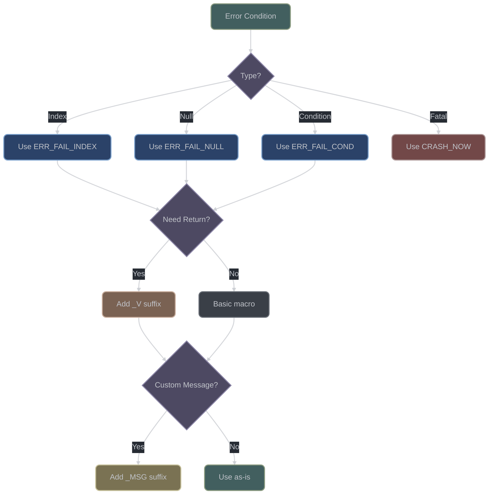

# Error Handling & Debugging

## Introduction

The godot-cpp error handling system provides a comprehensive macro-based architecture for error detection, reporting, and debugging. The system bridges C++ extensions with the Godot engine through the GDExtension interface, ensuring proper error propagation across binary boundaries.

**Key Source Files:**
- `include/godot_cpp/core/error_macros.hpp` - Main error handling system (804 lines)
- `src/core/error_macros.cpp` - Implementation functions
- `include/godot_cpp/core/print_string.hpp` - Print utilities
- `src/core/print_string.cpp` - Print implementation
- `gdextension/gdextension_interface.h` - C interface for error propagation

### Error Handling Decision Tree



## Error Macro System

### Macro Categories

The error handling system provides seven distinct categories of macros:

1. **Index Bounds Checking** - Validate array/container access
2. **Null Pointer Checking** - Ensure pointer validity
3. **Condition Checking** - Generic condition validation
4. **Loop Control** - Error handling in loops
5. **Fatal Errors** - Application termination
6. **Warnings** - Non-fatal issues
7. **Debug Assertions** - Development-only checks

### Index Bounds Checking Macros

> **Performance Impact**: Index checking macros add ~2-3 CPU cycles in release builds (simple comparison), but provide crucial safety. In debug builds, they also generate detailed error messages with file/line information. Always use these instead of manual checks for consistency.

#### Integer Index Validation ([error_macros.hpp:90](https://github.com/godotengine/godot-cpp/blob/master/include/godot_cpp/core/error_macros.hpp#L90))

| Macro | Return Behavior | Use Case | Debug Info |
|-------|----------------|----------|------------|
| `ERR_FAIL_INDEX` | Returns void | Array access validation | File, line, bounds |
| `ERR_FAIL_INDEX_V` | Returns value | Functions with return | File, line, bounds, return value |
| `ERR_FAIL_INDEX_MSG` | Returns void | Custom error context | Custom message |
| `CRASH_BAD_INDEX` | Terminates | Critical corruption | Full crash dump |

```cpp
// Basic index check - returns from function on failure
ERR_FAIL_INDEX(m_index, m_size)
// Expansion: if ((m_index) < 0 || (m_index) >= (m_size))

// With custom message
ERR_FAIL_INDEX_MSG(m_index, m_size, m_msg)

// With editor notification
ERR_FAIL_INDEX_EDMSG(m_index, m_size, m_msg)

// Returns value on failure
ERR_FAIL_INDEX_V(m_index, m_size, m_retval)
ERR_FAIL_INDEX_V_MSG(m_index, m_size, m_retval, m_msg)
ERR_FAIL_INDEX_V_EDMSG(m_index, m_size, m_retval, m_msg)

// Fatal crash on bounds violation
CRASH_BAD_INDEX(m_index, m_size)
CRASH_BAD_INDEX_MSG(m_index, m_size, m_msg)
```

#### Unsigned Index Validation ([error_macros.hpp:194](https://github.com/godotengine/godot-cpp/blob/master/include/godot_cpp/core/error_macros.hpp#L194))

```cpp
// Optimized for unsigned types (no negative check)
ERR_FAIL_UNSIGNED_INDEX(m_index, m_size)
// Expansion: if ((m_index) >= (m_size))

ERR_FAIL_UNSIGNED_INDEX_MSG(m_index, m_size, m_msg)
ERR_FAIL_UNSIGNED_INDEX_EDMSG(m_index, m_size, m_msg)
ERR_FAIL_UNSIGNED_INDEX_V(m_index, m_size, m_retval)
ERR_FAIL_UNSIGNED_INDEX_V_MSG(m_index, m_size, m_retval, m_msg)
ERR_FAIL_UNSIGNED_INDEX_V_EDMSG(m_index, m_size, m_retval, m_msg)
CRASH_BAD_UNSIGNED_INDEX(m_index, m_size)
CRASH_BAD_UNSIGNED_INDEX_MSG(m_index, m_size, m_msg)
```

### Null Pointer Checking Macros ([error_macros.hpp:296](https://github.com/godotengine/godot-cpp/blob/master/include/godot_cpp/core/error_macros.hpp#L296))

> **Usage Guidance**: Use null checks at public API boundaries and after dynamic casts. The macro automatically generates a descriptive message including the parameter name. For internal functions where null is impossible, use `DEV_ASSERT` instead for debug-only validation.

```cpp
// Basic null check
ERR_FAIL_NULL(m_param)
// Message: "Parameter \"m_param\" is null."

// With custom message
ERR_FAIL_NULL_MSG(m_param, m_msg)

// With editor notification
ERR_FAIL_NULL_EDMSG(m_param, m_msg)

// Returns value on null
ERR_FAIL_NULL_V(m_param, m_retval)
ERR_FAIL_NULL_V_MSG(m_param, m_retval, m_msg)
ERR_FAIL_NULL_V_EDMSG(m_param, m_retval, m_msg)
```

### Condition Checking Macros ([error_macros.hpp:376](https://github.com/godotengine/godot-cpp/blob/master/include/godot_cpp/core/error_macros.hpp#L376))

> **Best Practice**: Use `ERR_FAIL_COND` for preconditions, `ERR_CONTINUE` for skipping invalid loop iterations, and `ERR_BREAK` for early loop termination. These macros make error handling explicit and generate consistent error messages across the codebase.

```cpp
// Returns from function if condition is true
ERR_FAIL_COND(m_cond)
// Message: "Condition \"m_cond\" is true."

ERR_FAIL_COND_MSG(m_cond, m_msg)
ERR_FAIL_COND_EDMSG(m_cond, m_msg)

// Returns value if condition is true
ERR_FAIL_COND_V(m_cond, m_retval)
ERR_FAIL_COND_V_MSG(m_cond, m_retval, m_msg)
ERR_FAIL_COND_V_EDMSG(m_cond, m_retval, m_msg)

// Loop control variants
ERR_CONTINUE(m_cond)      // Executes 'continue' if true
ERR_CONTINUE_MSG(m_cond, m_msg)
ERR_CONTINUE_EDMSG(m_cond, m_msg)

ERR_BREAK(m_cond)         // Executes 'break' if true
ERR_BREAK_MSG(m_cond, m_msg)
ERR_BREAK_EDMSG(m_cond, m_msg)

// Fatal crash if condition is true
CRASH_COND(m_cond)
CRASH_COND_MSG(m_cond, m_msg)
```

### Generic Error Macros ([error_macros.hpp:549](https://github.com/godotengine/godot-cpp/blob/master/include/godot_cpp/core/error_macros.hpp#L549))

```cpp
// Always fails and returns
ERR_FAIL()
// Message: "Method/function failed."

ERR_FAIL_MSG(m_msg)
ERR_FAIL_EDMSG(m_msg)

// Always fails and returns value
ERR_FAIL_V(m_retval)
// Message: "Method/function failed. Returning: m_retval"

ERR_FAIL_V_MSG(m_retval, m_msg)
ERR_FAIL_V_EDMSG(m_retval, m_msg)
```

### Print Macros ([error_macros.hpp:632](https://github.com/godotengine/godot-cpp/blob/master/include/godot_cpp/core/error_macros.hpp#L632))

```cpp
// Print error without affecting control flow
ERR_PRINT(m_msg)

// Print error with editor notification
ERR_PRINT_ED(m_msg)

// Print error only once per call site
ERR_PRINT_ONCE(m_msg)      // NOT thread-safe!
ERR_PRINT_ED_ONCE(m_msg)   // NOT thread-safe!
```

### Warning Macros ([error_macros.hpp:667](https://github.com/godotengine/godot-cpp/blob/master/include/godot_cpp/core/error_macros.hpp#L667))

```cpp
// Print warning message
WARN_PRINT(m_msg)

// Print warning with editor notification
WARN_PRINT_ED(m_msg)

// Print warning only once per call site
WARN_PRINT_ONCE(m_msg)     // NOT thread-safe!
WARN_PRINT_ED_ONCE(m_msg)  // NOT thread-safe!

// Thread-safe deprecation warnings
WARN_DEPRECATED            // Uses std::atomic<bool>
// Message: "This method has been deprecated and will be removed in the future."

WARN_DEPRECATED_MSG(m_msg)  // Thread-safe with custom message
```

### Fatal Error Macros ([error_macros.hpp:744](https://github.com/godotengine/godot-cpp/blob/master/include/godot_cpp/core/error_macros.hpp#L744))

```cpp
// Immediate application crash
CRASH_NOW()
// Message: "FATAL: Method/function failed."

CRASH_NOW_MSG(m_msg)
```

### Debug-Only Macros ([error_macros.hpp:770](https://github.com/godotengine/godot-cpp/blob/master/include/godot_cpp/core/error_macros.hpp#L770))

> **DEV_ASSERT Strategy**: Use for invariants that should never fail in correct code. These compile to nothing in release builds (zero overhead), but catch logic errors during development. Perfect for checking function postconditions, data structure integrity, and algorithm correctness.

```cpp
// Only active in DEBUG_ENABLED builds
DEV_ASSERT(m_cond)
// Message: "FATAL: DEV_ASSERT failed \"m_cond\" is false."
// Behavior: Crashes in debug, no-op in release

// Method binding validation (debug only)
CHECK_METHOD_BIND(m_mb)
CHECK_METHOD_BIND_RET(m_mb, m_ret)
// Message: "Method bind was not found. Likely the engine method changed to an incompatible version."
```

## Error Propagation

### Cross-Binary Interface ([error_macros.cpp:40](https://github.com/godotengine/godot-cpp/blob/master/src/core/error_macros.cpp#L40))

```cpp
void _err_print_error(const char *p_function, const char *p_file, int p_line,
                     const char *p_error, bool p_editor_notify, bool p_is_warning) {
    if (p_is_warning) {
        internal::gdextension_interface_print_warning(
            p_error, p_function, p_file, p_line, p_editor_notify
        );
    } else {
        internal::gdextension_interface_print_error(
            p_error, p_function, p_file, p_line, p_editor_notify
        );
    }
}

void _err_print_index_error(const char *p_function, const char *p_file, int p_line,
                            int64_t p_index, int64_t p_size,
                            const char *p_index_str, const char *p_size_str,
                            bool p_editor_notify, bool p_fatal) {
    String fstr = "Index " + String(p_index_str) + " = " + itos(p_index) +
                  " is out of bounds (" + String(p_size_str) + " = " + itos(p_size) + ").";

    _err_print_error(p_function, p_file, p_line, fstr.utf8().get_data(),
                    p_editor_notify, false);

    if (p_fatal) {
        _err_flush_stdout();
    }
}
```

### GDExtensionCallError Structure

Error codes for method calls ([gdextension_interface.h:183](https://github.com/godotengine/godot/blob/master/core/extension/gdextension_interface.h#L183)):

```cpp
typedef enum {
    GDEXTENSION_CALL_OK,
    GDEXTENSION_CALL_ERROR_INVALID_METHOD,
    GDEXTENSION_CALL_ERROR_INVALID_ARGUMENT,    // Wrong variant type
    GDEXTENSION_CALL_ERROR_TOO_MANY_ARGUMENTS,
    GDEXTENSION_CALL_ERROR_TOO_FEW_ARGUMENTS,
    GDEXTENSION_CALL_ERROR_INSTANCE_IS_NULL,
    GDEXTENSION_CALL_ERROR_METHOD_NOT_CONST,
} GDExtensionCallErrorType;

typedef struct {
    GDExtensionCallErrorType error;
    int32_t argument;      // Which argument caused error
    int32_t expected;      // Expected count or type
} GDExtensionCallError;
```

### Error Return Conventions

```cpp
// Success path
if (operation_succeeded()) {
    return result;
}

// Error path with macro
ERR_FAIL_COND_V(!operation_succeeded(), nullptr);

// Manual error propagation
GDExtensionCallError err;
Variant result = method->call(instance, args, arg_count, err);
if (err.error != GDEXTENSION_CALL_OK) {
    ERR_FAIL_V_MSG(Variant(), "Method call failed: " + itos(err.error));
}
```

## Debug Support

### Platform-Specific Trap Generation ([error_macros.hpp:59](https://github.com/godotengine/godot-cpp/blob/master/include/godot_cpp/core/error_macros.hpp#L59))

```cpp
#ifdef _MSC_VER
    #define GENERATE_TRAP() __debugbreak()   // MSVC debugger break
#else
    #define GENERATE_TRAP() __builtin_trap()  // GCC/Clang trap instruction
#endif
```

### Debug vs Release Behavior

#### Compile-Time Flags

```cpp
#ifdef DEBUG_ENABLED
    // Full error checking and debug assertions
    DEV_ASSERT(condition);
    CHECK_METHOD_BIND(method);
#else
    // Optimized release build - assertions become no-ops
    #define DEV_ASSERT(m_cond) ((void)0)
    #define CHECK_METHOD_BIND(m_mb) ((void)0)
#endif
```

#### Function Name Resolution ([error_macros.hpp:53](https://github.com/godotengine/godot-cpp/blob/master/include/godot_cpp/core/error_macros.hpp#L53))

```cpp
#ifdef __GNUC__
    #define FUNCTION_STR __FUNCTION__
#else
    #define FUNCTION_STR __FUNCTION__
#endif
```

### Stack Information

Error reports include:
- **Function Name**: Via `FUNCTION_STR` macro
- **File Path**: Via `__FILE__` macro
- **Line Number**: Via `__LINE__` macro
- **No Stack Trace**: Not available in godot-cpp

## Memory Debugging

### Memory Layout for Debugging ([memory.hpp:67](https://github.com/godotengine/godot-cpp/blob/master/include/godot_cpp/core/memory.hpp#L67))

```cpp
// Memory layout with debugging headers
// Alignment:  ↓ max_align_t        ↓ uint64_t          ↓ max_align_t
//             ┌─────────────────┬──┬────────────────┬──┬───────────...
//             │ uint64_t        │░░│ uint64_t       │░░│ T[]
//             │ alloc size      │░░│ element count  │░░│ data
//             └─────────────────┴──┴────────────────┴──┴───────────...
// Offset:     ↑ SIZE_OFFSET        ↑ ELEMENT_OFFSET    ↑ DATA_OFFSET
```

### Array Bounds Validation ([memory.hpp:147](https://github.com/godotengine/godot-cpp/blob/master/include/godot_cpp/core/memory.hpp#L147))

```cpp
template <typename T>
T *memnew_arr_template(size_t p_elements, const char *p_dummy, const char *p_descr) {
    if (p_elements == 0) return nullptr;

    size_t alloc_size = Memory::DATA_OFFSET + sizeof(T) * p_elements;
    void *mem = Memory::alloc_static(alloc_size, true);

    ERR_FAIL_NULL_V(mem, failptr);  // Allocation failure check

    // Store element count for bounds checking
    uint64_t *_elem = reinterpret_cast<uint64_t *>(mem) +
                      Memory::ELEMENT_OFFSET / sizeof(uint64_t);
    *_elem = p_elements;

    // ... construct elements
    return elems;
}
```

### Double-Free Detection

```cpp
// Reference counting prevents double-free
void SafeRefCount::_check_unref_safety() {
    CRASH_COND_MSG(count.get() == 0,
        "Trying to unreference a SafeRefCount which is already zero. "
        "This may indicate a double free or some other logic error.");
}
```

### Memory Leak Detection

Debug builds can track allocations:

```cpp
#ifdef DEBUG_ENABLED
static uint64_t total_allocated = 0;
static uint64_t allocation_count = 0;

// On shutdown
if (allocation_count != 0) {
    ERR_PRINT("Memory leaks detected: " + itos(allocation_count) + " allocations.");
}
#endif
```

## Thread Safety

### Thread-Safe Macros

#### Deprecation Warnings ([error_macros.hpp:716](https://github.com/godotengine/godot-cpp/blob/master/include/godot_cpp/core/error_macros.hpp#L716))

```cpp
#define WARN_DEPRECATED \
    if (true) { \
        static std::atomic<bool> warning_shown; \
        if (!warning_shown.load() && warning_shown.exchange(true) == false) { \
            _err_print_error(FUNCTION_STR, __FILE__, __LINE__, \
                "This method has been deprecated and will be removed in the future.", \
                false, true); \
        } \
    } else \
        ((void)0)

#define WARN_DEPRECATED_MSG(m_msg) \
    if (true) { \
        static std::atomic<bool> warning_shown; \
        if (!warning_shown.load() && warning_shown.exchange(true) == false) { \
            _err_print_error(FUNCTION_STR, __FILE__, __LINE__, \
                String(m_msg).utf8().get_data(), false, true); \
        } \
    } else \
        ((void)0)
```

### Non-Thread-Safe Macros

#### Print-Once Macros ([error_macros.hpp:644](https://github.com/godotengine/godot-cpp/blob/master/include/godot_cpp/core/error_macros.hpp#L644))

```cpp
#define ERR_PRINT_ONCE(m_msg) \
    if (true) { \
        static bool first_print = true;  // RACE CONDITION! \
        if (first_print) { \
            ERR_PRINT(m_msg); \
            first_print = false; \
        } \
    } else \
        ((void)0)
```

**Issue**: Multiple threads can pass the check simultaneously, causing multiple prints.

### Thread Safety in Error Reporting

- **Engine Interface**: Thread safety handled by engine
- **Extension Side**: No explicit synchronization in error macros
- **Atomic Operations**: Used only for deprecation warnings

## Performance Optimizations

### Branch Prediction Hints ([defs.hpp:278](https://github.com/godotengine/godot-cpp/blob/master/include/godot_cpp/core/defs.hpp#L278))

```cpp
#if defined(__GNUC__)
    #define unlikely(x) __builtin_expect(!!(x), 0)  // Hint: false is expected
    #define likely(x) __builtin_expect(!!(x), 1)    // Hint: true is expected
#else
    #define unlikely(x) x
    #define likely(x) x
#endif
```

Usage in error macros:
```cpp
if (unlikely((m_index) < 0 || (m_index) >= (m_size))) {
    // Error path - compiler optimizes for false case
}
```

### Compile-Time String Generation

```cpp
#define _STR(m_x) #m_x        // Convert to string literal
#define _MKSTR(m_x) _STR(m_x) // Expand then stringify

// Usage in error messages
"Condition \"" _STR(m_cond) "\" is true."
// Becomes: "Condition \"actual_variable_name\" is true."
```

### Release Build Optimization

```cpp
#ifdef DEBUG_ENABLED
    // Full error checking
    #define DEV_ASSERT(m_cond) /* full implementation */
#else
    // No-op in release
    #define DEV_ASSERT(m_cond) ((void)0)
#endif
```

## Print and Logging System

### Print Functions ([print_string.hpp:36](https://github.com/godotengine/godot-cpp/blob/master/include/godot_cpp/core/print_string.hpp#L36))

```cpp
// Error output
inline void print_error(const Variant &p_variant) {
    UtilityFunctions::printerr(p_variant);
}

// Standard output
inline void print_line(const Variant &p_variant) {
    UtilityFunctions::print(p_variant);
}

// Verbose output (conditional)
template <typename... Args>
void print_verbose(const Variant &p_variant, Args... p_args) {
    if (is_print_verbose_enabled()) {
        UtilityFunctions::print(p_variant, p_args...);
    }
}

// Rich text output
inline void print_line_rich(const Variant &p_variant) {
    UtilityFunctions::print_rich(p_variant);
}
```

### Verbosity Control ([print_string.cpp:36](https://github.com/godotengine/godot-cpp/blob/master/src/core/print_string.cpp#L36))

```cpp
bool is_print_verbose_enabled() {
    return OS::get_singleton()->is_stdout_verbose();
}
```

## Error Conditions Reference

### Complete Error Condition List

| Condition | Macro Family | Fatal | Returns |
|-----------|--------------|-------|---------|
| Index out of bounds | ERR_FAIL_INDEX | No | Yes |
| Null pointer | ERR_FAIL_NULL | No | Yes |
| Generic condition | ERR_FAIL_COND | No | Yes |
| Method failure | ERR_FAIL | No | Yes |
| Loop continuation | ERR_CONTINUE | No | No (continue) |
| Loop break | ERR_BREAK | No | No (break) |
| Fatal index | CRASH_BAD_INDEX | Yes | N/A |
| Fatal condition | CRASH_COND | Yes | N/A |
| Immediate crash | CRASH_NOW | Yes | N/A |
| Debug assertion | DEV_ASSERT | Yes (debug) | N/A |

### Error Severity Levels

1. **Info**: Print functions without ERR/WARN prefix
2. **Warning**: WARN_* macros
3. **Error**: ERR_* macros (non-fatal)
4. **Fatal**: CRASH_* macros and failed DEV_ASSERT

## Platform-Specific Behavior

### Windows (MSVC)

```cpp
#ifdef _MSC_VER
    #define GENERATE_TRAP() __debugbreak()  // Triggers debugger
#endif
```

### Unix-like (GCC/Clang)

```cpp
#ifndef _MSC_VER
    #define GENERATE_TRAP() __builtin_trap()  // SIGILL or SIGTRAP
#endif
```

### Mobile Platforms

- **iOS**: Special handling for static library conflicts
- **Android**: Standard Unix-like behavior
- **Web**: Emscripten compatibility

## Best Practices

### Error Macro Selection

```cpp
// For parameter validation
void process_array(const int *data, size_t size, int index) {
    ERR_FAIL_NULL(data);
    ERR_FAIL_UNSIGNED_INDEX(index, size);
    // ... process
}

// For return values
Node *get_child(int index) {
    ERR_FAIL_INDEX_V(index, children.size(), nullptr);
    return children[index];
}

// For loops
for (int i = 0; i < count; i++) {
    ERR_CONTINUE(!items[i].is_valid());
    process_item(items[i]);
}

// For fatal errors
void critical_init() {
    CRASH_COND_MSG(!system_initialized(), "System not initialized!");
}
```

### Error Message Guidelines

```cpp
// Good: Specific and actionable
ERR_FAIL_COND_MSG(texture.is_null(),
    "Texture resource is null. Ensure texture is loaded before rendering.");

// Bad: Generic
ERR_FAIL_MSG("Error occurred");

// Good: Include values
ERR_FAIL_COND_MSG(value < min_value || value > max_value,
    vformat("Value %d out of range [%d, %d]", value, min_value, max_value));
```

### Thread Safety Considerations

```cpp
// Use atomic for shared state warnings
static std::atomic<bool> config_warning_shown(false);
if (!config_warning_shown.exchange(true)) {
    WARN_PRINT("Configuration issue detected");
}

// Avoid ERR_PRINT_ONCE in multithreaded code
// Use WARN_DEPRECATED for thread-safe once-only warnings
```

## Implementation Examples

### Complete Error Handling Pattern

```cpp
class ResourceLoader {
public:
    Ref<Resource> load_resource(const String &path, int type_hint = -1) {
        // Parameter validation
        ERR_FAIL_COND_V_MSG(path.is_empty(),
            Ref<Resource>(),
            "Resource path cannot be empty");

        // Type validation
        ERR_FAIL_INDEX_V_MSG(type_hint, ResourceType::TYPE_MAX,
            Ref<Resource>(),
            vformat("Invalid type hint: %d", type_hint));

        // File existence check
        if (!FileAccess::exists(path)) {
            ERR_FAIL_V_MSG(Ref<Resource>(),
                vformat("Resource file not found: %s", path));
        }

        // Load attempt
        Ref<Resource> res = _internal_load(path);

        // Null check with detailed error
        ERR_FAIL_NULL_V_MSG(res,
            Ref<Resource>(),
            vformat("Failed to load resource: %s (type: %d)", path, type_hint));

        // Success
        return res;
    }

private:
    Ref<Resource> _internal_load(const String &path) {
        // Debug-only validation
        DEV_ASSERT(!path.is_empty());

        // Implementation
        return Ref<Resource>();
    }
};
```

### Custom Error Macro

```cpp
// Project-specific error macro
#define PROJECT_ERROR(m_msg) \
    ERR_PRINT_ED(String("[ProjectName] ") + String(m_msg))

// Usage
PROJECT_ERROR("Custom subsystem error");
```

### Error Recovery Pattern

```cpp
class SafeProcessor {
    bool process_data(const PackedByteArray &data) {
        // Attempt processing
        for (int i = 0; i < data.size(); i++) {
            if (!validate_byte(data[i])) {
                // Non-fatal: skip invalid data
                ERR_CONTINUE_MSG(true,
                    vformat("Invalid byte at position %d", i));
            }

            if (!process_byte(data[i])) {
                // Fatal for this operation
                ERR_FAIL_V_MSG(false,
                    vformat("Failed to process byte at position %d", i));
            }
        }

        return true;
    }
};
```

## Conclusion

The godot-cpp error handling system provides a comprehensive, performance-optimized framework for error detection and reporting. Key strengths include:

1. **Comprehensive Coverage**: Complete macro set for all error scenarios
2. **Cross-Binary Integration**: Seamless error propagation to engine
3. **Debug/Release Optimization**: Appropriate behavior for each build type
4. **Performance**: Branch prediction and compile-time optimizations
5. **Thread Safety**: Atomic operations where needed

Areas for consideration:
- Non-thread-safe print-once macros
- Limited stack trace capabilities
- Reliance on engine for memory validation

The system effectively balances safety, performance, and usability for extension development.
