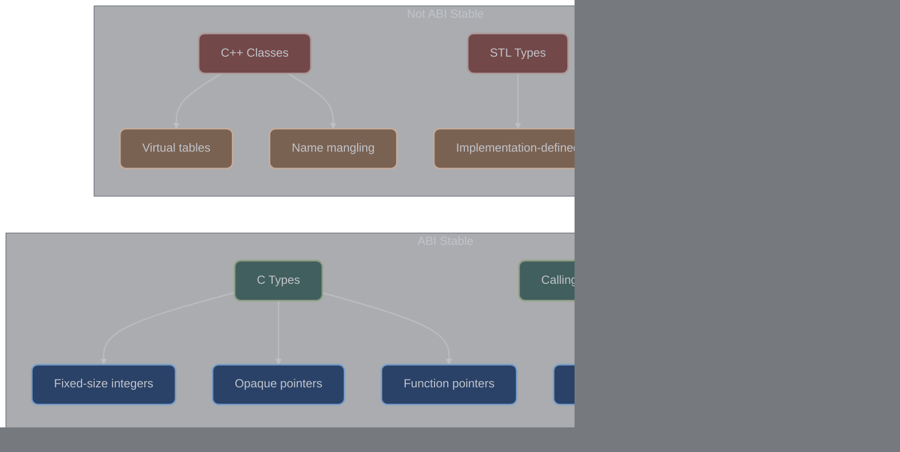

# Core Architecture

## Overview

The godot-cpp core architecture provides a sophisticated binary communication layer between C++ extensions and the Godot engine. This system uses a C-compatible ABI with function pointer tables, versioned interfaces, and careful memory management to ensure stability and performance.

**Key Source Files:**
- `include/godot_cpp/godot.hpp` - Main interface declarations
- `src/godot.cpp` - Core implementation and initialization
- `gdextension/gdextension_interface.h` - C interface definitions
- `include/godot_cpp/core/defs.hpp` - Core definitions and macros

### Architecture Flow Diagram


## Binary Communication System

### GDExtension Interface Structure

The entire communication system is built on a C-compatible interface with opaque pointers and function tables.

#### Core Pointer Types ([gdextension_interface.h:159](https://github.com/godotengine/godot/blob/master/core/extension/gdextension_interface.h#L159))

| Type Category | Pointer Type | Description | Usage |
|--------------|--------------|-------------|-------|
| **Variant** | `GDExtensionVariantPtr` | Opaque pointer to Variant data (24-40 bytes depending on platform) | Use for dynamic typing; always initialize before use via `variant_new_*` functions |
| **Type** | `GDExtensionTypePtr` | Generic pointer for builtin types | Cast to specific type pointers for Array, Dictionary, etc. |
| **String** | `GDExtensionStringPtr` | UTF-8 string with COW semantics | Convert to/from std::string via interface functions; never access directly |
| **StringName** | `GDExtensionStringNamePtr` | Interned string for efficient comparisons | Use for method/property names; cached globally |
| **Object** | `GDExtensionObjectPtr` | Base object pointer | Cast using `object_cast_to` with class tags; check for null |
| **Reference** | `GDExtensionRefPtr` | Reference-counted object | Automatic reference counting; use Ref<T> wrapper |

```c
// Variant pointers - Use GDExtensionVariantPtr for dynamic typing scenarios
// Initialize with variant_new_* functions, destroy with variant_destroy
typedef void *GDExtensionVariantPtr;
typedef const void *GDExtensionConstVariantPtr;
typedef void *GDExtensionUninitializedVariantPtr;  // Pre-allocated memory for placement new

// Type pointers - Generic pointers for builtin types like Array, Dictionary
// Cast to specific type before use, never dereference directly
typedef void *GDExtensionTypePtr;
typedef const void *GDExtensionConstTypePtr;
typedef void *GDExtensionUninitializedTypePtr;

// String pointers - UTF-8 strings with COW optimization
// Use string_new_with_utf8_chars to create, string_to_utf8_chars to read
typedef void *GDExtensionStringPtr;
typedef const void *GDExtensionConstStringPtr;
typedef void *GDExtensionUninitializedStringPtr;

// String name pointers - Interned strings for O(1) comparison
// Prefer for method/property names; globally cached across engine
typedef void *GDExtensionStringNamePtr;
typedef const void *GDExtensionConstStringNamePtr;
typedef void *GDExtensionUninitializedStringNamePtr;

// Object pointers - Base class for all engine objects
// Always check for null; use object_cast_to for safe downcasting
typedef void *GDExtensionObjectPtr;
typedef const void *GDExtensionConstObjectPtr;
typedef void *GDExtensionUninitializedObjectPtr;

// Reference pointer - Automatic reference counting
// Wraps RefCounted objects; use Ref<T> template for RAII
typedef void *GDExtensionRefPtr;
typedef const void *GDExtensionConstRefPtr;

// Primitive types - Platform-independent sizes
typedef int64_t GDExtensionInt;      // Always 64-bit signed
typedef uint8_t GDExtensionBool;     // 0 or 1 only
typedef uint64_t GDObjectInstanceID;  // Unique object identifier
typedef void *GDExtensionClassInstancePtr;  // Your C++ class instance
```

### Internal Namespace Structure ([godot.hpp:39](https://github.com/godotengine/godot-cpp/blob/master/include/godot_cpp/godot.hpp#L39))

The `internal` namespace contains the complete function pointer table.

> **Key Insight**: The internal namespace acts as a global singleton holding all 160+ function pointers to Godot's API. These are populated once during initialization and remain constant throughout the extension's lifetime. Direct access to these pointers bypasses virtual dispatch, providing maximum performance for engine calls.

```cpp
namespace godot {
namespace internal {
    // Core interface data
    extern "C" GDExtensionInterfaceGetProcAddress gdextension_interface_get_proc_address;
    extern "C" GDExtensionClassLibraryPtr library;
    extern "C" void *token;
    extern "C" GDExtensionGodotVersion2 godot_version;

    // Memory management (lines 47-50)
    extern "C" GDExtensionInterfaceMemAlloc gdextension_interface_mem_alloc;
    extern "C" GDExtensionInterfaceMemRealloc gdextension_interface_mem_realloc;
    extern "C" GDExtensionInterfaceMemFree gdextension_interface_mem_free;

    // Error reporting (lines 51-55)
    extern "C" GDExtensionInterfacePrintError gdextension_interface_print_error;
    extern "C" GDExtensionInterfacePrintWarning gdextension_interface_print_warning;
    extern "C" GDExtensionInterfacePrintScriptError gdextension_interface_print_script_error;

    // Variant operations (lines 57-103)
    extern "C" GDExtensionInterfaceVariantNewCopy gdextension_interface_variant_new_copy;
    extern "C" GDExtensionInterfaceVariantNewNil gdextension_interface_variant_new_nil;
    extern "C" GDExtensionInterfaceVariantDestroy gdextension_interface_variant_destroy;
    extern "C" GDExtensionInterfaceVariantCall gdextension_interface_variant_call;
    // ... 40+ more variant functions

    // String operations (lines 104-128)
    extern "C" GDExtensionInterfaceStringOperatorIndex gdextension_interface_string_operator_index;
    extern "C" GDExtensionInterfaceStringNewWithUtf8Chars gdextension_interface_string_new_with_utf8_chars;
    // ... more string functions

    // Object operations (lines 162-196)
    extern "C" GDExtensionInterfaceObjectDestroy gdextension_interface_object_destroy;
    extern "C" GDExtensionInterfaceObjectGetInstanceId gdextension_interface_object_get_instance_id;
    extern "C" GDExtensionInterfaceObjectSetInstance gdextension_interface_object_set_instance;
    // ... more object functions

    // Class database operations (lines 197-203)
    extern "C" GDExtensionInterfaceClassdbConstructObject gdextension_interface_classdb_construct_object;
    extern "C" GDExtensionInterfaceClassdbRegisterExtensionClass3 gdextension_interface_classdb_register_extension_class3;
    // ... more classdb functions

    // Total: 160+ function pointers
}
}
```

## Function Pointer Architecture

### Resolution Mechanism

Function pointers are resolved using a systematic macro-based approach.

#### LOAD_PROC_ADDRESS Macro ([godot.cpp:254](https://github.com/godotengine/godot-cpp/blob/master/src/godot.cpp#L254))

> **Usage Tip**: This macro is the cornerstone of interface loading. It performs three critical operations: (1) resolves the function by name from the engine, (2) casts it to the correct function pointer type, and (3) validates the pointer is non-null. If any function fails to load, the entire extension initialization aborts, preventing runtime crashes from missing functions.

```cpp
#define LOAD_PROC_ADDRESS(m_name, m_type) \
    internal::gdextension_interface_##m_name = (m_type)p_get_proc_address(#m_name); \
    if (!internal::gdextension_interface_##m_name) { \
        ERR_PRINT_EARLY("Unable to load GDExtension interface function " #m_name "()"); \
        return false; \
    }
```

### Initialization Order ([godot.cpp:301](https://github.com/godotengine/godot-cpp/blob/master/src/godot.cpp#L301))

The function pointer resolution follows a critical order:


1. **Error Printing** (line 301)
   ```cpp
   LOAD_PROC_ADDRESS(print_error, GDExtensionInterfacePrintError);
   ```

2. **Version Checking** (lines 303-312)
   ```cpp
   // Try version 2 first (current)
   internal::gdextension_interface_get_godot_version2 =
       (GDExtensionInterfaceGetGodotVersion2)p_get_proc_address("get_godot_version2");

   if (internal::gdextension_interface_get_godot_version2 != nullptr) {
       internal::gdextension_interface_get_godot_version2(&internal::godot_version);
   } else {
       // Fall back to version 1 for older engines
       GDExtensionInterfaceGetGodotVersion gdextension_interface_get_godot_version =
           (GDExtensionInterfaceGetGodotVersion)p_get_proc_address("get_godot_version");
       // Convert to version 2 structure
   }
   ```

3. **Memory Functions** (lines 340-342)
   ```cpp
   LOAD_PROC_ADDRESS(mem_alloc, GDExtensionInterfaceMemAlloc);
   LOAD_PROC_ADDRESS(mem_realloc, GDExtensionInterfaceMemRealloc);
   LOAD_PROC_ADDRESS(mem_free, GDExtensionInterfaceMemFree);
   ```

4. **Core Functions** (lines 343-347)
   ```cpp
   LOAD_PROC_ADDRESS(print_warning, GDExtensionInterfacePrintWarning);
   LOAD_PROC_ADDRESS(print_script_error, GDExtensionInterfacePrintScriptError);
   LOAD_PROC_ADDRESS(get_native_struct_size, GDExtensionInterfaceGetNativeStructSize);
   ```

5. **Variant System** (lines 349-396)
   - 50+ variant manipulation functions
   - Type constructors and destructors
   - Operator implementations

6. **String Operations** (lines 397-422)
   - String creation and manipulation
   - UTF-8/UTF-16/UTF-32 conversions
   - String name operations

7. **Object System** (lines 454-489)
   - Object lifecycle management
   - Instance binding
   - Method calling

8. **Editor Integration** (lines 491-495)
   - Editor-specific functions
   - Script language registration

### Function Pointer Validation

Each function pointer is validated immediately:

```cpp
if (!internal::gdextension_interface_##m_name) {
    ERR_PRINT_EARLY("Unable to load GDExtension interface function " #m_name "()");
    return false;
}
```

> **Important**: Function pointer validation is non-recoverable. If any required function fails to load, the extension cannot initialize. This fail-fast approach prevents subtle runtime errors. Optional functions (like editor-specific APIs) are loaded conditionally based on the initialization level.

## Interface Versioning

### Version Structure ([gdextension_interface.h:241](https://github.com/godotengine/godot/blob/master/core/extension/gdextension_interface.h#L241))

> **Version Strategy**: GDExtensionGodotVersion2 supports forward compatibility through structure extension. New fields can be added at the end without breaking existing extensions. Always check the engine version before accessing newer fields to avoid memory access violations.

```c
typedef struct {
    uint32_t major;     // Breaking changes (rare)
    uint32_t minor;     // New features (backward compatible)
    uint32_t patch;     // Bug fixes only
    const char *string; // Human-readable version
    // Extended fields available in newer versions
} GDExtensionGodotVersion2;
```

### Version Negotiation ([godot.cpp:314](https://github.com/godotengine/godot-cpp/blob/master/src/godot.cpp#L314))

| Compatibility Rule | Description | Example |
|-------------------|-------------|----------|
| **Major Version** | Must match exactly or engine must be newer | Extension 4.x requires Engine 4.x or 5.x |
| **Minor Version** | Engine must be same or newer within major | Extension 4.2 requires Engine 4.2+ |
| **Patch Version** | Engine must be same or newer within minor | Extension 4.2.1 requires Engine 4.2.1+ |
| **Build Metadata** | Ignored for compatibility | dev/alpha/beta/rc suffixes don't affect compatibility |

```cpp
bool GDExtensionBinding::init(GDExtensionInterfaceGetProcAddress p_get_proc_address,
                              GDExtensionClassLibraryPtr p_library,
                              GDExtensionInitialization *r_initialization) {
    // ... load version functions ...

    // Version compatibility check
    bool compatible;
    if (internal::godot_version.major != GODOT_VERSION_MAJOR) {
        // Major version must be equal or newer in engine
        compatible = internal::godot_version.major > GODOT_VERSION_MAJOR;
    } else if (internal::godot_version.minor != GODOT_VERSION_MINOR) {
        // Minor version must be equal or newer in engine
        compatible = internal::godot_version.minor > GODOT_VERSION_MINOR;
    } else {
        // Patch version must be equal or newer in engine
#if GODOT_VERSION_PATCH > 0
        compatible = internal::godot_version.patch >= GODOT_VERSION_PATCH;
#else
        compatible = true;
#endif
    }

    if (!compatible) {
        ERR_PRINT_EARLY("GDExtension only compatible with Godot version "
                       GODOT_VERSION_FULL_NAME " or later.");
        return false;
    }
}
```

### Legacy Interface Detection ([godot.cpp:261](https://github.com/godotengine/godot-cpp/blob/master/src/godot.cpp#L261))

The system can detect and reject legacy interfaces:

> **Detection Mechanism**: This clever heuristic checks if the function pointer address looks like a struct pointer (aligned and containing version numbers). This catches the common mistake of passing the wrong parameter from Godot 4.0, preventing crashes from incompatible interfaces.

```cpp
// Legacy interface structure from Godot 4.0
typedef struct {
    uint32_t version_major;
    uint32_t version_minor;
    uint32_t version_patch;
    const char *version_string;
    // ... rest of legacy structure
} LegacyGDExtensionInterface;

// Detection logic
uint32_t *raw_interface = (uint32_t *)(void *)p_get_proc_address;
if (uintptr_t(p_get_proc_address) % alignof(LegacyGDExtensionInterface) == 0) {
    if (raw_interface[0] == 4 && raw_interface[1] == 0) {
        // This is likely a legacy Godot 4.0 interface
        ERR_PRINT_EARLY("Cannot load a GDExtension built for Godot 4.1+ in Godot 4.0.");
        return false;
    }
}
```

### ABI Stability Guarantees



1. **Forward Compatibility**: Extensions built for older versions work on newer engines
2. **Backward Incompatibility**: Extensions built for newer versions fail on older engines
3. **Function Signature Stability**: Once added, function signatures never change
4. **Additive Only**: New functions can be added, but existing ones cannot be removed

## Initialization Architecture

### Entry Point Contract

Every GDExtension must export a C-compatible entry point:

```c
// Required function signature
typedef GDExtensionBool (*GDExtensionInitializationFunction)(
    GDExtensionInterfaceGetProcAddress p_get_proc_address,
    GDExtensionClassLibraryPtr p_library,
    GDExtensionInitialization *r_initialization
);

// Example entry point
extern "C" {
GDExtensionBool GDE_EXPORT example_library_init(
    GDExtensionInterfaceGetProcAddress p_get_proc_address,
    GDExtensionClassLibraryPtr p_library,
    GDExtensionInitialization *r_initialization) {

    return GDExtensionBinding::init(p_get_proc_address, p_library, r_initialization);
}
}
```

### GDExtensionInitialization Structure ([gdextension_interface.h:745](https://github.com/godotengine/godot/blob/master/core/extension/gdextension_interface.h#L745))

```c
typedef struct {
    // Minimum level required for this extension
    GDExtensionInitializationLevel minimum_initialization_level;

    // User data passed to callbacks
    void *userdata;

    // Initialization callback for each level
    GDExtensionInitializeCallback initialize;

    // Deinitialization callback for each level
    GDExtensionDeinitializeCallback deinitialize;
} GDExtensionInitialization;
```

### Initialization Levels ([gdextension_interface.h:735](https://github.com/godotengine/godot/blob/master/core/extension/gdextension_interface.h#L735))

```c
typedef enum {
    GDEXTENSION_INITIALIZATION_CORE = 0,     // Core engine functionality
    GDEXTENSION_INITIALIZATION_SERVERS = 1,  // Physics, rendering, audio servers
    GDEXTENSION_INITIALIZATION_SCENE = 2,    // Scene tree and nodes
    GDEXTENSION_INITIALIZATION_EDITOR = 3,   // Editor-specific functionality
    GDEXTENSION_MAX_INITIALIZATION_LEVEL,
} GDExtensionInitializationLevel;
```

### Initialization Callback System ([godot.cpp:515](https://github.com/godotengine/godot-cpp/blob/master/src/godot.cpp#L515))

```cpp
void GDExtensionBinding::initialize_level(void *p_userdata,
                                          GDExtensionInitializationLevel p_level) {
    InitData *init_data = static_cast<InitData *>(p_userdata);

    switch (p_level) {
        case GDEXTENSION_INITIALIZATION_CORE:
            init_level_core(init_data);
            break;
        case GDEXTENSION_INITIALIZATION_SERVERS:
            init_level_servers(init_data);
            break;
        case GDEXTENSION_INITIALIZATION_SCENE:
            init_level_scene(init_data);
            break;
        case GDEXTENSION_INITIALIZATION_EDITOR:
            init_level_editor(init_data);
            break;
    }

    // Call user callback if provided
    if (init_data && init_data->init_callback) {
        init_data->init_callback(static_cast<ModuleInitializationLevel>(p_level));
    }
}
```

### InitData Management ([godot.cpp:222](https://github.com/godotengine/godot-cpp/blob/master/src/godot.cpp#L222))

```cpp
class InitData {
public:
    ModuleInitializationLevel minimum_level = MODULE_INITIALIZATION_LEVEL_CORE;
    InitializationCallback init_callback = nullptr;
    TerminationCallback terminate_callback = nullptr;

    std::vector<std::pair<StringName, ClassCreatorFunc>> class_registration_funcs;
    std::vector<StringName> parent_class_names;
    std::vector<StringName> class_names;

    bool is_runtime = false;
};

// Global initialization list
class InitDataList {
    int data_count = 0;
    int data_capacity = 0;
    InitData **data = nullptr;

public:
    void add(InitData *p_cb) {
        if (data_count == data_capacity) {
            data_capacity = data_capacity ? data_capacity * 2 : 1;
            data = (InitData **)realloc(data, sizeof(InitData *) * data_capacity);
        }
        data[data_count++] = p_cb;
    }
};
```

## Memory Boundaries

### Memory Allocation Interface

All memory crossing the binary boundary uses engine allocators:

```cpp
// Engine-provided allocators ([godot.hpp:47](https://github.com/godotengine/godot-cpp/blob/master/include/godot_cpp/godot.hpp#L47))
extern "C" GDExtensionInterfaceMemAlloc gdextension_interface_mem_alloc;
extern "C" GDExtensionInterfaceMemRealloc gdextension_interface_mem_realloc;
extern "C" GDExtensionInterfaceMemFree gdextension_interface_mem_free;
```

### Ownership Rules

#### Engine-Owned Memory
- All Variant internal storage
- String and StringName data
- Object instances created by engine
- Resource data

#### Extension-Owned Memory
- C++ class instances (created with memnew)
- Local data structures
- Temporary buffers

#### Shared Memory Rules
1. **Never free engine memory with C++ delete**
2. **Never free extension memory with engine deallocator**
3. **Use reference counting for shared objects**
4. **Variants handle their own memory lifecycle**

### String Passing Conventions

Strings cross boundaries as opaque pointers:

```cpp
// Creating a string from UTF-8
GDExtensionStringPtr create_string(const char *utf8) {
    GDExtensionUninitializedStringPtr str;
    internal::gdextension_interface_string_new_with_utf8_chars(&str, utf8);
    return str;
}

// Getting UTF-8 from string
const char *get_utf8(GDExtensionConstStringPtr str) {
    int32_t length;
    internal::gdextension_interface_string_to_utf8_chars(str, nullptr, 0);
    char *buffer = (char *)internal::gdextension_interface_mem_alloc(length + 1);
    internal::gdextension_interface_string_to_utf8_chars(str, buffer, length);
    return buffer;
}
```

## Data Marshalling

### Variant as Universal Transport

The Variant system serves as the primary data marshalling mechanism:

```cpp
// Type constructors for marshalling ([variant.cpp:44](https://github.com/godotengine/godot-cpp/blob/master/src/variant/variant.cpp#L44))
GDExtensionVariantFromTypeConstructorFunc from_type_constructor[Variant::VARIANT_MAX]{};
GDExtensionTypeFromVariantConstructorFunc to_type_constructor[Variant::VARIANT_MAX]{};

void Variant::init_bindings() {
    // Initialize type constructors for each variant type
    for (int i = 1; i < VARIANT_MAX; i++) {
        from_type_constructor[i] =
            internal::gdextension_interface_get_variant_from_type_constructor(
                (GDExtensionVariantType)i
            );
        to_type_constructor[i] =
            internal::gdextension_interface_get_variant_to_type_constructor(
                (GDExtensionVariantType)i
            );
    }
}
```

### Method Call Marshalling

Method calls use Variant arrays for arguments:

```cpp
// Calling a variant method ([variant.cpp:580](https://github.com/godotengine/godot-cpp/blob/master/src/variant/variant.cpp#L580))
Variant Variant::call(const StringName &method, const Variant **args, int argcount,
                      GDExtensionCallError &r_error) const {
    Variant ret;
    internal::gdextension_interface_variant_call(
        _native_ptr(),                                    // this
        method._native_ptr(),                             // method name
        reinterpret_cast<GDExtensionConstVariantPtr *>(args),  // arguments
        argcount,                                         // argument count
        ret._native_ptr(),                                // return value
        &r_error                                          // error info
    );
    return ret;
}
```

### Object Instance Binding

Objects are bound to C++ instances through the instance binding system:

```cpp
// Setting instance binding ([wrapped.cpp:81](https://github.com/godotengine/godot-cpp/blob/master/src/classes/wrapped.cpp#L81))
internal::gdextension_interface_object_set_instance(
    _owner,                     // Engine object
    reinterpret_cast<GDExtensionConstStringNamePtr>(p_godot_class._native_ptr()),
    this                        // C++ instance
);

internal::gdextension_interface_object_set_instance_binding(
    _owner,
    internal::token,
    this,
    _constructing_class_binding_callbacks
);
```

## Callback System

### Engine to Extension Callbacks

The engine calls back into extensions through registered callbacks:

#### Initialization/Deinitialization Callbacks
```cpp
// Registration ([godot.cpp:500](https://github.com/godotengine/godot-cpp/blob/master/src/godot.cpp#L500))
r_initialization->initialize = initialize_level;
r_initialization->deinitialize = deinitialize_level;
r_initialization->minimum_initialization_level = minimum_level;
r_initialization->userdata = p_init_data;
```

#### Virtual Method Callbacks
```cpp
// Virtual method resolution ([class_db.cpp:288](https://github.com/godotengine/godot-cpp/blob/master/src/core/class_db.cpp#L288))
GDExtensionClassCallVirtual ClassDB::get_virtual_func(void *p_userdata,
                                                      GDExtensionConstStringNamePtr p_name,
                                                      uint32_t p_hash) {
    const StringName *class_name = reinterpret_cast<const StringName *>(p_userdata);
    const ClassInfo *type = &classes[*class_name];

    // Walk inheritance chain
    while (type != nullptr) {
        auto method_it = type->virtual_methods.find(*p_name);
        if (method_it != type->virtual_methods.end() &&
            method_it->second.hash == p_hash) {
            return method_it->second.func;
        }
        type = type->parent_ptr;
    }
    return nullptr;
}
```

### Extension to Engine Calls

Extensions call the engine through function pointers:

```cpp
// Direct function pointer invocation
internal::gdextension_interface_variant_new_copy(_native_ptr(), other._native_ptr());

// Object method calls
internal::gdextension_interface_object_method_bind_call(
    method_bind,
    object_ptr,
    args_ptr,
    arg_count,
    ret_ptr,
    &error
);
```

## Error Handling Across Boundaries

### Error Propagation

Errors are propagated using the GDExtensionCallError structure:

```c
typedef struct {
    GDExtensionCallErrorType error;
    int32_t argument;  // Which argument caused error
    int32_t expected;  // Expected value
} GDExtensionCallError;
```

### Error Reporting

Error messages cross boundaries through dedicated functions:

```cpp
// Error printing ([error_macros.cpp:40](https://github.com/godotengine/godot-cpp/blob/master/src/core/error_macros.cpp#L40))
void _err_print_error(const char *p_function, const char *p_file, int p_line,
                     const char *p_error, bool p_editor_notify, bool p_is_warning) {
    if (p_is_warning) {
        internal::gdextension_interface_print_warning(
            p_error, p_function, p_file, p_line, p_editor_notify
        );
    } else {
        internal::gdextension_interface_print_error(
            p_error, p_function, p_file, p_line, p_editor_notify
        );
    }
}
```

## Platform Considerations

### Symbol Visibility

Platform-specific export macros ensure proper symbol visibility:

```cpp
// Windows
#ifdef _WIN32
#define GDE_EXPORT __declspec(dllexport)
#else
// Unix-like
#define GDE_EXPORT __attribute__((visibility("default")))
#endif
```

### Calling Conventions

The interface uses C calling conventions for compatibility:

```c
// All interface functions use extern "C"
extern "C" {
    GDExtensionBool GDE_EXPORT entry_point(...);
}
```

### Platform-Specific Initialization

Some platforms require special handling:

```cpp
#ifdef __APPLE__
// macOS/iOS specific initialization
#endif

#ifdef __ANDROID__
// Android specific initialization
#endif

#ifdef __EMSCRIPTEN__
// Web/WASM specific initialization
#endif
```

## Performance Characteristics

### Function Call Overhead

| Call Type | Overhead | Notes |
|-----------|----------|-------|
| Direct function pointer | ~2-3 cycles | Minimal overhead |
| Variant method call | ~50-100 cycles | Includes marshalling |
| Virtual method | ~10-20 cycles | vtable lookup |
| Cross-boundary string | ~100+ cycles | Allocation + copy |

### Memory Allocation Performance

- **Engine allocator**: Optimized for game workloads
- **Pooled allocations**: Reduced fragmentation
- **Reference counting**: Atomic operations (~5-10 cycles)

### Optimization Strategies

1. **Batch Operations**: Minimize cross-boundary calls
2. **Cache Method Binds**: Store frequently used bindings
3. **Use ptrcall**: Avoid Variant conversion when possible
4. **Minimize String Operations**: Expensive across boundaries

## Implementation Examples

### Basic Extension Entry Point

```cpp
#include <godot_cpp/godot.hpp>

using namespace godot;

// Initialize function
void initialize_my_extension(ModuleInitializationLevel p_level) {
    if (p_level == MODULE_INITIALIZATION_LEVEL_SCENE) {
        // Register classes
        ClassDB::register_class<MyNode>();
        ClassDB::register_class<MyResource>();
    }
}

// Cleanup function
void terminate_my_extension(ModuleInitializationLevel p_level) {
    // Cleanup if needed
}

// Entry point
extern "C" {
GDExtensionBool GDE_EXPORT my_extension_init(
    GDExtensionInterfaceGetProcAddress p_get_proc_address,
    GDExtensionClassLibraryPtr p_library,
    GDExtensionInitialization *r_initialization) {

    GDExtensionBinding::InitObject init_obj(
        p_get_proc_address,
        p_library,
        r_initialization
    );

    init_obj.register_initializer(initialize_my_extension);
    init_obj.register_terminator(terminate_my_extension);
    init_obj.set_minimum_library_initialization_level(
        MODULE_INITIALIZATION_LEVEL_SCENE
    );

    return init_obj.init();
}
}
```

### Cross-Boundary Method Call

```cpp
// Calling engine method from extension
void call_engine_method(Object *obj, const StringName &method) {
    // Get method bind
    MethodBind *bind = ClassDB::get_method(obj->get_class(), method);
    if (!bind) {
        ERR_PRINT("Method not found");
        return;
    }

    // Prepare arguments
    const Variant *args[2];
    Variant arg1 = 42;
    Variant arg2 = "test";
    args[0] = &arg1;
    args[1] = &arg2;

    // Call through interface
    GDExtensionCallError error;
    Variant result = bind->call(obj, args, 2, error);

    if (error.error != GDEXTENSION_CALL_OK) {
        ERR_PRINT("Call failed: " + itos(error.error));
    }
}
```

### Custom Variant Type

```cpp
// Creating custom variant data
class CustomData {
    Vector<int> data;

public:
    Variant to_variant() const {
        Dictionary dict;
        Array arr;
        for (int val : data) {
            arr.append(val);
        }
        dict["data"] = arr;
        return dict;
    }

    static CustomData from_variant(const Variant &v) {
        CustomData result;
        Dictionary dict = v;
        Array arr = dict["data"];
        for (int i = 0; i < arr.size(); i++) {
            result.data.append(arr[i]);
        }
        return result;
    }
};
```

## Conclusion

The godot-cpp core architecture provides a robust, performant, and stable binary communication system between C++ extensions and the Godot engine. Key achievements include:

1. **ABI Stability**: Versioned interfaces with compatibility guarantees
2. **Type Safety**: Strong typing through the interface despite C compatibility
3. **Performance**: Minimal overhead for cross-boundary calls
4. **Memory Safety**: Clear ownership rules and managed lifecycles
5. **Platform Independence**: Consistent behavior across all supported platforms

The architecture successfully balances performance with safety, providing a foundation for complex native extensions while maintaining binary compatibility across engine versions.
