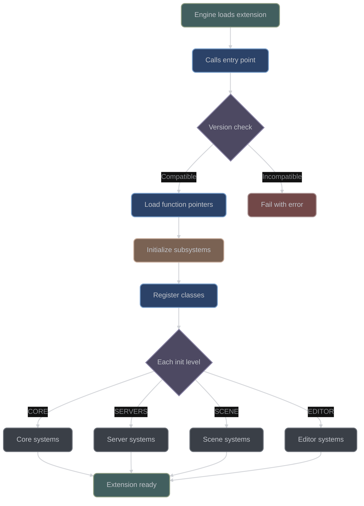
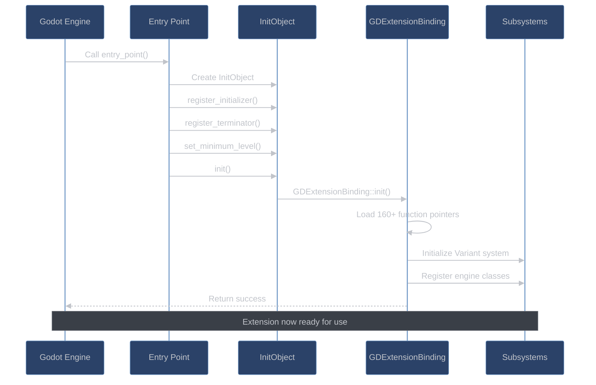

# Initialization Pipeline

## Overview

**The critical startup sequence that makes extensions work:** Initialization is the complex process that happens when Godot loads your GDExtension library. Think of it as a handshake between your C++ code and the Godot engine - they need to agree on communication protocols, exchange function pointers, and set up all the systems needed for your extension to work. This process must happen in the exact right order, or your extension will fail to load.

**Why initialization is complex:** Your C++ extension runs in a separate binary from Godot, so they can't directly call each other's functions. The initialization process creates bridges between these separate programs, setting up function pointer tables, negotiating interface versions, and registering your classes with Godot's type system. Understanding this process is crucial for debugging loading issues and writing robust extensions.

**What happens during initialization:** The process starts when Godot loads your library and calls your entry point function. Your extension then negotiates with Godot to establish communication, loads function pointers for all Godot APIs you'll need, initializes various subsystems in the correct order, and finally registers your custom classes. Only after all these steps complete successfully can your extension actually be used.

The godot-cpp initialization pipeline is a sophisticated multi-phase system that establishes the binary interface between C++ extensions and the Godot engine. The pipeline handles version negotiation, function pointer resolution, subsystem initialization, and class registration in a specific order to ensure proper operation.

**Key Source Files:**
- `src/godot.cpp` - Main initialization implementation
- `include/godot_cpp/godot.hpp` - Initialization declarations
- `src/core/class_db.cpp` - Class registration system
- `src/variant/variant.cpp` - Variant system initialization
- `include/godot_cpp/classes/wrapped.hpp` - Object initialization

### Initialization Flow Diagram



## Entry Point Architecture

### GDExtension Entry Point Contract

Every GDExtension must export a C-compatible entry point with this exact signature:

```c
typedef GDExtensionBool (*GDExtensionInitializationFunction)(
    GDExtensionInterfaceGetProcAddress p_get_proc_address,  // Function resolver
    GDExtensionClassLibraryPtr p_library,                   // Your extension handle
    GDExtensionInitialization *r_initialization             // Output: callbacks to register
);
```

> **Entry Point Naming**: The entry point function name must match what's declared in your `.gdextension` file's `entry_symbol` field. Common convention is `{library_name}_init`. The `GDE_EXPORT` macro ensures proper symbol visibility on all platforms.

### Example Entry Point (`test/src/[register_types.cpp:45](https://github.com/godotengine/godot-cpp/blob/master/test/src/register_types.cpp#L45))

```cpp
extern "C" {
GDExtensionBool GDE_EXPORT example_library_init(
    GDExtensionInterfaceGetProcAddress p_get_proc_address,
    GDExtensionClassLibraryPtr p_library,
    GDExtensionInitialization *r_initialization) {

    GDExtensionBinding::InitObject init_obj(p_get_proc_address, p_library, r_initialization);

    init_obj.register_initializer(initialize_example_module);
    init_obj.register_terminator(uninitialize_example_module);
    init_obj.set_minimum_library_initialization_level(MODULE_INITIALIZATION_LEVEL_SCENE);

    return init_obj.init();
}
}
```

### InitObject Pattern ([godot.hpp:227](https://github.com/godotengine/godot-cpp/blob/master/include/godot_cpp/godot.hpp#L227))

The InitObject provides a builder pattern for initialization:

| Method | Purpose | When to Use |
|--------|---------|-------------|
| `register_initializer()` | Set per-level init callback | Always required - registers your classes |
| `register_terminator()` | Set per-level cleanup callback | Always required - unregisters classes |
| `set_minimum_library_initialization_level()` | Earliest init level | Use SCENE for gameplay, SERVERS for low-level |
| `init()` | Execute initialization | Always call last - returns success/failure |

```cpp
class InitObject {
    GDExtensionInterfaceGetProcAddress get_proc_address;
    GDExtensionClassLibraryPtr library;
    GDExtensionInitialization *initialization;
    InitData *init_data;

public:
    InitObject(GDExtensionInterfaceGetProcAddress p_get_proc_address,
               GDExtensionClassLibraryPtr p_library,
               GDExtensionInitialization *r_initialization);

    void register_initializer(InitializationCallback p_init);     // Your init function
    void register_terminator(TerminationCallback p_terminate);    // Your cleanup function
    void set_minimum_library_initialization_level(ModuleInitializationLevel p_level);

    GDExtensionBool init();  // Performs actual initialization
};
```

> **Builder Pattern**: InitObject uses the builder pattern to make initialization foolproof. You can't forget critical steps because `init()` validates everything was configured.

## Startup Sequence

### Complete Initialization Flow

The initialization follows this exact sequence:



### GDExtensionBinding::init() Flow ([godot.cpp:276](https://github.com/godotengine/godot-cpp/blob/master/src/godot.cpp#L276))

```cpp
bool GDExtensionBinding::init(GDExtensionInterfaceGetProcAddress p_get_proc_address,
                              GDExtensionClassLibraryPtr p_library,
                              GDExtensionInitialization *r_initialization,
                              InitData *p_init_data) {

    // Phase 1: Validation (lines 277-279)
    if (!p_init_data || !p_init_data->init_callback) {
        ERR_FAIL_V_MSG(false, "Initialization callback must be defined.");
    }

    // Phase 2: Check if already initialized (lines 281-288)
    if (api_initialized) {
        r_initialization->initialize = initialize_level;
        r_initialization->deinitialize = deinitialize_level;
        r_initialization->userdata = p_init_data;
        r_initialization->minimum_initialization_level = p_init_data->minimum_initialization_level;
        return true;
    }

    // Phase 3: Legacy interface detection (lines 290-298)
    // Detects and rejects Godot 4.0 interfaces

    // Phase 4: Function pointer loading (lines 300-498)
    // Loads 160+ function pointers in specific order

    // Phase 5: Setup callbacks (lines 500-503)
    r_initialization->initialize = initialize_level;
    r_initialization->deinitialize = deinitialize_level;
    r_initialization->minimum_initialization_level = p_init_data->minimum_initialization_level;
    r_initialization->userdata = p_init_data;

    // Phase 6: Initialize variant system (lines 505-506)
    Variant::init_bindings();

    // Phase 7: Register engine classes (line 506)
    godot::internal::register_engine_classes();

    // Phase 8: Mark as initialized (line 508)
    api_initialized = true;

    return true;
}
```

## Function Pointer Loading

### Loading Order and Dependencies

Function pointers are loaded in a critical order to ensure dependencies are satisfied:

#### Phase 1: Essential Functions ([godot.cpp:300](https://github.com/godotengine/godot-cpp/blob/master/src/godot.cpp#L300))

```cpp
// 1. Error printing (must be first)
internal::gdextension_interface_print_error =
    (GDExtensionInterfacePrintError)p_get_proc_address("print_error");
if (!internal::gdextension_interface_print_error) {
    printf("ERROR: Unable to load GDExtension interface function print_error().\n");
    return false;
}

// 2. Store core pointers
internal::gdextension_interface_get_proc_address = p_get_proc_address;
internal::library = p_library;
internal::token = p_library;

// 3. Version checking
LOAD_PROC_ADDRESS(get_godot_version2, GDExtensionInterfaceGetGodotVersion2);
internal::gdextension_interface_get_godot_version2(&internal::godot_version);
```

#### Phase 2: Memory Functions ([godot.cpp:340](https://github.com/godotengine/godot-cpp/blob/master/src/godot.cpp#L340))

```cpp
LOAD_PROC_ADDRESS(mem_alloc, GDExtensionInterfaceMemAlloc);
LOAD_PROC_ADDRESS(mem_realloc, GDExtensionInterfaceMemRealloc);
LOAD_PROC_ADDRESS(mem_free, GDExtensionInterfaceMemFree);
```

#### Phase 3: Core Functions ([godot.cpp:343](https://github.com/godotengine/godot-cpp/blob/master/src/godot.cpp#L343))

```cpp
LOAD_PROC_ADDRESS(print_warning, GDExtensionInterfacePrintWarning);
LOAD_PROC_ADDRESS(print_script_error, GDExtensionInterfacePrintScriptError);
LOAD_PROC_ADDRESS(get_native_struct_size, GDExtensionInterfaceGetNativeStructSize);
```

#### Phase 4: Variant System ([godot.cpp:348](https://github.com/godotengine/godot-cpp/blob/master/src/godot.cpp#L348))

50+ variant-related functions including:
- Variant construction/destruction
- Type conversion
- Operators
- Method calls
- Property access

#### Phase 5: String Operations ([godot.cpp:397](https://github.com/godotengine/godot-cpp/blob/master/src/godot.cpp#L397))

String manipulation functions:
- UTF-8/16/32 conversions
- String creation
- StringName operations

#### Phase 6: Collection Functions ([godot.cpp:428](https://github.com/godotengine/godot-cpp/blob/master/src/godot.cpp#L428))

Array and Dictionary operations:
- Packed array functions
- Dictionary iteration
- Array manipulation

#### Phase 7: Object System ([godot.cpp:454](https://github.com/godotengine/godot-cpp/blob/master/src/godot.cpp#L454))

Object lifecycle functions:
- Object creation/destruction
- Instance binding
- Method calling
- Property access

#### Phase 8: ClassDB Functions ([godot.cpp:477](https://github.com/godotengine/godot-cpp/blob/master/src/godot.cpp#L477))

Class registration functions:
- Class registration
- Method binding
- Property registration
- Signal registration

#### Phase 9: Editor Functions ([godot.cpp:491](https://github.com/godotengine/godot-cpp/blob/master/src/godot.cpp#L491))

Editor-specific functions (optional):
- Plugin registration
- Documentation loading
- Tool functions

### LOAD_PROC_ADDRESS Macro ([godot.cpp:254](https://github.com/godotengine/godot-cpp/blob/master/src/godot.cpp#L254))

```cpp
#define LOAD_PROC_ADDRESS(m_name, m_type) \
    internal::gdextension_interface_##m_name = (m_type)p_get_proc_address(#m_name); \
    if (!internal::gdextension_interface_##m_name) { \
        ERR_PRINT_EARLY("Unable to load GDExtension interface function " #m_name "()"); \
        return false; \
    }
```

Each function pointer is validated immediately after loading. Any failure causes complete initialization failure.

## Interface Version Negotiation

### Version Compatibility Check ([godot.cpp:314](https://github.com/godotengine/godot-cpp/blob/master/src/godot.cpp#L314))

```cpp
// Version structure
internal::gdextension_interface_get_godot_version2(&internal::godot_version);

// Compatibility logic
bool compatible;
if (internal::godot_version.major != GODOT_VERSION_MAJOR) {
    // Major version must match or be newer in engine
    compatible = internal::godot_version.major > GODOT_VERSION_MAJOR;
} else if (internal::godot_version.minor != GODOT_VERSION_MINOR) {
    // Minor version must match or be newer in engine
    compatible = internal::godot_version.minor > GODOT_VERSION_MINOR;
} else {
    // Patch version check
#if GODOT_VERSION_PATCH > 0
    compatible = internal::godot_version.patch >= GODOT_VERSION_PATCH;
#else
    compatible = true;
#endif
}

if (!compatible) {
    char msg[128];
    snprintf(msg, 128,
        "Cannot load a GDExtension built for Godot %d.%d.%d using an older version of Godot (%d.%d.%d).",
        GODOT_VERSION_MAJOR, GODOT_VERSION_MINOR, GODOT_VERSION_PATCH,
        internal::godot_version.major, internal::godot_version.minor, internal::godot_version.patch);
    ERR_PRINT_EARLY(msg);
    return false;
}
```

### Legacy Interface Detection ([godot.cpp:290](https://github.com/godotengine/godot-cpp/blob/master/src/godot.cpp#L290))

The system can detect Godot 4.0 interfaces and reject them:

```cpp
uint32_t *raw_interface = (uint32_t *)(void *)p_get_proc_address;
if (uintptr_t(p_get_proc_address) % alignof(LegacyGDExtensionInterface) == 0) {
    if (raw_interface[0] == 4 && raw_interface[1] == 0) {
        // This is a Godot 4.0 interface
        LegacyGDExtensionInterface *legacy_interface =
            (LegacyGDExtensionInterface *)p_get_proc_address;
        internal::gdextension_interface_print_error =
            (GDExtensionInterfacePrintError)legacy_interface->print_error;
        ERR_PRINT_EARLY("Cannot load a GDExtension built for Godot 4.1+ in Godot 4.0.");
        return false;
    }
}
```

## Initialization Levels

### Level Definitions ([godot.hpp:215](https://github.com/godotengine/godot-cpp/blob/master/include/godot_cpp/godot.hpp#L215))

```cpp
enum ModuleInitializationLevel {
    MODULE_INITIALIZATION_LEVEL_CORE = 0,     // Core functionality
    MODULE_INITIALIZATION_LEVEL_SERVERS = 1,  // Engine servers
    MODULE_INITIALIZATION_LEVEL_SCENE = 2,    // Scene system
    MODULE_INITIALIZATION_LEVEL_EDITOR = 3,   // Editor functionality
    MODULE_INITIALIZATION_LEVEL_MAX
};
```

### Level Initialization Callback ([godot.cpp:515](https://github.com/godotengine/godot-cpp/blob/master/src/godot.cpp#L515))

```cpp
void GDExtensionBinding::initialize_level(void *p_userdata,
                                          GDExtensionInitializationLevel p_level) {
    ERR_FAIL_COND(static_cast<ModuleInitializationLevel>(p_level) >=
                  MODULE_INITIALIZATION_LEVEL_MAX);

    ClassDB::current_level = p_level;

    // Call user initialization callback
    InitData *init_data = static_cast<InitData *>(p_userdata);
    if (init_data && init_data->init_callback) {
        init_data->init_callback(static_cast<ModuleInitializationLevel>(p_level));
    }

    // Initialize ClassDB for this level (first time only)
    if (level_initialized[p_level] == 0) {
        ClassDB::initialize(p_level);
    }
    level_initialized[p_level]++;

    // Level-specific initialization
    if ((ModuleInitializationLevel)p_level == MODULE_INITIALIZATION_LEVEL_CORE) {
        // Register main loop callbacks if provided
        if (init_data && init_data->has_main_loop_callbacks()) {
            internal::gdextension_interface_register_main_loop_callbacks(
                internal::library,
                &init_data->main_loop_callbacks
            );
        }
    }

    if ((ModuleInitializationLevel)p_level == MODULE_INITIALIZATION_LEVEL_EDITOR) {
        // Register editor callbacks and load documentation
        internal::gdextension_interface_editor_register_get_classes_used_callback(
            internal::library,
            &ClassDB::_editor_get_classes_used_callback
        );

        const internal::DocData &doc_data = internal::get_doc_data();
        if (doc_data.is_valid()) {
            doc_data.load_data();
        }
    }
}
```

### Level Dependencies and Content

#### CORE Level
- Memory system initialization
- Variant type system
- Core types (String, Vector, etc.)
- Main loop registration
- Basic error handling

#### SERVERS Level
- Physics server
- Rendering server
- Audio server
- Navigation server
- Other engine servers

#### SCENE Level (Most Common)
- Scene tree system
- Node classes
- Resource types
- **User classes typically registered here**
- UI system

#### EDITOR Level
- Editor plugins
- Tool scripts
- Documentation
- Custom inspectors
- Editor-only functionality

## Subsystem Initialization

### Variant System Initialization ([variant.cpp:47](https://github.com/godotengine/godot-cpp/blob/master/src/variant/variant.cpp#L47))

```cpp
void Variant::init_bindings() {
    // Initialize type constructors
    for (int i = 1; i < VARIANT_MAX; i++) {
        from_type_constructor[i] =
            internal::gdextension_interface_get_variant_from_type_constructor(
                (GDExtensionVariantType)i
            );
        to_type_constructor[i] =
            internal::gdextension_interface_get_variant_to_type_constructor(
                (GDExtensionVariantType)i
            );
    }

    // Initialize internal access
    VariantInternal::init_bindings();

    // Initialize all variant types
    StringName::init_bindings();
    String::init_bindings();
    NodePath::init_bindings();
    RID::init_bindings();
    Callable::init_bindings();
    Signal::init_bindings();
    Dictionary::init_bindings();
    Array::init_bindings();

    // Initialize packed arrays
    PackedByteArray::init_bindings();
    PackedInt32Array::init_bindings();
    PackedInt64Array::init_bindings();
    PackedFloat32Array::init_bindings();
    PackedFloat64Array::init_bindings();
    PackedStringArray::init_bindings();
    PackedVector2Array::init_bindings();
    PackedVector3Array::init_bindings();
    PackedColorArray::init_bindings();
    PackedVector4Array::init_bindings();
}
```

### Engine Class Registration ([wrapped.cpp:141](https://github.com/godotengine/godot-cpp/blob/master/src/classes/wrapped.cpp#L141))

```cpp
void register_engine_classes() {
    // Get all registered callbacks
    std::vector<EngineClassRegistrationCallback> &callbacks =
        get_engine_class_registration_callbacks();

    // Execute each registration callback
    for (EngineClassRegistrationCallback cb : callbacks) {
        cb();
    }

    // Clear the callback list
    callbacks.clear();
}
```

### ClassDB Initialization ([class_db.cpp:411](https://github.com/godotengine/godot-cpp/blob/master/src/core/class_db.cpp#L411))

```cpp
void ClassDB::initialize(GDExtensionInitializationLevel p_level) {
    // Currently empty but reserved for future use
}
```

## Class Registration Pipeline

### Registration Macro ([class_db.hpp:365](https://github.com/godotengine/godot-cpp/blob/master/include/godot_cpp/core/class_db.hpp#L365))

```cpp
#define GDREGISTER_CLASS(m_class) ::godot::ClassDB::register_class<m_class>();
```

### Registration Flow ([class_db.hpp:234](https://github.com/godotengine/godot-cpp/blob/master/include/godot_cpp/core/class_db.hpp#L234))

```cpp
template <typename T>
static void _register_class(bool p_virtual = false, bool p_exposed = true,
                           bool p_runtime = false) {
    // Phase 1: Static assertions (lines 236-238)
    static_assert(TypesAreSame<typename T::self_type, T>::value,
                  "Class not declared properly, please use GDCLASS.");
    static_assert(!FunctionsAreSame<T::self_type::_bind_methods,
                                    T::parent_type::_bind_methods>::value,
                  "Class must declare 'static void _bind_methods'.");

    // Phase 2: Store instance binding callbacks (line 239)
    instance_binding_callbacks[T::get_class_static()] = &T::_gde_binding_callbacks;

    // Phase 3: Create ClassInfo (lines 241-252)
    ClassInfo cl;
    cl.name = T::get_class_static();
    cl.parent_name = T::get_parent_class_static();
    cl.level = current_level;

    // Link to parent if it's a custom class
    std::unordered_map<StringName, ClassInfo>::iterator parent_it =
        classes.find(cl.parent_name);
    if (parent_it != classes.end()) {
        cl.parent_ptr = &parent_it->second;
    }

    // Phase 4: Store in registry (lines 250-252)
    classes[cl.name] = cl;
    class_register_order.push_back(cl.name);

    // Phase 5: Create GDExtension registration info (lines 254-281)
    GDExtensionClassCreationInfo5 class_info = {
        p_virtual,                    // is_virtual
        is_abstract,                  // is_abstract
        p_exposed,                     // is_exposed
        p_runtime,                     // is_runtime
        nullptr,                       // icon_path
        T::set_bind,                   // set_func
        T::get_bind,                   // get_func
        T::has_get_property_list() ?
            T::get_property_list_bind : nullptr,  // get_property_list_func
        T::free_property_list_bind,   // free_property_list_func
        T::property_can_revert_bind,  // property_can_revert_func
        T::property_get_revert_bind,  // property_get_revert_func
        T::validate_property_bind,    // validate_property_func
        T::notification_bind,          // notification_func
        T::to_string_bind,             // to_string_func
        nullptr,                       // reference_func
        nullptr,                       // unreference_func
        &_create_instance_func<T>,    // create_instance_func
        T::free,                       // free_instance_func
        &_recreate_instance_func<T>,  // recreate_instance_func
        &ClassDB::get_virtual_func,   // get_virtual_func
        nullptr,                       // get_virtual_call_data_func
        nullptr,                       // call_virtual_func
        (void *)&T::get_class_static(), // class_userdata
    };

    // Phase 6: Register with engine (line 282)
    internal::gdextension_interface_classdb_register_extension_class5(
        internal::library,
        cl.name._native_ptr(),
        cl.parent_name._native_ptr(),
        &class_info
    );

    // Phase 7: Initialize class (lines 284-287)
    T::initialize_class();  // Calls _bind_methods()
    initialize_class(classes[cl.name]);
}
```

### Object Construction Pipeline ([wrapped.cpp:69](https://github.com/godotengine/godot-cpp/blob/master/src/classes/wrapped.cpp#L69))

```cpp
Wrapped::Wrapped(const StringName &p_godot_class) {
    // Create engine object
    _owner = godot::internal::gdextension_interface_classdb_construct_object2(
        reinterpret_cast<GDExtensionConstStringNamePtr>(p_godot_class._native_ptr())
    );

    // Set instance for extension class
    if (_constructing_extension_class_name) {
        godot::internal::gdextension_interface_object_set_instance(
            _owner,
            reinterpret_cast<GDExtensionConstStringNamePtr>(
                _constructing_extension_class_name
            ),
            this
        );
        _constructing_extension_class_name = nullptr;
    }

    // Set instance binding
    if (likely(_constructing_class_binding_callbacks)) {
        godot::internal::gdextension_interface_object_set_instance_binding(
            _owner,
            godot::internal::token,
            this,
            _constructing_class_binding_callbacks
        );
        _constructing_class_binding_callbacks = nullptr;
    } else {
        CRASH_NOW_MSG("BUG: Godot Object created without binding callbacks. "
                     "Did you forget to use memnew()?");
    }
}
```

## Failure Modes

### Critical Failure Points

#### 1. Missing Initialization Callback ([godot.cpp:277](https://github.com/godotengine/godot-cpp/blob/master/src/godot.cpp#L277))

```cpp
if (!p_init_data || !p_init_data->init_callback) {
    ERR_FAIL_V_MSG(false, "Initialization callback must be defined.");
}
```

#### 2. Function Pointer Loading Failure

Any missing function causes immediate failure:

```cpp
if (!internal::gdextension_interface_##m_name) {
    ERR_PRINT_EARLY("Unable to load GDExtension interface function " #m_name "()");
    return false;
}
```

#### 3. Version Incompatibility ([godot.cpp:329](https://github.com/godotengine/godot-cpp/blob/master/src/godot.cpp#L329))

```cpp
if (!compatible) {
    char msg[128];
    snprintf(msg, 128,
        "Cannot load a GDExtension built for Godot %d.%d.%d "
        "using an older version of Godot (%d.%d.%d).",
        GODOT_VERSION_MAJOR, GODOT_VERSION_MINOR, GODOT_VERSION_PATCH,
        internal::godot_version.major, internal::godot_version.minor,
        internal::godot_version.patch);
    ERR_PRINT_EARLY(msg);
    return false;
}
```

#### 4. Legacy Interface Detection ([godot.cpp:296](https://github.com/godotengine/godot-cpp/blob/master/src/godot.cpp#L296))

```cpp
ERR_PRINT_EARLY("Cannot load a GDExtension built for Godot 4.1+ in Godot 4.0.");
return false;
```

#### 5. Object Creation Without Bindings ([wrapped.cpp:89](https://github.com/godotengine/godot-cpp/blob/master/src/classes/wrapped.cpp#L89))

```cpp
CRASH_NOW_MSG("BUG: Godot Object created without binding callbacks. "
             "Did you forget to use memnew()?");
```

### Recovery and Cleanup

- **No Partial Initialization**: If any phase fails, entire initialization aborts
- **No Recovery Mechanism**: Fatal errors require fixing and reloading
- **Clean Failure**: No partial state remains after failure

## Deinitialization Process

### Level Deinitialization ([godot.cpp:543](https://github.com/godotengine/godot-cpp/blob/master/src/godot.cpp#L543))

```cpp
void GDExtensionBinding::deinitialize_level(void *p_userdata,
                                            GDExtensionInitializationLevel p_level) {
    ERR_FAIL_COND(static_cast<ModuleInitializationLevel>(p_level) >=
                  MODULE_INITIALIZATION_LEVEL_MAX);

    ClassDB::current_level = p_level;

    // Call user termination callback
    InitData *init_data = static_cast<InitData *>(p_userdata);
    if (init_data && init_data->terminate_callback) {
        init_data->terminate_callback(static_cast<ModuleInitializationLevel>(p_level));
    }

    // Deinitialize ClassDB for this level (last time only)
    level_initialized[p_level]--;
    if (level_initialized[p_level] == 0) {
        EditorPlugins::deinitialize(p_level);
        ClassDB::deinitialize(p_level);
    }
}
```

### ClassDB Cleanup ([class_db.cpp:414](https://github.com/godotengine/godot-cpp/blob/master/src/core/class_db.cpp#L414))

```cpp
void ClassDB::deinitialize(GDExtensionInitializationLevel p_level) {
    std::set<StringName> to_erase;

    // Process in reverse registration order
    for (std::vector<StringName>::reverse_iterator i = class_register_order.rbegin();
         i != class_register_order.rend(); ++i) {
        const StringName &name = *i;
        const ClassInfo &cl = classes[name];

        if (cl.level != p_level) {
            continue;
        }

        // Unregister from engine
        internal::gdextension_interface_classdb_unregister_extension_class(
            internal::library,
            name._native_ptr()
        );

        // Clean up method bindings
        for (const std::pair<const StringName, MethodBind *> &method : cl.method_map) {
            memdelete(method.second);
        }

        // Remove from registry
        classes.erase(name);
        to_erase.insert(name);
    }

    // Update registration order
    std::vector<StringName>::iterator it = std::remove_if(
        class_register_order.begin(),
        class_register_order.end(),
        [&](const StringName &p_name) {
            return to_erase.count(p_name) > 0;
        }
    );
    class_register_order.erase(it, class_register_order.end());

    // Clean up singletons at CORE level
    if (p_level == GDEXTENSION_INITIALIZATION_CORE) {
        // Free singleton instance bindings
        // ... singleton cleanup code
    }
}
```

## State Management

### Global State Variables ([godot.cpp:247](https://github.com/godotengine/godot-cpp/blob/master/src/godot.cpp#L247))

```cpp
bool GDExtensionBinding::api_initialized = false;
int GDExtensionBinding::level_initialized[MODULE_INITIALIZATION_LEVEL_MAX] = { 0 };
GDExtensionBinding::InitDataList GDExtensionBinding::initdata;
```

### Thread-Local Construction State ([wrapped.hpp:72](https://github.com/godotengine/godot-cpp/blob/master/include/godot_cpp/classes/wrapped.hpp#L72))

```cpp
_GODOT_CPP_THREAD_LOCAL static const StringName *_constructing_extension_class_name;
_GODOT_CPP_THREAD_LOCAL static const GDExtensionInstanceBindingCallbacks *
    _constructing_class_binding_callbacks;

#ifdef HOT_RELOAD_ENABLED
_GODOT_CPP_THREAD_LOCAL static GDExtensionObjectPtr _constructing_recreate_owner;
#endif
```

### InitData Structure ([godot.cpp:222](https://github.com/godotengine/godot-cpp/blob/master/src/godot.cpp#L222))

```cpp
class InitData {
public:
    ModuleInitializationLevel minimum_level = MODULE_INITIALIZATION_LEVEL_CORE;
    InitializationCallback init_callback = nullptr;
    TerminationCallback terminate_callback = nullptr;

    std::vector<std::pair<StringName, ClassCreatorFunc>> class_registration_funcs;
    std::vector<StringName> parent_class_names;
    std::vector<StringName> class_names;

    bool is_runtime = false;

    GDExtensionMainLoopCallbacks main_loop_callbacks;

    bool has_main_loop_callbacks() const {
        return main_loop_callbacks.startup_func != nullptr ||
               main_loop_callbacks.shutdown_func != nullptr ||
               main_loop_callbacks.frame_func != nullptr;
    }
};
```

## Implementation Examples

### Minimal Extension

```cpp
#include <godot_cpp/godot.hpp>

using namespace godot;

void initialize_minimal(ModuleInitializationLevel p_level) {
    if (p_level != MODULE_INITIALIZATION_LEVEL_SCENE) {
        return;
    }
    // Minimal initialization
}

void terminate_minimal(ModuleInitializationLevel p_level) {
    // Cleanup
}

extern "C" {
GDExtensionBool GDE_EXPORT minimal_init(
    GDExtensionInterfaceGetProcAddress p_get_proc_address,
    GDExtensionClassLibraryPtr p_library,
    GDExtensionInitialization *r_initialization) {

    GDExtensionBinding::InitObject init_obj(p_get_proc_address, p_library,
                                           r_initialization);
    init_obj.register_initializer(initialize_minimal);
    init_obj.register_terminator(terminate_minimal);
    init_obj.set_minimum_library_initialization_level(
        MODULE_INITIALIZATION_LEVEL_SCENE);
    return init_obj.init();
}
}
```

### Multi-Level Extension

```cpp
void initialize_multilevel(ModuleInitializationLevel p_level) {
    switch (p_level) {
        case MODULE_INITIALIZATION_LEVEL_CORE:
            // Initialize core systems
            register_core_types();
            break;

        case MODULE_INITIALIZATION_LEVEL_SERVERS:
            // Initialize server integrations
            register_server_types();
            break;

        case MODULE_INITIALIZATION_LEVEL_SCENE:
            // Register scene classes
            ClassDB::register_class<MyNode>();
            ClassDB::register_class<MyResource>();
            break;

        case MODULE_INITIALIZATION_LEVEL_EDITOR:
            // Register editor plugins
            EditorPlugins::add_by_type<MyEditorPlugin>();
            break;
    }
}
```

### Error Handling Example

```cpp
class SafeExtension {
    static bool validate_environment() {
        // Check for required features
        if (!OS::get_singleton()->has_feature("threads")) {
            return false;
        }
        return true;
    }

public:
    static void initialize(ModuleInitializationLevel p_level) {
        if (p_level != MODULE_INITIALIZATION_LEVEL_SCENE) {
            return;
        }

        if (!validate_environment()) {
            ERR_PRINT("Extension requires thread support");
            return;
        }

        // Safe to register classes
        ClassDB::register_class<ThreadedProcessor>();
    }
};
```

### Custom Main Loop

```cpp
class CustomMainLoop : public MainLoop {
    GDCLASS(CustomMainLoop, MainLoop)

protected:
    static void _bind_methods() {}

public:
    virtual void _initialize() override {
        print_line("Custom main loop initialized");
    }

    virtual bool _process(double delta) override {
        // Process frame
        return false;  // Continue
    }
};

void register_main_loop(ModuleInitializationLevel p_level) {
    if (p_level == MODULE_INITIALIZATION_LEVEL_CORE) {
        ClassDB::register_class<CustomMainLoop>();
    }
}
```

## Conclusion

The godot-cpp initialization pipeline is a sophisticated multi-phase system that:

1. **Ensures Compatibility**: Version checking prevents ABI mismatches
2. **Manages Dependencies**: Ordered loading ensures all dependencies are met
3. **Provides Flexibility**: Multiple initialization levels for different subsystems
4. **Handles Failures Gracefully**: Clean error reporting and no partial states
5. **Supports Complex Scenarios**: Multi-level initialization, main loop callbacks, editor integration

The pipeline's design ensures robust extension loading while maintaining binary compatibility and providing clear error messages for debugging initialization issues.
