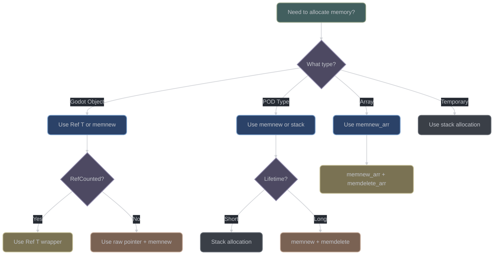

# Memory Model

## Overview

The godot-cpp memory model provides a sophisticated allocation system with clear ownership boundaries between C++ extensions and the Godot engine. It features custom allocators, atomic reference counting, copy-on-write optimizations, and careful memory alignment for optimal performance.

**Key Source Files:**
- `include/godot_cpp/core/memory.hpp` - Core memory management
- `src/core/memory.cpp` - Implementation
- `include/godot_cpp/templates/safe_refcount.hpp` - Atomic reference counting
- `include/godot_cpp/templates/cowdata.hpp` - Copy-on-write containers
- `include/godot_cpp/classes/wrapped.hpp` - Object lifecycle management

### Memory Management Decision Tree



## Memory Allocation System

### Core Memory Class

The Memory class provides static allocation functions ([memory.hpp:63](https://github.com/godotengine/godot-cpp/blob/master/include/godot_cpp/core/memory.hpp#L63)):

```cpp
class Memory {
public:
    // Basic allocation/deallocation
    static void *alloc_static(size_t p_bytes, bool p_pad_align = false);
    static void *realloc_static(void *p_memory, size_t p_bytes, bool p_pad_align = false);
    static void free_static(void *p_ptr, bool p_pad_align = false);

    // Reference counting
    static uint64_t get_mem_available();
    static uint64_t get_mem_usage();
    static uint64_t get_mem_max_usage();
};
```

> **Key Insight**: The Memory class delegates to Godot's internal allocator via `gdextension_interface_mem_*` functions. This ensures all memory allocated by extensions is tracked by the engine's memory statistics and respects engine-wide memory limits. The `p_pad_align` parameter adds platform-specific alignment padding for SIMD operations.

### Memory Layout for Allocations

Array allocations include metadata headers ([memory.hpp:67](https://github.com/godotengine/godot-cpp/blob/master/include/godot_cpp/core/memory.hpp#L67)):

```cpp
// Memory layout with alignment padding:
// Alignment:  ↓ max_align_t        ↓ uint64_t          ↓ max_align_t
//             ┌─────────────────┬──┬────────────────┬──┬───────────...
//             │ uint64_t        │░░│ uint64_t       │░░│ T[]
//             │ alloc size      │░░│ element count  │░░│ data
//             └─────────────────┴──┴────────────────┴──┴───────────...
// Offset:     ↑ SIZE_OFFSET        ↑ ELEMENT_OFFSET    ↑ DATA_OFFSET

static constexpr size_t SIZE_OFFSET = 0;
static constexpr size_t ELEMENT_OFFSET = ((SIZE_OFFSET + sizeof(uint64_t)) % alignof(max_align_t) == 0) ?
    (SIZE_OFFSET + sizeof(uint64_t)) :
    ((SIZE_OFFSET + sizeof(uint64_t)) + alignof(max_align_t) - ((SIZE_OFFSET + sizeof(uint64_t)) % alignof(max_align_t)));
static constexpr size_t DATA_OFFSET = ((ELEMENT_OFFSET + sizeof(uint64_t)) % alignof(max_align_t) == 0) ?
    (ELEMENT_OFFSET + sizeof(uint64_t)) :
    ((ELEMENT_OFFSET + sizeof(uint64_t)) + alignof(max_align_t) - ((ELEMENT_OFFSET + sizeof(uint64_t)) % alignof(max_align_t)));
```

### memnew/memdelete Macros

#### memnew Macro ([memory.hpp:99](https://github.com/godotengine/godot-cpp/blob/master/include/godot_cpp/core/memory.hpp#L99))

```cpp
#define memnew(m_class) \
    (::godot::_pre_initialize<std::remove_pointer_t<decltype(new ("", "") m_class)>>(), \
     ::godot::_post_initialize(new ("", "") m_class))
```

> **When to Use `memnew` vs `new`**:
> - **Use `memnew`**: For all Godot-related objects, especially those inheriting from Object/RefCounted/Resource
> - **Use `new`**: Only for pure C++ objects that never interact with Godot
> - **Why**: `memnew` integrates with Godot's memory tracking, provides debug information, and ensures proper cleanup on engine shutdown
> - **Performance**: `memnew` has minimal overhead (~5ns) due to metadata storage

**Expansion Flow:**
1. `_pre_initialize<T>()` - Sets construction context for hot-reload support
2. Placement `new("", "")` - Allocates via Godot's allocator with debug info
3. `_post_initialize()` - Registers object with engine if it's a Wrapped type

#### memdelete Template ([memory.hpp:104](https://github.com/godotengine/godot-cpp/blob/master/include/godot_cpp/core/memory.hpp#L104))

| Type | Behavior | Implementation | When to Use |
|------|----------|----------------|-------------|
| **Non-Wrapped** | Calls destructor + frees memory | `~T()` + `free_static()` | POD types, custom C++ classes |
| **Wrapped** | Delegates to engine | `object_destroy()` | All Godot objects (Node, Resource, etc.) |
| **Trivially Destructible** | Direct free | `free_static()` only | POD with no destructor |

```cpp
template <typename T, std::enable_if_t<!std::is_base_of_v<godot::Wrapped, T>, bool> = true>
void memdelete(T *p_class) {
    if constexpr (!std::is_trivially_destructible_v<T>) {
        p_class->~T();  // Manual destructor call for non-trivial types
    }
    Memory::free_static(p_class);  // Return memory to engine allocator
}

// Specialization for Wrapped classes - NEVER manually delete these!
template <typename T, std::enable_if_t<std::is_base_of_v<godot::Wrapped, T>, bool> = true>
void memdelete(T *p_class) {
    // Engine handles destruction, reference counting, and cleanup
    godot::internal::gdextension_interface_object_destroy(p_class->_owner);
}
```

> **Critical**: Never use `delete` on Godot objects! It bypasses reference counting and will cause crashes. Always use `memdelete` or let `Ref<T>` handle it automatically.

#### memnew_arr Macro ([memory.hpp:118](https://github.com/godotengine/godot-cpp/blob/master/include/godot_cpp/core/memory.hpp#L118))

```cpp
#define memnew_arr(m_class, m_count) \
    ::godot::memnew_arr_template<m_class>(m_count, "", "")
```

Array allocation with element tracking:

```cpp
template <typename T>
T *memnew_arr_template(size_t p_elements, const char *p_dummy, const char *p_descr) {
    if (p_elements == 0) return nullptr;

    // Calculate padded allocation size
    size_t alloc_size = Memory::DATA_OFFSET + sizeof(T) * p_elements;
    void *mem = Memory::alloc_static(alloc_size, true);

    // Store metadata
    uint64_t *_elem = reinterpret_cast<uint64_t *>(mem) + Memory::ELEMENT_OFFSET / sizeof(uint64_t);
    *_elem = p_elements;

    // Construct elements
    T *elems = reinterpret_cast<T *>(reinterpret_cast<uint8_t *>(mem) + Memory::DATA_OFFSET);
    for (size_t i = 0; i < p_elements; i++) {
        memnew_placement(&elems[i], T);
    }

    return elems;
}
```

## Custom Allocators

### Placement New Operators ([memory.hpp:43](https://github.com/godotengine/godot-cpp/blob/master/include/godot_cpp/core/memory.hpp#L43))

```cpp
// Standard allocation
void *operator new(size_t p_size, const char *p_dummy, const char *p_description);

// Custom allocator function
void *operator new(size_t p_size, const char *p_dummy, void *(*p_allocfunc)(size_t p_size));

// Placement new with size check
void *operator new(size_t p_size, const char *p_dummy, void *p_pointer, size_t check, const char *p_description);
```

The `p_dummy` parameter prevents conflicts when both engine and GDExtension are built as static libraries on iOS.

### Memory Implementation ([memory.cpp:36](https://github.com/godotengine/godot-cpp/blob/master/src/core/memory.cpp#L36))

```cpp
void *Memory::alloc_static(size_t p_bytes, bool p_pad_align) {
#ifdef DEV_ENABLED
    bool prepad = p_pad_align;
#else
    bool prepad = false;
#endif

    void *mem = internal::gdextension_interface_mem_alloc(
        p_bytes + (prepad ? DATA_OFFSET : 0)
    );

    if (prepad) {
        uint64_t *s = reinterpret_cast<uint64_t *>(mem);
        *s = p_bytes;
        return reinterpret_cast<uint8_t *>(mem) + DATA_OFFSET;
    }
    return mem;
}

void Memory::free_static(void *p_ptr, bool p_pad_align) {
#ifdef DEV_ENABLED
    bool prepad = p_pad_align;
#else
    bool prepad = false;
#endif

    if (prepad) {
        p_ptr = reinterpret_cast<uint8_t *>(p_ptr) - DATA_OFFSET;
    }
    internal::gdextension_interface_mem_free(p_ptr);
}
```

### Allocation Tracking

Debug builds track allocation size in headers for validation:

```cpp
void *Memory::realloc_static(void *p_memory, size_t p_bytes, bool p_pad_align) {
    if (p_memory == nullptr) {
        return alloc_static(p_bytes, p_pad_align);
    }

    if (p_bytes == 0) {
        free_static(p_memory, p_pad_align);
        return nullptr;
    }

    // Reallocation preserves header information
    // ... implementation details
}
```

## Reference Counting

### SafeRefCount Class ([safe_refcount.hpp:178](https://github.com/godotengine/godot-cpp/blob/master/include/godot_cpp/templates/safe_refcount.hpp#L178))

Thread-safe reference counting implementation:

```cpp
class SafeRefCount {
    SafeNumeric<uint32_t> count;  // Atomic counter

public:
    _ALWAYS_INLINE_ bool ref() {  // Returns true on success
        return count.conditional_increment() != 0;
    }

    _ALWAYS_INLINE_ uint32_t refval() {  // Get current count
        return count.get();
    }

    _ALWAYS_INLINE_ bool unref() {  // Returns true if should delete
#ifdef DEV_ENABLED
        _check_unref_safety();  // Debug validation
#endif
        return count.decrement() == 0;
    }

    _ALWAYS_INLINE_ uint32_t unrefval() {  // Unref and return new count
        return count.decrement();
    }

    _ALWAYS_INLINE_ void init(uint32_t p_value = 1) {
        count.set(p_value);
    }
};
```

### SafeNumeric Template ([safe_refcount.hpp:47](https://github.com/godotengine/godot-cpp/blob/master/include/godot_cpp/templates/safe_refcount.hpp#L47))

Atomic wrapper for numeric types:

| Method | Memory Order | Use Case | Performance |
|--------|-------------|----------|-------------|
| `set()` | release | Publishing new value | 1-2 cycles |
| `get()` | acquire | Reading current value | 1-2 cycles |
| `increment()` | acq_rel | Atomic add | 10-20 cycles |
| `decrement()` | acq_rel | Atomic subtract | 10-20 cycles |
| `conditional_increment()` | CAS loop | Increment if non-zero | 20-100 cycles |

```cpp
template <typename T>
class SafeNumeric {
    std::atomic<T> value;

public:
    _ALWAYS_INLINE_ void set(T p_value) {
        value.store(p_value, std::memory_order_release);  // Publish to other threads
    }

    _ALWAYS_INLINE_ T get() const {
        return value.load(std::memory_order_acquire);  // Synchronize with setter
    }

    _ALWAYS_INLINE_ T increment() {
        return value.fetch_add(1, std::memory_order_acq_rel) + 1;  // Return NEW value
    }

    _ALWAYS_INLINE_ T decrement() {
        return value.fetch_sub(1, std::memory_order_acq_rel) - 1;  // Return NEW value
    }

    _ALWAYS_INLINE_ T conditional_increment() {
        T old_value = value.load(std::memory_order_acquire);
        while (old_value != 0) {  // Only increment if alive
            if (value.compare_exchange_weak(old_value, old_value + 1,
                std::memory_order_acq_rel, std::memory_order_acquire)) {
                return old_value;  // Success - return OLD value
            }
            // CAS failed - old_value updated, retry
        }
        return 0;  // Object is dying, don't increment
    }
};
```

> **Conditional Increment**: This is the key to preventing use-after-free bugs. It atomically checks if the count is non-zero before incrementing, preventing resurrection of objects being destroyed.

### Reference Counting in Objects

RefCounted integration ([ref.hpp:47](https://github.com/godotengine/godot-cpp/blob/master/include/godot_cpp/templates/ref.hpp#L47)):

```cpp
template <typename T>
class Ref {
    T *reference = nullptr;

    void ref(const Ref &p_from) {
        if (p_from.reference == reference) return;

        unref();
        reference = p_from.reference;
        if (reference) {
            reference->reference();  // Increment count
        }
    }

    void unref() {
        if (reference && reference->unreference()) {
            memdelete(reference);  // Delete if count reaches 0
        }
        reference = nullptr;
    }
};
```

## Object Lifecycle

### Construction Phases

#### Pre-initialization ([wrapped.hpp:129](https://github.com/godotengine/godot-cpp/blob/master/include/godot_cpp/classes/wrapped.hpp#L129))

```cpp
template <typename T, std::enable_if_t<std::is_base_of<::godot::Wrapped, T>::value, bool> = true>
_ALWAYS_INLINE_ void _pre_initialize() {
#ifdef _GODOT_CPP_AVOID_THREAD_LOCAL
    Wrapped::_constructing_mutex.lock();
#endif
    Wrapped::_set_construct_info<T>();
}
```

#### Object Creation ([wrapped.cpp:69](https://github.com/godotengine/godot-cpp/blob/master/src/classes/wrapped.cpp#L69))

```cpp
Wrapped::Wrapped(const StringName &p_godot_class) {
#ifdef _GODOT_CPP_AVOID_THREAD_LOCAL
    std::lock_guard<std::recursive_mutex> lock(Wrapped::_constructing_mutex);
#endif

    // Create engine object
    _owner = godot::internal::gdextension_interface_classdb_construct_object2(
        reinterpret_cast<GDExtensionConstStringNamePtr>(p_godot_class._native_ptr())
    );

    // Set instance binding
    godot::internal::gdextension_interface_object_set_instance(
        _owner,
        reinterpret_cast<GDExtensionConstStringNamePtr>(p_godot_class._native_ptr()),
        this
    );

    // Set binding callbacks
    godot::internal::gdextension_interface_object_set_instance_binding(
        _owner,
        godot::internal::token,
        this,
        _constructing_class_binding_callbacks
    );
}
```

#### Post-initialization ([wrapped.cpp:58](https://github.com/godotengine/godot-cpp/blob/master/src/classes/wrapped.cpp#L58))

```cpp
void Wrapped::_postinitialize() {
#ifdef _GODOT_CPP_AVOID_THREAD_LOCAL
    Wrapped::_constructing_mutex.unlock();
#endif

    Object *obj = dynamic_cast<Object *>(this);
    if (obj) {
        obj->notification(Object::NOTIFICATION_POSTINITIALIZE);
    }
}
```

### Destruction Sequence

#### Object Destruction ([wrapped.hpp:382](https://github.com/godotengine/godot-cpp/blob/master/include/godot_cpp/classes/wrapped.hpp#L382))

```cpp
static void free(void * /*data*/, GDExtensionClassInstancePtr ptr) {
    if (ptr) {
        m_class *cls = reinterpret_cast<m_class *>(ptr);
        cls->~m_class();  // Call destructor
        ::godot::Memory::free_static(cls);  // Free memory
    }
}
```

#### Engine Object Cleanup ([memory.hpp:115](https://github.com/godotengine/godot-cpp/blob/master/include/godot_cpp/core/memory.hpp#L115))

```cpp
// For Wrapped objects
godot::internal::gdextension_interface_object_destroy(p_class->_owner);
```

### Object States

1. **Uninitialized**: Memory allocated but constructor not called
2. **Constructing**: C++ constructor running
3. **Initializing**: Engine object creation and binding
4. **Active**: Fully constructed and usable
5. **Destructing**: Destructor called, cleaning up
6. **Freed**: Memory returned to allocator

## Memory Boundaries

### Ownership Model

#### godot-cpp Owned Memory

- C++ object instances created with `memnew()`
- Array metadata headers (size, element count)
- COW data structure headers
- Reference count storage
- Extension class member variables

#### Godot Engine Owned Memory

- GodotObject instances (`_owner` pointers)
- Engine class instances
- Internal Godot data structures
- String pools and interned strings
- Resource data

### Cross-Binary Transfer

#### Object Creation ([wrapped.cpp:77](https://github.com/godotengine/godot-cpp/blob/master/src/classes/wrapped.cpp#L77))

```cpp
// Engine allocates and owns the GodotObject
_owner = godot::internal::gdextension_interface_classdb_construct_object2(
    reinterpret_cast<GDExtensionConstStringNamePtr>(p_godot_class._native_ptr())
);
```

#### Object Destruction ([memory.hpp:115](https://github.com/godotengine/godot-cpp/blob/master/include/godot_cpp/core/memory.hpp#L115))

```cpp
// Engine deallocates its object
godot::internal::gdextension_interface_object_destroy(p_class->_owner);
```

### Memory Safety Rules

1. **Never free engine-owned memory directly**
2. **Always use memnew/memdelete for C++ objects**
3. **Reference counting prevents premature deletion**
4. **Clear ownership boundaries at interfaces**
5. **No raw pointer sharing across boundaries**

## COW Data Structures

### CowData Template ([cowdata.hpp:47](https://github.com/godotengine/godot-cpp/blob/master/include/godot_cpp/templates/cowdata.hpp#L47))

Copy-on-write container implementation:

```cpp
template <typename T>
class CowData {
private:
    // Platform-specific size type
    typedef int64_t USize;

    T *_ptr = nullptr;  // Data pointer

    // Memory layout with reference count
    // Alignment:  ↓ max_align_t           ↓ USize          ↓ max_align_t
    //             ┌────────────────────┬──┬─────────────┬──┬───────────...
    //             │ SafeNumeric<USize> │░░│ USize       │░░│ T[]
    //             │ ref. count         │░░│ data size   │░░│ data
    //             └────────────────────┴──┴─────────────┴──┴───────────...
    // Offset:     ↑ REF_COUNT_OFFSET      ↑ SIZE_OFFSET    ↑ DATA_OFFSET

    static constexpr size_t REF_COUNT_OFFSET = 0;
    static constexpr size_t SIZE_OFFSET = /* aligned offset */;
    static constexpr size_t DATA_OFFSET = /* aligned offset */;
};
```

### Copy-on-Write Mechanism

#### _copy_on_write() Method ([cowdata.hpp:307](https://github.com/godotengine/godot-cpp/blob/master/include/godot_cpp/templates/cowdata.hpp#L307))

```cpp
typename CowData<T>::USize CowData<T>::_copy_on_write() {
    if (!_ptr) return 0;

    SafeNumeric<USize> *refc = _get_refcount();
    USize rc = refc->get();

    if (unlikely(rc > 1)) {  // Data is shared
        // Calculate new size
        USize current_size = *_get_size();
        USize new_size = next_po2(current_size);

        // Allocate new memory
        void *new_mem = Memory::alloc_static(DATA_OFFSET + new_size * sizeof(T), true);

        // Initialize new reference count
        SafeNumeric<USize> *new_refc = reinterpret_cast<SafeNumeric<USize> *>(
            reinterpret_cast<uint8_t *>(new_mem) + REF_COUNT_OFFSET
        );
        new_refc->set(1);

        // Copy data
        T *new_data = reinterpret_cast<T *>(
            reinterpret_cast<uint8_t *>(new_mem) + DATA_OFFSET
        );
        for (USize i = 0; i < current_size; i++) {
            memnew_placement(&new_data[i], T(_ptr[i]));
        }

        // Decrement old reference
        if (refc->decrement() == 0) {
            _free_data();
        }

        // Update pointer
        _ptr = new_data;
    }

    return rc;
}
```

### Reference Sharing

#### Copy Constructor ([cowdata.hpp:265](https://github.com/godotengine/godot-cpp/blob/master/include/godot_cpp/templates/cowdata.hpp#L265))

```cpp
CowData(const CowData<T> &p_from) { _ref(p_from); }
```

#### Assignment Operator ([cowdata.hpp:180](https://github.com/godotengine/godot-cpp/blob/master/include/godot_cpp/templates/cowdata.hpp#L180))

```cpp
void operator=(const CowData<T> &p_from) { _ref(p_from); }
```

#### Move Semantics ([cowdata.hpp:181](https://github.com/godotengine/godot-cpp/blob/master/include/godot_cpp/templates/cowdata.hpp#L181), 266-269`)

```cpp
void operator=(CowData<T> &&p_from) {
    _unref();
    _ptr = p_from._ptr;
    p_from._ptr = nullptr;
}

CowData(CowData<T> &&p_from) {
    _ptr = p_from._ptr;
    p_from._ptr = nullptr;
}
```

### COW Triggers

1. **Mutable Access**: `ptrw()` when ref count > 1
2. **Element Modification**: `set()` on shared data
3. **Resize Operations**: When capacity changes
4. **Write Operations**: Any non-const member access

## Memory Alignment

### Alignment Requirements

#### Platform-Specific Alignment

```cpp
// Maximum alignment for platform
alignof(max_align_t)  // Typically 8 or 16 bytes

// Data structure alignment
struct alignas(16) AlignedData {
    // ...
};
```

#### Allocation Alignment ([memory.hpp:143](https://github.com/godotengine/godot-cpp/blob/master/include/godot_cpp/core/memory.hpp#L143))

```cpp
template <typename T>
T *memnew_arr_template(size_t p_elements, const char *p_dummy, const char *p_descr) {
    // Ensure proper alignment for headers
    size_t alloc_size = Memory::DATA_OFFSET + sizeof(T) * p_elements;

    // DATA_OFFSET is calculated to maintain alignment
    void *mem = Memory::alloc_static(alloc_size, true);

    // Aligned data pointer
    T *elems = reinterpret_cast<T *>(
        reinterpret_cast<uint8_t *>(mem) + Memory::DATA_OFFSET
    );

    return elems;
}
```

### Power-of-Two Allocation

```cpp
// Next power of 2 calculation for efficient allocation
static _ALWAYS_INLINE_ USize next_po2(USize x) {
    if (x == 0) return 0;

    --x;
    x |= x >> 1;
    x |= x >> 2;
    x |= x >> 4;
    x |= x >> 8;
    x |= x >> 16;
    if (sizeof(USize) == 8) {
        x |= x >> 32;
    }
    return ++x;
}
```

## Thread Safety

### Atomic Operations

All reference counting uses atomic operations with proper memory ordering:

```cpp
// Acquire-release semantics for reference counting
value.fetch_add(1, std::memory_order_acq_rel);
value.fetch_sub(1, std::memory_order_acq_rel);

// Acquire for loads
value.load(std::memory_order_acquire);

// Release for stores
value.store(p_value, std::memory_order_release);
```

### Mutex Protection

Construction/destruction synchronization:

```cpp
#ifdef _GODOT_CPP_AVOID_THREAD_LOCAL
static std::recursive_mutex _constructing_mutex;
#else
static thread_local bool _constructing;
static thread_local ObjectID _constructing_id;
#endif
```

### Thread-Safe Patterns

1. **Immutable Sharing**: COW ensures readers never see partial writes
2. **Atomic Reference Counts**: Prevent race conditions in sharing
3. **Lock-Free Operations**: Most operations use atomics instead of locks
4. **Thread-Local Storage**: Per-thread construction state

## Memory Tracking

### Debug Mode Tracking

Memory usage statistics ([memory.cpp:96](https://github.com/godotengine/godot-cpp/blob/master/src/core/memory.cpp#L96)):

```cpp
uint64_t Memory::get_mem_available() {
    return internal::gdextension_interface_mem_get_available();
}

uint64_t Memory::get_mem_usage() {
    return internal::gdextension_interface_mem_get_usage();
}

uint64_t Memory::get_mem_max_usage() {
    return internal::gdextension_interface_mem_get_max_usage();
}
```

### Allocation Validation

Debug builds include safety checks:

```cpp
#ifdef DEV_ENABLED
void SafeRefCount::_check_unref_safety() {
    CRASH_COND_MSG(count.get() == 0,
        "Trying to unreference a SafeRefCount which is already zero. "
        "This may indicate a double free or some other logic error.");
}
#endif
```

## Performance Characteristics

### Allocation Performance

| Operation | Time Complexity | Space Overhead |
|-----------|----------------|----------------|
| memnew | O(1) | 0 bytes |
| memnew_arr | O(n) | 32 bytes header |
| memdelete | O(1) | 0 bytes |
| memdelete_arr | O(n) | 0 bytes |
| COW allocation | O(n) | 32 bytes header |

### Reference Counting Overhead

| Operation | Time Complexity | Cache Impact |
|-----------|----------------|--------------|
| ref() | O(1) atomic | 1 cache line |
| unref() | O(1) atomic | 1 cache line |
| get count | O(1) atomic | 1 cache line |
| COW check | O(1) atomic | 1 cache line |

### Memory Fragmentation

Mitigation strategies:
1. **Power-of-2 sizes**: Reduces external fragmentation
2. **Pooled allocation**: Reuses freed blocks
3. **Compact headers**: Minimizes per-allocation overhead
4. **Alignment padding**: Trades space for performance

## Error Handling

### Allocation Failures

```cpp
void *mem = Memory::alloc_static(size);
ERR_FAIL_NULL_V_MSG(mem, nullptr,
    "Out of memory allocating " + itos(size) + " bytes.");
```

### Reference Counting Errors

```cpp
// Double-free detection
CRASH_COND_MSG(count.get() == 0,
    "Trying to unreference a SafeRefCount which is already zero.");

// Invalid reference detection
ERR_FAIL_NULL_MSG(p_ref,
    "Trying to reference a null pointer.");
```

### Debug Validation

```cpp
#ifdef DEV_ENABLED
// Allocation tracking
static uint64_t total_allocated = 0;
static uint64_t allocation_count = 0;

// Leak detection on shutdown
if (allocation_count != 0) {
    ERR_PRINT("Memory leaks detected: " + itos(allocation_count) + " allocations.");
}
#endif
```

## Implementation Examples

### Custom Allocator Usage

```cpp
// Simple allocation
MyClass *obj = memnew(MyClass(param1, param2));

// Array allocation
int *array = memnew_arr(int, 100);

// Placement new
void *buffer = Memory::alloc_static(sizeof(MyClass));
MyClass *placed = memnew_placement(buffer, MyClass);

// Cleanup
memdelete(obj);
memdelete_arr(array);
placed->~MyClass();
Memory::free_static(buffer);
```

### Reference-Counted Object

```cpp
class MyResource : public RefCounted {
    GDCLASS(MyResource, RefCounted)

private:
    SafeRefCount internal_ref;

public:
    void internal_reference() {
        internal_ref.ref();
    }

    bool internal_unreference() {
        return internal_ref.unref();
    }
};

// Usage
Ref<MyResource> resource = memnew(MyResource);
// Automatic reference counting through Ref<T>
```

### COW Container Usage

```cpp
class MyContainer {
    CowData<int> data;

public:
    void append(int value) {
        // Triggers copy if shared
        data.push_back(value);
    }

    const int *read() const {
        // No copy needed
        return data.ptr();
    }

    int *write() {
        // May trigger copy
        return data.ptrw();
    }
};
```

## Conclusion

The godot-cpp memory model provides a robust foundation for extension development with:

1. **Clear Ownership**: Distinct boundaries between C++ and engine memory
2. **Thread Safety**: Atomic reference counting and COW for safe sharing
3. **Performance**: Optimized allocation patterns and alignment
4. **Safety**: Debug validation and error detection
5. **Flexibility**: Custom allocators and placement new support

The system balances performance with safety, providing zero-cost abstractions where possible while maintaining memory safety through reference counting and clear ownership rules.
