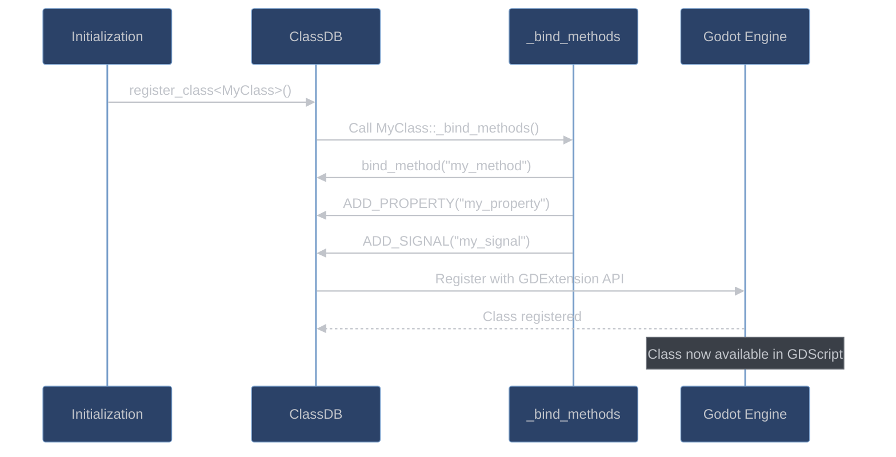

# Binding System

## Overview

**What are bindings?** Think of bindings as translators between your C++ code and the rest of Godot. When you write a C++ method, Godot doesn't automatically know it exists or how to call it. Bindings are the registration process that tells Godot "here's a C++ function, here's its name, here are its parameters, and here's how to call it from GDScript or the editor."

**Why bindings are essential:** Without bindings, your C++ code would be invisible to Godot. Bindings make your C++ classes appear as native Godot classes that can be used in GDScript, show up in the editor's inspector, and participate in Godot's signal system.

The binding system in godot-cpp creates the bridge between your C++ code and the Godot engine. It handles method registration, type conversion, parameter marshalling, and enables seamless interaction between GDExtension code and GDScript. Every class, method, property, and signal must be properly bound to be accessible from the engine.

### Why Bindings Are Needed


## What Are Bindings

**The bridge between worlds:** Bindings are the metadata and infrastructure that allow Godot's dynamic scripting system to interact with your static C++ code. They include information about parameter types, return values, method names, and function pointers, plus the code that converts between C++ types and Godot's universal "Variant" type.

### Definition and Purpose

Bindings are the metadata and function pointer mappings that allow the Godot engine to interact with C++ code. They serve several critical purposes:

1. **Name Resolution**: Map string names (from GDScript/editor) to C++ methods
2. **Type Safety**: Validate parameter types at call boundaries
3. **Marshalling**: Convert between Variant and C++ types
4. **Documentation**: Provide method signatures for the editor
5. **Reflection**: Enable runtime introspection of classes

### Binding Components

```cpp
// A binding consists of several components:
struct MethodBinding {
    StringName name;                    // Method name visible to engine
    MethodBind *method_bind;            // Function pointer wrapper
    MethodInfo method_info;             // Parameter and return type info
    Vector<Variant> default_arguments; // Optional default values
    uint32_t flags;                     // Method characteristics
};

// Example of what gets generated for each bound method:
class ExampleBinding {
public:
    // Your C++ method
    int calculate(float a, float b = 1.0f) {
        return static_cast<int>(a * b);
    }

    // Generated binding infrastructure:
    static MethodBind *bind_calculate;

    static void _bind_methods() {
        // Creates MethodBind with type information
        bind_calculate = ClassDB::bind_method(
            D_METHOD("calculate", "a", "b"),  // Name and parameters
            &ExampleBinding::calculate,        // Function pointer
            DEFVAL(1.0f)                       // Default argument
        );

        // MethodBind stores:
        // - Function pointer: &ExampleBinding::calculate
        // - Return type: Variant::INT
        // - Parameter types: [Variant::FLOAT, Variant::FLOAT]
        // - Parameter names: ["a", "b"]
        // - Default values: [null, 1.0]
    }
};
```

## Binding Architecture

**How the binding system is organized:** At the heart of the binding system is ClassDB - a global registry that stores information about all registered classes. When you call `_bind_methods()`, you're adding entries to this database. During runtime, when GDScript calls a method, ClassDB looks up the binding information and routes the call to your C++ code.

### ClassDB Structure

The ClassDB is the central registry for all class information:

```cpp
// Simplified ClassDB structure
class ClassDB {
private:
    static HashMap<StringName, ClassInfo> classes;

    struct ClassInfo {
        StringName name;
        StringName parent_name;
        ClassInfo *parent_ptr;

        // Method bindings
        HashMap<StringName, MethodBind*> method_map;

        // Property bindings
        HashMap<StringName, PropertyInfo> property_map;
        HashMap<StringName, PropertySetGet> property_setget;

        // Signal definitions
        HashMap<StringName, MethodInfo> signal_map;

        // Virtual methods
        HashMap<StringName, GDExtensionClassCallVirtual> virtual_methods;

        // Class creation function
        GDExtensionClassCreationInfo creation_info;
    };

public:
    template<class T>
    static void register_class() {
        ClassInfo info;
        info.name = T::get_class_static();
        info.parent_name = T::get_parent_class_static();

        // Initialize class
        T::initialize_class();

        // Call _bind_methods to register everything
        T::_bind_methods();

        classes[info.name] = info;
    }
};
```

### Binding Lifecycle



## Method Binding

**Making your C++ functions callable:** Method binding is the process of registering your C++ functions so they can be called from GDScript, connected to signals, or invoked by the editor. The binding system automatically handles converting GDScript's dynamic arguments to your C++ parameter types and converting your return value back.

### Basic Method Binding

```cpp
class MyClass : public Node {
    GDCLASS(MyClass, Node)

protected:
    static void _bind_methods() {
        // Simple method binding
        ClassDB::bind_method(D_METHOD("simple_method"), &MyClass::simple_method);

        // Method with parameters
        ClassDB::bind_method(D_METHOD("add", "a", "b"), &MyClass::add);

        // Method with default arguments
        ClassDB::bind_method(D_METHOD("multiply", "a", "b"),
                           &MyClass::multiply, DEFVAL(2.0));

        // Static method binding
        ClassDB::bind_static_method("MyClass",
                                   D_METHOD("static_helper", "input"),
                                   &MyClass::static_helper);
    }

public:
    void simple_method() {
        print_line("Called from GDScript!");
    }

    int add(int a, int b) {
        return a + b;
    }

    float multiply(float a, float b = 2.0f) {
        return a * b;
    }

    static String static_helper(const String &input) {
        return "Processed: " + input;
    }
};
```

### Advanced Method Binding

```cpp
class AdvancedBinding : public Resource {
    GDCLASS(AdvancedBinding, Resource)

protected:
    static void _bind_methods() {
        // Method with complex return type
        MethodBind *bind = ClassDB::bind_method(
            D_METHOD("get_data_structure"),
            &AdvancedBinding::get_data_structure
        );

        // Set method flags
        bind->set_flag(METHOD_FLAG_CONST, true);

        // Vararg method (variable arguments)
        {
            MethodInfo mi("format_string", PropertyInfo(Variant::STRING, ""));
            mi.arguments.push_back(PropertyInfo(Variant::STRING, "format"));
            mi.flags = METHOD_FLAG_VARARG;

            ClassDB::bind_vararg_method(METHOD_FLAGS_DEFAULT,
                                       "format_string",
                                       &AdvancedBinding::format_string,
                                       mi);
        }

        // Method with enum parameter
        ClassDB::bind_method(D_METHOD("set_mode", "mode"),
                           &AdvancedBinding::set_mode);

        // Register enum for the method
        BIND_ENUM_CONSTANT(MODE_NORMAL);
        BIND_ENUM_CONSTANT(MODE_ADVANCED);
        BIND_ENUM_CONSTANT(MODE_EXPERT);
    }

public:
    enum Mode {
        MODE_NORMAL,
        MODE_ADVANCED,
        MODE_EXPERT
    };

    Dictionary get_data_structure() const {
        Dictionary dict;
        dict["key"] = "value";
        dict["number"] = 42;
        return dict;
    }

    Variant format_string(const Variant **p_args, int p_argcount,
                         Callable::CallError &r_error) {
        if (p_argcount < 1) {
            r_error.error = Callable::CallError::CALL_ERROR_TOO_FEW_ARGUMENTS;
            r_error.argument = 1;
            return Variant();
        }

        String format = *p_args[0];
        String result = format;

        for (int i = 1; i < p_argcount; i++) {
            result = result.replace("{" + itos(i-1) + "}",
                                   p_args[i]->stringify());
        }

        return result;
    }

    void set_mode(Mode p_mode) {
        // Handle enum parameter
    }
};
```

### Method Binding Internals

```cpp
// How method binding works internally
template<class T, class R, class... Args>
class MethodBindT : public MethodBind {
    R (T::*method)(Args...);

public:
    MethodBindT(R (T::*p_method)(Args...)) : method(p_method) {}

    virtual Variant call(Object *p_object, const Variant **p_args,
                        int p_arg_count, Callable::CallError &r_error) override {
        T *instance = Object::cast_to<T>(p_object);

        // Validate argument count
        if (p_arg_count != sizeof...(Args)) {
            r_error.error = Callable::CallError::CALL_ERROR_TOO_FEW_ARGUMENTS;
            return Variant();
        }

        // Convert Variants to native types and call
        return call_with_variant_args(instance, method, p_args);
    }

private:
    template<std::size_t... Is>
    R call_with_variant_args_helper(T *p_instance, const Variant **p_args,
                                   std::index_sequence<Is...>) {
        // Convert each Variant to the expected type
        return (p_instance->*method)(
            VariantCaster<typename std::tuple_element<Is, std::tuple<Args...>>::type>
                ::cast(*p_args[Is])...
        );
    }

    R call_with_variant_args(T *p_instance, const Variant **p_args) {
        return call_with_variant_args_helper(p_instance, p_args,
                                            std::index_sequence_for<Args...>{});
    }
};
```

## Property Binding

**Exposing variables to the editor and GDScript:** Property binding makes your C++ member variables visible in the editor's inspector and accessible from GDScript. Unlike simple variables, bound properties can have validation, hints for the editor (like sliders or color pickers), and automatic save/load behavior.

### Property Registration

```cpp
class PropertyExample : public Node {
    GDCLASS(PropertyExample, Node)

private:
    int health = 100;
    float speed = 5.0f;
    String player_name = "Player";
    Ref<Texture2D> icon;
    Color tint_color = Color(1, 1, 1, 1);
    Vector3 spawn_position;

protected:
    static void _bind_methods() {
        // Basic property binding
        ClassDB::bind_method(D_METHOD("set_health", "health"),
                           &PropertyExample::set_health);
        ClassDB::bind_method(D_METHOD("get_health"),
                           &PropertyExample::get_health);
        ADD_PROPERTY(PropertyInfo(Variant::INT, "health"),
                    "set_health", "get_health");

        // Property with hint
        ClassDB::bind_method(D_METHOD("set_speed", "speed"),
                           &PropertyExample::set_speed);
        ClassDB::bind_method(D_METHOD("get_speed"),
                           &PropertyExample::get_speed);
        ADD_PROPERTY(PropertyInfo(Variant::FLOAT, "speed",
                                 PROPERTY_HINT_RANGE, "0.0,100.0,0.1"),
                    "set_speed", "get_speed");

        // String property with placeholder
        ClassDB::bind_method(D_METHOD("set_player_name", "name"),
                           &PropertyExample::set_player_name);
        ClassDB::bind_method(D_METHOD("get_player_name"),
                           &PropertyExample::get_player_name);
        ADD_PROPERTY(PropertyInfo(Variant::STRING, "player_name",
                                 PROPERTY_HINT_PLACEHOLDER_TEXT,
                                 "Enter player name..."),
                    "set_player_name", "get_player_name");

        // Resource property
        ClassDB::bind_method(D_METHOD("set_icon", "icon"),
                           &PropertyExample::set_icon);
        ClassDB::bind_method(D_METHOD("get_icon"),
                           &PropertyExample::get_icon);
        ADD_PROPERTY(PropertyInfo(Variant::OBJECT, "icon",
                                 PROPERTY_HINT_RESOURCE_TYPE, "Texture2D"),
                    "set_icon", "get_icon");

        // Color property
        ClassDB::bind_method(D_METHOD("set_tint_color", "color"),
                           &PropertyExample::set_tint_color);
        ClassDB::bind_method(D_METHOD("get_tint_color"),
                           &PropertyExample::get_tint_color);
        ADD_PROPERTY(PropertyInfo(Variant::COLOR, "tint_color"),
                    "set_tint_color", "get_tint_color");

        // Vector3 property with suffix
        ClassDB::bind_method(D_METHOD("set_spawn_position", "position"),
                           &PropertyExample::set_spawn_position);
        ClassDB::bind_method(D_METHOD("get_spawn_position"),
                           &PropertyExample::get_spawn_position);
        ADD_PROPERTY(PropertyInfo(Variant::VECTOR3, "spawn_position",
                                 PROPERTY_HINT_NONE, "",
                                 PROPERTY_USAGE_DEFAULT, "suffix:m"),
                    "set_spawn_position", "get_spawn_position");

        // Property groups for organization
        ADD_GROUP("Player Stats", "stat_");
        ADD_PROPERTY(PropertyInfo(Variant::INT, "stat_level"),
                    "set_level", "get_level");
        ADD_PROPERTY(PropertyInfo(Variant::INT, "stat_experience"),
                    "set_experience", "get_experience");

        ADD_SUBGROUP("Combat", "combat_");
        ADD_PROPERTY(PropertyInfo(Variant::FLOAT, "combat_damage"),
                    "set_damage", "get_damage");
    }

public:
    // Setters and getters
    void set_health(int p_health) {
        health = CLAMP(p_health, 0, 100);
        // Notify editor of change
        notify_property_list_changed();
    }
    int get_health() const { return health; }

    void set_speed(float p_speed) {
        speed = p_speed;
    }
    float get_speed() const { return speed; }

    // Validation in setter
    void set_player_name(const String &p_name) {
        if (p_name.is_empty()) {
            player_name = "Player";
        } else {
            player_name = p_name;
        }
    }
    String get_player_name() const { return player_name; }
};
```

### Dynamic Properties

```cpp
class DynamicProperties : public Resource {
    GDCLASS(DynamicProperties, Resource)

private:
    Dictionary custom_properties;
    bool advanced_mode = false;

protected:
    static void _bind_methods() {
        ClassDB::bind_method(D_METHOD("set_advanced_mode", "enabled"),
                           &DynamicProperties::set_advanced_mode);
        ClassDB::bind_method(D_METHOD("get_advanced_mode"),
                           &DynamicProperties::get_advanced_mode);
        ADD_PROPERTY(PropertyInfo(Variant::BOOL, "advanced_mode"),
                    "set_advanced_mode", "get_advanced_mode");
    }

    // Dynamic property list based on state
    virtual void _get_property_list(List<PropertyInfo> *p_list) const override {
        // Add properties based on mode
        if (advanced_mode) {
            p_list->push_back(PropertyInfo(Variant::FLOAT, "advanced_setting_1",
                                          PROPERTY_HINT_RANGE, "0,1,0.01"));
            p_list->push_back(PropertyInfo(Variant::INT, "advanced_setting_2",
                                          PROPERTY_HINT_ENUM, "Option1,Option2,Option3"));
        }

        // Add dynamic properties from dictionary
        for (const KeyValue<Variant, Variant> &E : custom_properties) {
            String name = E.key;
            p_list->push_back(PropertyInfo(Variant::NIL, name,
                                          PROPERTY_HINT_NONE, "",
                                          PROPERTY_USAGE_DEFAULT | PROPERTY_USAGE_SCRIPT_VARIABLE));
        }
    }

    // Handle dynamic property access
    virtual bool _set(const StringName &p_name, const Variant &p_value) override {
        String name = p_name;

        if (name.begins_with("advanced_setting_")) {
            // Handle advanced settings
            custom_properties[name] = p_value;
            return true;
        }

        // Check if it's a custom property
        if (custom_properties.has(name)) {
            custom_properties[name] = p_value;
            return true;
        }

        return false;
    }

    virtual bool _get(const StringName &p_name, Variant &r_ret) const override {
        String name = p_name;

        if (custom_properties.has(name)) {
            r_ret = custom_properties[name];
            return true;
        }

        return false;
    }

public:
    void set_advanced_mode(bool p_enabled) {
        advanced_mode = p_enabled;
        notify_property_list_changed();  // Refresh property list
    }

    bool get_advanced_mode() const { return advanced_mode; }
};
```

## Signal Binding

**Declaring events your class can emit:** Signal binding registers the signals (events) that your class can emit. This tells Godot what parameters the signal carries and allows other objects to connect to your signals through the editor or GDScript. Signals enable loose coupling between game systems.

### Signal Registration and Usage

```cpp
class SignalExample : public Node {
    GDCLASS(SignalExample, Node)

protected:
    static void _bind_methods() {
        // Simple signal
        ADD_SIGNAL(MethodInfo("health_depleted"));

        // Signal with parameters
        ADD_SIGNAL(MethodInfo("health_changed",
                            PropertyInfo(Variant::INT, "old_health"),
                            PropertyInfo(Variant::INT, "new_health")));

        // Signal with complex parameter
        ADD_SIGNAL(MethodInfo("item_collected",
                            PropertyInfo(Variant::OBJECT, "item",
                                       PROPERTY_HINT_RESOURCE_TYPE, "Item"),
                            PropertyInfo(Variant::INT, "quantity")));

        // Signal that returns a value
        MethodInfo damage_taken;
        damage_taken.name = "damage_taken";
        damage_taken.return_val = PropertyInfo(Variant::BOOL, "handled");
        damage_taken.arguments.push_back(PropertyInfo(Variant::INT, "amount"));
        damage_taken.arguments.push_back(PropertyInfo(Variant::INT, "damage_type"));
        ADD_SIGNAL(damage_taken);
    }

private:
    int health = 100;

public:
    void take_damage(int amount, int damage_type) {
        int old_health = health;
        health -= amount;

        // Emit signal and check return value
        bool handled = emit_signal("damage_taken", amount, damage_type);

        if (!handled) {
            // Default damage handling
            health = Math::max(0, health);
        }

        // Emit health changed signal
        emit_signal("health_changed", old_health, health);

        if (health <= 0) {
            emit_signal("health_depleted");
        }
    }

    void collect_item(const Ref<Item> &item, int quantity) {
        emit_signal("item_collected", item, quantity);
    }
};
```

## Virtual Method Binding

**Allowing GDScript to override your C++ methods:** Virtual method binding enables GDScript classes that inherit from your C++ class to override specific methods. This is how you create extensible base classes in C++ that can be customized through scripting without recompiling.

### Registering Virtual Methods

```cpp
class VirtualMethodExample : public Node {
    GDCLASS(VirtualMethodExample, Node)

protected:
    static void _bind_methods() {
        // Bind virtual methods that can be overridden in GDScript
        GDVIRTUAL_BIND(_ready);
        GDVIRTUAL_BIND(_process, "delta");
        GDVIRTUAL_BIND(_physics_process, "delta");

        // Custom virtual method
        GDVIRTUAL_BIND(_on_damage_received, "amount", "source");

        // Virtual method with return value
        GDVIRTUAL_BIND(_calculate_damage, "base_damage", "multiplier");
    }

public:
    // Built-in virtual methods
    virtual void _ready() override {
        // C++ implementation
        print_line("VirtualMethodExample ready");

        // Call GDScript override if exists
        GDVIRTUAL_CALL(_ready);
    }

    virtual void _process(double delta) override {
        // Check if GDScript has override
        bool overridden = false;
        GDVIRTUAL_IS_OVERRIDDEN_PTR(ptr, _process);
        if (ptr) {
            overridden = true;
            GDVIRTUAL_CALL(_process, delta);
        }

        if (!overridden) {
            // Default C++ behavior
            default_process(delta);
        }
    }

    // Custom virtual methods
    void receive_damage(int amount, Node *source) {
        // Call virtual method
        GDVIRTUAL_CALL(_on_damage_received, amount, source);

        // Can also check return value
        int calculated_damage = 0;
        if (GDVIRTUAL_CALL(_calculate_damage, amount, 1.5f, calculated_damage)) {
            // GDScript provided calculation
            apply_damage(calculated_damage);
        } else {
            // Use default calculation
            apply_damage(amount);
        }
    }

private:
    void default_process(double delta) {
        // Default implementation
    }

    void apply_damage(int amount) {
        // Apply the damage
    }

    // Virtual method declarations for GDScript
    GDVIRTUAL0(_ready)
    GDVIRTUAL1(_process, double)
    GDVIRTUAL1(_physics_process, double)
    GDVIRTUAL2(_on_damage_received, int, Node*)
    GDVIRTUAL2R(int, _calculate_damage, int, float)
};
```

## Type Conversion and Marshalling

**Translating between C++ and GDScript types:** GDScript uses a universal "Variant" type that can hold any value, while C++ uses specific types like `int`, `String`, and `Vector3`. The marshalling system automatically converts between these representations when calling bound methods, handling the complexity of type safety and validation.

### Variant Conversion

```cpp
// Type conversion between Variant and C++ types
class TypeConversion {
public:
    static void demonstrate_conversions() {
        // From C++ to Variant
        int cpp_int = 42;
        Variant var_int = cpp_int;  // Automatic conversion

        String cpp_string = "Hello";
        Variant var_string = cpp_string;

        Vector3 cpp_vec(1, 2, 3);
        Variant var_vec = cpp_vec;

        // From Variant to C++
        Variant variant_value = 3.14;
        float cpp_float = variant_value;  // Automatic conversion

        // Safe conversion with type checking
        if (variant_value.get_type() == Variant::FLOAT) {
            float safe_float = variant_value.operator float();
        }

        // Array conversion
        Array godot_array;
        godot_array.append(1);
        godot_array.append("two");
        godot_array.append(Vector2(3, 4));

        // Dictionary conversion
        Dictionary dict;
        dict["key"] = "value";
        dict["number"] = 42;

        Variant var_dict = dict;
    }
};

// Custom type marshalling
template<typename T>
struct VariantCaster {
    static T cast(const Variant &p_variant);
};

// Specialization for custom type
template<>
struct VariantCaster<MyCustomType> {
    static MyCustomType cast(const Variant &p_variant) {
        // Convert from Variant to MyCustomType
        if (p_variant.get_type() == Variant::DICTIONARY) {
            Dictionary dict = p_variant;
            MyCustomType result;
            result.value = dict.get("value", 0);
            result.name = dict.get("name", "");
            return result;
        }
        return MyCustomType();
    }
};
```

### Parameter Marshalling

```cpp
class ParameterMarshalling : public Object {
    GDCLASS(ParameterMarshalling, Object)

protected:
    static void _bind_methods() {
        // Method with multiple parameter types
        ClassDB::bind_method(D_METHOD("complex_method", "number", "text",
                                     "position", "data"),
                           &ParameterMarshalling::complex_method);
    }

public:
    void complex_method(int number, const String &text,
                       const Vector3 &position, const Dictionary &data) {
        // Parameters are automatically marshalled from Variants
    }

    // Manual parameter marshalling for varargs
    Variant manual_marshalling(const Variant **p_args, int p_argcount,
                              Callable::CallError &r_error) {
        // Validate argument count
        if (p_argcount < 2) {
            r_error.error = Callable::CallError::CALL_ERROR_TOO_FEW_ARGUMENTS;
            r_error.argument = 2;
            r_error.expected = 2;
            return Variant();
        }

        // Manual type checking and conversion
        if (p_args[0]->get_type() != Variant::INT) {
            r_error.error = Callable::CallError::CALL_ERROR_INVALID_ARGUMENT;
            r_error.argument = 0;
            r_error.expected = Variant::INT;
            return Variant();
        }

        int first_arg = *p_args[0];
        String second_arg = p_args[1]->operator String();

        // Process arguments
        return process_varargs(first_arg, second_arg);
    }

private:
    Variant process_varargs(int a, const String &b) {
        return a + b.to_int();
    }
};
```

## Binding Generation Process

**How Godot's built-in classes get their bindings:** Most of Godot's built-in classes (like Node, Resource, etc.) have their bindings automatically generated from the engine's API definition. The binding generator reads this API information and creates the C++ wrapper classes you use in godot-cpp, complete with proper method signatures and parameter types.

### How Bindings Are Generated

The binding generator (`binding_generator.py`) creates C++ bindings from Godot's API:


```python
# Conceptual binding generation process
def generate_class_binding(class_api):
    """
    Generates C++ binding code for a Godot class
    """
    code = []

    # Generate class declaration
    code.append(f"class {class_api.name} : public {class_api.inherits} {{")
    code.append(f"    GDCLASS({class_api.name}, {class_api.inherits})")

    # Generate method bindings
    for method in class_api.methods:
        # Generate method declaration
        return_type = variant_to_cpp_type(method.return_type)
        params = ", ".join(f"{variant_to_cpp_type(p.type)} {p.name}"
                          for p in method.arguments)
        code.append(f"    {return_type} {method.name}({params});")

    # Generate property accessors
    for prop in class_api.properties:
        cpp_type = variant_to_cpp_type(prop.type)
        code.append(f"    void set_{prop.name}({cpp_type} value);")
        code.append(f"    {cpp_type} get_{prop.name}() const;")

    code.append("};")
    return "\n".join(code)
```


### Generated Binding Example

```cpp
// Auto-generated binding for Node3D class
class Node3D : public Node {
    GDCLASS(Node3D, Node)

protected:
    static void _bind_methods();

public:
    // Generated method bindings
    void set_position(const Vector3 &p_position);
    Vector3 get_position() const;

    void set_rotation(const Vector3 &p_rotation);
    Vector3 get_rotation() const;

    void translate(const Vector3 &p_offset);
    void rotate(const Vector3 &p_axis, real_t p_angle);

    // Generated property bindings
    static void _bind_methods() {
        ClassDB::bind_method(D_METHOD("set_position", "position"),
                           &Node3D::set_position);
        ClassDB::bind_method(D_METHOD("get_position"),
                           &Node3D::get_position);
        ADD_PROPERTY(PropertyInfo(Variant::VECTOR3, "position"),
                    "set_position", "get_position");

        // ... more bindings
    }
};

// Implementation calls through to engine
void Node3D::set_position(const Vector3 &p_position) {
    internal::_call_builtin_method_ptr<void>(_method_set_position,
                                            _owner, &p_position);
}

Vector3 Node3D::get_position() const {
    return internal::_call_builtin_method_ptr<Vector3>(_method_get_position,
                                                      _owner, nullptr);
}
```

## Performance Considerations

**Understanding the cost of bound calls:** Every time you call a bound method (either from GDScript to C++ or vice versa), there's overhead for type conversion and virtual dispatch. While this overhead is usually negligible, it becomes important in performance-critical code like inner loops or frequently called update methods.

### Binding Overhead

```cpp
class PerformanceOptimization : public Node {
    GDCLASS(PerformanceOptimization, Node)

private:
    // Cache frequently used method binds
    static MethodBind *cached_method_bind;

protected:
    static void _bind_methods() {
        // Store method bind for direct access
        cached_method_bind = ClassDB::bind_method(
            D_METHOD("frequently_called"),
            &PerformanceOptimization::frequently_called
        );
    }

public:
    // Direct C++ call: ~1-2 CPU cycles
    void direct_call() {
        frequently_called();
    }

    // Through binding: ~50-100 CPU cycles
    void bound_call() {
        call("frequently_called");
    }

    // Optimized bound call with cached MethodBind
    void optimized_bound_call() {
        const Variant *args = nullptr;
        Callable::CallError error;
        cached_method_bind->call(this, args, 0, error);
    }

    void frequently_called() {
        // Method implementation
    }

    // Batch operations to reduce binding overhead
    void batch_operation(const Array &items) {
        // Single binding call with multiple items
        // More efficient than multiple individual calls
        for (int i = 0; i < items.size(); i++) {
            process_item_internal(items[i]);
        }
    }

private:
    void process_item_internal(const Variant &item) {
        // Internal processing without binding overhead
    }
};

MethodBind *PerformanceOptimization::cached_method_bind = nullptr;
```

### Best Practices for Performance

```cpp
class BindingBestPractices : public Node {
    GDCLASS(BindingBestPractices, Node)

protected:
    static void _bind_methods() {
        // 1. Use const methods when possible
        ClassDB::bind_method(D_METHOD("get_data"),
                           &BindingBestPractices::get_data);
        ClassDB::get_method("BindingBestPractices", "get_data")->
            set_flag(METHOD_FLAG_CONST, true);

        // 2. Avoid frequent property updates
        // Batch them when possible
        ClassDB::bind_method(D_METHOD("update_multiple_properties", "data"),
                           &BindingBestPractices::update_multiple_properties);

        // 3. Use signals sparingly for high-frequency events
        // Consider callbacks or direct method calls instead
    }

public:
    // Const method - can be optimized by compiler
    Dictionary get_data() const {
        return cached_data;
    }

    // Batch property updates
    void update_multiple_properties(const Dictionary &data) {
        // Update all at once, single notification
        for (const KeyValue<Variant, Variant> &E : data) {
            set(E.key, E.value);
        }
        notify_property_list_changed();  // Single notification
    }

    // Use internal methods for hot paths
    virtual void _process(double delta) override {
        // Hot path - avoid binding overhead
        internal_update(delta);

        // Only use bindings when necessary
        if (should_emit_signal) {
            emit_signal("update_complete");
            should_emit_signal = false;
        }
    }

private:
    Dictionary cached_data;
    bool should_emit_signal = false;

    void internal_update(double delta) {
        // Performance-critical code without binding overhead
    }
};
```

## Conclusion

The binding system is the crucial infrastructure that enables GDExtension to integrate seamlessly with Godot. It provides type safety, automatic marshalling, and reflection capabilities while maintaining reasonable performance. Understanding how bindings work, when they're invoked, and their performance characteristics is essential for writing efficient GDExtension code. The system's flexibility allows for everything from simple method exposure to complex dynamic property systems, making it possible to create fully-featured engine extensions that feel native to Godot users.
