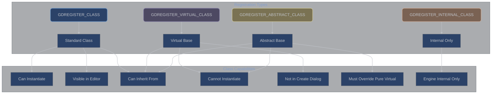

# Class Registration and Inheritance Patterns

## Table of Contents

1. [Overview](#overview)
2. [Class Registration Types](#class-registration-types)
3. [Inheritance Behavior](#inheritance-behavior)
4. [Registration Functions](#registration-functions)
5. [Virtual Classes](#virtual-classes)
6. [Abstract Classes](#abstract-classes)
7. [Runtime Type Behavior](#runtime-type-behavior)
8. [Common Patterns](#common-patterns)
9. [Troubleshooting](#troubleshooting)

## Overview

**Understanding how GDExtension classes register and inherit:** Class registration in godot-cpp determines how your C++ classes integrate with Godot's object system. Different registration methods create different behaviors for instantiation, inheritance, editor visibility, and runtime type checking. Choosing the right registration type is crucial for proper integration with both the engine and GDScript.

### Registration Architecture



## Class Registration Types

### Standard Class Registration (`GDREGISTER_CLASS`)

**The default registration for most classes:** Standard registration creates a fully functional class that can be instantiated, appears in the editor's Create Node/Resource dialogs, and supports all Godot features. Use this for concrete classes that users will directly create and use.

```cpp
// Standard class that can be instantiated
class MyGameEntity : public Node2D {
    GDCLASS(MyGameEntity, Node2D)

private:
    int health = 100;
    float speed = 150.0f;
    String entity_name;

protected:
    static void _bind_methods() {
        ClassDB::bind_method(D_METHOD("take_damage", "amount"),
                           &MyGameEntity::take_damage);
        ClassDB::bind_method(D_METHOD("heal", "amount"),
                           &MyGameEntity::heal);

        ClassDB::bind_method(D_METHOD("set_health", "health"),
                           &MyGameEntity::set_health);
        ClassDB::bind_method(D_METHOD("get_health"),
                           &MyGameEntity::get_health);
        ADD_PROPERTY(PropertyInfo(Variant::INT, "health",
                                 PROPERTY_HINT_RANGE, "0,200,1"),
                    "set_health", "get_health");
    }

public:
    MyGameEntity() {
        // Constructor - called when instantiated
        print_line("MyGameEntity created");
    }

    void take_damage(int amount) {
        health = MAX(0, health - amount);
        if (health == 0) {
            queue_free();
        }
    }

    void heal(int amount) {
        health = MIN(200, health + amount);
    }

    void set_health(int p_health) { health = CLAMP(p_health, 0, 200); }
    int get_health() const { return health; }
};

// In module initialization
void initialize_module(ModuleInitializationLevel p_level) {
    if (p_level != MODULE_INITIALIZATION_LEVEL_SCENE) {
        return;
    }

    // Standard registration - fully functional class
    GDREGISTER_CLASS(MyGameEntity);
}
```

**When to use `GDREGISTER_CLASS`:**
- Concrete implementation classes
- Classes users will instantiate directly
- Classes that need to appear in editor dialogs
- Most game objects, resources, and tools

### Virtual Class Registration (`GDREGISTER_VIRTUAL_CLASS`)

**Base classes not meant for direct instantiation:** Virtual classes serve as base classes for inheritance but cannot be instantiated directly. They don't appear in the editor's Create dialogs but can be used as base types in GDScript and for polymorphic behavior.

```cpp
// Virtual base class - cannot be instantiated directly
class BaseWeapon : public Node2D {
    GDCLASS(BaseWeapon, Node2D)

protected:
    float damage = 10.0f;
    float range = 100.0f;
    int ammo = 30;

    static void _bind_methods() {
        // These methods are inherited by derived classes
        ClassDB::bind_method(D_METHOD("fire"), &BaseWeapon::fire);
        ClassDB::bind_method(D_METHOD("reload"), &BaseWeapon::reload);
        ClassDB::bind_method(D_METHOD("can_fire"), &BaseWeapon::can_fire);

        ClassDB::bind_method(D_METHOD("set_damage", "damage"),
                           &BaseWeapon::set_damage);
        ClassDB::bind_method(D_METHOD("get_damage"),
                           &BaseWeapon::get_damage);
        ADD_PROPERTY(PropertyInfo(Variant::FLOAT, "damage"),
                    "set_damage", "get_damage");

        // Virtual methods that derived classes should override
        GDVIRTUAL_BIND(_get_fire_rate);
        GDVIRTUAL_BIND(_get_reload_time);
        GDVIRTUAL_BIND(_on_fire_effects);
    }

    // Virtual methods for derived classes
    GDVIRTUAL0RC(float, _get_fire_rate)
    GDVIRTUAL0RC(float, _get_reload_time)
    GDVIRTUAL0(_on_fire_effects)

public:
    virtual void fire() {
        if (!can_fire()) {
            return;
        }

        ammo--;
        apply_damage();

        // Call virtual method for effects
        GDVIRTUAL_CALL(_on_fire_effects);
    }

    virtual void reload() {
        float reload_time = 2.0f;
        GDVIRTUAL_CALL(_get_reload_time, reload_time);

        // Reload logic
        ammo = get_max_ammo();
    }

    virtual bool can_fire() const {
        return ammo > 0;
    }

    virtual int get_max_ammo() const {
        return 30; // Default, override in derived
    }

protected:
    virtual void apply_damage() {
        // Base implementation
        print_line(vformat("Applying damage: %f", damage));
    }

    void set_damage(float p_damage) { damage = p_damage; }
    float get_damage() const { return damage; }
};

// Concrete implementation
class Pistol : public BaseWeapon {
    GDCLASS(Pistol, BaseWeapon)

protected:
    static void _bind_methods() {
        // Bind pistol-specific methods
        ClassDB::bind_method(D_METHOD("set_fire_mode", "mode"),
                           &Pistol::set_fire_mode);
    }

public:
    Pistol() {
        damage = 15.0f;
        range = 150.0f;
        ammo = 12;
    }

    virtual int get_max_ammo() const override {
        return 12; // Pistol magazine size
    }

    void set_fire_mode(const String &mode) {
        // Pistol-specific functionality
    }

protected:
    virtual void apply_damage() override {
        BaseWeapon::apply_damage();
        print_line("Pistol fired!");
    }
};

// Another concrete implementation
class Shotgun : public BaseWeapon {
    GDCLASS(Shotgun, BaseWeapon)

private:
    int pellet_count = 8;

protected:
    static void _bind_methods() {
        ClassDB::bind_method(D_METHOD("set_pellet_count", "count"),
                           &Shotgun::set_pellet_count);
        ClassDB::bind_method(D_METHOD("get_pellet_count"),
                           &Shotgun::get_pellet_count);
        ADD_PROPERTY(PropertyInfo(Variant::INT, "pellet_count",
                                 PROPERTY_HINT_RANGE, "4,12,1"),
                    "set_pellet_count", "get_pellet_count");
    }

public:
    Shotgun() {
        damage = 8.0f; // Per pellet
        range = 80.0f;
        ammo = 6;
    }

    virtual int get_max_ammo() const override {
        return 6; // Shotgun shells
    }

protected:
    virtual void apply_damage() override {
        // Apply damage for each pellet
        for (int i = 0; i < pellet_count; i++) {
            BaseWeapon::apply_damage();
        }
        print_line("Shotgun blast!");
    }

    void set_pellet_count(int count) { pellet_count = count; }
    int get_pellet_count() const { return pellet_count; }
};

// Registration
void initialize_weapons(ModuleInitializationLevel p_level) {
    if (p_level != MODULE_INITIALIZATION_LEVEL_SCENE) {
        return;
    }

    // Virtual base class - cannot be instantiated
    GDREGISTER_VIRTUAL_CLASS(BaseWeapon);

    // Concrete classes - can be instantiated
    GDREGISTER_CLASS(Pistol);
    GDREGISTER_CLASS(Shotgun);
}
```

**When to use `GDREGISTER_VIRTUAL_CLASS`:**
- Base classes defining common interface
- Classes that should not be instantiated directly
- Template pattern implementations
- Polymorphic base types

### Abstract Class Registration (`GDREGISTER_ABSTRACT_CLASS`)

**Classes with pure virtual methods:** Abstract classes contain one or more pure virtual methods that must be implemented by derived classes. They cannot be instantiated and enforce implementation of specific methods in derived classes.

```cpp
// Abstract class with pure virtual methods
class AbstractProcessor : public Resource {
    GDCLASS(AbstractProcessor, Resource)

protected:
    static void _bind_methods() {
        ClassDB::bind_method(D_METHOD("process_data", "input"),
                           &AbstractProcessor::process_data);
        ClassDB::bind_method(D_METHOD("get_processor_name"),
                           &AbstractProcessor::get_processor_name);
        ClassDB::bind_method(D_METHOD("validate_input", "input"),
                           &AbstractProcessor::validate_input);

        // Abstract method that must be implemented
        ClassDB::bind_method(D_METHOD("execute"),
                           &AbstractProcessor::execute);
    }

public:
    // Pure virtual methods - must be implemented by derived classes
    virtual Variant execute_processing(const Variant &input) = 0;
    virtual String get_processor_type() const = 0;
    virtual bool supports_async() const = 0;

    // Concrete method using pure virtual methods
    Variant process_data(const Variant &input) {
        if (!validate_input(input)) {
            ERR_PRINT("Invalid input for processor");
            return Variant();
        }

        print_line(vformat("Processing with: %s", get_processor_type()));
        return execute_processing(input);
    }

    // Virtual method with default implementation
    virtual bool validate_input(const Variant &input) const {
        return input.get_type() != Variant::NIL;
    }

    String get_processor_name() const {
        return vformat("%s Processor", get_processor_type());
    }

    // Template method pattern
    Dictionary execute() {
        Dictionary result;
        result["type"] = get_processor_type();
        result["async"] = supports_async();
        result["status"] = "ready";

        before_execute();
        Variant output = execute_processing(Variant());
        after_execute();

        result["output"] = output;
        return result;
    }

protected:
    // Hook methods
    virtual void before_execute() {}
    virtual void after_execute() {}
};

// Concrete implementation of abstract class
class ImageProcessor : public AbstractProcessor {
    GDCLASS(ImageProcessor, AbstractProcessor)

private:
    int quality = 90;
    String format = "PNG";

protected:
    static void _bind_methods() {
        ClassDB::bind_method(D_METHOD("set_quality", "quality"),
                           &ImageProcessor::set_quality);
        ClassDB::bind_method(D_METHOD("get_quality"),
                           &ImageProcessor::get_quality);
        ADD_PROPERTY(PropertyInfo(Variant::INT, "quality",
                                 PROPERTY_HINT_RANGE, "0,100,1"),
                    "set_quality", "get_quality");
    }

public:
    // Implement pure virtual methods
    virtual Variant execute_processing(const Variant &input) override {
        if (input.get_type() == Variant::OBJECT) {
            // Process image
            return process_image(input);
        }
        return Variant();
    }

    virtual String get_processor_type() const override {
        return "Image";
    }

    virtual bool supports_async() const override {
        return true;
    }

    // Override virtual method
    virtual bool validate_input(const Variant &input) const override {
        if (!AbstractProcessor::validate_input(input)) {
            return false;
        }

        // Check if input is an Image
        if (input.get_type() == Variant::OBJECT) {
            Object *obj = input;
            return obj && obj->is_class("Image");
        }
        return false;
    }

protected:
    virtual void before_execute() override {
        print_line("Preparing image processor...");
    }

    virtual void after_execute() override {
        print_line("Image processing complete");
    }

private:
    Variant process_image(const Variant &input) {
        // Actual image processing logic
        return input;
    }

    void set_quality(int p_quality) { quality = CLAMP(p_quality, 0, 100); }
    int get_quality() const { return quality; }
};

// Another concrete implementation
class DataProcessor : public AbstractProcessor {
    GDCLASS(DataProcessor, AbstractProcessor)

public:
    virtual Variant execute_processing(const Variant &input) override {
        Dictionary data;
        data["processed"] = true;
        data["timestamp"] = OS::get_singleton()->get_unix_time();
        return data;
    }

    virtual String get_processor_type() const override {
        return "Data";
    }

    virtual bool supports_async() const override {
        return false;
    }
};

// Registration
void initialize_processors(ModuleInitializationLevel p_level) {
    if (p_level != MODULE_INITIALIZATION_LEVEL_SCENE) {
        return;
    }

    // Abstract class - cannot be instantiated
    GDREGISTER_ABSTRACT_CLASS(AbstractProcessor);

    // Concrete implementations
    GDREGISTER_CLASS(ImageProcessor);
    GDREGISTER_CLASS(DataProcessor);
}
```

**When to use `GDREGISTER_ABSTRACT_CLASS`:**
- Enforcing implementation of specific methods
- Template method pattern
- Strategy pattern base classes
- When you need compile-time guarantees of method implementation

### Internal Class Registration (`GDREGISTER_INTERNAL_CLASS`)

**Engine-internal classes not exposed to users:** Internal classes are registered but not exposed to GDScript or the editor. They're used for internal implementation details that shouldn't be directly accessible to users.

```cpp
// Internal implementation class
class InternalCache : public RefCounted {
    GDCLASS(InternalCache, RefCounted)

private:
    HashMap<String, Variant> cache_data;
    uint64_t last_cleanup = 0;
    int max_size = 100;

protected:
    static void _bind_methods() {
        // Even internal classes need method binding for reflection
        ClassDB::bind_method(D_METHOD("clear_cache"),
                           &InternalCache::clear_cache);
    }

public:
    void store(const String &key, const Variant &value) {
        if (cache_data.size() >= max_size) {
            perform_cleanup();
        }
        cache_data[key] = value;
    }

    Variant retrieve(const String &key) {
        if (cache_data.has(key)) {
            return cache_data[key];
        }
        return Variant();
    }

    void clear_cache() {
        cache_data.clear();
        last_cleanup = OS::get_singleton()->get_ticks_msec();
    }

private:
    void perform_cleanup() {
        // Remove oldest entries
        if (cache_data.size() > max_size / 2) {
            cache_data.clear(); // Simplified cleanup
        }
    }
};

// Public-facing class that uses internal class
class CachedResourceLoader : public Resource {
    GDCLASS(CachedResourceLoader, Resource)

private:
    Ref<InternalCache> cache;

protected:
    static void _bind_methods() {
        ClassDB::bind_method(D_METHOD("load_resource", "path"),
                           &CachedResourceLoader::load_resource);
        ClassDB::bind_method(D_METHOD("clear_cache"),
                           &CachedResourceLoader::clear_cache);
    }

public:
    CachedResourceLoader() {
        // Internal class created but not exposed
        cache.instantiate();
    }

    Ref<Resource> load_resource(const String &path) {
        // Check cache first
        Variant cached = cache->retrieve(path);
        if (cached.get_type() == Variant::OBJECT) {
            return cached;
        }

        // Load and cache
        Ref<Resource> resource = ResourceLoader::load(path);
        if (resource.is_valid()) {
            cache->store(path, resource);
        }
        return resource;
    }

    void clear_cache() {
        cache->clear_cache();
    }
};

// Registration
void initialize_internal(ModuleInitializationLevel p_level) {
    if (p_level != MODULE_INITIALIZATION_LEVEL_SCENE) {
        return;
    }

    // Internal class - not visible to users
    GDREGISTER_INTERNAL_CLASS(InternalCache);

    // Public class
    GDREGISTER_CLASS(CachedResourceLoader);
}
```

## Inheritance Behavior

### Inheritance Chain Effects

**How different registrations affect the inheritance chain:**

```cpp
// Example inheritance hierarchy
class VehicleBase : public Node2D {
    GDCLASS(VehicleBase, Node2D)

protected:
    float max_speed = 100.0f;
    float acceleration = 10.0f;

    static void _bind_methods() {
        // Methods available to all derived classes
        ClassDB::bind_method(D_METHOD("accelerate"),
                           &VehicleBase::accelerate);
        ClassDB::bind_method(D_METHOD("brake"),
                           &VehicleBase::brake);

        // Properties inherited by all
        ADD_PROPERTY(PropertyInfo(Variant::FLOAT, "max_speed"),
                    "set_max_speed", "get_max_speed");
    }

public:
    virtual void accelerate() {
        // Base implementation
    }

    virtual void brake() {
        // Base implementation
    }
};

// Intermediate class - also virtual
class GroundVehicle : public VehicleBase {
    GDCLASS(GroundVehicle, VehicleBase)

protected:
    int wheel_count = 4;

    static void _bind_methods() {
        ClassDB::bind_method(D_METHOD("set_wheel_count", "count"),
                           &GroundVehicle::set_wheel_count);
        ADD_PROPERTY(PropertyInfo(Variant::INT, "wheel_count"),
                    "set_wheel_count", "get_wheel_count");
    }

public:
    void set_wheel_count(int count) { wheel_count = count; }
    int get_wheel_count() const { return wheel_count; }
};

// Concrete class - can be instantiated
class Car : public GroundVehicle {
    GDCLASS(Car, GroundVehicle)

private:
    int door_count = 4;

protected:
    static void _bind_methods() {
        ClassDB::bind_method(D_METHOD("honk"), &Car::honk);

        ADD_PROPERTY(PropertyInfo(Variant::INT, "door_count"),
                    "set_door_count", "get_door_count");
    }

public:
    Car() {
        max_speed = 200.0f;
        wheel_count = 4;
    }

    void honk() {
        print_line("Beep beep!");
    }

    void set_door_count(int count) { door_count = count; }
    int get_door_count() const { return door_count; }
};

// Registration with inheritance considerations
void register_vehicles(ModuleInitializationLevel p_level) {
    if (p_level != MODULE_INITIALIZATION_LEVEL_SCENE) {
        return;
    }

    // Virtual base classes
    GDREGISTER_VIRTUAL_CLASS(VehicleBase);
    GDREGISTER_VIRTUAL_CLASS(GroundVehicle);

    // Concrete class
    GDREGISTER_CLASS(Car);
}
```

### Property and Method Inheritance

```cpp
class InheritanceExample : public Node {
    GDCLASS(InheritanceExample, Node)

public:
    static void test_inheritance() {
        // In GDScript, Car will have:
        // - From Node2D: position, rotation, scale, etc.
        // - From VehicleBase: max_speed, accelerate(), brake()
        // - From GroundVehicle: wheel_count
        // - From Car: door_count, honk()

        // Type checking
        Car *car = memnew(Car);

        // All these checks return true
        bool is_car = car->is_class("Car");
        bool is_ground = car->is_class("GroundVehicle");
        bool is_vehicle = car->is_class("VehicleBase");
        bool is_node2d = car->is_class("Node2D");
        bool is_node = car->is_class("Node");
        bool is_object = car->is_class("Object");

        memdelete(car);
    }
};
```

## Registration Functions

### `GDREGISTER_CLASS`

```cpp
// Standard registration for instantiable classes
GDREGISTER_CLASS(ClassName);

// What it does:
// 1. Registers class with ClassDB
// 2. Makes class available in editor
// 3. Enables instantiation via memnew() and .new()
// 4. Adds to node/resource creation dialogs
// 5. Enables full reflection and scripting
```

### `GDREGISTER_VIRTUAL_CLASS`

```cpp
// Virtual class registration
GDREGISTER_VIRTUAL_CLASS(ClassName);

// What it does:
// 1. Registers class with ClassDB
// 2. Marks as non-instantiable
// 3. Hides from editor creation dialogs
// 4. Allows inheritance
// 5. Enables type checking and casting
```

### `GDREGISTER_ABSTRACT_CLASS`

```cpp
// Abstract class registration
GDREGISTER_ABSTRACT_CLASS(ClassName);

// What it does:
// 1. Registers class with ClassDB
// 2. Marks as non-instantiable
// 3. Enforces pure virtual implementation
// 4. Hides from editor creation dialogs
// 5. Provides base class functionality
```

### `GDREGISTER_INTERNAL_CLASS`

```cpp
// Internal class registration
GDREGISTER_INTERNAL_CLASS(ClassName);

// What it does:
// 1. Registers class internally
// 2. Not exposed to GDScript
// 3. Not visible in editor
// 4. Can be used by other C++ classes
// 5. Maintains type safety internally
```

### `GDREGISTER_RUNTIME_CLASS`

```cpp
// Runtime-only class registration (special case)
GDREGISTER_RUNTIME_CLASS(ClassName);

// What it does:
// 1. Registers only when not in editor
// 2. Game runtime functionality only
// 3. Reduces editor overhead
// 4. Useful for gameplay-only systems
```

## Virtual Classes

### When to Use Virtual Classes

```cpp
// Use virtual classes for:
// 1. Base classes with common functionality
// 2. Interface-like classes
// 3. Classes that should never be instantiated directly
// 4. Polymorphic base types

class AIBehavior : public Resource {
    GDCLASS(AIBehavior, Resource)

protected:
    float priority = 1.0f;
    bool interruptible = true;

    static void _bind_methods() {
        ClassDB::bind_method(D_METHOD("execute", "agent"),
                           &AIBehavior::execute);
        ClassDB::bind_method(D_METHOD("can_execute", "agent"),
                           &AIBehavior::can_execute);

        GDVIRTUAL_BIND(_on_enter, "agent");
        GDVIRTUAL_BIND(_on_execute, "agent", "delta");
        GDVIRTUAL_BIND(_on_exit, "agent");
    }

    GDVIRTUAL1(_on_enter, Node*)
    GDVIRTUAL2R(bool, _on_execute, Node*, float)
    GDVIRTUAL1(_on_exit, Node*)

public:
    void execute(Node *agent, float delta) {
        static bool entered = false;

        if (!entered) {
            GDVIRTUAL_CALL(_on_enter, agent);
            entered = true;
        }

        bool completed = false;
        GDVIRTUAL_CALL(_on_execute, agent, delta, completed);

        if (completed) {
            GDVIRTUAL_CALL(_on_exit, agent);
            entered = false;
        }
    }

    virtual bool can_execute(Node *agent) const {
        // Override in derived classes
        return true;
    }
};

// Concrete behaviors
class PatrolBehavior : public AIBehavior {
    GDCLASS(PatrolBehavior, AIBehavior)

public:
    virtual bool can_execute(Node *agent) const override {
        // Check if patrol is possible
        return true;
    }
};

// Register as virtual base, concrete as standard
GDREGISTER_VIRTUAL_CLASS(AIBehavior);
GDREGISTER_CLASS(PatrolBehavior);
```

## Abstract Classes

### Pure Virtual Method Patterns

```cpp
// Abstract class with pure virtual methods
class DataSerializer : public RefCounted {
    GDCLASS(DataSerializer, RefCounted)

protected:
    static void _bind_methods() {
        ClassDB::bind_method(D_METHOD("serialize", "data"),
                           &DataSerializer::serialize);
        ClassDB::bind_method(D_METHOD("deserialize", "bytes"),
                           &DataSerializer::deserialize);
    }

public:
    // Pure virtual methods - must be implemented
    virtual PackedByteArray serialize_impl(const Variant &data) = 0;
    virtual Variant deserialize_impl(const PackedByteArray &bytes) = 0;
    virtual String get_format_name() const = 0;
    virtual String get_file_extension() const = 0;

    // Public interface using pure virtual methods
    PackedByteArray serialize(const Variant &data) {
        if (!validate_data(data)) {
            return PackedByteArray();
        }

        PackedByteArray result = serialize_impl(data);
        add_header(result);
        return result;
    }

    Variant deserialize(const PackedByteArray &bytes) {
        if (!validate_header(bytes)) {
            return Variant();
        }

        PackedByteArray data = remove_header(bytes);
        return deserialize_impl(data);
    }

protected:
    virtual bool validate_data(const Variant &data) const {
        return data.get_type() != Variant::NIL;
    }

    void add_header(PackedByteArray &bytes) {
        // Add format header
    }

    bool validate_header(const PackedByteArray &bytes) {
        // Validate format header
        return true;
    }

    PackedByteArray remove_header(const PackedByteArray &bytes) {
        // Remove and return data without header
        return bytes;
    }
};

// Concrete implementations
class JSONSerializer : public DataSerializer {
    GDCLASS(JSONSerializer, DataSerializer)

public:
    virtual PackedByteArray serialize_impl(const Variant &data) override {
        JSON json;
        String json_string = json.stringify(data);
        return json_string.to_utf8_buffer();
    }

    virtual Variant deserialize_impl(const PackedByteArray &bytes) override {
        String json_string = String::utf8((const char*)bytes.ptr(),
                                         bytes.size());
        JSON json;
        json.parse(json_string);
        return json.get_data();
    }

    virtual String get_format_name() const override {
        return "JSON";
    }

    virtual String get_file_extension() const override {
        return "json";
    }
};

class BinarySerializer : public DataSerializer {
    GDCLASS(BinarySerializer, DataSerializer)

public:
    virtual PackedByteArray serialize_impl(const Variant &data) override {
        // Binary serialization implementation
        return PackedByteArray();
    }

    virtual Variant deserialize_impl(const PackedByteArray &bytes) override {
        // Binary deserialization implementation
        return Variant();
    }

    virtual String get_format_name() const override {
        return "Binary";
    }

    virtual String get_file_extension() const override {
        return "bin";
    }
};

// Registration
GDREGISTER_ABSTRACT_CLASS(DataSerializer);
GDREGISTER_CLASS(JSONSerializer);
GDREGISTER_CLASS(BinarySerializer);
```

## Runtime Type Behavior

### Type Checking and Casting

```cpp
class TypeBehaviorExample : public Node {
    GDCLASS(TypeBehaviorExample, Node)

public:
    static void demonstrate_type_behavior() {
        // Creating instances (only concrete classes)
        Car *car = memnew(Car);  // OK - concrete class
        // VehicleBase *vehicle = memnew(VehicleBase);  // ERROR - virtual class
        // AbstractProcessor *proc = memnew(AbstractProcessor);  // ERROR - abstract

        // Type checking with is_class()
        if (car->is_class("Car")) {
            print_line("Is a Car");
        }
        if (car->is_class("GroundVehicle")) {
            print_line("Is a GroundVehicle");
        }
        if (car->is_class("VehicleBase")) {
            print_line("Is a VehicleBase");
        }

        // Casting up the hierarchy
        VehicleBase *vehicle = car;  // OK - upcast
        GroundVehicle *ground = car;  // OK - upcast

        // Safe downcasting
        Node2D *node = car;
        Car *car_again = Object::cast_to<Car>(node);  // Safe downcast
        if (car_again) {
            car_again->honk();
        }

        // Using Variant
        Variant v = car;
        if (v.get_type() == Variant::OBJECT) {
            Object *obj = v;

            // Check class type
            if (obj->is_class("Car")) {
                Car *variant_car = Object::cast_to<Car>(obj);
                if (variant_car) {
                    variant_car->honk();
                }
            }
        }

        // ClassDB queries
        StringName car_class = car->get_class();
        print_line("Class name: " + String(car_class));

        // Get parent classes
        StringName parent = ClassDB::get_parent_class(car_class);
        while (parent != StringName()) {
            print_line("Parent: " + String(parent));
            parent = ClassDB::get_parent_class(parent);
        }

        memdelete(car);
    }

    static void demonstrate_instantiation() {
        // Instantiation via ClassDB
        StringName class_name = "Car";

        if (ClassDB::can_instantiate(class_name)) {
            Object *obj = ClassDB::instantiate(class_name);
            Car *car = Object::cast_to<Car>(obj);
            if (car) {
                car->honk();
                memdelete(car);
            }
        }

        // Check if virtual
        if (!ClassDB::can_instantiate("VehicleBase")) {
            print_line("VehicleBase cannot be instantiated (virtual)");
        }

        // Check if abstract
        if (!ClassDB::can_instantiate("AbstractProcessor")) {
            print_line("AbstractProcessor cannot be instantiated (abstract)");
        }
    }
};
```

### GDScript Interaction

```gdscript
# GDScript usage of different registration types

extends Node

func _ready():
    # Can create concrete classes
    var car = Car.new()
    car.max_speed = 250.0
    car.door_count = 2
    car.honk()

    # Cannot create virtual classes
    # var vehicle = VehicleBase.new()  # ERROR - won't compile

    # Cannot create abstract classes
    # var processor = AbstractProcessor.new()  # ERROR - won't compile

    # But can use them as types
    var my_vehicle: VehicleBase = car  # OK - type annotation

    # Can check types
    if car is VehicleBase:
        print("Car is a VehicleBase")

    if car is GroundVehicle:
        print("Car is a GroundVehicle")

    # Polymorphic arrays
    var vehicles: Array[VehicleBase] = []
    vehicles.append(car)
    vehicles.append(Truck.new())  # Another concrete class

    # Process polymorphically
    for vehicle in vehicles:
        vehicle.accelerate()
        vehicle.brake()
```

## Common Patterns

### Factory Pattern with Virtual Base

```cpp
class ItemFactory : public RefCounted {
    GDCLASS(ItemFactory, RefCounted)

protected:
    static void _bind_methods() {
        ClassDB::bind_method(D_METHOD("create_item", "type"),
                           &ItemFactory::create_item);
    }

public:
    Ref<Item> create_item(const String &type) {
        Ref<Item> item;

        if (type == "weapon") {
            item = memnew(WeaponItem);
        } else if (type == "armor") {
            item = memnew(ArmorItem);
        } else if (type == "consumable") {
            item = memnew(ConsumableItem);
        }

        return item;
    }
};

// Virtual base
class Item : public Resource {
    GDCLASS(Item, Resource)
    // Virtual class - cannot instantiate directly
};

// Concrete implementations
class WeaponItem : public Item {
    GDCLASS(WeaponItem, Item)
    // Can instantiate
};

// Registration
GDREGISTER_VIRTUAL_CLASS(Item);
GDREGISTER_CLASS(WeaponItem);
GDREGISTER_CLASS(ItemFactory);
```

### Strategy Pattern with Abstract Base

```cpp
class MovementStrategy : public RefCounted {
    GDCLASS(MovementStrategy, RefCounted)

public:
    // Pure virtual - must implement
    virtual Vector2 calculate_movement(const Vector2 &current,
                                      const Vector2 &target,
                                      float delta) = 0;
};

class LinearMovement : public MovementStrategy {
    GDCLASS(LinearMovement, MovementStrategy)

public:
    virtual Vector2 calculate_movement(const Vector2 &current,
                                      const Vector2 &target,
                                      float delta) override {
        return current.lerp(target, delta);
    }
};

class Character : public Node2D {
    GDCLASS(Character, Node2D)

private:
    Ref<MovementStrategy> movement_strategy;

public:
    void set_movement_strategy(Ref<MovementStrategy> strategy) {
        movement_strategy = strategy;
    }

    void move_to(const Vector2 &target, float delta) {
        if (movement_strategy.is_valid()) {
            Vector2 new_pos = movement_strategy->calculate_movement(
                get_position(), target, delta);
            set_position(new_pos);
        }
    }
};

// Registration
GDREGISTER_ABSTRACT_CLASS(MovementStrategy);
GDREGISTER_CLASS(LinearMovement);
GDREGISTER_CLASS(Character);
```

## Troubleshooting

### Common Registration Issues

```cpp
// Issue 1: Forgetting to register base class
class Base : public Node {
    GDCLASS(Base, Node)
};

class Derived : public Base {
    GDCLASS(Derived, Base)
};

// Wrong:
GDREGISTER_CLASS(Derived);  // Base not registered!

// Correct:
GDREGISTER_VIRTUAL_CLASS(Base);  // Register base first
GDREGISTER_CLASS(Derived);

// Issue 2: Trying to instantiate virtual class
// Wrong:
VehicleBase *vehicle = memnew(VehicleBase);  // Compile error

// Correct:
Car *car = memnew(Car);
VehicleBase *vehicle = car;  // Use concrete class

// Issue 3: Not implementing pure virtual methods
class Incomplete : public AbstractProcessor {
    GDCLASS(Incomplete, AbstractProcessor)
    // Missing pure virtual implementations - won't compile!
};

// Issue 4: Wrong registration type
// Wrong:
GDREGISTER_CLASS(AbstractBase);  // Has pure virtual but using standard registration

// Correct:
GDREGISTER_ABSTRACT_CLASS(AbstractBase);

// Issue 5: Circular dependencies
class A : public B {  // B not defined yet
    GDCLASS(A, B)
};

class B : public A {  // Circular!
    GDCLASS(B, A)
};
```

### Registration Order

```cpp
// Correct registration order
void initialize_module(ModuleInitializationLevel p_level) {
    if (p_level != MODULE_INITIALIZATION_LEVEL_SCENE) {
        return;
    }

    // 1. Register base classes first
    GDREGISTER_VIRTUAL_CLASS(VehicleBase);

    // 2. Then intermediate classes
    GDREGISTER_VIRTUAL_CLASS(GroundVehicle);
    GDREGISTER_VIRTUAL_CLASS(AirVehicle);

    // 3. Finally concrete classes
    GDREGISTER_CLASS(Car);
    GDREGISTER_CLASS(Truck);
    GDREGISTER_CLASS(Airplane);
    GDREGISTER_CLASS(Helicopter);
}
```

## Conclusion

Understanding class registration types is crucial for proper GDExtension architecture. Choose registration types based on:

- **`GDREGISTER_CLASS`**: For concrete, instantiable classes
- **`GDREGISTER_VIRTUAL_CLASS`**: For base classes and interfaces
- **`GDREGISTER_ABSTRACT_CLASS`**: For enforcing implementation contracts
- **`GDREGISTER_INTERNAL_CLASS`**: For hidden implementation details

Each registration type affects instantiation, inheritance, editor visibility, and runtime behavior differently. Proper use ensures clean architecture, proper polymorphism, and intuitive user experience in both C++ and GDScript.
