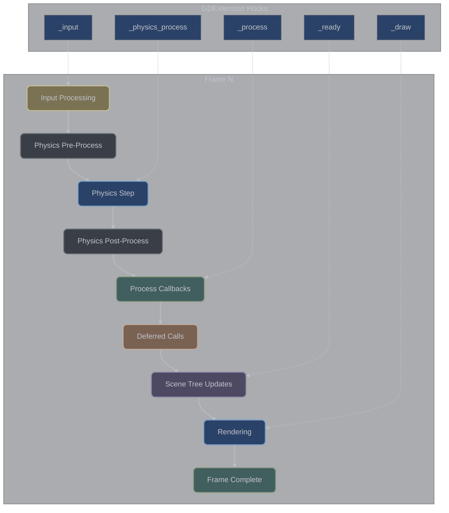
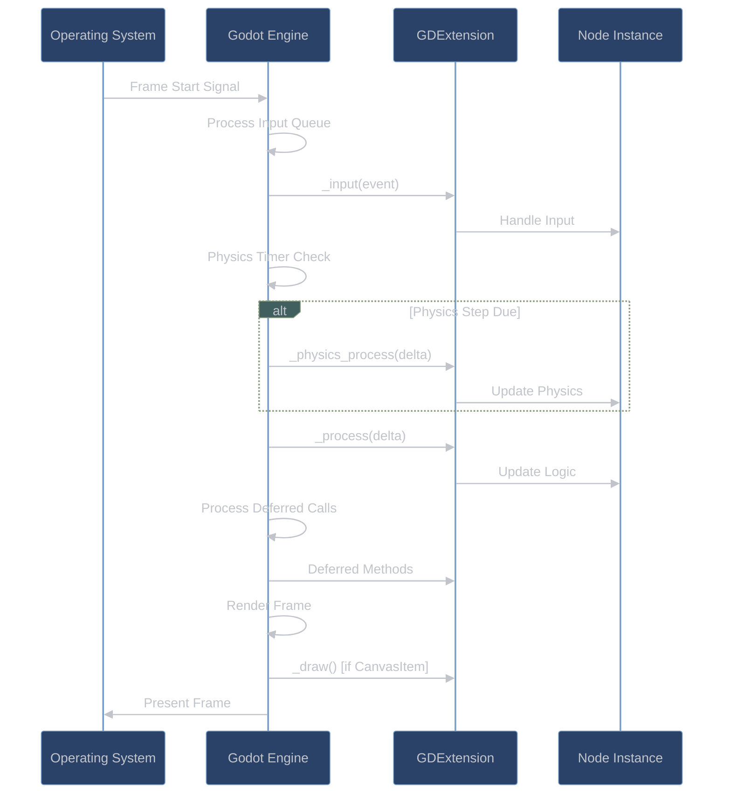

# Game Loop and Lifecycle

## Overview

**What is the game loop?** The game loop is Godot's heart - it's the continuous cycle that runs your game. Think of it like a movie projector showing frames: each "frame" processes input (what buttons were pressed), updates game logic (move characters, check collisions), runs physics simulation, and draws everything on screen. This happens 60 times per second by default.

**Why does this matter for GDExtension?** Your C++ code needs to hook into this loop to participate in the game. You do this by overriding special methods like `_process()` and `_physics_process()`. When Godot runs each frame, it automatically calls your methods at the right time, passing you information like how much time has passed since the last frame.

The Godot game loop is a sophisticated multi-phase processing pipeline that coordinates physics simulation, rendering, input handling, and script execution. GDExtension libraries integrate into this loop through virtual method callbacks and notification systems, receiving data from the engine through the binary interface.

### Game Loop Architecture



## Engine Game Loop

**Understanding the main loop:** Godot's engine runs two main types of updates - physics steps that happen at a fixed rate (usually 60 times per second for consistent physics), and process steps that happen as fast as possible (tied to your display's frame rate). This separation ensures physics behaves consistently regardless of frame rate.

### Main Loop Structure

The Godot engine runs a fixed timestep physics simulation with variable rendering:

```cpp
// Conceptual engine main loop
while (running) {
    // 1. Process OS events and input
    OS::get_singleton()->process_events();
    InputDefault::get_singleton()->flush_buffered_events();

    // 2. Fixed timestep physics (default 60 Hz)
    physics_accumulator += frame_delta;
    while (physics_accumulator >= physics_step) {
        // Physics processing
        physics_server->step(physics_step);

        // Call _physics_process on all nodes
        scene_tree->physics_process(physics_step);

        physics_accumulator -= physics_step;
    }

    // 3. Variable timestep process (tied to frame rate)
    scene_tree->idle_process(frame_delta);  // Calls _process

    // 4. Update scene tree
    scene_tree->process_deletions();
    scene_tree->update_dirty_nodes();

    // 5. Rendering
    rendering_server->draw(frame_delta);

    // 6. Audio processing
    audio_server->update();
}
```

### Frame Phases

| Phase | Frequency | Purpose | GDExtension Hooks |
|-------|-----------|---------|-------------------|
| **Input** | Every frame | Process input events | `_input()`, `_unhandled_input()` |
| **Physics** | Fixed timestep (60 Hz) | Physics simulation | `_physics_process()` |
| **Process** | Every frame | Game logic updates | `_process()` |
| **Deferred** | End of frame | Safe tree modifications | `call_deferred()` results |
| **Render** | Every frame | Draw calls | `_draw()` (CanvasItem only) |

## Frame Processing Pipeline

**What happens each frame:** Every frame follows a predictable sequence: first input events are collected, then physics simulation runs (if it's time for a physics step), then general processing happens, and finally everything gets rendered to the screen. Your GDExtension code gets called during these phases through callback methods.

### Detailed Frame Sequence



## GDExtension Integration Points

**How your C++ code joins the loop:** GDExtension provides several "hooks" - special methods you can override in your C++ classes. When you override `_process()`, Godot calls it every frame. When you override `_physics_process()`, Godot calls it during physics updates. These methods are your entry points into the game loop.

### Virtual Method Callbacks

GDExtension nodes receive callbacks through the virtual method system:

```cpp
class MyNode : public Node3D {
    GDCLASS(MyNode, Node3D)

protected:
    static void _bind_methods() {
        // These virtuals are automatically recognized by the engine
    }

public:
    // Called once when node enters the scene tree
    virtual void _ready() override {
        // Engine calls this through:
        // 1. Engine detects node added to tree
        // 2. Calls notification(NOTIFICATION_READY)
        // 3. Node::_ready() virtual dispatched
        // 4. Arrives here via vtable
    }

    // Called every physics frame (fixed timestep)
    virtual void _physics_process(double delta) override {
        // Engine calls this through:
        // 1. Physics timer triggers
        // 2. SceneTree iterates physics_process_list
        // 3. For each node: get_script_instance()->call("_physics_process", delta)
        // 4. GDExtension vtable lookup
        // 5. This method invoked with delta time

        // delta is always physics_fps (e.g., 1.0/60.0)
    }

    // Called every render frame (variable timestep)
    virtual void _process(double delta) override {
        // Engine calls this through:
        // 1. Main loop process phase
        // 2. SceneTree iterates process_list
        // 3. Virtual method dispatch
        // 4. This method receives actual frame delta

        // delta varies with frame rate
    }

    // Called for each input event
    virtual void _input(const Ref<InputEvent> &event) override {
        // Engine calls this through:
        // 1. OS event arrives (mouse, keyboard, etc.)
        // 2. InputDefault processes raw event
        // 3. SceneTree input propagation
        // 4. Node receives if input processing enabled
        // 5. Virtual dispatch to this method

        if (event->is_action_pressed("jump")) {
            // Handle input
        }
    }

    // Called when node is removed from tree
    virtual void _exit_tree() override {
        // Cleanup resources
    }
};
```

### Data Flow from Engine

Data flows from the engine to GDExtension through several mechanisms:

#### 1. **Virtual Method Parameters**

```cpp
// Engine passes data directly as parameters
virtual void _physics_process(double delta) {
    // 'delta' comes from engine's physics timer
    // Passed through function pointer call across binary boundary
}

virtual void _input(const Ref<InputEvent> &event) {
    // 'event' is created by engine, wrapped in Ref<>
    // Reference counted, shared between engine and extension
}
```

#### 2. **Property Synchronization**

```cpp
class MyNode : public Node3D {
    Vector3 cached_position;

    virtual void _process(double delta) override {
        // Properties synchronized before callback
        Vector3 current_pos = get_position();  // Fetches from engine

        if (current_pos != cached_position) {
            // Position changed by engine or other code
            on_position_changed(current_pos);
            cached_position = current_pos;
        }
    }
};
```

#### 3. **Notification System**

```cpp
virtual void _notification(int what) {
    switch (what) {
        case NOTIFICATION_ENTER_TREE:
            // Engine notifies node entered tree
            // Data available through getters
            break;

        case NOTIFICATION_TRANSFORM_CHANGED:
            // Engine notifies transform modified
            // Can query new transform
            break;

        case NOTIFICATION_PHYSICS_PROCESS:
            // Alternative to _physics_process()
            break;
    }
}
```

## Data Flow Architecture

**How information flows from Godot to your code:** Godot doesn't just call your methods - it also passes you data. For example, `_process(delta)` receives "delta" - the time elapsed since the last frame. This data flows from the engine's C++ core, through the binding layer, into your GDExtension code as properly converted C++ types.

### Engine to Extension Data Path


### Call Propagation Example

Here's how a `_process()` call propagates from engine to your code:

```cpp
// 1. ENGINE SIDE (conceptual)
void SceneTree::idle_process(float delta) {
    for (Node *node : process_list) {
        // Check if node has script/extension
        if (node->has_method("_process")) {
            // Call through GDExtension interface
            gdextension_object_method_bind_call(
                process_method_bind,
                node->_owner_ptr,
                &delta,
                1,
                nullptr,
                &error
            );
        }
    }
}

// 2. BINDING LAYER (godot-cpp)
// Auto-generated binding receives call
void Node::_process_bind(double delta) {
    // Convert parameters if needed
    // Dispatch to virtual
    _process(delta);
}

// 3. YOUR EXTENSION
void MyNode::_process(double delta) {
    // Your implementation
    position.x += speed * delta;
    set_position(position);  // Calls back to engine
}
```

## Virtual Method Invocation

**How Godot finds and calls your methods:** When you override methods like `_ready()` or `_process()`, Godot needs to know these methods exist and how to call them. The binding system registers your overridden methods with Godot during initialization, creating a virtual method table that allows the engine to call your C++ code efficiently.

### Registration and Binding

Virtual methods are registered during class initialization:

```cpp
// In your _bind_methods():
static void _bind_methods() {
    // Virtual methods use special macros
    GDVIRTUAL_BIND(_ready);
    GDVIRTUAL_BIND(_process, "delta");
    GDVIRTUAL_BIND(_physics_process, "delta");
    GDVIRTUAL_BIND(_input, "event");
}

// The GDVIRTUAL_BIND macro expands to:
// 1. Register method name with ClassDB
// 2. Set up parameter type information
// 3. Create method binding for engine calls
// 4. Link to virtual method table
```

### Virtual Method Table

Each GDExtension class maintains a virtual method table:

```cpp
// ClassDB stores virtual methods
struct ClassInfo {
    HashMap<StringName, GDExtensionClassCallVirtual> virtual_methods;

    // When engine calls virtual method:
    // 1. Look up method by name
    // 2. Get function pointer
    // 3. Marshal arguments
    // 4. Invoke function
};

// Virtual method resolution
GDExtensionClassCallVirtual get_virtual_func(StringName method) {
    // Walk inheritance chain
    ClassInfo *info = current_class;
    while (info) {
        if (info->virtual_methods.has(method)) {
            return info->virtual_methods[method];
        }
        info = info->parent;
    }
    return nullptr;
}
```

## Frame Timing and Order

**Understanding when things happen:** Not all callbacks happen at the same time or frequency. Input processing happens first and every frame, physics processing happens at a fixed rate (default 60 Hz), regular processing happens every frame but after physics, and drawing happens last. This predictable order lets you write code that depends on previous phases being complete.

### Execution Order Within Frame

1. **Input Phase**
   - `_input()` - All nodes with input processing
   - `_gui_input()` - Control nodes only
   - `_unhandled_input()` - Nodes with unhandled input processing
   - `_unhandled_key_input()` - Unhandled keyboard input

2. **Physics Phase** (fixed timestep)
   - `_physics_process()` - All nodes with physics processing
   - Physics server integration
   - Collision detection and response

3. **Process Phase** (every frame)
   - `_process()` - All nodes with processing enabled
   - Animation updates
   - Particle systems

4. **Deferred Phase**
   - Execute `call_deferred()` queue
   - Safe for scene tree modifications
   - Node additions/removals

5. **Pre-Draw Phase**
   - Transform updates
   - Visibility culling
   - Material setup

6. **Draw Phase**
   - `_draw()` - CanvasItem nodes
   - Render server submission
   - GPU command buffer building

### Timing Guarantees

```cpp
class TimingExample : public Node {
    double physics_accumulator = 0.0;
    double process_accumulator = 0.0;
    int physics_frames = 0;
    int process_frames = 0;

    virtual void _physics_process(double delta) override {
        // GUARANTEE: delta is always 1.0/physics_fps
        // Default: 1.0/60.0 = 0.01666... seconds
        physics_accumulator += delta;
        physics_frames++;

        // After 60 physics frames, accumulator ≈ 1.0 second
    }

    virtual void _process(double delta) override {
        // VARIABLE: delta depends on frame rate
        // Can range from 0.001 to 0.1+ seconds
        process_accumulator += delta;
        process_frames++;

        // Accumulator matches real time, frames vary with FPS
    }
};
```

## Thread Context

**Where your code runs:** Almost all GDExtension callbacks run on the main thread - the same thread where Godot's core systems operate. This means you don't need to worry about thread safety when calling most Godot functions, but it also means heavy computation in your callbacks can slow down the entire game.

### Main Thread Execution

Most callbacks execute on the main thread:

```cpp
class ThreadSafetyExample : public Node {
    Mutex data_mutex;
    Vector<float> shared_data;

    virtual void _ready() override {
        // Main thread
        setup_resources();
    }

    virtual void _process(double delta) override {
        // Main thread
        update_game_logic(delta);
    }

    virtual void _physics_process(double delta) override {
        // Main thread
        update_physics(delta);
    }

    virtual void _input(const Ref<InputEvent> &event) override {
        // Main thread
        handle_input(event);
    }

    // Custom threaded work
    void background_work() {
        // Worker thread - need synchronization
        MutexLock lock(data_mutex);
        process_shared_data();

        // Use call_deferred for thread-safe scene updates
        call_deferred("update_from_thread", result);
    }

    void update_from_thread(Variant result) {
        // Main thread (via call_deferred)
        apply_thread_results(result);
    }
};
```

### Thread-Safe Operations

```cpp
// Safe cross-thread communication patterns
class ThreadSafeNode : public Node {
protected:
    // Thread-safe notification
    void notify_main_thread(const String &message) {
        // call_deferred ensures main thread execution
        call_deferred("_on_thread_message", message);
    }

    // Thread-safe property update
    void update_property_threadsafe(const StringName &property,
                                   const Variant &value) {
        call_deferred("set", property, value);
    }

    // Thread-safe node operations
    void add_child_threadsafe(Node *child) {
        call_deferred("add_child", child);
    }

private:
    void _on_thread_message(const String &message) {
        // Executes on main thread
        print_line("Thread message: " + message);
    }
};
```

## Performance Considerations

**Keeping your game running smoothly:** Since your callback methods run during the main game loop, any heavy work you do directly impacts frame rate. The key is to spread expensive operations across multiple frames, disable processing when not needed, and use techniques like level-of-detail to reduce work based on distance or importance.

### Optimization Strategies

1. **Conditional Processing**
```cpp
virtual void _ready() override {
    // Disable processing when not needed
    set_process(false);
    set_physics_process(false);

    // Enable only when necessary
    if (needs_updates) {
        set_process(true);
    }
}
```

2. **Frame Skipping**
```cpp
class OptimizedNode : public Node {
    int frame_skip = 0;
    const int SKIP_FRAMES = 3;  // Process every 4th frame

    virtual void _process(double delta) override {
        if (frame_skip++ < SKIP_FRAMES) {
            return;
        }
        frame_skip = 0;

        // Heavy processing here
        expensive_update(delta * (SKIP_FRAMES + 1));
    }
};
```

3. **Level of Detail (LOD)**
```cpp
virtual void _process(double delta) override {
    float distance = get_viewport()->get_camera_3d()->
        get_global_position().distance_to(get_global_position());

    if (distance > FAR_DISTANCE) {
        // Skip or simplify processing
        return;
    } else if (distance > MEDIUM_DISTANCE) {
        // Reduced processing
        simple_update(delta);
    } else {
        // Full processing
        detailed_update(delta);
    }
}
```

4. **Batch Operations**
```cpp
class BatchProcessor : public Node {
    Vector<Operation> pending_operations;

    virtual void _process(double delta) override {
        // Batch multiple operations
        if (pending_operations.size() >= BATCH_SIZE ||
            time_since_last_batch > MAX_BATCH_DELAY) {
            process_batch();
            pending_operations.clear();
        }
    }

    void process_batch() {
        // Process all operations at once
        // More efficient than individual updates
    }
};
```

### Profiling Integration Points

```cpp
class ProfiledNode : public Node {
    virtual void _process(double delta) override {
        // Measure GDExtension overhead
        uint64_t start = OS::get_singleton()->get_ticks_usec();

        // Your processing
        perform_work(delta);

        uint64_t elapsed = OS::get_singleton()->get_ticks_usec() - start;

        // Report to Godot profiler
        if (elapsed > 1000) {  // Over 1ms
            print_verbose(vformat("Heavy frame: %d μs", elapsed));
        }
    }
};
```

## Conclusion

The game loop integration in GDExtension provides multiple precise hooks into Godot's frame processing pipeline. Understanding the execution order, timing guarantees, and data flow patterns is crucial for building performant extensions that work harmoniously with the engine's architecture. The virtual method system provides a clean, efficient interface while the notification system offers fine-grained control over node lifecycle events.
