# GDScript and GDExtension Interaction

## Overview

**What is GDScript interaction?** This is the two-way communication between your C++ GDExtension code and GDScript (Godot's built-in scripting language). Once properly set up, your C++ classes appear in GDScript just like built-in Godot classes - GDScript can create instances, call methods, access properties, and connect to signals.

**Why use both C++ and GDScript?** This hybrid approach gives you the best of both worlds: write performance-critical systems (like physics simulations or data processing) in C++ for speed, while keeping game logic (like AI behavior or UI interactions) in GDScript for rapid iteration and easier debugging.

GDExtension classes seamlessly integrate with GDScript, appearing as native engine classes. This bidirectional communication enables hybrid architectures where performance-critical code runs in C++ while game logic remains in GDScript.

### Communication Architecture

```mermaid
---
config:
    theme: 'base'
    curve: 'straight'
    themeVariables:
        darkMode: true
        clusterBkg: '#22272f62'
        clusterBorder: '#6a6f77ff'
        clusterTextColor: '#6a6f77ff'
        lineColor: '#C1C4CAAA'
        background: '#262B33'
        primaryColor: '#2b4268ff'
        primaryTextColor: '#C1C4CAff'
        primaryBorderColor: '#6a6f77ff'
        primaryLabelBkg: '#262B33'
        secondaryColor: '#425f5fff'
        secondaryBorderColor: '#8c9c81ff'
        secondaryTextColor: '#C1C4CAff'
        tertiaryColor: '#4d4962ff'
        tertiaryBorderColor: '#8983a5ff'
        tertiaryTextColor: '#eeeeee55'
        nodeTextColor: '#C1C4CA'
        defaultLinkColor: '#C1C4CA'
        edgeLabelBackground: '#262B33'
        edgeLabelBorderColor: '#C1C4CA'
        labelTextColor: '#C1C4CA'
        errorBkgColor: '#724848ff'
        errorTextColor: '#C1C4CA'
        flowchart:
            curve: 'basis'
            nodeSpacing: 50
            rankSpacing: 50
            subGraphTitleMargin:
                top: 15
                bottom: 15
                left: 15
                right: 15
---
flowchart LR
    subgraph GDSCRIPT["GDScript Layer"]
        A[Game Logic] --> B[Script Instance]
    end

    subgraph BINDING["Binding Layer"]
        C[Method Calls] --> D[Property Access]
        D --> E[Signal Emission]
    end

    subgraph GDEXT["GDExtension Layer"]
        F[C++ Classes] --> G[Native Performance]
    end

    B <--> C
    E <--> F

    linkStyle default stroke:#C1C4CAaa,stroke-width:2px,color:#C1C4CA

    style A fill:#7a7253ff,stroke:#c7c19bff,stroke-width:2px,color:#C1C4CA,rx:8,ry:8
    style B fill:#7a6253ff,stroke:#c7ac9bff,stroke-width:2px,color:#C1C4CA,rx:8,ry:8
    style C fill:#2b4268ff,stroke:#779DC9ff,stroke-width:2px,color:#C1C4CA,rx:8,ry:8
    style D fill:#4d4962ff,stroke:#8983a5ff,stroke-width:2px,color:#C1C4CA,rx:8,ry:8
    style E fill:#3a3f47ff,stroke:#6a6f77ff,stroke-width:2px,color:#C1C4CA,rx:8,ry:8
    style F fill:#425f5fff,stroke:#8c9c81ff,stroke-width:2px,color:#C1C4CA,rx:8,ry:8
    style G fill:#425f5fff,stroke:#8c9c81ff,stroke-width:2px,color:#C1C4CA,rx:8,ry:8
```



## Calling GDExtension from GDScript

**Using your C++ classes in GDScript:** Once you've registered your C++ class with proper bindings, GDScript can use it exactly like any other Godot class. You can instantiate it with `.new()`, call its methods, access its properties, and connect to its signals. The binding system handles all the complexity of converting between GDScript's dynamic types and your C++ types.

### Basic Usage

Once registered, GDExtension classes appear like any other Godot class:

```gdscript
# GDScript using GDExtension class
extends Node

func _ready():
    # Create instance of GDExtension class
    var my_extension = MyExtensionClass.new()

    # Call methods
    var result = my_extension.calculate(10, 20)
    print("Result: ", result)

    # Access properties
    my_extension.health = 100
    var current_health = my_extension.health

    # Connect to signals
    my_extension.health_changed.connect(_on_health_changed)

    # Add as child node (if extends Node)
    add_child(my_extension)

    # Use static methods
    var processed = MyExtensionClass.process_data("input")

func _on_health_changed(new_health):
    print("Health is now: ", new_health)
```

### GDExtension Class Definition

The C++ class that GDScript interacts with:

```cpp
class MyExtensionClass : public Node {
    GDCLASS(MyExtensionClass, Node)

private:
    int health = 100;
    float speed = 5.0f;
    String player_name = "Player";

protected:
    static void _bind_methods() {
        // Make methods available to GDScript
        ClassDB::bind_method(D_METHOD("calculate", "a", "b"),
                           &MyExtensionClass::calculate);

        // Properties
        ClassDB::bind_method(D_METHOD("set_health", "value"),
                           &MyExtensionClass::set_health);
        ClassDB::bind_method(D_METHOD("get_health"),
                           &MyExtensionClass::get_health);
        ADD_PROPERTY(PropertyInfo(Variant::INT, "health",
                                 PROPERTY_HINT_RANGE, "0,100"),
                    "set_health", "get_health");

        // Signals
        ADD_SIGNAL(MethodInfo("health_changed",
                            PropertyInfo(Variant::INT, "new_health")));

        // Static methods
        ClassDB::bind_static_method("MyExtensionClass",
                                   D_METHOD("process_data", "input"),
                                   &MyExtensionClass::process_data);

        // Constants
        BIND_CONSTANT(MAX_HEALTH);

        // Enums
        BIND_ENUM_CONSTANT(STATE_IDLE);
        BIND_ENUM_CONSTANT(STATE_ACTIVE);
        BIND_ENUM_CONSTANT(STATE_COMPLETE);
    }

public:
    enum State {
        STATE_IDLE,
        STATE_ACTIVE,
        STATE_COMPLETE
    };

    static const int MAX_HEALTH = 100;

    int calculate(int a, int b) {
        return a + b;
    }

    void set_health(int p_health) {
        int old_health = health;
        health = CLAMP(p_health, 0, MAX_HEALTH);
        if (health != old_health) {
            emit_signal("health_changed", health);
        }
    }

    int get_health() const {
        return health;
    }

    static String process_data(const String &input) {
        return "Processed: " + input;
    }
};
```

### Using in GDScript with Type Hints

GDScript can use type hints with GDExtension classes:

```gdscript
# Type-safe GDScript
class_name GameController
extends Node

var extension_node: MyExtensionClass
var health_bar: ProgressBar

func _ready() -> void:
    # Type-safe instantiation
    extension_node = MyExtensionClass.new() as MyExtensionClass
    add_child(extension_node)

    # Type checking
    if extension_node:
        setup_extension()

func setup_extension() -> void:
    # Accessing enum constants
    extension_node.state = MyExtensionClass.STATE_IDLE

    # Using constants
    extension_node.health = MyExtensionClass.MAX_HEALTH

    # Method with return type
    var calc_result: int = extension_node.calculate(5, 3)

func process_data(input: String) -> String:
    # Call static method
    return MyExtensionClass.process_data(input)
```

## Calling GDScript from GDExtension

**Invoking GDScript code from C++:** Your C++ code can call GDScript methods using the `call()` function, access GDScript properties with `get()` and `set()`, and even load and run GDScript code dynamically. This is useful for creating extensible systems where GDScript acts as a scripting layer on top of your C++ foundation.

### Script Instance Access

GDExtension can call GDScript methods through the script instance:

```cpp
class ScriptInteraction : public Node {
    GDCLASS(ScriptInteraction, Node)

public:
    void call_gdscript_method() {
        // Check if node has script
        if (!has_method("custom_gdscript_method")) {
            return;
        }

        // Call GDScript method
        Variant result = call("custom_gdscript_method", 42, "parameter");

        // Call with array of arguments
        Array args;
        args.append(10);
        args.append("test");
        Variant result2 = callv("another_method", args);
    }

    void check_script_properties() {
        // Check for script
        Ref<Script> script = get_script();
        if (script.is_valid()) {
            // Script is attached

            // Get script property
            if (has_method("get_custom_property")) {
                Variant prop = call("get_custom_property");
            }

            // Set script property
            if (has_method("set_custom_property")) {
                call("set_custom_property", "new_value");
            }
        }
    }

    void interact_with_script_signals() {
        // Connect to GDScript signal
        if (has_signal("gdscript_signal")) {
            connect("gdscript_signal",
                   Callable(this, "on_gdscript_signal"));
        }

        // Emit signal that GDScript can receive
        if (has_signal("request_processed")) {
            emit_signal("request_processed", true);
        }
    }

    void on_gdscript_signal(const Variant &data) {
        print_line("Received from GDScript: " + data.stringify());
    }
};
```

### Dynamic Script Loading

Loading and instantiating GDScript from C++:

```cpp
class DynamicScriptLoader : public Node {
    GDCLASS(DynamicScriptLoader, Node)

public:
    Node *load_gdscript_node(const String &script_path) {
        // Load GDScript file
        Ref<Script> script = ResourceLoader::load(script_path);
        if (script.is_null()) {
            ERR_PRINT("Failed to load script: " + script_path);
            return nullptr;
        }

        // Check if script can be instantiated
        if (!script->can_instantiate()) {
            ERR_PRINT("Script cannot be instantiated: " + script_path);
            return nullptr;
        }

        // Get base type
        StringName base_type = script->get_instance_base_type();

        // Create base node
        Object *obj = ClassDB::instantiate(base_type);
        Node *node = Object::cast_to<Node>(obj);

        if (node) {
            // Attach script
            node->set_script(script);

            // Call GDScript _ready if needed
            if (node->has_method("_ready")) {
                node->call("_ready");
            }

            return node;
        }

        return nullptr;
    }

    void create_and_configure_gdscript_node() {
        Node *gdscript_node = load_gdscript_node("res://scripts/Player.gd");

        if (gdscript_node) {
            // Configure through GDScript methods
            if (gdscript_node->has_method("initialize")) {
                Dictionary config;
                config["health"] = 100;
                config["speed"] = 5.5;
                gdscript_node->call("initialize", config);
            }

            // Add to scene
            add_child(gdscript_node);

            // Set owner for scene saving
            gdscript_node->set_owner(get_tree()->get_edited_scene_root());
        }
    }
};
```

### Evaluating GDScript Code

Running GDScript dynamically:

```cpp
class GDScriptEvaluator : public Node {
    GDCLASS(GDScriptEvaluator, Node)

public:
    Variant evaluate_expression(const String &expression) {
        // Create expression
        Ref<Expression> expr;
        expr.instantiate();

        // Parse expression
        Array input_names;
        input_names.append("x");
        input_names.append("y");

        Error err = expr->parse(expression, input_names);
        if (err != OK) {
            ERR_PRINT("Failed to parse expression: " + expression);
            return Variant();
        }

        // Execute expression
        Array input_values;
        input_values.append(10);
        input_values.append(20);

        Variant result = expr->execute(input_values, this);

        if (expr->has_execute_failed()) {
            ERR_PRINT("Expression execution failed");
            return Variant();
        }

        return result;
    }

    void run_gdscript_code() {
        // For more complex GDScript execution, use GDScript class
        Ref<GDScript> gdscript;
        gdscript.instantiate();

        String code = R"(
extends RefCounted

func calculate(a, b):
    return a * b + 10

func get_message():
    return "Hello from dynamic GDScript"
)";

        gdscript->set_source_code(code);
        Error err = gdscript->reload();

        if (err == OK) {
            // Create instance
            Ref<RefCounted> instance = gdscript->new();

            if (instance.is_valid()) {
                // Call methods
                Variant result = instance->call("calculate", 5, 3);
                print_line("Result: " + result.stringify());

                String message = instance->call("get_message");
                print_line("Message: " + message);
            }
        }
    }
};
```

## Property Synchronization

**Keeping data in sync between C++ and GDScript:** When both C++ and GDScript can modify the same property, you need to ensure they stay synchronized. This involves proper setter methods, change notifications, and sometimes caching strategies to avoid constant cross-language calls in performance-critical code.

### Automatic Property Syncing

Properties are automatically synchronized between GDScript and GDExtension:

```cpp
class PropertySync : public Node {
    GDCLASS(PropertySync, Node)

private:
    float sync_value = 0.0f;
    bool dirty = false;

protected:
    static void _bind_methods() {
        // Property with notification
        ClassDB::bind_method(D_METHOD("set_sync_value", "value"),
                           &PropertySync::set_sync_value);
        ClassDB::bind_method(D_METHOD("get_sync_value"),
                           &PropertySync::get_sync_value);
        ADD_PROPERTY(PropertyInfo(Variant::FLOAT, "sync_value",
                                 PROPERTY_HINT_RANGE, "0.0,1.0,0.01"),
                    "set_sync_value", "get_sync_value");

        // Property change signal
        ADD_SIGNAL(MethodInfo("sync_value_changed",
                            PropertyInfo(Variant::FLOAT, "new_value")));
    }

public:
    void set_sync_value(float p_value) {
        if (sync_value != p_value) {
            sync_value = p_value;
            dirty = true;

            // Notify GDScript
            emit_signal("sync_value_changed", sync_value);

            // Update property list for editor
            notify_property_list_changed();

            // Call GDScript handler if exists
            if (has_method("_on_sync_value_changed")) {
                call("_on_sync_value_changed", sync_value);
            }
        }
    }

    float get_sync_value() const {
        return sync_value;
    }

    virtual void _process(double delta) override {
        if (dirty) {
            // Check if GDScript modified the value
            Variant script_value = get("sync_value");
            if (script_value.get_type() == Variant::FLOAT) {
                float val = script_value;
                if (val != sync_value) {
                    // GDScript changed the value
                    sync_value = val;
                }
            }
            dirty = false;
        }
    }
};
```

GDScript side:

```gdscript
extends PropertySync

var local_sync_value: float = 0.0

func _ready():
    # Connect to property change signal
    sync_value_changed.connect(_on_sync_changed)

    # Set initial value
    sync_value = 0.5

func _on_sync_changed(new_value: float):
    print("C++ changed sync_value to: ", new_value)
    local_sync_value = new_value

func _on_sync_value_changed(value: float):
    # Called by C++ when property changes
    print("Property changed handler: ", value)

func _process(delta):
    # Modify from GDScript
    if Input.is_action_pressed("ui_up"):
        sync_value += delta * 0.1
        sync_value = clamp(sync_value, 0.0, 1.0)
```

## Signal Communication

**Event-driven communication between languages:** Signals provide an excellent way for C++ and GDScript code to communicate without tight coupling. Your C++ code can emit signals that GDScript connects to, and vice versa. This enables clean event-driven architectures where different parts of your system can respond to events without needing direct references to each other.

### Bidirectional Signal Flow

```cpp
class SignalCommunication : public Node {
    GDCLASS(SignalCommunication, Node)

protected:
    static void _bind_methods() {
        // Signals emitted to GDScript
        ADD_SIGNAL(MethodInfo("data_received",
                            PropertyInfo(Variant::DICTIONARY, "data")));
        ADD_SIGNAL(MethodInfo("processing_complete",
                            PropertyInfo(Variant::BOOL, "success"),
                            PropertyInfo(Variant::STRING, "message")));

        // Method to receive GDScript signals
        ClassDB::bind_method(D_METHOD("on_gdscript_request", "request_data"),
                           &SignalCommunication::on_gdscript_request);
    }

public:
    virtual void _ready() override {
        // Connect to GDScript signals if they exist
        if (has_signal("gdscript_custom_signal")) {
            connect("gdscript_custom_signal",
                   Callable(this, "handle_gdscript_signal"));
        }

        // Emit initial signal
        Dictionary init_data;
        init_data["status"] = "ready";
        init_data["version"] = 1;
        emit_signal("data_received", init_data);
    }

    void on_gdscript_request(const Dictionary &request_data) {
        // Process request from GDScript
        String action = request_data.get("action", "");

        if (action == "process") {
            bool success = process_request(request_data);
            emit_signal("processing_complete", success,
                       success ? "Success" : "Failed");
        }
    }

    void handle_gdscript_signal(const Variant &arg1, const Variant &arg2) {
        print_line("Received signal from GDScript");
    }

private:
    bool process_request(const Dictionary &data) {
        // Process the request
        return true;
    }
};
```

GDScript implementation:

```gdscript
extends SignalCommunication

signal gdscript_custom_signal(param1, param2)

func _ready():
    # Connect to C++ signals
    data_received.connect(_on_data_received)
    processing_complete.connect(_on_processing_complete)

    # Emit signal to C++
    gdscript_custom_signal.emit("test", 123)

    # Call C++ method that expects signal
    var request = {
        "action": "process",
        "data": "test_data"
    }
    on_gdscript_request(request)

func _on_data_received(data: Dictionary):
    print("Received data from C++: ", data)

func _on_processing_complete(success: bool, message: String):
    if success:
        print("Processing succeeded: ", message)
    else:
        print("Processing failed: ", message)
```

### Using CustomCallable for Lambda and std::function Callbacks

**Modern C++ signal handling:** CustomCallable allows you to connect signals to lambdas, std::function objects, or any callable in C++. This provides a more flexible and modern approach to signal handling compared to traditional method binding, especially useful for one-off callbacks, capturing local state, or creating dynamic signal handlers.

```cpp
#include <godot_cpp/core/custom_callable.hpp>
#include <functional>

class ModernSignalHandling : public Node {
    GDCLASS(ModernSignalHandling, Node)

private:
    int counter = 0;
    std::function<void(int)> stored_callback;

protected:
    static void _bind_methods() {
        ADD_SIGNAL(MethodInfo("value_changed",
                            PropertyInfo(Variant::INT, "value")));
        ADD_SIGNAL(MethodInfo("process_complete"));
    }

public:
    virtual void _ready() override {
        // Lambda with capture
        int local_value = 42;
        auto lambda_callback = [this, local_value](const Variant &value) {
            print_line(vformat("Lambda received: %d (captured: %d)",
                             value.operator int(), local_value));
            counter++;
        };

        // Connect using CustomCallable with lambda
        connect("value_changed",
               Callable::create(lambda_callback));

        // std::function callback
        stored_callback = [this](int value) {
            print_line(vformat("std::function callback: %d", value));
            if (value > 100) {
                emit_signal("process_complete");
            }
        };

        // Stateful lambda capturing this
        auto stateful_lambda = [this](const Array &args) -> Variant {
            if (args.size() > 0) {
                int value = args[0];
                stored_callback(value);
            }
            return Variant();
        };

        // Connect with CustomCallable
        connect("value_changed",
               Callable::create(stateful_lambda));

        // Connect child node signals with lambdas
        Node *child = get_node_or_null(NodePath("ChildNode"));
        if (child && child->has_signal("custom_signal")) {
            auto child_handler = [this, child](const Variant &data) {
                print_line(vformat("Child %s sent: %s",
                                 child->get_name(),
                                 data.stringify()));
            };

            child->connect("custom_signal",
                          Callable::create(child_handler));
        }
    }

    void connect_with_context() {
        // Lambda with shared_ptr for lifetime management
        auto shared_data = std::make_shared<Dictionary>();
        (*shared_data)["count"] = 0;

        auto context_lambda = [shared_data](const Variant &value) mutable {
            int count = (*shared_data)["count"];
            count++;
            (*shared_data)["count"] = count;
            print_line(vformat("Called %d times with value: %s",
                             count, value.stringify()));
        };

        connect("value_changed",
               Callable::create(context_lambda));
    }

    void create_dynamic_handlers() {
        // Create multiple handlers dynamically
        for (int i = 0; i < 5; i++) {
            auto handler = [i](const Variant &value) {
                print_line(vformat("Handler %d received: %s",
                                 i, value.stringify()));
            };

            connect("value_changed",
                   Callable::create(handler));
        }
    }

    void connect_one_shot() {
        // One-shot connection that disconnects after first call
        std::shared_ptr<Callable> callable_ref;

        auto one_shot = [this, &callable_ref](const Variant &value) {
            print_line("One-shot handler called!");
            // Disconnect after handling
            if (callable_ref) {
                disconnect("value_changed", *callable_ref);
            }
        };

        auto callable = Callable::create(one_shot);
        callable_ref = std::make_shared<Callable>(callable);
        connect("value_changed", callable, CONNECT_ONE_SHOT);
    }
};

// Advanced CustomCallable patterns
class CallableFactory : public RefCounted {
    GDCLASS(CallableFactory, RefCounted)

public:
    // Factory for creating typed callbacks
    template<typename T>
    static Callable create_typed_handler(std::function<void(T)> handler) {
        return Callable::create([handler](const Variant &value) {
            if (value.get_type() == Variant::get_type<T>()) {
                handler(value.operator T());
            }
        });
    }

    // Create callback with error handling
    static Callable create_safe_handler(std::function<void(Variant)> handler) {
        return Callable::create([handler](const Variant &value) {
            try {
                handler(value);
            } catch (const std::exception &e) {
                ERR_PRINT(vformat("Callback error: %s", e.what()));
            }
        });
    }

    // Chain multiple callbacks
    static Callable create_chained_handler(
        const std::vector<std::function<void(Variant)>> &handlers) {
        return Callable::create([handlers](const Variant &value) {
            for (const auto &handler : handlers) {
                handler(value);
            }
        });
    }

    // Conditional callback
    static Callable create_conditional_handler(
        std::function<bool(Variant)> condition,
        std::function<void(Variant)> handler) {
        return Callable::create([condition, handler](const Variant &value) {
            if (condition(value)) {
                handler(value);
            }
        });
    }

    // Rate-limited callback
    static Callable create_throttled_handler(
        std::function<void(Variant)> handler,
        double min_interval) {

        struct ThrottleState {
            uint64_t last_call = 0;
            double interval;
            std::function<void(Variant)> handler;
        };

        auto state = std::make_shared<ThrottleState>();
        state->interval = min_interval * 1000000; // Convert to microseconds
        state->handler = handler;

        return Callable::create([state](const Variant &value) {
            uint64_t now = OS::get_singleton()->get_ticks_usec();
            if (now - state->last_call >= state->interval) {
                state->handler(value);
                state->last_call = now;
            }
        });
    }
};

// Practical example: Event bus with lambda handlers
class EventBus : public Node {
    GDCLASS(EventBus, Node)

private:
    HashMap<String, Vector<Callable>> event_handlers;

protected:
    static void _bind_methods() {
        ClassDB::bind_method(D_METHOD("subscribe", "event", "callable"),
                           &EventBus::subscribe);
        ClassDB::bind_method(D_METHOD("publish", "event", "data"),
                           &EventBus::publish);
    }

public:
    void subscribe(const String &event, const Callable &callable) {
        if (!event_handlers.has(event)) {
            event_handlers[event] = Vector<Callable>();
        }
        event_handlers[event].append(callable);
    }

    void subscribe_lambda(const String &event,
                         std::function<void(Variant)> handler) {
        subscribe(event, Callable::create(handler));
    }

    void publish(const String &event, const Variant &data) {
        if (event_handlers.has(event)) {
            for (const Callable &handler : event_handlers[event]) {
                handler.call(data);
            }
        }
    }

    // Usage example
    void setup_event_handling() {
        // Subscribe with lambda
        subscribe_lambda("player_health_changed", [this](const Variant &data) {
            int health = data;
            if (health <= 0) {
                publish("player_died", Dictionary());
            }
        });

        // Subscribe with capturing lambda
        int max_health = 100;
        subscribe_lambda("player_healed", [this, max_health](const Variant &data) {
            int heal_amount = data;
            print_line(vformat("Healed for %d (max: %d)",
                             heal_amount, max_health));
        });

        // Chain reactions
        subscribe_lambda("enemy_defeated", [this](const Variant &data) {
            Dictionary enemy_data = data;
            int exp = enemy_data.get("exp", 0);
            publish("experience_gained", exp);

            if (enemy_data.has("loot")) {
                publish("loot_dropped", enemy_data["loot"]);
            }
        });
    }
};
```

Usage from GDScript:

```gdscript
extends Node

func _ready():
    # Get the event bus (assuming it's a singleton)
    var event_bus = get_node("/root/EventBus")

    # Subscribe to events with callables
    var health_callback = func(data):
        print("Health changed to: ", data)

    event_bus.subscribe("player_health_changed", health_callback)

    # Publish events
    event_bus.publish("player_health_changed", 75)

    # Create and use ModernSignalHandling
    var modern_node = ModernSignalHandling.new()
    add_child(modern_node)

    # Emit signal that triggers lambda handlers
    modern_node.emit_signal("value_changed", 150)
```

## Custom Types in GDScript

**Making C++ data structures available to GDScript:** Beyond simple methods and properties, you can expose complex C++ data types to GDScript. This includes custom Resource classes for saveable data, custom Node classes for game entities, and even complex data structures with their own methods and properties.

### Exposing Complex Types

```cpp
class CustomDataType : public Resource {
    GDCLASS(CustomDataType, Resource)

private:
    String name;
    int level = 1;
    Dictionary attributes;
    Array inventory;

protected:
    static void _bind_methods() {
        // Properties
        ClassDB::bind_method(D_METHOD("set_name", "name"),
                           &CustomDataType::set_name);
        ClassDB::bind_method(D_METHOD("get_name"),
                           &CustomDataType::get_name);
        ADD_PROPERTY(PropertyInfo(Variant::STRING, "name"),
                    "set_name", "get_name");

        ClassDB::bind_method(D_METHOD("set_level", "level"),
                           &CustomDataType::set_level);
        ClassDB::bind_method(D_METHOD("get_level"),
                           &CustomDataType::get_level);
        ADD_PROPERTY(PropertyInfo(Variant::INT, "level",
                                 PROPERTY_HINT_RANGE, "1,100"),
                    "set_level", "get_level");

        ClassDB::bind_method(D_METHOD("set_attributes", "attributes"),
                           &CustomDataType::set_attributes);
        ClassDB::bind_method(D_METHOD("get_attributes"),
                           &CustomDataType::get_attributes);
        ADD_PROPERTY(PropertyInfo(Variant::DICTIONARY, "attributes"),
                    "set_attributes", "get_attributes");

        // Methods
        ClassDB::bind_method(D_METHOD("add_item", "item"),
                           &CustomDataType::add_item);
        ClassDB::bind_method(D_METHOD("remove_item", "index"),
                           &CustomDataType::remove_item);
        ClassDB::bind_method(D_METHOD("get_item", "index"),
                           &CustomDataType::get_item);
        ClassDB::bind_method(D_METHOD("get_item_count"),
                           &CustomDataType::get_item_count);

        // Factory method
        ClassDB::bind_static_method("CustomDataType",
                                   D_METHOD("create_default"),
                                   &CustomDataType::create_default);
    }

public:
    void set_name(const String &p_name) { name = p_name; }
    String get_name() const { return name; }

    void set_level(int p_level) { level = CLAMP(p_level, 1, 100); }
    int get_level() const { return level; }

    void set_attributes(const Dictionary &p_attributes) {
        attributes = p_attributes;
    }
    Dictionary get_attributes() const { return attributes; }

    void add_item(const Variant &item) {
        inventory.append(item);
    }

    void remove_item(int index) {
        if (index >= 0 && index < inventory.size()) {
            inventory.remove_at(index);
        }
    }

    Variant get_item(int index) const {
        if (index >= 0 && index < inventory.size()) {
            return inventory[index];
        }
        return Variant();
    }

    int get_item_count() const {
        return inventory.size();
    }

    static Ref<CustomDataType> create_default() {
        Ref<CustomDataType> data;
        data.instantiate();
        data->set_name("Default");
        data->set_level(1);

        Dictionary default_attrs;
        default_attrs["strength"] = 10;
        default_attrs["speed"] = 5;
        data->set_attributes(default_attrs);

        return data;
    }
};
```

Using in GDScript:

```gdscript
extends Node

var player_data: CustomDataType

func _ready():
    # Create using factory method
    player_data = CustomDataType.create_default()

    # Modify properties
    player_data.name = "Hero"
    player_data.level = 10

    # Work with attributes
    var attrs = player_data.attributes
    attrs["intelligence"] = 15
    player_data.attributes = attrs

    # Use methods
    player_data.add_item("Sword")
    player_data.add_item("Potion")

    print("Player: ", player_data.name)
    print("Level: ", player_data.level)
    print("Items: ", player_data.get_item_count())

    # Save as resource
    ResourceSaver.save(player_data, "user://player_data.tres")

    # Load resource
    var loaded_data = load("user://player_data.tres") as CustomDataType
    if loaded_data:
        print("Loaded: ", loaded_data.name)
```

## Editor Integration

**Making your C++ classes work in the Godot editor:** Properly bound C++ classes automatically appear in the Godot editor's node creation dialog, their properties show up in the inspector with appropriate UI widgets, and they can be used in tool scripts that run inside the editor. This makes your C++ extensions feel like native Godot features.

### Custom Inspector Properties

```cpp
class EditorIntegration : public Node {
    GDCLASS(EditorIntegration, Node)

private:
    int dropdown_value = 0;
    String file_path;
    Color color_value = Color(1, 1, 1);

protected:
    static void _bind_methods() {
        // Dropdown property
        ClassDB::bind_method(D_METHOD("set_dropdown_value", "value"),
                           &EditorIntegration::set_dropdown_value);
        ClassDB::bind_method(D_METHOD("get_dropdown_value"),
                           &EditorIntegration::get_dropdown_value);
        ADD_PROPERTY(PropertyInfo(Variant::INT, "dropdown_value",
                                 PROPERTY_HINT_ENUM,
                                 "Option1,Option2,Option3"),
                    "set_dropdown_value", "get_dropdown_value");

        // File path property
        ClassDB::bind_method(D_METHOD("set_file_path", "path"),
                           &EditorIntegration::set_file_path);
        ClassDB::bind_method(D_METHOD("get_file_path"),
                           &EditorIntegration::get_file_path);
        ADD_PROPERTY(PropertyInfo(Variant::STRING, "file_path",
                                 PROPERTY_HINT_FILE, "*.png,*.jpg"),
                    "set_file_path", "get_file_path");

        // Color property
        ClassDB::bind_method(D_METHOD("set_color_value", "color"),
                           &EditorIntegration::set_color_value);
        ClassDB::bind_method(D_METHOD("get_color_value"),
                           &EditorIntegration::get_color_value);
        ADD_PROPERTY(PropertyInfo(Variant::COLOR, "color_value"),
                    "set_color_value", "get_color_value");

        // Export hints for GDScript
        ADD_GROUP("Export Settings", "export_");
        ADD_PROPERTY(PropertyInfo(Variant::BOOL, "export_enabled"),
                    "set_export_enabled", "get_export_enabled");
    }

    // Property list for dynamic properties
    virtual void _get_property_list(List<PropertyInfo> *p_list) const override {
        // Add dynamic properties visible in editor
        p_list->push_back(PropertyInfo(Variant::STRING,
                                      "dynamic_property",
                                      PROPERTY_HINT_MULTILINE_TEXT));

        // Conditional properties
        if (dropdown_value == 1) {
            p_list->push_back(PropertyInfo(Variant::FLOAT,
                                          "conditional_value",
                                          PROPERTY_HINT_RANGE,
                                          "0.0,1.0,0.01"));
        }
    }

    virtual bool _set(const StringName &p_name, const Variant &p_value) override {
        String name = p_name;
        if (name == "dynamic_property") {
            // Handle dynamic property
            return true;
        }
        return false;
    }

    virtual bool _get(const StringName &p_name, Variant &r_ret) const override {
        String name = p_name;
        if (name == "dynamic_property") {
            r_ret = "Dynamic value";
            return true;
        }
        return false;
    }

public:
    void set_dropdown_value(int p_value) {
        dropdown_value = p_value;
        notify_property_list_changed();
    }
    int get_dropdown_value() const { return dropdown_value; }

    void set_file_path(const String &p_path) { file_path = p_path; }
    String get_file_path() const { return file_path; }

    void set_color_value(const Color &p_color) { color_value = p_color; }
    Color get_color_value() const { return color_value; }
};
```

### Tool Scripts

Making GDExtension classes work with tool scripts:

```cpp
class ToolMode : public Node {
    GDCLASS(ToolMode, Node)

protected:
    static void _bind_methods() {
        ClassDB::bind_method(D_METHOD("update_in_editor"),
                           &ToolMode::update_in_editor);
    }

public:
    virtual void _ready() override {
        if (Engine::get_singleton()->is_editor_hint()) {
            // Running in editor
            set_process(true);
            update_in_editor();
        }
    }

    virtual void _process(double delta) override {
        if (Engine::get_singleton()->is_editor_hint()) {
            // Update in editor
            update_gizmos();
        } else {
            // Game runtime logic
            update_gameplay(delta);
        }
    }

    void update_in_editor() {
        // Called from GDScript tool scripts
        print_line("Updating in editor");
    }

private:
    void update_gizmos() {
        // Editor visualization
    }

    void update_gameplay(double delta) {
        // Game logic
    }
};
```

## Common Patterns

**Proven architectures for C++/GDScript integration:** Several patterns have emerged as effective ways to structure hybrid applications: plugin systems where GDScript extends C++ base classes, data exchange patterns for efficiently sharing large amounts of data, and component architectures where C++ and GDScript components work together on the same entities.

### Plugin Architecture

Creating extensible systems with GDScript plugins:

```cpp
class PluginSystem : public Node {
    GDCLASS(PluginSystem, Node)

private:
    Array registered_plugins;
    Dictionary plugin_data;

protected:
    static void _bind_methods() {
        // Plugin registration
        ClassDB::bind_method(D_METHOD("register_plugin", "plugin_script"),
                           &PluginSystem::register_plugin);
        ClassDB::bind_method(D_METHOD("unregister_plugin", "plugin_name"),
                           &PluginSystem::unregister_plugin);

        // Plugin communication
        ClassDB::bind_method(D_METHOD("call_plugin_method", "plugin_name",
                                     "method", "args"),
                           &PluginSystem::call_plugin_method);

        // Plugin discovery
        ClassDB::bind_method(D_METHOD("discover_plugins", "directory"),
                           &PluginSystem::discover_plugins);

        // Signals for plugin events
        ADD_SIGNAL(MethodInfo("plugin_registered",
                            PropertyInfo(Variant::STRING, "plugin_name")));
        ADD_SIGNAL(MethodInfo("plugin_message",
                            PropertyInfo(Variant::STRING, "plugin_name"),
                            PropertyInfo(Variant::DICTIONARY, "message")));
    }

public:
    bool register_plugin(const Ref<Script> &plugin_script) {
        if (plugin_script.is_null()) {
            return false;
        }

        // Create plugin instance
        Ref<RefCounted> plugin = plugin_script->new();
        if (plugin.is_null()) {
            return false;
        }

        // Validate plugin interface
        if (!plugin->has_method("get_plugin_name") ||
            !plugin->has_method("initialize") ||
            !plugin->has_method("process")) {
            ERR_PRINT("Plugin missing required methods");
            return false;
        }

        String plugin_name = plugin->call("get_plugin_name");

        // Initialize plugin
        Dictionary init_data;
        init_data["version"] = 1;
        init_data["system"] = this;
        plugin->call("initialize", init_data);

        // Store plugin
        registered_plugins.append(plugin);
        plugin_data[plugin_name] = plugin;

        emit_signal("plugin_registered", plugin_name);
        return true;
    }

    void unregister_plugin(const String &plugin_name) {
        if (plugin_data.has(plugin_name)) {
            Ref<RefCounted> plugin = plugin_data[plugin_name];
            if (plugin.is_valid() && plugin->has_method("cleanup")) {
                plugin->call("cleanup");
            }

            plugin_data.erase(plugin_name);

            // Remove from array
            for (int i = 0; i < registered_plugins.size(); i++) {
                Ref<RefCounted> p = registered_plugins[i];
                if (p == plugin) {
                    registered_plugins.remove_at(i);
                    break;
                }
            }
        }
    }

    Variant call_plugin_method(const String &plugin_name,
                              const String &method,
                              const Array &args) {
        if (plugin_data.has(plugin_name)) {
            Ref<RefCounted> plugin = plugin_data[plugin_name];
            if (plugin.is_valid() && plugin->has_method(method)) {
                return plugin->callv(method, args);
            }
        }
        return Variant();
    }

    void discover_plugins(const String &directory) {
        DirAccess *dir = DirAccess::open(directory);
        if (!dir) {
            return;
        }

        dir->list_dir_begin();
        String file_name = dir->get_next();

        while (!file_name.is_empty()) {
            if (file_name.ends_with(".gd")) {
                String full_path = directory.path_join(file_name);
                Ref<Script> script = ResourceLoader::load(full_path);
                if (script.is_valid()) {
                    register_plugin(script);
                }
            }
            file_name = dir->get_next();
        }

        dir->list_dir_end();
    }

    virtual void _process(double delta) override {
        // Process all plugins
        for (int i = 0; i < registered_plugins.size(); i++) {
            Ref<RefCounted> plugin = registered_plugins[i];
            if (plugin.is_valid() && plugin->has_method("process")) {
                plugin->call("process", delta);
            }
        }
    }
};
```

Example GDScript plugin:

```gdscript
# Plugin script
extends RefCounted

var plugin_name = "ExamplePlugin"
var enabled = true

func get_plugin_name() -> String:
    return plugin_name

func initialize(data: Dictionary) -> void:
    print("Plugin initialized with data: ", data)
    enabled = true

func process(delta: float) -> void:
    if enabled:
        # Plugin processing logic
        pass

func cleanup() -> void:
    print("Plugin cleanup")
    enabled = false

func custom_action(params: Dictionary) -> Variant:
    # Custom plugin functionality
    return "Action completed"
```

### Data Exchange Patterns

Efficient data exchange between GDScript and C++:

```cpp
class DataExchange : public Node {
    GDCLASS(DataExchange, Node)

protected:
    static void _bind_methods() {
        // Bulk data transfer
        ClassDB::bind_method(D_METHOD("send_bulk_data", "data"),
                           &DataExchange::send_bulk_data);
        ClassDB::bind_method(D_METHOD("receive_bulk_data"),
                           &DataExchange::receive_bulk_data);

        // Streaming data
        ClassDB::bind_method(D_METHOD("start_stream"),
                           &DataExchange::start_stream);
        ClassDB::bind_method(D_METHOD("stream_data", "chunk"),
                           &DataExchange::stream_data);
        ClassDB::bind_method(D_METHOD("end_stream"),
                           &DataExchange::end_stream);

        // Shared buffer access
        ClassDB::bind_method(D_METHOD("get_shared_buffer"),
                           &DataExchange::get_shared_buffer);
        ClassDB::bind_method(D_METHOD("update_shared_buffer", "data"),
                           &DataExchange::update_shared_buffer);
    }

private:
    PackedByteArray shared_buffer;
    Array stream_buffer;
    bool streaming = false;

public:
    void send_bulk_data(const Dictionary &data) {
        // Convert complex data for GDScript
        Dictionary processed;

        for (const KeyValue<Variant, Variant> &E : data) {
            // Process each entry
            processed[E.key] = process_value(E.value);
        }

        // Emit to GDScript
        call_deferred("_on_bulk_data_received", processed);
    }

    Dictionary receive_bulk_data() {
        // Return data to GDScript
        Dictionary result;
        result["timestamp"] = OS::get_singleton()->get_unix_time();
        result["data"] = shared_buffer;
        return result;
    }

    void start_stream() {
        streaming = true;
        stream_buffer.clear();
    }

    void stream_data(const Variant &chunk) {
        if (streaming) {
            stream_buffer.append(chunk);

            // Process when buffer is full
            if (stream_buffer.size() >= 100) {
                process_stream_buffer();
            }
        }
    }

    void end_stream() {
        if (streaming) {
            process_stream_buffer();
            streaming = false;
        }
    }

    PackedByteArray get_shared_buffer() const {
        return shared_buffer;
    }

    void update_shared_buffer(const PackedByteArray &data) {
        shared_buffer = data;

        // Notify GDScript of update
        if (has_method("_on_buffer_updated")) {
            call_deferred("_on_buffer_updated", shared_buffer.size());
        }
    }

private:
    Variant process_value(const Variant &value) {
        // Custom processing
        return value;
    }

    void process_stream_buffer() {
        // Process accumulated stream data
        print_line("Processing " + itos(stream_buffer.size()) + " chunks");
        stream_buffer.clear();
    }
};
```

## Performance Optimization

**Minimizing the cost of cross-language calls:** Every call between C++ and GDScript has some overhead for type conversion and marshalling. For performance-critical code, consider batching operations, caching frequently accessed data, and keeping hot paths within a single language to minimize cross-language overhead.

### Minimizing Call Overhead

```cpp
class PerformanceOptimized : public Node {
    GDCLASS(PerformanceOptimized, Node)

private:
    // Cache frequently accessed script methods
    bool has_update_method = false;
    bool has_process_method = false;

protected:
    static void _bind_methods() {
        // Batch operations
        ClassDB::bind_method(D_METHOD("batch_update", "items"),
                           &PerformanceOptimized::batch_update);

        // Direct data access
        ClassDB::bind_method(D_METHOD("get_data_ptr"),
                           &PerformanceOptimized::get_data_ptr);
    }

public:
    virtual void _ready() override {
        // Cache method existence
        has_update_method = has_method("gdscript_update");
        has_process_method = has_method("gdscript_process");
    }

    virtual void _process(double delta) override {
        // Avoid repeated has_method checks
        if (has_process_method) {
            call("gdscript_process", delta);
        }

        // Batch updates instead of individual calls
        if (should_batch_update()) {
            Array batch = collect_batch_data();
            call_deferred("process_batch", batch);
        }
    }

    void batch_update(const Array &items) {
        // Process multiple items in one call
        for (int i = 0; i < items.size(); i++) {
            process_item_internal(items[i]);
        }

        // Single callback to GDScript
        if (has_update_method) {
            call("gdscript_update", items.size());
        }
    }

    int64_t get_data_ptr() {
        // Return pointer for direct memory access (advanced)
        // GDScript can use this with GDExtension for zero-copy
        return reinterpret_cast<int64_t>(shared_buffer.data());
    }

private:
    Vector<float> shared_buffer;

    bool should_batch_update() {
        // Batching logic
        return Engine::get_singleton()->get_process_frames() % 10 == 0;
    }

    Array collect_batch_data() {
        Array batch;
        // Collect data for batching
        return batch;
    }

    void process_item_internal(const Variant &item) {
        // Internal processing
    }
};
```

## Debugging Integration

**Tools and techniques for debugging hybrid code:** Debugging code that spans both C++ and GDScript requires special considerations. This includes techniques for tracing calls across language boundaries, debugging tools that work with both languages, and strategies for isolating issues to specific parts of your hybrid system.

### Debug Helpers

```cpp
class DebugIntegration : public Node {
    GDCLASS(DebugIntegration, Node)

protected:
    static void _bind_methods() {
        // Debug methods
        ClassDB::bind_method(D_METHOD("debug_print", "message"),
                           &DebugIntegration::debug_print);
        ClassDB::bind_method(D_METHOD("get_debug_info"),
                           &DebugIntegration::get_debug_info);
        ClassDB::bind_method(D_METHOD("enable_profiling", "enabled"),
                           &DebugIntegration::enable_profiling);

        // Debug signals
        ADD_SIGNAL(MethodInfo("debug_message",
                            PropertyInfo(Variant::STRING, "message"),
                            PropertyInfo(Variant::INT, "level")));
    }

private:
    bool profiling_enabled = false;
    HashMap<String, uint64_t> profile_data;

public:
    void debug_print(const String &message) {
        // Print with context
        String context = vformat("[%s:%d] ",
                               get_class(),
                               get_instance_id());
        print_line(context + message);

        // Also emit to GDScript
        emit_signal("debug_message", message, 0);

        // Log to file if needed
        if (OS::get_singleton()->is_debug_build()) {
            log_to_file(message);
        }
    }

    Dictionary get_debug_info() {
        Dictionary info;

        // Object info
        info["class"] = get_class();
        info["instance_id"] = get_instance_id();
        info["script"] = get_script().is_valid();

        // Performance info
        info["memory_usage"] = OS::get_singleton()->get_static_memory_usage();
        info["frame"] = Engine::get_singleton()->get_process_frames();

        // Profile data
        if (profiling_enabled) {
            Dictionary profile;
            for (const KeyValue<String, uint64_t> &E : profile_data) {
                profile[E.key] = E.value;
            }
            info["profile"] = profile;
        }

        return info;
    }

    void enable_profiling(bool enabled) {
        profiling_enabled = enabled;
        if (!enabled) {
            profile_data.clear();
        }
    }

    void profile_function(const String &name) {
        if (profiling_enabled) {
            uint64_t start = OS::get_singleton()->get_ticks_usec();

            // Function execution

            uint64_t elapsed = OS::get_singleton()->get_ticks_usec() - start;
            profile_data[name] = elapsed;
        }
    }

private:
    void log_to_file(const String &message) {
        // File logging implementation
    }
};
```

## Conclusion

The seamless interaction between GDScript and GDExtension enables powerful hybrid architectures. GDExtension provides performance-critical functionality while GDScript handles game logic with rapid iteration. Understanding the communication patterns, property synchronization, signal flow, and optimization techniques ensures efficient and maintainable codebases that leverage the strengths of both systems.
