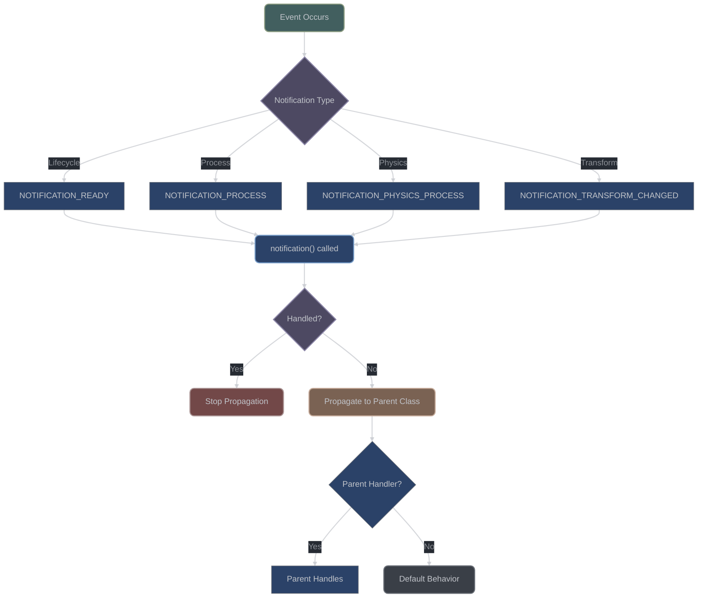

# Notification System

## Table of Contents

1. [Overview](#overview)
2. [Notification Architecture](#notification-architecture)
3. [Notification Types](#notification-types)
4. [Notification Propagation](#notification-propagation)
5. [Handling Notifications](#handling-notifications)
6. [Custom Notifications](#custom-notifications)
7. [Notification Ordering](#notification-ordering)
8. [Common Patterns](#common-patterns)
9. [Performance Considerations](#performance-considerations)

## Overview

**What are notifications?** Notifications are Godot's way of telling your objects when important things happen. Think of them as automatic messages sent by the engine - "you've been added to the scene tree," "it's time to process this frame," "your transform changed," etc. They're different from signals because they're sent automatically by the engine, not by your code.

**Why use notifications?** Notifications let you respond to engine events without having to constantly check for changes. Instead of asking "am I in the tree yet?" every frame, you simply wait for the `NOTIFICATION_ENTER_TREE` notification. This is more efficient and ensures you don't miss important state changes.

The notification system in Godot provides a unified way to inform objects about state changes, lifecycle events, and system events. Notifications can propagate through the scene tree hierarchy, be consumed by handlers, or pass through to parent classes. This system is fundamental to how nodes communicate state changes without tight coupling.

### Notification Flow



## Notification Architecture

**How notifications flow through objects:** When something important happens in the engine, it generates a notification with a specific ID number. This notification gets sent to the relevant object, which can choose to handle it in its `_notification()` method. If not handled, it can be passed up to the parent class, allowing for layered handling of events.

### Core Notification System

```cpp
// Base notification handling in Object
class Object {
public:
    // Public interface for sending notifications
    void notification(int p_notification, bool p_reversed = false) {
        if (!p_reversed) {
            // Normal order: derived -> base
            _notification(p_notification);
        } else {
            // Reversed order: base -> derived
            _notification_reversed(p_notification);
        }
    }

protected:
    // Virtual method for handling notifications
    virtual void _notification(int p_what) {
        // Base implementation handles common notifications
        switch (p_what) {
            case NOTIFICATION_POSTINITIALIZE:
                // Object fully constructed
                break;
            case NOTIFICATION_PREDELETE:
                // About to be deleted
                break;
        }
    }

private:
    void _notification_reversed(int p_what) {
        // Call parent first, then derived
        // Used for cleanup notifications
    }
};
```

### Notification Constants

```cpp
// Common notification constants (from object.h)
enum {
    // Object notifications
    NOTIFICATION_POSTINITIALIZE = 0,
    NOTIFICATION_PREDELETE = 1,

    // Node notifications
    NOTIFICATION_ENTER_TREE = 10,
    NOTIFICATION_EXIT_TREE = 11,
    NOTIFICATION_MOVED_IN_PARENT = 12,
    NOTIFICATION_READY = 13,
    NOTIFICATION_PAUSED = 14,
    NOTIFICATION_UNPAUSED = 15,
    NOTIFICATION_PHYSICS_PROCESS = 16,
    NOTIFICATION_PROCESS = 17,
    NOTIFICATION_PARENTED = 18,
    NOTIFICATION_UNPARENTED = 19,
    NOTIFICATION_SCENE_INSTANTIATED = 20,
    NOTIFICATION_DRAG_BEGIN = 21,
    NOTIFICATION_DRAG_END = 22,
    NOTIFICATION_PATH_RENAMED = 23,
    NOTIFICATION_CHILD_ORDER_CHANGED = 24,
    NOTIFICATION_INTERNAL_PROCESS = 25,
    NOTIFICATION_INTERNAL_PHYSICS_PROCESS = 26,
    NOTIFICATION_POST_ENTER_TREE = 27,
    NOTIFICATION_DISABLED = 28,
    NOTIFICATION_ENABLED = 29,

    // CanvasItem notifications
    NOTIFICATION_DRAW = 30,
    NOTIFICATION_VISIBILITY_CHANGED = 31,
    NOTIFICATION_ENTER_CANVAS = 32,
    NOTIFICATION_EXIT_CANVAS = 33,
    NOTIFICATION_LOCAL_TRANSFORM_CHANGED = 35,
    NOTIFICATION_WORLD_2D_CHANGED = 36,

    // Node3D notifications
    NOTIFICATION_TRANSFORM_CHANGED = 2000,
    NOTIFICATION_ENTER_WORLD = 41,
    NOTIFICATION_EXIT_WORLD = 42,
    NOTIFICATION_VISIBILITY_CHANGED_3D = 43,
    NOTIFICATION_LOCAL_TRANSFORM_CHANGED_3D = 44,

    // Control notifications
    NOTIFICATION_RESIZED = 40,
    NOTIFICATION_MOUSE_ENTER = 41,
    NOTIFICATION_MOUSE_EXIT = 42,
    NOTIFICATION_MOUSE_ENTER_SELF = 60,
    NOTIFICATION_MOUSE_EXIT_SELF = 61,
    NOTIFICATION_FOCUS_ENTER = 43,
    NOTIFICATION_FOCUS_EXIT = 44,
    NOTIFICATION_THEME_CHANGED = 45,
    NOTIFICATION_SCROLL_BEGIN = 47,
    NOTIFICATION_SCROLL_END = 48,
    NOTIFICATION_LAYOUT_DIRECTION_CHANGED = 49,

    // Window notifications
    NOTIFICATION_WM_MOUSE_ENTER = 1002,
    NOTIFICATION_WM_MOUSE_EXIT = 1003,
    NOTIFICATION_WM_WINDOW_FOCUS_IN = 1004,
    NOTIFICATION_WM_WINDOW_FOCUS_OUT = 1005,
    NOTIFICATION_WM_CLOSE_REQUEST = 1006,
    NOTIFICATION_WM_GO_BACK_REQUEST = 1007,
    NOTIFICATION_WM_SIZE_CHANGED = 1008,
    NOTIFICATION_WM_DPI_CHANGE = 1009,
    NOTIFICATION_WM_ABOUT = 1011,

    // Application notifications
    NOTIFICATION_OS_MEMORY_WARNING = 2009,
    NOTIFICATION_TRANSLATION_CHANGED = 2010,
    NOTIFICATION_WM_ABOUT = 2011,
    NOTIFICATION_CRASH = 2012,
    NOTIFICATION_OS_IME_UPDATE = 2013,
    NOTIFICATION_APPLICATION_RESUMED = 2014,
    NOTIFICATION_APPLICATION_PAUSED = 2015,
    NOTIFICATION_APPLICATION_FOCUS_IN = 2016,
    NOTIFICATION_APPLICATION_FOCUS_OUT = 2017,
    NOTIFICATION_TEXT_SERVER_CHANGED = 2018,

    // Editor notifications (editor builds only)
    NOTIFICATION_EDITOR_PRE_SAVE = 9001,
    NOTIFICATION_EDITOR_POST_SAVE = 9002,
};
```

## Notification Types

**Categories of notifications:** Godot sends many different types of notifications, organized into categories. Lifecycle notifications tell you about object creation and destruction. Process notifications happen every frame or physics step. Transform notifications tell you when objects move or change. Understanding these categories helps you know which notifications your objects should care about.

### Lifecycle Notifications

```cpp
class LifecycleNode : public Node {
    GDCLASS(LifecycleNode, Node)

protected:
    virtual void _notification(int p_what) {
        switch (p_what) {
            case NOTIFICATION_ENTER_TREE:
                // Node added to scene tree
                // Parent exists, children might not be ready
                print_line("Entered tree");
                setup_connections();
                break;

            case NOTIFICATION_READY:
                // Node and all children are in tree
                // Safe to access child nodes
                print_line("Node ready");
                initialize_gameplay();
                break;

            case NOTIFICATION_EXIT_TREE:
                // Node being removed from tree
                // Clean up connections
                print_line("Exiting tree");
                cleanup_connections();
                break;

            case NOTIFICATION_PREDELETE:
                // Object about to be destroyed
                // Final cleanup
                print_line("Pre-delete");
                release_resources();
                break;

            case NOTIFICATION_PARENTED:
                // Node got a new parent
                print_line("Parented to: " + get_parent()->get_name());
                break;

            case NOTIFICATION_UNPARENTED:
                // Node removed from parent
                print_line("Unparented");
                break;
        }
    }

private:
    void setup_connections() {
        // Connect to parent signals
        if (get_parent()) {
            get_parent()->connect("some_signal", Callable(this, "on_parent_signal"));
        }
    }

    void cleanup_connections() {
        // Disconnect from parent
        if (get_parent() && get_parent()->is_connected("some_signal", Callable(this, "on_parent_signal"))) {
            get_parent()->disconnect("some_signal", Callable(this, "on_parent_signal"));
        }
    }

    void initialize_gameplay() {
        // Initialize once everything is ready
    }

    void release_resources() {
        // Clean up resources
    }
};
```

### Process Notifications

```cpp
class ProcessNode : public Node {
    GDCLASS(ProcessNode, Node)

protected:
    virtual void _notification(int p_what) {
        switch (p_what) {
            case NOTIFICATION_PROCESS:
                // Called every frame if processing enabled
                // Alternative to _process()
                process_frame(get_process_delta_time());
                break;

            case NOTIFICATION_PHYSICS_PROCESS:
                // Called every physics frame
                // Alternative to _physics_process()
                physics_update(get_physics_process_delta_time());
                break;

            case NOTIFICATION_INTERNAL_PROCESS:
                // Internal processing (used by engine)
                internal_update();
                break;

            case NOTIFICATION_INTERNAL_PHYSICS_PROCESS:
                // Internal physics processing
                internal_physics();
                break;
        }
    }

private:
    void process_frame(double delta) {
        // Frame processing logic
    }

    void physics_update(double delta) {
        // Physics processing logic
    }

    void internal_update() {
        // Internal updates
    }

    void internal_physics() {
        // Internal physics
    }
};
```

### Transform Notifications

```cpp
class TransformNode : public Node3D {
    GDCLASS(TransformNode, Node3D)

private:
    Transform3D cached_transform;
    bool transform_dirty = false;

protected:
    virtual void _notification(int p_what) {
        switch (p_what) {
            case NOTIFICATION_TRANSFORM_CHANGED:
                // Global transform changed
                on_global_transform_changed();
                break;

            case NOTIFICATION_LOCAL_TRANSFORM_CHANGED:
                // Local transform changed
                on_local_transform_changed();
                break;

            case NOTIFICATION_ENTER_WORLD:
                // Entered 3D world
                register_with_physics();
                break;

            case NOTIFICATION_EXIT_WORLD:
                // Left 3D world
                unregister_from_physics();
                break;

            case NOTIFICATION_VISIBILITY_CHANGED:
                // Visibility state changed
                on_visibility_changed(is_visible());
                break;
        }
    }

private:
    void on_global_transform_changed() {
        Transform3D new_transform = get_global_transform();
        if (new_transform != cached_transform) {
            cached_transform = new_transform;
            transform_dirty = true;

            // Update dependent systems
            update_collision_shape();
            update_children_transforms();
        }
    }

    void on_local_transform_changed() {
        // Local transform modified
        mark_for_update();
    }

    void on_visibility_changed(bool visible) {
        if (visible) {
            enable_processing();
        } else {
            disable_processing();
        }
    }

    void register_with_physics() {
        // Register collision shapes
    }

    void unregister_from_physics() {
        // Remove from physics
    }

    void update_collision_shape() {
        // Update physics representation
    }

    void update_children_transforms() {
        // Propagate changes to children
    }

    void mark_for_update() {
        transform_dirty = true;
    }

    void enable_processing() {
        set_process(true);
        set_physics_process(true);
    }

    void disable_processing() {
        set_process(false);
        set_physics_process(false);
    }
};
```

## Notification Propagation

**How notifications move between objects:** Unlike signals that you explicitly connect, notifications follow built-in propagation rules. Some notifications (like `NOTIFICATION_READY`) go to children first, then parents. Others go to parents first. You can also stop propagation by handling a notification without calling the parent class, giving you fine control over event processing.

### Propagation Rules

```cpp
class PropagationExample : public Control {
    GDCLASS(PropagationExample, Control)

protected:
    virtual void _notification(int p_what) {
        // Check if we want to handle this notification
        bool handled = false;

        switch (p_what) {
            case NOTIFICATION_MOUSE_ENTER:
                // Handle mouse enter
                print_line("Mouse entered: " + get_name());
                on_mouse_entered();
                handled = true;  // We handled it
                break;

            case NOTIFICATION_THEME_CHANGED:
                // Handle theme change
                update_theme();
                // Don't set handled - let parent also update
                break;

            case NOTIFICATION_RESIZED:
                // Handle resize
                adjust_layout();
                // Continue propagation for parent layout
                break;
        }

        // Call parent implementation if not fully handled
        if (!handled) {
            Control::_notification(p_what);  // Explicit parent call
        }
    }

private:
    void on_mouse_entered() {
        // Handle mouse enter
        modulate = Color(1.2, 1.2, 1.2);  // Brighten
    }

    void update_theme() {
        // Update from theme
        // This might also trigger parent theme updates
    }

    void adjust_layout() {
        // Adjust our layout
        // Parent might also need to adjust
    }
};
```

### Controlling Propagation

```cpp
class NotificationControl : public Node {
    GDCLASS(NotificationControl, Node)

private:
    bool block_notifications = false;
    HashSet<int> consumed_notifications;

protected:
    virtual void _notification(int p_what) {
        // Option 1: Complete blocking
        if (block_notifications) {
            return;  // Don't process or propagate
        }

        // Option 2: Selective consumption
        if (consumed_notifications.has(p_what)) {
            handle_consumed_notification(p_what);
            return;  // Don't propagate to parent
        }

        // Option 3: Pre-process and propagate
        bool continue_propagation = true;

        switch (p_what) {
            case NOTIFICATION_READY:
                // Pre-process
                before_ready();

                // Call parent
                Node::_notification(p_what);

                // Post-process
                after_ready();

                continue_propagation = false;  // Already called parent
                break;

            case NOTIFICATION_PROCESS:
                // Conditionally propagate
                if (should_process()) {
                    Node::_notification(p_what);
                }
                continue_propagation = false;
                break;
        }

        // Default propagation
        if (continue_propagation) {
            Node::_notification(p_what);
        }
    }

public:
    void set_block_notifications(bool p_block) {
        block_notifications = p_block;
    }

    void consume_notification(int p_notification) {
        consumed_notifications.insert(p_notification);
    }

    void release_notification(int p_notification) {
        consumed_notifications.erase(p_notification);
    }

private:
    void handle_consumed_notification(int p_what) {
        // Handle without propagation
        print_line("Consumed notification: " + itos(p_what));
    }

    void before_ready() {
        // Pre-processing
    }

    void after_ready() {
        // Post-processing
    }

    bool should_process() {
        // Conditional logic
        return Engine::get_singleton()->get_frames_per_second() > 30;
    }
};
```

### Tree-Wide Notifications

```cpp
class TreeNotifications : public Node {
    GDCLASS(TreeNotifications, Node)

public:
    // Send notification to entire subtree
    void propagate_notification_to_children(int p_notification) {
        // Send to self
        notification(p_notification);

        // Send to all children recursively
        for (int i = 0; i < get_child_count(); i++) {
            Node *child = get_child(i);
            if (TreeNotifications *tn = Object::cast_to<TreeNotifications>(child)) {
                tn->propagate_notification_to_children(p_notification);
            } else {
                child->notification(p_notification);
            }
        }
    }

    // Send notification up the tree
    void propagate_notification_to_parents(int p_notification) {
        // Send to self
        notification(p_notification);

        // Send to parent
        if (Node *parent = get_parent()) {
            if (TreeNotifications *tn = Object::cast_to<TreeNotifications>(parent)) {
                tn->propagate_notification_to_parents(p_notification);
            } else {
                parent->notification(p_notification);
            }
        }
    }

    // Broadcast to siblings
    void broadcast_to_siblings(int p_notification) {
        if (Node *parent = get_parent()) {
            for (int i = 0; i < parent->get_child_count(); i++) {
                Node *sibling = parent->get_child(i);
                if (sibling != this) {
                    sibling->notification(p_notification);
                }
            }
        }
    }
};
```

## Handling Notifications

**Writing code that responds to notifications:** You handle notifications by overriding the `_notification(int what)` method in your C++ class. The `what` parameter tells you which notification was sent. Use a switch statement to handle different notification types, and remember to call the parent class for notifications you don't handle yourself.

### Best Practices

```cpp
class BestPracticesNode : public Node {
    GDCLASS(BestPracticesNode, Node)

protected:
    virtual void _notification(int p_what) {
        // 1. Use switch for multiple notifications
        switch (p_what) {
            case NOTIFICATION_READY:
                handle_ready();
                break;

            case NOTIFICATION_ENTER_TREE:
                handle_enter_tree();
                break;

            case NOTIFICATION_EXIT_TREE:
                handle_exit_tree();
                break;

            // 2. Group related notifications
            case NOTIFICATION_VISIBILITY_CHANGED:
            case NOTIFICATION_VISIBILITY_CHANGED_3D:
                handle_visibility_change();
                break;

            // 3. Always have default case
            default:
                // Call parent for unhandled notifications
                Node::_notification(p_what);
                break;
        }
    }

private:
    // 4. Separate handlers for clarity
    void handle_ready() {
        // Ready logic
        setup_node();
    }

    void handle_enter_tree() {
        // Enter tree logic
        connect_signals();
    }

    void handle_exit_tree() {
        // Exit tree logic
        disconnect_signals();
    }

    void handle_visibility_change() {
        // Visibility logic
        update_render_state();
    }

    // 5. Keep notification handlers lightweight
    void setup_node() {
        // Defer heavy initialization
        call_deferred("heavy_initialization");
    }

    void heavy_initialization() {
        // Heavy work here
    }

    void connect_signals() {
        // Connect to signals
    }

    void disconnect_signals() {
        // Disconnect from signals
    }

    void update_render_state() {
        // Update rendering
    }
};
```

### Notification vs Virtual Methods

```cpp
class NotificationVsVirtual : public Node {
    GDCLASS(NotificationVsVirtual, Node)

protected:
    // Option 1: Use virtual methods (preferred for common callbacks)
    virtual void _ready() override {
        print_line("_ready() virtual method");
        // Easier to override in derived classes
        // Better performance (direct call)
    }

    virtual void _process(double delta) override {
        print_line("_process() virtual method");
        // Clear intent
        // Type-safe parameters
    }

    // Option 2: Use notifications (for less common or system events)
    virtual void _notification(int p_what) {
        switch (p_what) {
            case NOTIFICATION_READY:
                // Alternative to _ready()
                // Use when you need more control over propagation
                print_line("NOTIFICATION_READY");
                break;

            case NOTIFICATION_PROCESS:
                // Alternative to _process()
                // Use when you need unified notification handling
                print_line("NOTIFICATION_PROCESS");
                break;

            case NOTIFICATION_WM_WINDOW_FOCUS_IN:
                // No virtual method equivalent
                // Must use notification
                print_line("Window focused");
                break;

            case NOTIFICATION_TRANSLATION_CHANGED:
                // System event - notification only
                update_translated_text();
                break;
        }
    }

private:
    void update_translated_text() {
        // Update UI text
    }
};
```

## Custom Notifications

**Creating your own notification types:** While most notifications come from the engine, you can define custom notification constants for your own events. This is useful for creating reusable components that need to communicate state changes. Custom notifications work just like built-in ones but use ID numbers starting from a safe range.

### Defining Custom Notifications

```cpp
class CustomNotificationNode : public Node {
    GDCLASS(CustomNotificationNode, Node)

public:
    // Define custom notification constants
    enum {
        // Start after Godot's notifications
        NOTIFICATION_CUSTOM_BASE = 10000,
        NOTIFICATION_CUSTOM_EVENT = NOTIFICATION_CUSTOM_BASE + 1,
        NOTIFICATION_DATA_CHANGED = NOTIFICATION_CUSTOM_BASE + 2,
        NOTIFICATION_STATE_TRANSITION = NOTIFICATION_CUSTOM_BASE + 3,
    };

protected:
    static void _bind_methods() {
        // Bind notification constants for GDScript
        BIND_CONSTANT(NOTIFICATION_CUSTOM_EVENT);
        BIND_CONSTANT(NOTIFICATION_DATA_CHANGED);
        BIND_CONSTANT(NOTIFICATION_STATE_TRANSITION);
    }

    virtual void _notification(int p_what) {
        switch (p_what) {
            case NOTIFICATION_CUSTOM_EVENT:
                handle_custom_event();
                break;

            case NOTIFICATION_DATA_CHANGED:
                handle_data_change();
                break;

            case NOTIFICATION_STATE_TRANSITION:
                handle_state_transition();
                break;

            default:
                Node::_notification(p_what);
                break;
        }
    }

public:
    // Public methods to trigger custom notifications
    void trigger_custom_event() {
        notification(NOTIFICATION_CUSTOM_EVENT);

        // Also notify children
        for (int i = 0; i < get_child_count(); i++) {
            get_child(i)->notification(NOTIFICATION_CUSTOM_EVENT);
        }
    }

    void notify_data_changed() {
        notification(NOTIFICATION_DATA_CHANGED);
    }

    void transition_state() {
        notification(NOTIFICATION_STATE_TRANSITION);
    }

private:
    void handle_custom_event() {
        print_line("Custom event received");
    }

    void handle_data_change() {
        print_line("Data changed");
        update_display();
    }

    void handle_state_transition() {
        print_line("State transitioned");
        update_state_machine();
    }

    void update_display() {
        // Update UI
    }

    void update_state_machine() {
        // Update state
    }
};
```

## Notification Ordering

**Understanding when notifications arrive:** The order of notifications is predictable and important. For example, `NOTIFICATION_ENTER_TREE` always comes before `NOTIFICATION_READY`, and `NOTIFICATION_READY` goes to children before parents. Understanding this order helps you write initialization code that runs at the right time.

### Execution Order

```cpp
class NotificationOrder : public Node {
    GDCLASS(NotificationOrder, Node)

protected:
    virtual void _notification(int p_what) {
        // Notification order for tree operations:
        // 1. NOTIFICATION_ENTER_TREE (parent before children)
        // 2. NOTIFICATION_READY (children before parent)
        // 3. NOTIFICATION_EXIT_TREE (children before parent)

        switch (p_what) {
            case NOTIFICATION_ENTER_TREE:
                print_line(get_name() + ": ENTER_TREE");
                // Parent processes before children
                break;

            case NOTIFICATION_READY:
                print_line(get_name() + ": READY");
                // Children process before parent
                // All children are ready here
                break;

            case NOTIFICATION_EXIT_TREE:
                print_line(get_name() + ": EXIT_TREE");
                // Children process before parent
                break;

            case NOTIFICATION_PREDELETE:
                print_line(get_name() + ": PREDELETE");
                // Called in deletion order
                break;
        }

        // Call parent
        Node::_notification(p_what);
    }

public:
    void demonstrate_order() {
        // Create tree structure
        Node *parent = memnew(NotificationOrder);
        parent->set_name("Parent");

        Node *child1 = memnew(NotificationOrder);
        child1->set_name("Child1");

        Node *child2 = memnew(NotificationOrder);
        child2->set_name("Child2");

        Node *grandchild = memnew(NotificationOrder);
        grandchild->set_name("Grandchild");

        // Build tree
        parent->add_child(child1);
        parent->add_child(child2);
        child1->add_child(grandchild);

        // Output order:
        // ENTER_TREE: Parent, Child1, Grandchild, Child2
        // READY: Grandchild, Child1, Child2, Parent

        // Cleanup
        parent->queue_free();

        // EXIT_TREE: Grandchild, Child1, Child2, Parent
        // PREDELETE: (deletion order)
    }
};
```

## Common Patterns

**Proven ways to use notifications:** Over time, certain patterns have emerged as effective ways to use the notification system. These include state machines that transition based on notifications, deferred processing systems, and component architectures that use notifications for loose coupling between systems.

### State Machine Notifications

```cpp
class StateMachineNode : public Node {
    GDCLASS(StateMachineNode, Node)

public:
    enum State {
        STATE_IDLE,
        STATE_ACTIVE,
        STATE_PAUSED,
        STATE_COMPLETE
    };

private:
    State current_state = STATE_IDLE;
    State previous_state = STATE_IDLE;

protected:
    static void _bind_methods() {
        BIND_ENUM_CONSTANT(STATE_IDLE);
        BIND_ENUM_CONSTANT(STATE_ACTIVE);
        BIND_ENUM_CONSTANT(STATE_PAUSED);
        BIND_ENUM_CONSTANT(STATE_COMPLETE);
    }

    virtual void _notification(int p_what) {
        switch (p_what) {
            case NOTIFICATION_READY:
                transition_to(STATE_IDLE);
                break;

            case NOTIFICATION_PROCESS:
                update_state(get_process_delta_time());
                break;

            case NOTIFICATION_PAUSED:
                if (current_state == STATE_ACTIVE) {
                    transition_to(STATE_PAUSED);
                }
                break;

            case NOTIFICATION_UNPAUSED:
                if (current_state == STATE_PAUSED) {
                    transition_to(STATE_ACTIVE);
                }
                break;
        }
    }

public:
    void transition_to(State p_state) {
        if (current_state == p_state) {
            return;
        }

        previous_state = current_state;
        current_state = p_state;

        // Send state change notification
        notification(NOTIFICATION_CUSTOM_BASE + current_state);

        // Handle state entry
        switch (current_state) {
            case STATE_IDLE:
                enter_idle();
                break;
            case STATE_ACTIVE:
                enter_active();
                break;
            case STATE_PAUSED:
                enter_paused();
                break;
            case STATE_COMPLETE:
                enter_complete();
                break;
        }
    }

private:
    void update_state(double delta) {
        switch (current_state) {
            case STATE_IDLE:
                update_idle(delta);
                break;
            case STATE_ACTIVE:
                update_active(delta);
                break;
            case STATE_PAUSED:
                // No update when paused
                break;
            case STATE_COMPLETE:
                // No update when complete
                break;
        }
    }

    void enter_idle() { set_process(false); }
    void enter_active() { set_process(true); }
    void enter_paused() { set_process(false); }
    void enter_complete() { set_process(false); }

    void update_idle(double delta) {}
    void update_active(double delta) {}
};
```

### Deferred Notifications

```cpp
class DeferredNotificationNode : public Node {
    GDCLASS(DeferredNotificationNode, Node)

private:
    Vector<int> pending_notifications;
    bool processing_deferred = false;

protected:
    virtual void _notification(int p_what) {
        switch (p_what) {
            case NOTIFICATION_PROCESS:
                process_deferred_notifications();
                break;

            default:
                // Handle or defer
                if (should_defer(p_what)) {
                    defer_notification(p_what);
                } else {
                    handle_notification(p_what);
                }
                break;
        }
    }

public:
    void defer_notification(int p_notification) {
        if (!pending_notifications.has(p_notification)) {
            pending_notifications.push_back(p_notification);
            set_process(true);  // Enable processing to handle deferred
        }
    }

private:
    bool should_defer(int p_what) {
        // Defer notifications during certain states
        return is_physics_processing() &&
               p_what != NOTIFICATION_PHYSICS_PROCESS;
    }

    void process_deferred_notifications() {
        if (processing_deferred || pending_notifications.is_empty()) {
            return;
        }

        processing_deferred = true;

        Vector<int> to_process = pending_notifications;
        pending_notifications.clear();

        for (int notification : to_process) {
            handle_notification(notification);
        }

        processing_deferred = false;

        if (pending_notifications.is_empty()) {
            set_process(false);  // Disable if no more deferred
        }
    }

    void handle_notification(int p_what) {
        // Actual notification handling
        print_line("Handling notification: " + itos(p_what));
    }
};
```

## Performance Considerations

**Keeping notification handling efficient:** Since notifications are sent frequently (especially process notifications), it's important to keep your notification handlers fast. Use early exits, cache expensive computations, and consider batching operations. Remember that slow notification handling can directly impact your game's frame rate.

### Optimizing Notification Handling

```cpp
class OptimizedNotificationNode : public Node {
    GDCLASS(OptimizedNotificationNode, Node)

private:
    // Cache frequently checked states
    bool is_in_tree = false;
    bool is_ready = false;
    bool is_processing = false;

    // Batch notification flags
    uint32_t notification_flags = 0;

protected:
    virtual void _notification(int p_what) {
        // Early exit for disabled notifications
        if (!should_process_notification(p_what)) {
            return;
        }

        // Use bit flags for batching
        switch (p_what) {
            case NOTIFICATION_ENTER_TREE:
                is_in_tree = true;
                notification_flags |= FLAG_ENTERED_TREE;
                break;

            case NOTIFICATION_READY:
                is_ready = true;
                notification_flags |= FLAG_READY;

                // Process batched operations
                if (notification_flags & FLAG_BATCH_MASK) {
                    process_batched_notifications();
                }
                break;

            case NOTIFICATION_PROCESS:
                // Skip expensive operations based on state
                if (is_processing && is_ready) {
                    lightweight_update();
                }
                break;

            case NOTIFICATION_EXIT_TREE:
                is_in_tree = false;
                is_ready = false;
                notification_flags = 0;
                break;
        }
    }

private:
    enum NotificationFlags {
        FLAG_ENTERED_TREE = 1 << 0,
        FLAG_READY = 1 << 1,
        FLAG_BATCH_MASK = FLAG_ENTERED_TREE | FLAG_READY
    };

    bool should_process_notification(int p_what) const {
        // Filter notifications based on state
        if (!is_in_tree &&
            (p_what == NOTIFICATION_PROCESS ||
             p_what == NOTIFICATION_PHYSICS_PROCESS)) {
            return false;
        }
        return true;
    }

    void process_batched_notifications() {
        // Process all flagged notifications at once
        notification_flags = 0;
    }

    void lightweight_update() {
        // Optimized update path
    }
};
```

### Notification Profiling

```cpp
class ProfiledNotificationNode : public Node {
    GDCLASS(ProfiledNotificationNode, Node)

private:
    HashMap<int, uint64_t> notification_times;
    HashMap<int, uint64_t> notification_counts;

protected:
    virtual void _notification(int p_what) {
        uint64_t start = OS::get_singleton()->get_ticks_usec();

        // Process notification
        handle_notification_internal(p_what);

        uint64_t elapsed = OS::get_singleton()->get_ticks_usec() - start;

        // Track metrics
        notification_times[p_what] += elapsed;
        notification_counts[p_what]++;

        // Report slow notifications
        if (elapsed > 1000) {  // Over 1ms
            print_verbose(vformat("Slow notification %d: %d us",
                                p_what, elapsed));
        }
    }

private:
    void handle_notification_internal(int p_what) {
        // Actual notification handling
        Node::_notification(p_what);
    }

public:
    void print_notification_stats() {
        print_line("Notification Statistics:");
        for (const KeyValue<int, uint64_t> &E : notification_counts) {
            int notification = E.key;
            uint64_t count = E.value;
            uint64_t total_time = notification_times[notification];
            uint64_t avg_time = count > 0 ? total_time / count : 0;

            print_line(vformat("  Notification %d: %d calls, avg %d us",
                             notification, count, avg_time));
        }
    }
};
```

## Conclusion

The notification system is a powerful mechanism for handling events and state changes in Godot. Understanding notification types, propagation rules, and consumption patterns enables you to build responsive and well-structured node hierarchies. Proper notification handling ensures your nodes react appropriately to engine events while maintaining performance through selective processing and optimized propagation control.
