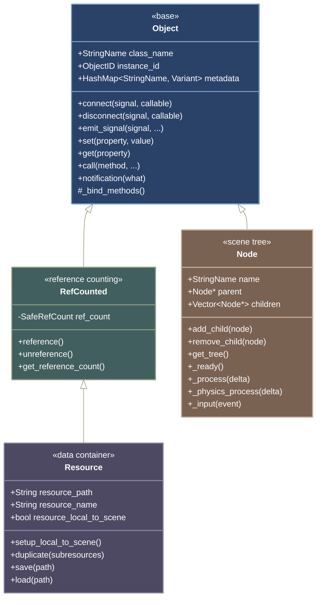

# Object, Resource, and Node Classes

## Overview

**What are Objects, Resources, and Nodes?** These are the three fundamental building blocks of Godot. Think of `Object` as the foundation that provides basic features every game object needs - like the ability to receive signals, store properties, and call methods. `Resource` extends Object for data that should be saved and loaded (like textures, sounds, or custom save files). `Node` extends Object for things that exist in your game world and participate in the game loop (like players, enemies, or UI elements).

**Why this hierarchy matters:** Understanding this hierarchy is crucial because it determines what your C++ classes can do. Inherit from Object for basic functionality, Resource for saveable data, or Node for game entities that need to process each frame.

The Godot object hierarchy forms the foundation of all engine functionality. Every class that can interact with the engine must inherit from `Object`, which provides essential services like reference counting, signal emission, property management, and method binding.

### Class Hierarchy



## godot::Object - The Foundation

**The base of everything:** Object is like the "DNA" that all Godot classes share. It provides the fundamental capabilities that make something recognizable to the Godot engine - the ability to have properties that show up in the inspector, emit and receive signals for communication, and be called from GDScript. When you inherit from Object, your C++ class becomes a "first-class citizen" in the Godot ecosystem.

### Core Functionality

`Object` is the base class for all Godot classes, providing fundamental services:

```cpp
// include/godot_cpp/classes/object.hpp
class Object {
private:
    // Internal state maintained by Object
    ObjectID _instance_id;           // Unique identifier
    GDExtensionObjectPtr _owner;      // Engine-side object pointer
    StringName _class_name;           // Runtime type information

    // Bookkeeping structures
    HashMap<StringName, Variant> metadata;  // User metadata
    List<Connection> signal_connections;    // Active signal connections
    HashMap<StringName, PropertyInfo> properties;  // Registered properties

public:
    // Core object interface
    void set(const StringName &p_name, const Variant &p_value);
    Variant get(const StringName &p_name) const;

    // Dynamic method invocation
    Variant call(const StringName &p_method, const Variant **p_args, int p_argcount);
    Variant callv(const StringName &p_method, const Array &p_args);

    // Signal system
    Error connect(const StringName &p_signal, const Callable &p_callable,
                  uint32_t p_flags = 0);
    void disconnect(const StringName &p_signal, const Callable &p_callable);
    void emit_signal(const StringName &p_signal, const Variant **p_args, int p_argcount);

    // Type system
    bool is_class(const StringName &p_class) const;
    StringName get_class() const;

    // Notification system
    void notification(int p_what, bool p_reversed = false);
    virtual void _notification(int p_what) {}
};
```

### Object Lifecycle in GDExtension

```cpp
class MyObject : public Object {
    GDCLASS(MyObject, Object)

protected:
    static void _bind_methods() {
        // Called once during class registration
        // Sets up all bindings for the class

        ClassDB::bind_method(D_METHOD("my_method"), &MyObject::my_method);

        ADD_SIGNAL(MethodInfo("my_signal",
            PropertyInfo(Variant::STRING, "message")));

        ADD_PROPERTY(PropertyInfo(Variant::INT, "my_property"),
            "set_my_property", "get_my_property");
    }

public:
    MyObject() {
        // Constructor - object not yet fully initialized
        // Don't access engine services here
    }

    void _init() {
        // Called after engine-side initialization
        // Safe to use engine services
    }

    virtual void _notification(int p_what) {
        switch (p_what) {
            case NOTIFICATION_POSTINITIALIZE:
                // Object fully constructed
                break;
            case NOTIFICATION_PREDELETE:
                // About to be deleted
                cleanup();
                break;
        }
    }

    ~MyObject() {
        // Destructor - object already disconnected from engine
    }
};
```

### Object State Management

Object maintains extensive state for engine integration:

```cpp
// State tracking example
class StatefulObject : public Object {
    GDCLASS(StatefulObject, Object)

private:
    // Object automatically tracks:
    // 1. All property values
    // 2. Signal connections
    // 3. Metadata entries
    // 4. Script instance (if any)
    // 5. Editor-specific data

protected:
    static void _bind_methods() {
        // Properties are automatically tracked
        ClassDB::bind_method(D_METHOD("set_health", "value"), &StatefulObject::set_health);
        ClassDB::bind_method(D_METHOD("get_health"), &StatefulObject::get_health);
        ADD_PROPERTY(PropertyInfo(Variant::INT, "health", PROPERTY_HINT_RANGE, "0,100"),
                     "set_health", "get_health");

        // Signals are registered in object state
        ADD_SIGNAL(MethodInfo("health_changed",
                             PropertyInfo(Variant::INT, "new_health")));

        // Groups for organizational purposes
        ADD_GROUP("Stats", "stat_");
        ADD_PROPERTY(PropertyInfo(Variant::INT, "stat_strength"),
                     "set_strength", "get_strength");
    }

    int health = 100;
    int strength = 10;

public:
    void set_health(int p_health) {
        if (health != p_health) {
            health = p_health;
            emit_signal("health_changed", health);

            // Property change notification for editor
            notify_property_list_changed();
        }
    }

    int get_health() const { return health; }
};
```

## godot::Resource - Data Management

**Data that persists:** Resources are for anything you want to save to disk and load later - think of them as "files" that Godot understands. This includes obvious things like images and sounds, but also custom data like player stats, level configurations, or game settings. Resources automatically handle reference counting (so they're only deleted when nothing is using them) and can be shared between different parts of your game.

### Resource Architecture

Resources are reference-counted data containers designed for sharing and saving:

```cpp
class MyResource : public Resource {
    GDCLASS(MyResource, Resource)

private:
    String data;
    Ref<Texture2D> texture;
    Array items;

protected:
    static void _bind_methods() {
        ClassDB::bind_method(D_METHOD("set_data", "data"), &MyResource::set_data);
        ClassDB::bind_method(D_METHOD("get_data"), &MyResource::get_data);
        ADD_PROPERTY(PropertyInfo(Variant::STRING, "data"), "set_data", "get_data");

        ClassDB::bind_method(D_METHOD("set_texture", "texture"), &MyResource::set_texture);
        ClassDB::bind_method(D_METHOD("get_texture"), &MyResource::get_texture);
        ADD_PROPERTY(PropertyInfo(Variant::OBJECT, "texture",
                                 PROPERTY_HINT_RESOURCE_TYPE, "Texture2D"),
                     "set_texture", "get_texture");
    }

public:
    // Resources are automatically serializable
    void set_data(const String &p_data) {
        data = p_data;
        emit_changed();  // Notify users of change
    }
    String get_data() const { return data; }

    void set_texture(const Ref<Texture2D> &p_texture) {
        texture = p_texture;
        emit_changed();
    }
    Ref<Texture2D> get_texture() const { return texture; }

    // Custom duplication logic
    virtual Ref<Resource> duplicate(bool p_subresources = false) const override {
        Ref<MyResource> copy;
        copy.instantiate();
        copy->data = data;

        if (p_subresources && texture.is_valid()) {
            copy->texture = texture->duplicate();
        } else {
            copy->texture = texture;
        }

        return copy;
    }
};
```

### Resource Usage Patterns

```cpp
// Creating and using resources
void ResourceExample::demonstrate_resources() {
    // Create new resource
    Ref<MyResource> res;
    res.instantiate();
    res->set_data("Hello");

    // Save to disk
    ResourceSaver::save(res, "res://my_resource.tres");

    // Load from disk
    Ref<MyResource> loaded = ResourceLoader::load("res://my_resource.tres");

    // Resources are shared by default
    node1->set_resource(loaded);
    node2->set_resource(loaded);  // Same instance

    // Make unique copy
    Ref<MyResource> unique_copy = loaded->duplicate(true);
    node3->set_resource(unique_copy);  // Different instance

    // Local to scene resources
    res->set_local_to_scene(true);  // Each scene gets its own copy
}
```

### Resource Loading and Caching

```cpp
class ResourceManager : public Object {
    GDCLASS(ResourceManager, Object)

private:
    HashMap<String, Ref<Resource>> cache;

public:
    Ref<Resource> load_cached(const String &p_path) {
        // Check cache first
        if (cache.has(p_path)) {
            return cache[p_path];
        }

        // Load and cache
        Ref<Resource> res = ResourceLoader::load(p_path);
        if (res.is_valid()) {
            cache[p_path] = res;

            // Connect to changed signal for cache invalidation
            res->connect("changed", Callable(this, "on_resource_changed").bind(p_path));
        }

        return res;
    }

    void on_resource_changed(const String &p_path) {
        print_line("Resource changed: " + p_path);
        // Could reload or notify dependents
    }
};
```

## godot::Node - Scene Tree Building Block

**Living game entities:** Nodes are the "actors" in your game - things that exist in the game world and do stuff each frame. Every Node exists in a tree structure (parent-child relationships) and can participate in the game loop by overriding methods like `_process()` and `_ready()`. When you want to create game objects that move, respond to input, or update over time, you inherit from Node or one of its specialized subclasses.

### Node Architecture

Nodes form the scene tree and provide the game loop integration:

```cpp
class MyNode : public Node {
    GDCLASS(MyNode, Node)

private:
    bool initialized = false;
    float time_accumulated = 0.0f;
    NodePath target_path;
    Node *cached_target = nullptr;

protected:
    static void _bind_methods() {
        // Bind lifecycle methods
        ClassDB::bind_method(D_METHOD("initialize"), &MyNode::initialize);

        // Properties with NodePath
        ClassDB::bind_method(D_METHOD("set_target_path", "path"), &MyNode::set_target_path);
        ClassDB::bind_method(D_METHOD("get_target_path"), &MyNode::get_target_path);
        ADD_PROPERTY(PropertyInfo(Variant::NODE_PATH, "target_path"),
                     "set_target_path", "get_target_path");

        // Custom signals
        ADD_SIGNAL(MethodInfo("target_reached"));
    }

public:
    virtual void _ready() override {
        // Node is in tree and ready
        initialize();

        // Resolve node paths
        if (!target_path.is_empty()) {
            cached_target = get_node<Node>(target_path);
        }

        // Configure processing
        set_process(true);
        set_physics_process(true);
        set_process_input(true);
    }

    virtual void _enter_tree() override {
        // Node added to tree but children might not be ready
        print_line("Entered tree: " + get_path());
    }

    virtual void _exit_tree() override {
        // Node removed from tree
        cached_target = nullptr;  // Clear cached references
    }

    virtual void _process(double delta) override {
        time_accumulated += delta;

        if (cached_target) {
            Vector3 target_pos = Object::cast_to<Node3D>(cached_target)->get_global_position();
            Vector3 my_pos = Object::cast_to<Node3D>(this)->get_global_position();

            if (my_pos.distance_to(target_pos) < 1.0) {
                emit_signal("target_reached");
            }
        }
    }
};
```

### Node Tree Operations

```cpp
class TreeOperations : public Node {
    GDCLASS(TreeOperations, Node)

public:
    void demonstrate_tree_ops() {
        // Creating nodes
        Node *child = memnew(Node);
        child->set_name("Child");
        add_child(child);

        // Node ownership (for scene saving)
        child->set_owner(this);

        // Finding nodes
        Node *found = get_node_or_null(NodePath("Child"));
        Node *recursive = find_child("**/DeepChild", true, false);

        // Getting typed nodes
        Node3D *spatial = get_node<Node3D>("Child");

        // Tree traversal
        TypedArray<Node> children = get_children();
        for (int i = 0; i < children.size(); i++) {
            Node *c = Object::cast_to<Node>(children[i]);
            print_line("Child: " + c->get_name());
        }

        // Scene tree access
        SceneTree *tree = get_tree();
        if (tree) {
            // Get nodes in group
            TypedArray<Node> enemies = tree->get_nodes_in_group("enemies");

            // Scene operations
            tree->change_scene_to_file("res://next_level.tscn");
        }

        // Deferred operations (safe during callbacks)
        child->queue_free();  // Delete at end of frame
        call_deferred("add_child", another_child);
    }
};
```

### Node Groups and Metadata

```cpp
class GroupedNode : public Node {
    GDCLASS(GroupedNode, Node)

public:
    virtual void _ready() override {
        // Add to groups for easy lookup
        add_to_group("enemies");
        add_to_group("damageable");

        // Store metadata
        set_meta("health", 100);
        set_meta("team", "red");

        // Check group membership
        if (is_in_group("enemies")) {
            get_tree()->call_group("players", "alert_enemy_spawned", this);
        }
    }

    void take_damage(int amount) {
        int health = get_meta("health", 100);
        health -= amount;
        set_meta("health", health);

        if (health <= 0) {
            remove_from_group("damageable");
            add_to_group("dead");
            queue_free();
        }
    }
};
```

## State Management and Bookkeeping

**How Godot tracks your objects:** Behind the scenes, Godot maintains extensive information about every object - what properties it has, what signals it can emit, which methods can be called, and how it relates to other objects. This "bookkeeping" is what makes features like the inspector, signal connections, and GDScript interaction work automatically.

### How Object Maintains State

The Object class maintains extensive internal state through several mechanisms:

```cpp
// Internal Object state management (conceptual)
class Object {
private:
    // 1. Property Storage
    struct PropertyStorage {
        HashMap<StringName, Variant> properties;
        HashMap<StringName, PropertyInfo> property_info;
        Vector<PropertyInfo> property_list_cache;
        bool property_list_changed = false;
    } property_data;

    // 2. Signal Connections
    struct SignalData {
        struct Connection {
            Callable callable;
            uint32_t flags;
            Vector<Variant> binds;
        };
        HashMap<StringName, List<Connection>> connections;
        HashMap<StringName, MethodInfo> signal_info;
    } signal_data;

    // 3. Metadata
    HashMap<StringName, Variant> metadata;

    // 4. Script Instance
    ScriptInstance *script_instance = nullptr;

    // 5. Message Queue
    MessageQueue *message_queue;  // For deferred calls

    // 6. Instance Binding
    void *instance_binding[MAX_LANGUAGE_BINDINGS];

public:
    // State is automatically managed during:
    void set(const StringName &p_property, const Variant &p_value) {
        // 1. Update property storage
        property_data.properties[p_property] = p_value;

        // 2. Call setter if exists
        if (has_method("set_" + p_property)) {
            call("set_" + p_property, p_value);
        }

        // 3. Emit property changed
        emit_signal(CoreStringNames::property_list_changed);

        // 4. Notify editor if applicable
        if (Engine::get_singleton()->is_editor_hint()) {
            EditorInterface::mark_property_dirty(this, p_property);
        }
    }
};
```

### Bookkeeping for Bindings

```cpp
class BindingBookkeeping : public Node {
    GDCLASS(BindingBookkeeping, Node)

protected:
    static void _bind_methods() {
        // Every bound method is tracked
        MethodInfo method_info;
        method_info.name = "process_data";
        method_info.return_val = PropertyInfo(Variant::BOOL, "success");
        method_info.arguments.push_back(PropertyInfo(Variant::DICTIONARY, "data"));

        ClassDB::bind_method(D_METHOD("process_data", "data"),
                            &BindingBookkeeping::process_data);

        // Method is now:
        // 1. Registered in ClassDB
        // 2. Available for call() and callv()
        // 3. Exposed to GDScript
        // 4. Visible in documentation
        // 5. Accessible via RPC if configured
    }

public:
    bool process_data(const Dictionary &data) {
        // This method can be called from:
        // - GDScript: node.process_data({"key": "value"})
        // - C++: call("process_data", data)
        // - Editor: Via inspector actions
        // - Network: If RPC configured
        return true;
    }
};
```

## Signal System

**Communication between objects:** Signals are Godot's way of letting objects talk to each other without tight coupling. Think of them like a radio broadcast - one object emits a signal ("the player died") and any number of other objects can listen for that signal and react accordingly (update the UI, play a sound, restart the level). This keeps your code modular and easy to maintain.

### Signal Implementation Details

```cpp
class SignalEmitter : public Node {
    GDCLASS(SignalEmitter, Node)

protected:
    static void _bind_methods() {
        // Define signal with parameters
        ADD_SIGNAL(MethodInfo("health_changed",
            PropertyInfo(Variant::INT, "old_health"),
            PropertyInfo(Variant::INT, "new_health")));

        // Signal with return value (for gathering results)
        MethodInfo damage_signal("damage_dealt");
        damage_signal.return_val = PropertyInfo(Variant::BOOL, "handled");
        damage_signal.arguments.push_back(PropertyInfo(Variant::INT, "amount"));
        ADD_SIGNAL(damage_signal);
    }

    int health = 100;

public:
    void take_damage(int amount) {
        int old_health = health;
        health = Math::max(0, health - amount);

        // Emit signal with arguments
        emit_signal("health_changed", old_health, health);

        // Emit and check if handled
        bool handled = emit_signal("damage_dealt", amount);
        if (!handled) {
            print_line("Damage not handled by any connection");
        }
    }

    void connect_signals() {
        // Connect with different flags
        connect("health_changed",
                Callable(this, "on_health_changed"),
                CONNECT_DEFERRED);  // Call at end of frame

        connect("damage_dealt",
                Callable(this, "on_damage").bind(true),  // Bind extra argument
                CONNECT_ONE_SHOT);  // Disconnect after first emission
    }

    void on_health_changed(int old_h, int new_h) {
        print_line(vformat("Health: %d -> %d", old_h, new_h));
    }
};
```

## Property System

**Making data visible and editable:** Properties are how you expose your C++ variables to the Godot editor and GDScript. When you properly register a property, it automatically appears in the inspector where designers can tweak values, can be modified from GDScript, and can be saved with scenes. The property system handles type conversion and validation automatically.

### Advanced Property Features

```cpp
class AdvancedProperties : public Resource {
    GDCLASS(AdvancedProperties, Resource)

private:
    int level = 1;
    float experience = 0.0f;
    String player_name = "Player";
    Ref<Resource> equipped_item;
    Array inventory;

protected:
    static void _bind_methods() {
        // Property with range hint
        ClassDB::bind_method(D_METHOD("set_level", "level"), &AdvancedProperties::set_level);
        ClassDB::bind_method(D_METHOD("get_level"), &AdvancedProperties::get_level);
        ADD_PROPERTY(PropertyInfo(Variant::INT, "level",
                                 PROPERTY_HINT_RANGE, "1,100,1"),
                     "set_level", "get_level");

        // Property with expression hint
        ADD_PROPERTY(PropertyInfo(Variant::FLOAT, "experience",
                                 PROPERTY_HINT_EXP_RANGE, "0,10000,0.1"),
                     "set_experience", "get_experience");

        // Property with placeholder
        ADD_PROPERTY(PropertyInfo(Variant::STRING, "player_name",
                                 PROPERTY_HINT_PLACEHOLDER_TEXT, "Enter name..."),
                     "set_player_name", "get_player_name");

        // Resource type property
        ADD_PROPERTY(PropertyInfo(Variant::OBJECT, "equipped_item",
                                 PROPERTY_HINT_RESOURCE_TYPE, "Item"),
                     "set_equipped_item", "get_equipped_item");

        // Array property
        ADD_PROPERTY(PropertyInfo(Variant::ARRAY, "inventory",
                                 PROPERTY_HINT_TYPE_STRING,
                                 String::num(Variant::OBJECT) + "/" +
                                 String::num(PROPERTY_HINT_RESOURCE_TYPE) + ":Item"),
                     "set_inventory", "get_inventory");
    }

public:
    // Property validation
    void set_level(int p_level) {
        level = CLAMP(p_level, 1, 100);
        notify_property_list_changed();
    }

    // Dynamic property list
    virtual void _get_property_list(List<PropertyInfo> *p_list) const override {
        // Add dynamic properties based on state
        if (level > 10) {
            p_list->push_back(PropertyInfo(Variant::BOOL, "prestige_available"));
        }

        // Add properties for each inventory item
        for (int i = 0; i < inventory.size(); i++) {
            p_list->push_back(PropertyInfo(Variant::OBJECT,
                                          "slot_" + itos(i),
                                          PROPERTY_HINT_RESOURCE_TYPE, "Item"));
        }
    }

    virtual bool _set(const StringName &p_name, const Variant &p_value) override {
        String name = p_name;
        if (name.begins_with("slot_")) {
            int index = name.get_slicec('_', 1).to_int();
            if (index >= 0 && index < inventory.size()) {
                inventory[index] = p_value;
                return true;
            }
        }
        return false;
    }

    virtual bool _get(const StringName &p_name, Variant &r_ret) const override {
        String name = p_name;
        if (name.begins_with("slot_")) {
            int index = name.get_slicec('_', 1).to_int();
            if (index >= 0 && index < inventory.size()) {
                r_ret = inventory[index];
                return true;
            }
        }
        return false;
    }
};
```

## Method Binding

**Making your C++ functions callable:** Method binding is how you expose your C++ functions to the rest of Godot. Once a method is bound, it can be called from GDScript, connected to signals, or invoked through the editor. The binding system handles converting between GDScript's dynamic types and your C++ parameter types automatically.

### How Bindings Work

Method binding creates the bridge between engine calls and C++ methods:

```cpp
// The binding process
class BindingExample : public Node {
    GDCLASS(BindingExample, Node)

protected:
    static void _bind_methods() {
        // 1. D_METHOD macro creates method info
        // D_METHOD("set_value", "value") expands to:
        // - Method name: "set_value"
        // - Parameter names: ["value"]
        // - Parameter count: 1

        // 2. ClassDB::bind_method creates binding
        MethodBind *bind = ClassDB::bind_method(
            D_METHOD("calculate", "a", "b"),
            &BindingExample::calculate
        );

        // 3. Binding stores:
        // - Function pointer
        // - Parameter types (deduced)
        // - Return type (deduced)
        // - Method flags

        // 4. Optional: Set default arguments
        bind->set_default_arguments({10, 20});

        // 5. Method is now callable from:
        // - GDScript
        // - call() / callv()
        // - Editor
        // - Network RPC
    }

public:
    int calculate(int a, int b) {
        return a + b;
    }

    // Vararg method binding
    static void _bind_methods_vararg() {
        MethodInfo mi;
        mi.name = "print_all";
        mi.arguments.push_back(PropertyInfo(Variant::NIL, "args"));
        mi.flags = METHOD_FLAG_VARARG;

        ClassDB::bind_vararg_method(
            METHOD_FLAGS_DEFAULT,
            "print_all",
            &BindingExample::print_all,
            mi
        );
    }

    Variant print_all(const Variant **p_args, int p_argcount,
                     Callable::CallError &r_error) {
        for (int i = 0; i < p_argcount; i++) {
            print_line(p_args[i]->stringify());
        }
        return Variant();
    }
};
```

## Memory Management Patterns

**Avoiding crashes and leaks:** Godot uses different memory management strategies for different types of objects. Resources use reference counting (automatically deleted when no longer used), while Nodes use manual management through the scene tree (deleted when removed from the tree). Understanding these patterns helps you avoid memory leaks and crashes.

### Reference Counting Best Practices

```cpp
class MemoryPatterns : public Node {
    GDCLASS(MemoryPatterns, Node)

private:
    // Use Ref<T> for RefCounted objects
    Ref<Resource> resource;
    Ref<Texture2D> texture;

    // Use raw pointers for Nodes (not ref-counted)
    Node *child_node = nullptr;
    Control *ui_element = nullptr;

    // Cache frequently accessed nodes
    HashMap<StringName, Node*> node_cache;

public:
    virtual void _ready() override {
        // Create ref-counted objects
        resource = Ref<Resource>(memnew(Resource));

        // Create nodes (not ref-counted)
        child_node = memnew(Node);
        add_child(child_node);
        child_node->set_owner(get_owner());

        // Load resources (automatically ref-counted)
        texture = ResourceLoader::load("res://icon.png");
    }

    virtual void _exit_tree() override {
        // Clear node references (don't delete - tree handles it)
        child_node = nullptr;
        ui_element = nullptr;
        node_cache.clear();

        // Ref<T> automatically decrements on destruction
        // No manual cleanup needed for resource/texture
    }

    void safe_node_access() {
        // Always check node validity
        if (child_node && is_instance_valid(child_node)) {
            child_node->set_name("Valid");
        }

        // Use ObjectID for long-term references
        ObjectID child_id = child_node->get_instance_id();

        // Later...
        Object *obj = ObjectDB::get_instance(child_id);
        Node *node = Object::cast_to<Node>(obj);
        if (node) {
            // Safe to use
        }
    }
};
```

## Common Usage Patterns

**Proven approaches for common needs:** Over time, certain patterns have emerged as effective ways to structure Godot applications. These include factory patterns for creating objects, component patterns for modular functionality, and singleton patterns for global game state. These patterns help you organize your code in ways that work well with Godot's architecture.

### Factory Pattern

```cpp
class NodeFactory : public Object {
    GDCLASS(NodeFactory, Object)

protected:
    static void _bind_methods() {
        ClassDB::bind_method(D_METHOD("create_enemy", "type"),
                           &NodeFactory::create_enemy);
    }

public:
    Node *create_enemy(const String &type) {
        Node *enemy = nullptr;

        if (type == "zombie") {
            enemy = memnew(Zombie);
        } else if (type == "skeleton") {
            enemy = memnew(Skeleton);
        } else {
            enemy = memnew(Enemy);
        }

        // Configure common properties
        enemy->set_name(type.capitalize());
        enemy->add_to_group("enemies");
        enemy->set_meta("type", type);

        return enemy;
    }
};
```

### Component Pattern

```cpp
// Component base class
class Component : public Node {
    GDCLASS(Component, Node)

protected:
    Node *owner_node = nullptr;

public:
    virtual void _enter_tree() override {
        owner_node = get_parent();
    }

    virtual void setup(Node *p_owner) {
        owner_node = p_owner;
    }
};

// Health component
class HealthComponent : public Component {
    GDCLASS(HealthComponent, Component)

private:
    int max_health = 100;
    int current_health = 100;

protected:
    static void _bind_methods() {
        ADD_SIGNAL(MethodInfo("died"));
        ADD_SIGNAL(MethodInfo("health_changed",
                             PropertyInfo(Variant::INT, "health")));
    }

public:
    void damage(int amount) {
        current_health = Math::max(0, current_health - amount);
        emit_signal("health_changed", current_health);

        if (current_health == 0) {
            emit_signal("died");
        }
    }
};

// Entity using components
class Entity : public Node {
    GDCLASS(Entity, Node)

private:
    HealthComponent *health = nullptr;

public:
    virtual void _ready() override {
        // Add component
        health = memnew(HealthComponent);
        add_child(health);
        health->setup(this);

        // Connect to component signals
        health->connect("died", Callable(this, "on_death"));
    }

    void on_death() {
        queue_free();
    }
};
```

### Singleton Pattern

```cpp
// Singleton accessible from GDScript
class GameManager : public Node {
    GDCLASS(GameManager, Node)

private:
    static GameManager *singleton;
    int score = 0;
    int high_score = 0;

protected:
    static void _bind_methods() {
        ClassDB::bind_method(D_METHOD("get_score"), &GameManager::get_score);
        ClassDB::bind_method(D_METHOD("add_score", "points"), &GameManager::add_score);
        ClassDB::bind_method(D_METHOD("get_high_score"), &GameManager::get_high_score);
    }

public:
    static GameManager *get_singleton() { return singleton; }

    GameManager() {
        ERR_FAIL_COND(singleton != nullptr);
        singleton = this;
    }

    ~GameManager() {
        ERR_FAIL_COND(singleton != this);
        singleton = nullptr;
    }

    void add_score(int points) {
        score += points;
        if (score > high_score) {
            high_score = score;
        }
    }

    int get_score() const { return score; }
    int get_high_score() const { return high_score; }
};

GameManager *GameManager::singleton = nullptr;

// Register as singleton
void register_game_types() {
    ClassDB::register_class<GameManager>();

    Engine::get_singleton()->add_singleton(
        Engine::Singleton("GameManager", GameManager::get_singleton())
    );
}
```

## Conclusion

The Object, Resource, and Node classes form the foundational trinity of Godot's architecture. Object provides the core infrastructure for property management, signals, and method binding. Resource adds reference counting and serialization for data management. Node brings scene tree integration and game loop participation. Understanding their roles, state management, and interaction patterns is essential for effective GDExtension development. The extensive bookkeeping and binding systems enable seamless integration between C++ code and the Godot engine, providing a powerful and flexible development environment.
