# Engine Singleton Interactions

## Overview

**What are singletons?** Singletons are Godot's "global services" - single instances of important engine systems that you can access from anywhere in your code. Think of them like public utilities: there's one Input system that handles all input, one RenderingServer that manages all graphics, one AudioServer for all sound, etc.

**Why use singletons?** Singletons give you direct access to engine functionality that would otherwise be hidden. Want to check if a key is pressed? Ask the Input singleton. Need to create custom graphics? Talk to the RenderingServer. Want to load a resource? Use ResourceLoader. They're your gateway to engine power.

Godot's singleton system provides global access to engine subsystems. These singletons manage core functionality like rendering, physics, audio, input, and resource loading. GDExtension code interacts with these singletons through their respective APIs to leverage engine capabilities.

### Singleton Access Pattern

```cpp
// Standard singleton access pattern in GDExtension
#include <godot_cpp/classes/engine.hpp>
#include <godot_cpp/classes/input.hpp>
#include <godot_cpp/classes/os.hpp>
#include <godot_cpp/classes/rendering_server.hpp>

void example_singleton_access() {
    // Direct singleton access
    Engine *engine = Engine::get_singleton();
    Input *input = Input::get_singleton();
    OS *os = OS::get_singleton();
    RenderingServer *rs = RenderingServer::get_singleton();

    // All singletons are guaranteed to exist during runtime
    // No need for null checks in normal operation
}
```

## Singleton Architecture

**How singletons work:** Each singleton is a single instance of a class that's created when Godot starts and exists for the entire runtime. You access them through static `get_singleton()` methods that return pointers to these global instances. Since there's only ever one instance of each singleton, they maintain consistent state across your entire game.

### How Singletons Work

```mermaid
---
config:
    theme: 'base'
    curve: 'straight'
    themeVariables:
        darkMode: true
        clusterBkg: '#22272f62'
        clusterBorder: '#6a6f77ff'
        clusterTextColor: '#6a6f77ff'
        lineColor: '#C1C4CAAA'
        background: '#262B33'
        primaryColor: '#2b4268ff'
        primaryTextColor: '#C1C4CAff'
        primaryBorderColor: '#6a6f77ff'
        primaryLabelBkg: '#262B33'
        secondaryColor: '#425f5fff'
        secondaryBorderColor: '#8c9c81ff'
        secondaryTextColor: '#C1C4CAff'
        tertiaryColor: '#4d4962ff'
        tertiaryBorderColor: '#8983a5ff'
        tertiaryTextColor: '#eeeeee55'
        nodeTextColor: '#C1C4CA'
        defaultLinkColor: '#C1C4CA'
        edgeLabelBackground: '#262B33'
        edgeLabelBorderColor: '#C1C4CA'
        labelTextColor: '#C1C4CA'
        errorBkgColor: '#724848ff'
        errorTextColor: '#C1C4CA'
        flowchart:
            curve: 'basis'
            nodeSpacing: 50
            rankSpacing: 50
            subGraphTitleMargin:
                top: 15
                bottom: 15
                left: 15
                right: 15
---
flowchart LR
    subgraph ENGINE["Godot Engine Core"]
        A[Engine Initialization] --> B[Create Singletons]
        B --> C[Register with ClassDB]
        C --> D[Available Globally]
    end

    subgraph GDEXT["GDExtension"]
        E["get_singleton()"] --> F[Cached Pointer]
        F --> G[Direct API Calls]
    end

    D --> E

    linkStyle default stroke:#C1C4CAaa,stroke-width:2px,color:#C1C4CA

    style A fill:#425f5fff,stroke:#8c9c81ff,stroke-width:2px,color:#C1C4CA,rx:8,ry:8
    style B fill:#2b4268ff,stroke:#779DC9ff,stroke-width:2px,color:#C1C4CA,rx:8,ry:8
    style C fill:#7a6253ff,stroke:#c7ac9bff,stroke-width:2px,color:#C1C4CA,rx:8,ry:8
    style D fill:#4d4962ff,stroke:#8983a5ff,stroke-width:2px,color:#C1C4CA,rx:8,ry:8
    style E fill:#2b4268ff,stroke:#779DC9ff,stroke-width:2px,color:#C1C4CA,rx:8,ry:8
    style F fill:#3a3f47ff,stroke:#6a6f77ff,stroke-width:2px,color:#C1C4CA,rx:8,ry:8
    style G fill:#425f5fff,stroke:#8c9c81ff,stroke-width:2px,color:#C1C4CA,rx:8,ry:8
```



### Singleton Implementation Pattern

```cpp
// How singletons are implemented (conceptual)
class EngineSingleton : public Object {
    static EngineSingleton *singleton;

protected:
    EngineSingleton() {
        singleton = this;
    }

public:
    static EngineSingleton *get_singleton() {
        return singleton;
    }

    ~EngineSingleton() {
        singleton = nullptr;
    }
};
```

## Core Singletons

**Essential engine services:** Core singletons provide fundamental engine information and control. The Engine singleton tells you about Godot's version and performance. The OS singleton gives you access to the operating system - file paths, environment variables, system info. The Time singleton provides precise time and date functionality.

### Engine Singleton

The Engine singleton provides core engine information and control:

```cpp
#include <godot_cpp/classes/engine.hpp>

class EngineInteraction : public Node {
    GDCLASS(EngineInteraction, Node)

public:
    void demonstrate_engine_singleton() {
        Engine *engine = Engine::get_singleton();

        // Version information
        Dictionary version = engine->get_version_info();
        String version_string = version["string"];
        int major = version["major"];
        int minor = version["minor"];
        int patch = version["patch"];
        print_line("Engine version: " + version_string);

        // Frame information
        int physics_fps = engine->get_physics_ticks_per_second();
        int max_fps = engine->get_max_fps();
        double physics_jitter = engine->get_physics_jitter_fix();
        print_line(vformat("Physics: %d Hz, Max FPS: %d", physics_fps, max_fps));

        // Performance metrics
        uint64_t physics_frames = engine->get_physics_frames();
        uint64_t process_frames = engine->get_process_frames();
        double time_scale = engine->get_time_scale();

        // Editor detection
        bool is_editor = engine->is_editor_hint();
        if (is_editor) {
            print_line("Running in editor");
        }

        // Time scale manipulation (slow motion/fast forward)
        engine->set_time_scale(0.5);  // Half speed

        // Physics interpolation
        engine->set_physics_jitter_fix(0.0);  // Disable jitter fix

        // Custom main loop (advanced)
        // engine->set_main_loop(custom_main_loop);
    }

    void check_features() {
        Engine *engine = Engine::get_singleton();

        // Check for debug build
        if (engine->is_in_physics_frame()) {
            print_line("Currently in physics frame");
        }

        // Get singleton list
        TypedArray<Dictionary> singletons = engine->get_singleton_list();
        for (int i = 0; i < singletons.size(); i++) {
            Dictionary singleton_info = singletons[i];
            print_line("Singleton: " + String(singleton_info["name"]));
        }

        // Register custom singleton
        Engine::Singleton my_singleton("MySingleton", get_singleton_instance());
        engine->register_singleton(my_singleton);
    }

private:
    Object *get_singleton_instance() {
        // Return your singleton instance
        return memnew(Object);
    }
};
```

### OS Singleton

Operating system functionality and platform information:

```cpp
#include <godot_cpp/classes/os.hpp>

class OSInteraction : public Node {
    GDCLASS(OSInteraction, Node)

public:
    void demonstrate_os_singleton() {
        OS *os = OS::get_singleton();

        // System information
        String os_name = os->get_name();  // "Windows", "Linux", "macOS", etc.
        String model_name = os->get_model_name();
        int processor_count = os->get_processor_count();
        String processor_name = os->get_processor_name();

        print_line(vformat("OS: %s, CPUs: %d", os_name, processor_count));

        // Memory information
        uint64_t static_memory = os->get_static_memory_usage();
        uint64_t static_memory_peak = os->get_static_memory_peak_usage();

        // Time and date
        Dictionary datetime = os->get_datetime();
        int year = datetime["year"];
        int month = datetime["month"];
        int day = datetime["day"];
        int hour = datetime["hour"];
        int minute = datetime["minute"];
        int second = datetime["second"];

        uint64_t unix_time = os->get_unix_time();
        uint64_t ticks_msec = os->get_ticks_msec();
        uint64_t ticks_usec = os->get_ticks_usec();

        // Environment variables
        String home = os->get_environment("HOME");
        os->set_environment("MY_VAR", "my_value");

        // System directories
        String user_data = os->get_user_data_dir();
        String config = os->get_config_dir();
        String cache = os->get_cache_dir();
        String data = os->get_data_dir();

        // Executable information
        String exe_path = os->get_executable_path();
        PackedStringArray cmd_args = os->get_cmdline_args();

        // Process management
        int pid = os->get_process_id();
        os->create_process("/usr/bin/ls", {"-la"});
        os->kill(pid);  // Kill process by PID

        // System features
        bool has_feature = os->has_feature("mobile");

        // Clipboard
        os->set_clipboard("Hello from GDExtension");
        String clipboard = os->get_clipboard();

        // Shell operations
        os->shell_open("https://godotengine.org");  // Open URL
        os->shell_open("file:///home/user/file.txt");  // Open file

        // Threading
        int thread_id = os->get_thread_caller_id();
        int main_thread_id = os->get_main_thread_id();

        // Alerts (blocking)
        // os->alert("Message", "Title");
    }

    void benchmark_example() {
        OS *os = OS::get_singleton();

        uint64_t start = os->get_ticks_usec();

        // Perform operation
        complex_operation();

        uint64_t elapsed = os->get_ticks_usec() - start;
        print_line(vformat("Operation took: %d microseconds", elapsed));
    }

private:
    void complex_operation() {
        // Some complex work
    }
};
```

### Time Singleton

High-precision time operations:

```cpp
#include <godot_cpp/classes/time.hpp>

class TimeInteraction : public Node {
    GDCLASS(TimeInteraction, Node)

public:
    void demonstrate_time_singleton() {
        Time *time = Time::get_singleton();

        // Current time
        Dictionary datetime = time->get_datetime_dict_from_system();
        String datetime_string = time->get_datetime_string_from_system();

        // Unix timestamp
        int64_t unix_timestamp = time->get_unix_time_from_system();

        // Time zone information
        Dictionary timezone = time->get_time_zone_from_system();
        int bias = timezone["bias"];  // Minutes from UTC
        String tz_name = timezone["name"];

        // Formatting
        String formatted = time->get_datetime_string_from_datetime_dict(datetime, false);

        // Parsing
        Dictionary parsed = time->get_datetime_dict_from_datetime_string("2024-01-15 14:30:00");

        // High precision timing
        int64_t ticks = time->get_ticks_msec();
        int64_t ticks_us = time->get_ticks_usec();

        print_line("Current time: " + datetime_string);
        print_line(vformat("Unix time: %d", unix_timestamp));
    }
};
```

## Rendering Singletons

**Direct control over graphics:** Rendering singletons let you bypass Godot's node system and directly control graphics hardware. RenderingServer gives you low-level access to create meshes, textures, and shaders programmatically. DisplayServer handles windows, screens, and display hardware. These are powerful but complex - most games use the higher-level node system instead.

### RenderingServer

Direct access to the rendering pipeline:

```cpp
#include <godot_cpp/classes/rendering_server.hpp>
#include <godot_cpp/classes/rendering_device.hpp>

class RenderingInteraction : public Node {
    GDCLASS(RenderingInteraction, Node)

private:
    RID viewport_rid;
    RID camera_rid;
    RID scenario_rid;
    RID instance_rid;
    RID mesh_rid;

public:
    void demonstrate_rendering_server() {
        RenderingServer *rs = RenderingServer::get_singleton();

        // Create viewport
        viewport_rid = rs->viewport_create();
        rs->viewport_set_size(viewport_rid, 1920, 1080);
        rs->viewport_set_active(viewport_rid, true);

        // Create scenario (3D world)
        scenario_rid = rs->scenario_create();
        rs->viewport_set_scenario(viewport_rid, scenario_rid);

        // Create camera
        camera_rid = rs->camera_create();
        rs->camera_set_perspective(camera_rid, 60.0, 0.1, 1000.0);
        rs->camera_set_transform(camera_rid,
            Transform3D(Basis(), Vector3(0, 5, 10)));
        rs->viewport_attach_camera(viewport_rid, camera_rid);

        // Create mesh
        create_custom_mesh();

        // Create instance
        instance_rid = rs->instance_create();
        rs->instance_set_base(instance_rid, mesh_rid);
        rs->instance_set_scenario(instance_rid, scenario_rid);
        rs->instance_set_transform(instance_rid, Transform3D());

        // Global rendering settings
        rs->set_default_clear_color(Color(0.1, 0.1, 0.2));

        // Performance settings
        rs->viewport_set_msaa_3d(viewport_rid,
            RenderingServer::VIEWPORT_MSAA_4X);
        rs->viewport_set_screen_space_aa(viewport_rid,
            RenderingServer::VIEWPORT_SCREEN_SPACE_AA_FXAA);

        // Debug visualization
        rs->viewport_set_debug_draw(viewport_rid,
            RenderingServer::VIEWPORT_DEBUG_DRAW_WIREFRAME);
    }

    void create_custom_mesh() {
        RenderingServer *rs = RenderingServer::get_singleton();

        // Create mesh
        mesh_rid = rs->mesh_create();

        // Define vertices
        PackedVector3Array vertices;
        vertices.push_back(Vector3(-1, 0, -1));
        vertices.push_back(Vector3(1, 0, -1));
        vertices.push_back(Vector3(1, 0, 1));
        vertices.push_back(Vector3(-1, 0, 1));

        // Define normals
        PackedVector3Array normals;
        for (int i = 0; i < 4; i++) {
            normals.push_back(Vector3(0, 1, 0));
        }

        // Define UVs
        PackedVector2Array uvs;
        uvs.push_back(Vector2(0, 0));
        uvs.push_back(Vector2(1, 0));
        uvs.push_back(Vector2(1, 1));
        uvs.push_back(Vector2(0, 1));

        // Define indices
        PackedInt32Array indices;
        indices.append_array({0, 1, 2, 0, 2, 3});

        // Create surface
        Array surface_array;
        surface_array.resize(RenderingServer::ARRAY_MAX);
        surface_array[RenderingServer::ARRAY_VERTEX] = vertices;
        surface_array[RenderingServer::ARRAY_NORMAL] = normals;
        surface_array[RenderingServer::ARRAY_TEX_UV] = uvs;
        surface_array[RenderingServer::ARRAY_INDEX] = indices;

        rs->mesh_add_surface_from_arrays(mesh_rid,
            RenderingServer::PRIMITIVE_TRIANGLES,
            surface_array);
    }

    void cleanup() {
        RenderingServer *rs = RenderingServer::get_singleton();

        // Free resources
        if (instance_rid.is_valid()) rs->free_rid(instance_rid);
        if (mesh_rid.is_valid()) rs->free_rid(mesh_rid);
        if (camera_rid.is_valid()) rs->free_rid(camera_rid);
        if (scenario_rid.is_valid()) rs->free_rid(scenario_rid);
        if (viewport_rid.is_valid()) rs->free_rid(viewport_rid);
    }
};
```

### DisplayServer

Window and display management:

```cpp
#include <godot_cpp/classes/display_server.hpp>

class DisplayInteraction : public Node {
    GDCLASS(DisplayInteraction, Node)

public:
    void demonstrate_display_server() {
        DisplayServer *ds = DisplayServer::get_singleton();

        // Screen information
        int screen_count = ds->get_screen_count();
        int primary_screen = ds->get_primary_screen();

        for (int i = 0; i < screen_count; i++) {
            Vector2i screen_pos = ds->screen_get_position(i);
            Vector2i screen_size = ds->screen_get_size(i);
            int dpi = ds->screen_get_dpi(i);
            float scale = ds->screen_get_scale(i);
            float refresh_rate = ds->screen_get_refresh_rate(i);

            print_line(vformat("Screen %d: %dx%d at %d,%d, %d DPI, %.1f Hz",
                i, screen_size.x, screen_size.y,
                screen_pos.x, screen_pos.y, dpi, refresh_rate));
        }

        // Window management
        int main_window = DisplayServer::MAIN_WINDOW_ID;

        // Window properties
        ds->window_set_title("GDExtension Window", main_window);
        ds->window_set_size(Vector2i(1280, 720), main_window);
        ds->window_set_position(Vector2i(100, 100), main_window);

        // Window modes
        ds->window_set_mode(DisplayServer::WINDOW_MODE_WINDOWED, main_window);
        // ds->window_set_mode(DisplayServer::WINDOW_MODE_FULLSCREEN, main_window);
        // ds->window_set_mode(DisplayServer::WINDOW_MODE_EXCLUSIVE_FULLSCREEN, main_window);

        // Window flags
        ds->window_set_flag(DisplayServer::WINDOW_FLAG_ALWAYS_ON_TOP, true, main_window);
        ds->window_set_flag(DisplayServer::WINDOW_FLAG_BORDERLESS, false, main_window);
        ds->window_set_flag(DisplayServer::WINDOW_FLAG_RESIZE_DISABLED, false, main_window);

        // Cursor
        ds->cursor_set_shape(DisplayServer::CURSOR_ARROW);
        ds->cursor_set_custom_image(Ref<Resource>(), Vector2());

        // Clipboard with MIME types
        ds->clipboard_set("text/plain", "Hello from GDExtension");
        String clipboard_text = ds->clipboard_get();

        // IME (Input Method Editor)
        ds->window_set_ime_active(true, main_window);
        ds->window_set_ime_position(Vector2i(100, 100), main_window);

        // Native dialogs
        // ds->dialog_show("Title", "Description", {"OK", "Cancel"}, callback);

        // Screen orientation (mobile)
        ds->screen_set_orientation(DisplayServer::SCREEN_LANDSCAPE);

        // Virtual keyboard (mobile)
        // ds->virtual_keyboard_show("", Rect2(), 0, -1, -1);
        // ds->virtual_keyboard_hide();
    }

    void handle_window_events() {
        DisplayServer *ds = DisplayServer::get_singleton();

        // Check window focus
        bool has_focus = ds->window_is_focused();

        // Get mouse position
        Vector2i mouse_pos = ds->mouse_get_position();

        // Warp mouse
        ds->warp_mouse(Vector2i(640, 360));

        // Get window under mouse
        int window_id = ds->get_window_at_screen_position(mouse_pos);

        print_line(vformat("Mouse at: %d,%d, Window focused: %s",
            mouse_pos.x, mouse_pos.y, has_focus ? "true" : "false"));
    }
};
```

## Physics Singletons

**Low-level physics control:** Physics singletons (PhysicsServer3D and PhysicsServer2D) provide direct access to the physics simulation. You can create collision shapes, rigid bodies, and physics spaces programmatically. Like rendering singletons, these are typically used for specialized cases where the standard physics nodes aren't sufficient.

### PhysicsServer3D and PhysicsServer2D

Direct physics simulation control:

```cpp
#include <godot_cpp/classes/physics_server3d.hpp>
#include <godot_cpp/classes/physics_server2d.hpp>

class PhysicsInteraction : public Node {
    GDCLASS(PhysicsInteraction, Node)

private:
    RID space_rid;
    RID body_rid;
    RID shape_rid;

public:
    void demonstrate_physics_3d() {
        PhysicsServer3D *ps = PhysicsServer3D::get_singleton();

        // Create physics space
        space_rid = ps->space_create();
        ps->space_set_active(space_rid, true);

        // Set space parameters
        ps->space_set_param(space_rid,
            PhysicsServer3D::SPACE_PARAM_GRAVITY, 9.8);
        ps->space_set_param(space_rid,
            PhysicsServer3D::SPACE_PARAM_GRAVITY_VECTOR, Vector3(0, -1, 0));

        // Create collision shape
        shape_rid = ps->sphere_shape_create();
        ps->shape_set_data(shape_rid, 0.5);  // Radius

        // Create rigid body
        body_rid = ps->body_create();
        ps->body_set_mode(body_rid, PhysicsServer3D::BODY_MODE_RIGID);
        ps->body_set_space(body_rid, space_rid);

        // Add shape to body
        ps->body_add_shape(body_rid, shape_rid, Transform3D());

        // Set body properties
        ps->body_set_param(body_rid, PhysicsServer3D::BODY_PARAM_MASS, 1.0);
        ps->body_set_param(body_rid, PhysicsServer3D::BODY_PARAM_FRICTION, 0.5);
        ps->body_set_param(body_rid, PhysicsServer3D::BODY_PARAM_BOUNCE, 0.2);

        // Set initial state
        ps->body_set_state(body_rid,
            PhysicsServer3D::BODY_STATE_TRANSFORM,
            Transform3D(Basis(), Vector3(0, 10, 0)));

        // Apply forces
        ps->body_apply_central_impulse(body_rid, Vector3(5, 10, 0));
        ps->body_apply_torque_impulse(body_rid, Vector3(0, 1, 0));

        // Direct state access
        PhysicsDirectBodyState3D *state = ps->body_get_direct_state(body_rid);
        if (state) {
            Vector3 velocity = state->get_linear_velocity();
            Vector3 angular_velocity = state->get_angular_velocity();
            Transform3D transform = state->get_transform();
        }

        // Perform raycast
        perform_raycast();

        // Area detection
        create_area_detector();
    }

    void perform_raycast() {
        PhysicsServer3D *ps = PhysicsServer3D::get_singleton();

        // Setup raycast parameters
        PhysicsRayQueryParameters3D *ray_params =
            PhysicsRayQueryParameters3D::create(
                Vector3(0, 10, 0),  // From
                Vector3(0, -10, 0)  // To
            );

        ray_params->set_collision_mask(0xFFFFFFFF);
        ray_params->set_collide_with_areas(true);
        ray_params->set_collide_with_bodies(true);

        // Perform raycast
        Dictionary result = ps->space_get_direct_state(space_rid)->
            intersect_ray(ray_params->get_from(), ray_params->get_to(),
                         ray_params->get_exclude(),
                         ray_params->get_collision_mask());

        if (!result.is_empty()) {
            Vector3 position = result["position"];
            Vector3 normal = result["normal"];
            Object *collider = result["collider"];
            RID collider_rid = result["rid"];

            print_line(vformat("Ray hit at: %.2f, %.2f, %.2f",
                position.x, position.y, position.z));
        }
    }

    void create_area_detector() {
        PhysicsServer3D *ps = PhysicsServer3D::get_singleton();

        // Create area
        RID area_rid = ps->area_create();
        ps->area_set_space(area_rid, space_rid);

        // Create shape for area
        RID area_shape = ps->box_shape_create();
        ps->shape_set_data(area_shape, Vector3(5, 5, 5));

        ps->area_add_shape(area_shape, area_shape, Transform3D());

        // Set area monitoring
        ps->area_set_monitor_callback(area_rid,
            Callable(this, "on_body_entered_area"));

        // Set area parameters
        ps->area_set_param(area_rid,
            PhysicsServer3D::AREA_PARAM_GRAVITY, 5.0);
        ps->area_set_param(area_rid,
            PhysicsServer3D::AREA_PARAM_GRAVITY_IS_POINT, true);
        ps->area_set_param(area_rid,
            PhysicsServer3D::AREA_PARAM_GRAVITY_POINT,
            Vector3(0, 0, 0));
    }

    void on_body_entered_area(RID body, ObjectID instance,
                              int body_shape, int area_shape) {
        print_line("Body entered area!");
    }

    void cleanup_physics() {
        PhysicsServer3D *ps = PhysicsServer3D::get_singleton();

        if (body_rid.is_valid()) ps->free_rid(body_rid);
        if (shape_rid.is_valid()) ps->free_rid(shape_rid);
        if (space_rid.is_valid()) ps->free_rid(space_rid);
    }
};
```

## Audio and Input

**Sound and interaction systems:** The AudioServer manages all audio output - volume levels, audio buses, effects, and device management. The Input singleton handles all forms of user input - keyboard, mouse, gamepad, and mobile touch. These are commonly used singletons since most games need to check input states and control audio.

### AudioServer

Audio system control:

```cpp
#include <godot_cpp/classes/audio_server.hpp>

class AudioInteraction : public Node {
    GDCLASS(AudioInteraction, Node)

public:
    void demonstrate_audio_server() {
        AudioServer *audio = AudioServer::get_singleton();

        // Bus management
        int bus_count = audio->get_bus_count();

        for (int i = 0; i < bus_count; i++) {
            String bus_name = audio->get_bus_name(i);
            float volume_db = audio->get_bus_volume_db(i);
            bool solo = audio->is_bus_solo(i);
            bool mute = audio->is_bus_mute(i);
            bool bypass = audio->is_bus_bypassing_effects(i);

            print_line(vformat("Bus %s: %.1f dB, Mute: %s",
                bus_name, volume_db, mute ? "true" : "false"));
        }

        // Master bus control
        int master_bus = audio->get_bus_index("Master");
        audio->set_bus_volume_db(master_bus, -6.0);  // -6 dB
        audio->set_bus_mute(master_bus, false);

        // Create custom bus
        audio->add_bus();
        int custom_bus = audio->get_bus_count() - 1;
        audio->set_bus_name(custom_bus, "CustomBus");
        audio->set_bus_send(custom_bus, "Master");

        // Add effects
        Ref<AudioEffect> reverb = memnew(AudioEffectReverb);
        audio->add_bus_effect(custom_bus, reverb);

        // Audio settings
        float mix_rate = audio->get_mix_rate();
        AudioServer::SpeakerMode speaker_mode = audio->get_speaker_mode();

        // Device management
        PackedStringArray output_devices = audio->get_output_device_list();
        String current_device = audio->get_output_device();

        for (const String &device : output_devices) {
            print_line("Audio device: " + device);
        }

        // audio->set_output_device("Device Name");

        // Capture devices (microphone)
        PackedStringArray input_devices = audio->get_input_device_list();

        // Performance metrics
        double output_latency = audio->get_output_latency();
        double time_to_next_mix = audio->get_time_to_next_mix();
        double time_since_last_mix = audio->get_time_since_last_mix();

        print_line(vformat("Audio latency: %.3f ms", output_latency * 1000));

        // Bus peak detection
        float peak_left = audio->get_bus_peak_volume_left_db(master_bus, 0);
        float peak_right = audio->get_bus_peak_volume_right_db(master_bus, 0);

        // Global audio control
        audio->set_bus_layout(Ref<AudioBusLayout>());
        audio->lock();  // Lock for thread-safe operations
        // Perform thread-safe audio operations
        audio->unlock();
    }

    void setup_audio_effects() {
        AudioServer *audio = AudioServer::get_singleton();

        int fx_bus = audio->get_bus_index("Master");

        // Add compressor
        Ref<AudioEffectCompressor> compressor;
        compressor.instantiate();
        compressor->set_threshold(-20.0);
        compressor->set_ratio(4.0);
        compressor->set_attack_us(10.0);
        compressor->set_release_ms(100.0);
        audio->add_bus_effect(fx_bus, compressor);

        // Add EQ
        Ref<AudioEffectEQ> eq;
        eq.instantiate();
        audio->add_bus_effect(fx_bus, eq);

        // Enable/disable effect
        audio->set_bus_effect_enabled(fx_bus, 0, true);

        // Remove effect
        // audio->remove_bus_effect(fx_bus, 0);
    }
};
```

### Input Singleton

Input handling and action management:

```cpp
#include <godot_cpp/classes/input.hpp>
#include <godot_cpp/classes/input_event.hpp>

class InputInteraction : public Node {
    GDCLASS(InputInteraction, Node)

public:
    virtual void _ready() override {
        // Map actions programmatically
        setup_input_actions();
    }

    virtual void _process(double delta) override {
        demonstrate_input();
    }

    void setup_input_actions() {
        // Note: InputMap is a separate singleton for action configuration
        // Input singleton is for querying input state

        Input *input = Input::get_singleton();

        // Set mouse mode
        input->set_mouse_mode(Input::MOUSE_MODE_CAPTURED);  // FPS-style
        // input->set_mouse_mode(Input::MOUSE_MODE_CONFINED);  // Keep in window
        // input->set_mouse_mode(Input::MOUSE_MODE_HIDDEN);    // Hide cursor
        // input->set_mouse_mode(Input::MOUSE_MODE_VISIBLE);   // Normal

        // Configure input settings
        input->set_use_accumulated_input(true);
    }

    void demonstrate_input() {
        Input *input = Input::get_singleton();

        // Check action states
        bool jump_pressed = input->is_action_pressed("jump");
        bool jump_just_pressed = input->is_action_just_pressed("jump");
        bool jump_just_released = input->is_action_just_released("jump");
        float move_strength = input->get_action_strength("move_forward");

        // Get action raw strength (ignoring deadzones)
        float raw_strength = input->get_action_raw_strength("move_forward");

        // Check multiple actions
        if (input->is_action_pressed("move_left")) {
            move_left();
        }
        if (input->is_action_pressed("move_right")) {
            move_right();
        }

        // Direct key checks (use sparingly, actions are preferred)
        bool space_pressed = input->is_key_pressed(KEY_SPACE);
        bool shift_held = input->is_key_pressed(KEY_SHIFT);

        // Mouse button states
        bool left_click = input->is_mouse_button_pressed(MOUSE_BUTTON_LEFT);
        bool right_click = input->is_mouse_button_pressed(MOUSE_BUTTON_RIGHT);

        // Mouse position and movement
        Vector2 mouse_pos = input->get_mouse_position();
        Vector2 last_mouse_speed = input->get_last_mouse_velocity();

        // Joystick/gamepad input
        int device = 0;  // First controller
        if (input->is_joy_button_pressed(device, JOY_BUTTON_A)) {
            print_line("A button pressed");
        }

        float left_stick_x = input->get_joy_axis(device, JOY_AXIS_LEFT_X);
        float left_stick_y = input->get_joy_axis(device, JOY_AXIS_LEFT_Y);
        Vector2 left_stick = Vector2(left_stick_x, left_stick_y);

        // Apply deadzone
        if (left_stick.length() < 0.2) {
            left_stick = Vector2();
        }

        // Vibration (gamepad)
        input->start_joy_vibration(device, 0.5, 0.5, 0.5);  // weak, strong, duration

        // Get connected joysticks
        Array connected_joysticks = input->get_connected_joypads();
        for (int i = 0; i < connected_joysticks.size(); i++) {
            int joy_id = connected_joysticks[i];
            String joy_name = input->get_joy_name(joy_id);
            print_line("Controller " + itos(joy_id) + ": " + joy_name);
        }

        // Touch input (mobile)
        // Vector2 touch_pos = input->get_touch_position(0);  // First finger

        // Accelerometer (mobile)
        Vector3 accelerometer = input->get_accelerometer();
        Vector3 gravity = input->get_gravity();
        Vector3 gyroscope = input->get_gyroscope();
        Vector3 magnetometer = input->get_magnetometer();

        // Action simulation (useful for automation/testing)
        // input->action_press("jump");
        // input->action_release("jump");

        // Parse input event
        // Ref<InputEvent> event = input->parse_input_event(raw_event);
    }

    void handle_mouse_capture() {
        Input *input = Input::get_singleton();

        // Toggle mouse capture on ESC
        if (input->is_action_just_pressed("ui_cancel")) {
            if (input->get_mouse_mode() == Input::MOUSE_MODE_CAPTURED) {
                input->set_mouse_mode(Input::MOUSE_MODE_VISIBLE);
            } else {
                input->set_mouse_mode(Input::MOUSE_MODE_CAPTURED);
            }
        }

        // Warp mouse to center (useful for FPS controls)
        if (input->get_mouse_mode() == Input::MOUSE_MODE_CAPTURED) {
            // Mouse is automatically centered when captured
            // But you can manually warp if needed:
            // input->warp_mouse(get_viewport()->get_size() / 2);
        }
    }

private:
    void move_left() { /* Movement logic */ }
    void move_right() { /* Movement logic */ }
};
```

## Resource Management

**Loading and saving game assets:** ResourceLoader and ResourceSaver handle all file operations for game assets. ResourceLoader loads textures, sounds, scenes, and custom resources from disk. ResourceSaver writes resources back to disk. They handle different file formats, compression, and caching automatically.

### ResourceLoader and ResourceSaver

Resource loading and saving:

```cpp
#include <godot_cpp/classes/resource_loader.hpp>
#include <godot_cpp/classes/resource_saver.hpp>

class ResourceInteraction : public Node {
    GDCLASS(ResourceInteraction, Node)

public:
    void demonstrate_resource_management() {
        // Loading resources
        load_resources();

        // Saving resources
        save_resources();

        // Preloading and caching
        manage_resource_cache();
    }

    void load_resources() {
        // Load resource (blocks until loaded)
        Ref<Resource> resource = ResourceLoader::load("res://data/config.tres");

        // Type-safe loading
        Ref<Texture2D> texture = ResourceLoader::load("res://icon.png");
        Ref<PackedScene> scene = ResourceLoader::load("res://scenes/level.tscn");

        // Check if resource exists
        bool exists = ResourceLoader::exists("res://data/config.tres");

        // Get resource type
        String type = ResourceLoader::get_resource_type("res://icon.png");
        print_line("Resource type: " + type);  // "Texture2D"

        // Load with type hint (faster)
        Ref<Resource> typed_resource = ResourceLoader::load(
            "res://data/config.tres", "Resource");

        // Get dependencies
        PackedStringArray dependencies = ResourceLoader::get_dependencies(
            "res://scenes/level.tscn");
        for (const String &dep : dependencies) {
            print_line("Dependency: " + dep);
        }

        // Threaded loading
        Error err = ResourceLoader::load_threaded_request(
            "res://large_asset.res");

        // Check loading status
        ResourceLoader::ThreadLoadStatus status;
        Array progress;
        status = ResourceLoader::load_threaded_get_status(
            "res://large_asset.res", progress);

        if (status == ResourceLoader::THREAD_LOAD_LOADED) {
            Ref<Resource> loaded = ResourceLoader::load_threaded_get(
                "res://large_asset.res");
        }
    }

    void save_resources() {
        // Create custom resource
        Ref<Resource> custom_resource;
        custom_resource.instantiate();
        custom_resource->set_meta("version", 1);
        custom_resource->set_meta("data", "custom_data");

        // Save resource
        Error err = ResourceSaver::save(custom_resource,
            "user://saved_resource.tres");

        if (err == OK) {
            print_line("Resource saved successfully");
        }

        // Save with flags
        uint32_t flags = ResourceSaver::FLAG_COMPRESS |
                        ResourceSaver::FLAG_BUNDLE_RESOURCES;
        ResourceSaver::save(custom_resource,
            "user://compressed_resource.res", flags);

        // Get recognized extensions
        PackedStringArray extensions = ResourceSaver::get_recognized_extensions(
            custom_resource);
        for (const String &ext : extensions) {
            print_line("Can save as: ." + ext);
        }
    }

    void manage_resource_cache() {
        // Set cache mode
        ResourceLoader::set_cache_mode(ResourceLoader::CACHE_MODE_REPLACE);

        // Check if cached
        bool has_cached = ResourceLoader::has_cached("res://icon.png");

        // Get cached resource
        if (has_cached) {
            Ref<Resource> cached = ResourceLoader::load("res://icon.png");
            // This returns the cached version without disk access
        }

        // Custom resource format loader (advanced)
        // Ref<ResourceFormatLoader> custom_loader;
        // ResourceLoader::add_resource_format_loader(custom_loader);
    }
};
```

## Editor Singletons

**Editor-specific functionality:** When your GDExtension runs in the Godot editor (not just in your game), you can access editor singletons like EditorInterface. These let you interact with the editor's UI, selection system, and project management. This is mainly useful for editor plugins and tools.

### EditorInterface (Editor Only)

Editor-specific functionality:

```cpp
#include <godot_cpp/classes/editor_interface.hpp>
#include <godot_cpp/classes/editor_selection.hpp>

class EditorInteraction : public Node {
    GDCLASS(EditorInteraction, Node)

public:
    void demonstrate_editor_interface() {
        if (!Engine::get_singleton()->is_editor_hint()) {
            return;  // Not in editor
        }

        EditorInterface *editor = EditorInterface::get_singleton();

        // Get editor viewport
        SubViewport *viewport = editor->get_editor_viewport_3d();

        // Get edited scene
        Node *edited_scene = editor->get_edited_scene_root();

        // Open scenes
        editor->open_scene_from_path("res://scenes/level.tscn");
        editor->reload_scene_from_path("res://scenes/level.tscn");

        // Save scenes
        editor->save_scene();
        // editor->save_scene_as("res://scenes/level_backup.tscn");

        // Get selection
        EditorSelection *selection = editor->get_selection();
        TypedArray<Node> selected = selection->get_selected_nodes();

        for (int i = 0; i < selected.size(); i++) {
            Node *node = Object::cast_to<Node>(selected[i]);
            print_line("Selected: " + node->get_name());
        }

        // Play scenes
        editor->play_main_scene();
        editor->play_current_scene();
        editor->play_custom_scene("res://scenes/test.tscn");
        editor->stop_playing_scene();

        // Editor settings
        editor->set_main_screen_editor("3D");  // or "2D", "Script", etc.

        // Inspector
        editor->inspect_object(edited_scene);

        // File system
        editor->select_file("res://icon.png");

        // Resource preview
        // Ref<Texture2D> preview = editor->get_resource_preview(resource);

        // Make visible in editor
        // editor->make_bottom_panel_item_visible(panel);
    }

    void handle_selection_changes() {
        if (!Engine::get_singleton()->is_editor_hint()) {
            return;
        }

        EditorSelection *selection = EditorInterface::get_singleton()->
            get_selection();

        // Connect to selection changed
        selection->connect("selection_changed",
            Callable(this, "on_selection_changed"));

        // Add to selection
        // selection->add_node(node);

        // Clear selection
        // selection->clear();

        // Remove from selection
        // selection->remove_node(node);
    }

    void on_selection_changed() {
        print_line("Editor selection changed");
    }
};
```

## Custom Singletons

**Creating your own global services:** You can create custom singletons to manage global game state - things like a GameManager for score and levels, or a SaveSystem for managing save files. Custom singletons follow the same pattern as engine singletons and can be accessed from both C++ and GDScript.

### Creating Custom Singletons

```cpp
// Custom singleton implementation
class GameManager : public Object {
    GDCLASS(GameManager, Object)

private:
    static GameManager *singleton;

    int score = 0;
    int level = 1;
    Dictionary game_state;

protected:
    static void _bind_methods() {
        ClassDB::bind_method(D_METHOD("get_score"), &GameManager::get_score);
        ClassDB::bind_method(D_METHOD("set_score", "score"),
                           &GameManager::set_score);
        ClassDB::bind_method(D_METHOD("add_score", "points"),
                           &GameManager::add_score);

        ClassDB::bind_method(D_METHOD("get_level"), &GameManager::get_level);
        ClassDB::bind_method(D_METHOD("next_level"), &GameManager::next_level);

        ClassDB::bind_method(D_METHOD("save_game"), &GameManager::save_game);
        ClassDB::bind_method(D_METHOD("load_game"), &GameManager::load_game);

        ADD_PROPERTY(PropertyInfo(Variant::INT, "score"),
                    "set_score", "get_score");
        ADD_PROPERTY(PropertyInfo(Variant::INT, "level", PROPERTY_HINT_RANGE,
                    "1,100"), "", "get_level");

        ADD_SIGNAL(MethodInfo("score_changed",
                             PropertyInfo(Variant::INT, "new_score")));
        ADD_SIGNAL(MethodInfo("level_changed",
                             PropertyInfo(Variant::INT, "new_level")));
    }

public:
    static GameManager *get_singleton() {
        return singleton;
    }

    GameManager() {
        ERR_FAIL_COND(singleton != nullptr);
        singleton = this;
    }

    ~GameManager() {
        ERR_FAIL_COND(singleton != this);
        singleton = nullptr;
    }

    void initialize() {
        // Load saved game state
        load_game();

        // Register with engine
        Engine::get_singleton()->register_singleton(
            Engine::Singleton("GameManager", this));
    }

    void cleanup() {
        // Save game state
        save_game();

        // Unregister from engine
        Engine::get_singleton()->unregister_singleton("GameManager");
    }

    int get_score() const { return score; }

    void set_score(int p_score) {
        score = p_score;
        emit_signal("score_changed", score);
    }

    void add_score(int points) {
        set_score(score + points);
    }

    int get_level() const { return level; }

    void next_level() {
        level++;
        emit_signal("level_changed", level);
    }

    void save_game() {
        Ref<ConfigFile> config;
        config.instantiate();

        config->set_value("game", "score", score);
        config->set_value("game", "level", level);
        config->set_value("game", "state", game_state);

        config->save("user://savegame.cfg");
    }

    void load_game() {
        Ref<ConfigFile> config;
        config.instantiate();

        Error err = config->load("user://savegame.cfg");
        if (err != OK) {
            return;  // No save file
        }

        score = config->get_value("game", "score", 0);
        level = config->get_value("game", "level", 1);
        game_state = config->get_value("game", "state", Dictionary());
    }
};

GameManager *GameManager::singleton = nullptr;

// Register during module initialization
void initialize_game_module(ModuleInitializationLevel p_level) {
    if (p_level == MODULE_INITIALIZATION_LEVEL_SCENE) {
        ClassDB::register_class<GameManager>();

        // Create and register singleton
        GameManager *game_manager = memnew(GameManager);
        game_manager->initialize();
    }
}

void uninitialize_game_module(ModuleInitializationLevel p_level) {
    if (p_level == MODULE_INITIALIZATION_LEVEL_SCENE) {
        if (GameManager::get_singleton()) {
            GameManager::get_singleton()->cleanup();
            memdelete(GameManager::get_singleton());
        }
    }
}
```

## Performance Considerations

**Using singletons efficiently:** While singletons are convenient, accessing them has a small overhead. For performance-critical code, consider caching singleton pointers instead of calling `get_singleton()` repeatedly. Also, batch operations when possible - it's more efficient to make one big request than many small ones.

### Singleton Access Optimization

```cpp
class OptimizedSingletonAccess : public Node {
    GDCLASS(OptimizedSingletonAccess, Node)

private:
    // Cache singleton pointers for hot paths
    Engine *cached_engine = nullptr;
    Input *cached_input = nullptr;
    RenderingServer *cached_rs = nullptr;
    PhysicsServer3D *cached_ps = nullptr;

public:
    virtual void _ready() override {
        // Cache singletons once
        cached_engine = Engine::get_singleton();
        cached_input = Input::get_singleton();
        cached_rs = RenderingServer::get_singleton();
        cached_ps = PhysicsServer3D::get_singleton();
    }

    virtual void _process(double delta) override {
        // Use cached pointers in hot paths
        // Avoids repeated singleton lookups

        if (cached_input->is_action_pressed("move")) {
            // Process movement
        }

        uint64_t frame = cached_engine->get_process_frames();
        // Use frame counter
    }

    void batch_singleton_operations() {
        // Batch operations to reduce API calls
        RenderingServer *rs = cached_rs;

        // Bad: Multiple individual calls
        // rs->set_scenario_setting(scenario, SETTING_1, value1);
        // rs->set_scenario_setting(scenario, SETTING_2, value2);
        // rs->set_scenario_setting(scenario, SETTING_3, value3);

        // Good: Batched update
        Dictionary settings;
        settings[SETTING_1] = value1;
        settings[SETTING_2] = value2;
        settings[SETTING_3] = value3;
        // rs->set_scenario_settings(scenario, settings);  // If available
    }
};
```

## Conclusion

Godot's singleton system provides access to all engine subsystems. Understanding how to interact with these singletons enables GDExtension developers to leverage the full power of the engine, from low-level rendering and physics control to high-level game services and editor integration. Proper singleton usage, including caching for performance and batching operations, ensures efficient and maintainable extension code.
