# Enhanced Mermaid Diagram Templates

## Flow Chart Template 1 (Simple)

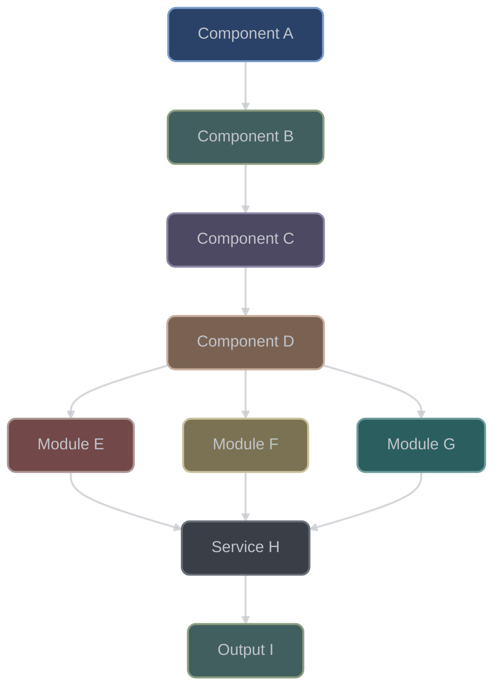

## Flow Chart Template 2 (Complex Flow with Subgraphs)

```mermaid
---
config:
    theme: 'base'
    curve: 'straight'
    themeVariables:
        darkMode: true
        clusterBkg: '#22272f62'
        clusterBorder: '#6a6f77ff'
        clusterTextColor: '#6a6f77ff'
        lineColor: '#C1C4CAAA'
        background: '#262B33'
        primaryColor: '#2b4268ff'
        primaryTextColor: '#C1C4CAff'
        primaryBorderColor: '#6a6f77ff'
        primaryLabelBkg: '#262B33'
        secondaryColor: '#425f5fff'
        secondaryBorderColor: '#8c9c81ff'
        secondaryTextColor: '#C1C4CAff'
        tertiaryColor: '#4d4962ff'
        tertiaryBorderColor: '#8983a5ff'
        tertiaryTextColor: '#eeeeee55'
        nodeTextColor: '#C1C4CA'
        defaultLinkColor: '#C1C4CA'
        edgeLabelBackground: '#262B33'
        edgeLabelBorderColor: '#C1C4CAff'
        labelTextColor: '#ffffff'
        errorBkgColor: '#724848ff'
        errorTextColor: '#C1C4CA'
        flowchart:
            curve: 'basis'
            nodeSpacing: 50
            rankSpacing: 50
            subGraphTitleMargin:
                top: 15
                bottom: 15
                left: 15
                right: 15
---
flowchart TB
    subgraph INPUT["Input & Validation"]
        direction TB
        A[Start: fathomgrids.exe] --> B{Validate Arguments}
        B -->|Invalid| C[Print Usage & Exit]
        B -->|Valid| D[Parse Cutoff Depth]
        D --> E{Grid Level?}
        E -->|Yes| F[Map Grid Level]
        E -->|No| G[Default Level 0]
        F --> H[Build Path]
        G --> H
    end

    %% Initialization Phase
    subgraph INIT["Initialization"]
        direction TB
        I[Open Output Files]
        I -->|Failed| J[Report Error & Exit]
        I -->|Success| K[Init Memory]
        K --> L[Allocate Arrays]
        L --> M[Calculate Buckets]
        M --> N[Open Quad File]
    end

    %% Processing Phase
    subgraph PROCESS["Quad Tree Processing"]
        direction LR
        subgraph TRAVERSE["Traverse"]
            P[Start Traversal] --> Q[Read Node]
            Q --> R{Has Children?}
        end

        subgraph HANDLE["Handle Nodes"]
            R -->|No| S[Process Grid]
            R -->|Yes| T[Process Children]
            S --> U[Generate ID]
            U --> V{Depth Check}
            V -->|Above| W[Individual]
            V -->|Below| X[Composite]
        end

        subgraph CHILDREN["Child Processing"]
            T  --> Y[Q0] --> Z[Q1]
            Z  --> AA[Q2] --> BB[Q3]
            BB --> CC[Combine]
        end

        DD[Update Arrays]
        W  --> DD
        X  --> DD
        CC --> DD
        DD --> EE{More?}
        EE -->|Yes| Q
    end

    %% Enumeration Phase
    subgraph ENUM["Enumeration"]
        direction TB
        FF[Build Tree] --> GG[Traverse]
        GG --> HH{Type?}
        HH -->|Single| II[Write Single]
        HH -->|Composite| JJ{Subdivide?}
        JJ -->|Yes| KK[Subdivide]
        JJ -->|No| LL[Write Composite]
        KK --> GG
        II --> MM[Update Stats]
        LL --> MM
        MM --> NN{More?}
        NN -->|Yes| GG
    end

    %% Output Phase
    subgraph OUTPUT["Output & Cleanup"]
        direction TB
        OO[Generate Reports] --> PP[Depth Dist]
        PP --> QQ[Grid Dist]
        QQ --> RR[Cleanup]
        RR --> SS[Close Files]
        SS --> TT[Success Exit]
    end

    %% Main Flow Connections
    H --> I
    N -->|Found| P
    N -->|Not Found| O[No Data]
    O --> OO
    EE -->|No| FF
    NN -->|No| OO

    linkStyle default stroke:#C1C4CAaa,stroke-width:2px,color:#C1C4CA

    style A fill:#425f5fff,stroke:#8c9c81ff,stroke-width:2px,color:#C1C4CA,rx:8,ry:8
    style C fill:#724848ff,stroke:#ac9696ff,stroke-width:2px,color:#C1C4CA,rx:8,ry:8
    style J fill:#724848ff,stroke:#ac9696ff,stroke-width:2px,color:#C1C4CA,rx:8,ry:8
    style TT fill:#425f5fff,stroke:#8c9c81ff,stroke-width:2px,color:#C1C4CA,rx:8,ry:8
    style P fill:#7a6253ff,stroke:#c7ac9bff,stroke-width:2px,color:#C1C4CA,rx:8,ry:8
    style FF fill:#2b4268ff,stroke:#779DC9ff,stroke-width:2px,color:#C1C4CA,rx:8,ry:8
    style B fill:#4d4962ff,stroke:#8983a5ff,stroke-width:2px,color:#C1C4CA,rx:8,ry:8
    style E fill:#4d4962ff,stroke:#8983a5ff,stroke-width:2px,color:#C1C4CA,rx:8,ry:8
    style R fill:#4d4962ff,stroke:#8983a5ff,stroke-width:2px,color:#C1C4CA,rx:8,ry:8
    style V fill:#4d4962ff,stroke:#8983a5ff,stroke-width:2px,color:#C1C4CA,rx:8,ry:8
    style HH fill:#4d4962ff,stroke:#8983a5ff,stroke-width:2px,color:#C1C4CA,rx:8,ry:8
    style JJ fill:#4d4962ff,stroke:#8983a5ff,stroke-width:2px,color:#C1C4CA,rx:8,ry:8
    style EE fill:#4d4962ff,stroke:#8983a5ff,stroke-width:2px,color:#C1C4CA,rx:8,ry:8
    style NN fill:#4d4962ff,stroke:#8983a5ff,stroke-width:2px,color:#C1C4CA,rx:8,ry:8
```

## Sequence Diagram Template

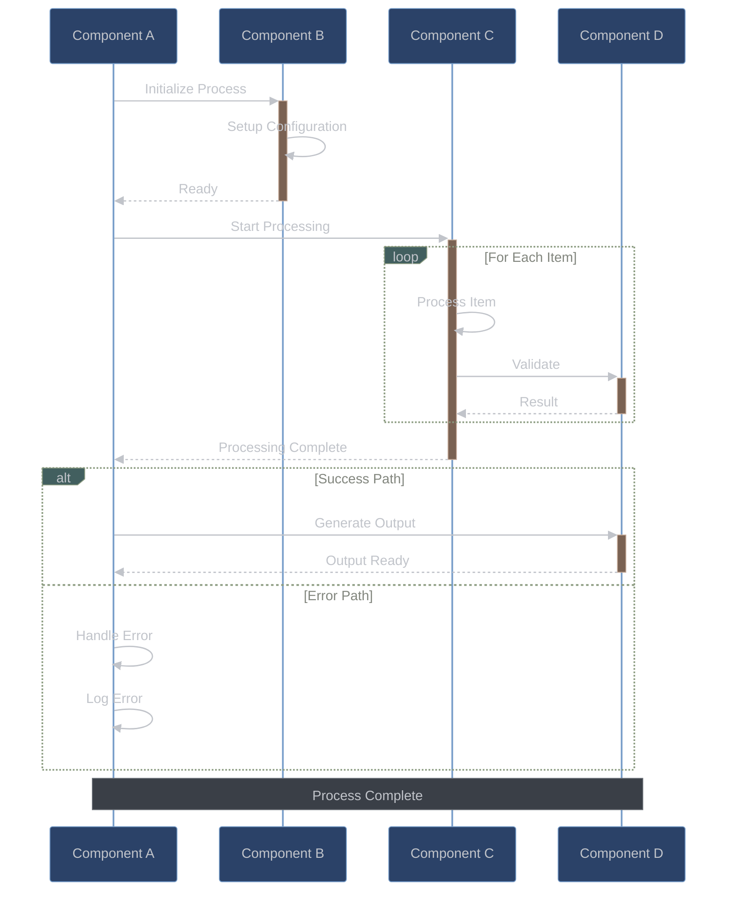

## Class Diagram Template

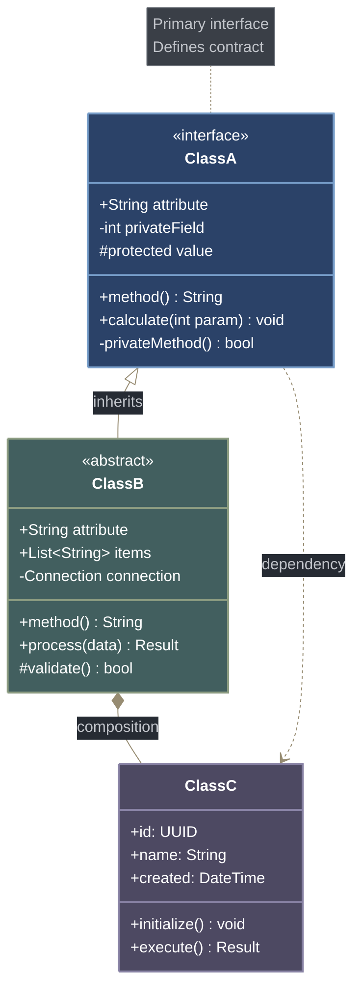

## Entity Relationship Diagram Template

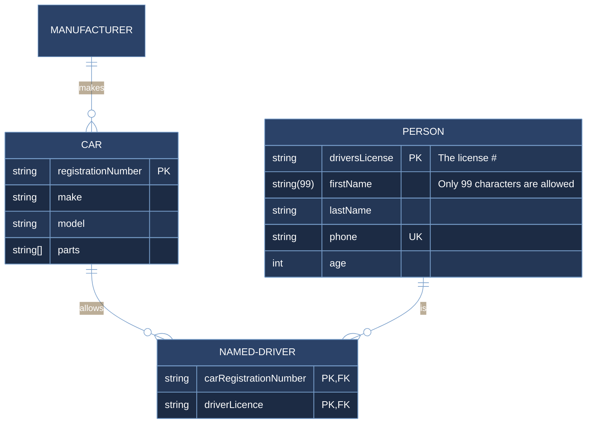

## Gantt Chart Template

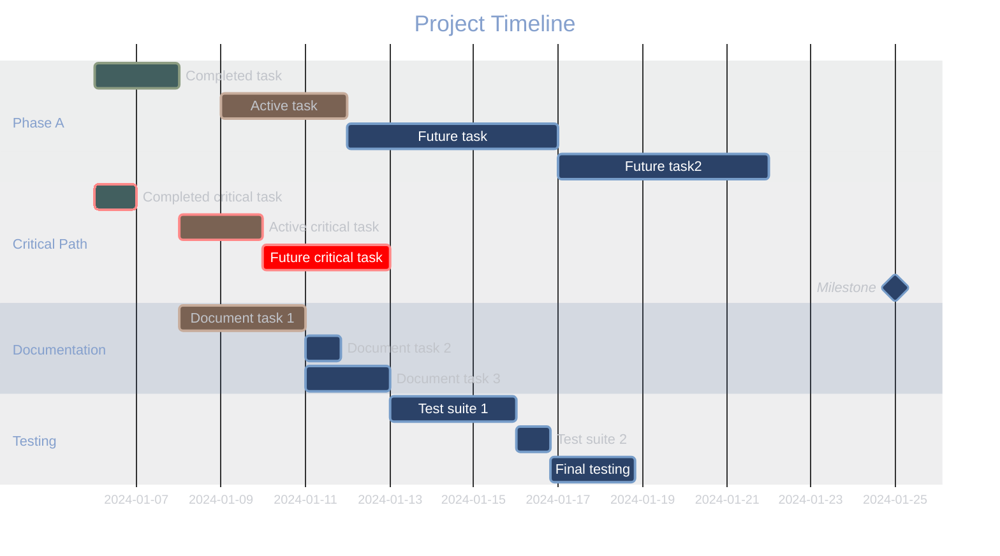

## Git Graph Template

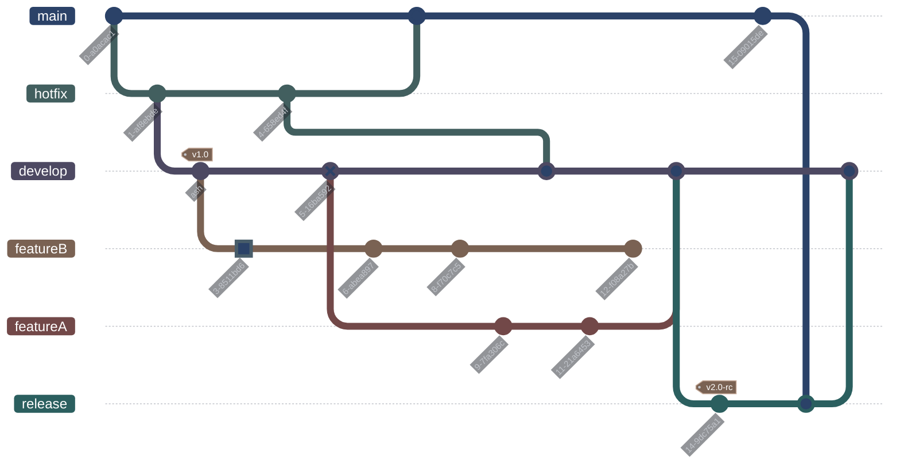

## User Journey Template

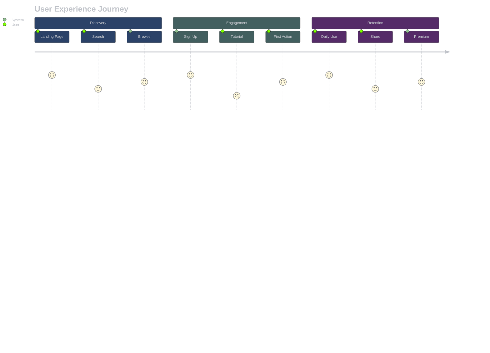

## Pie Chart Template

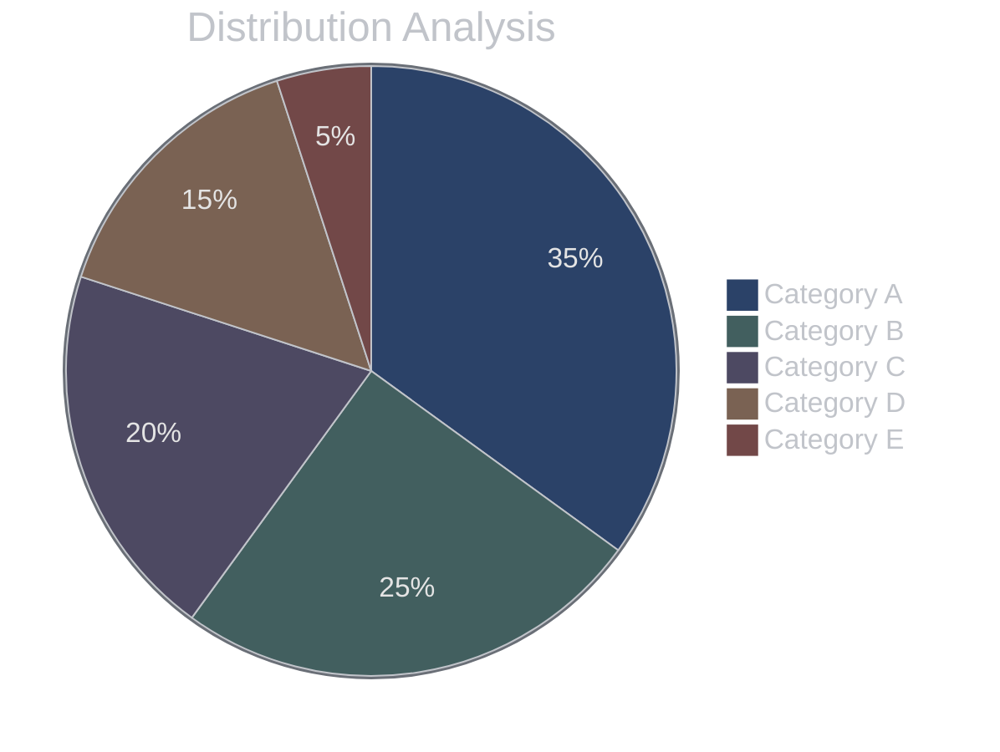

## Graph Template

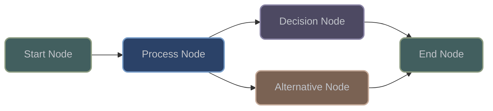

## State Diagram Template

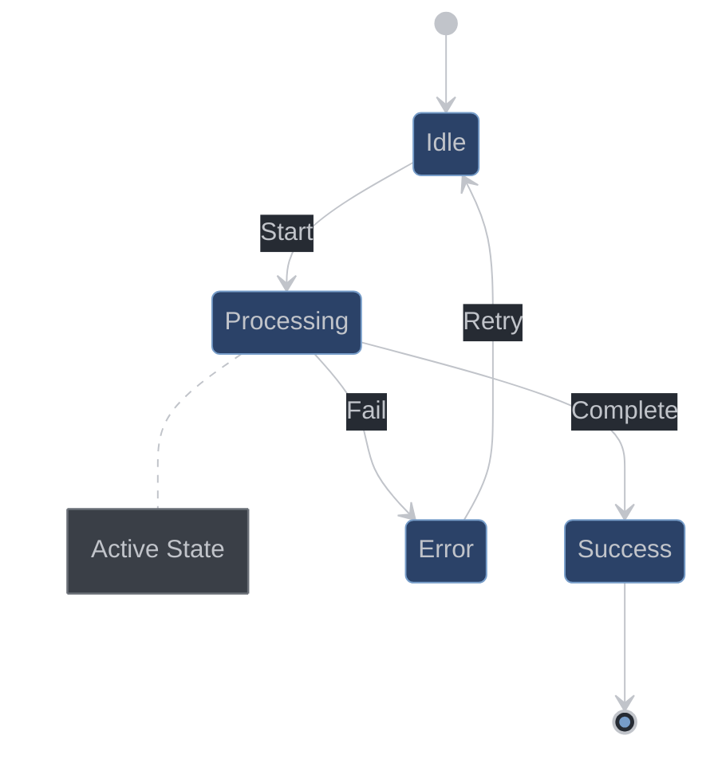

## Mind Map Template

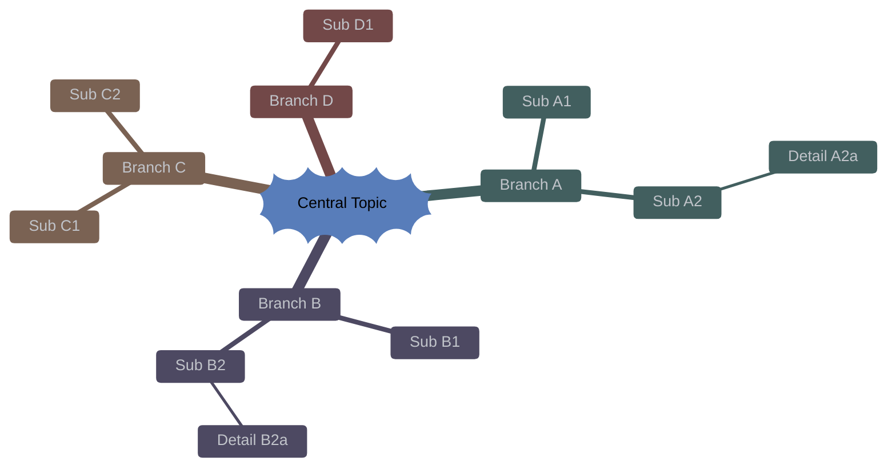

## Timeline Template

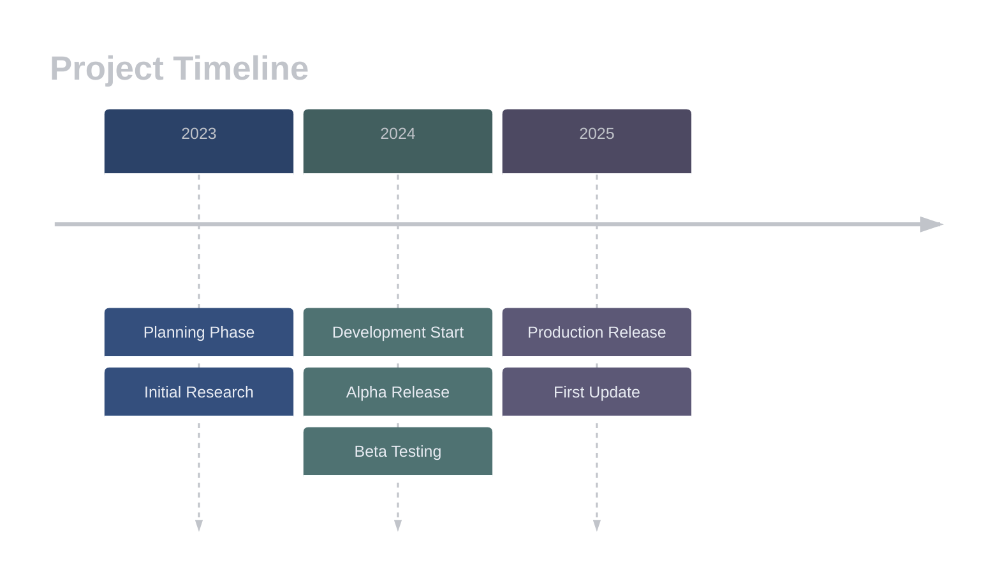

## Quadrant Chart Template

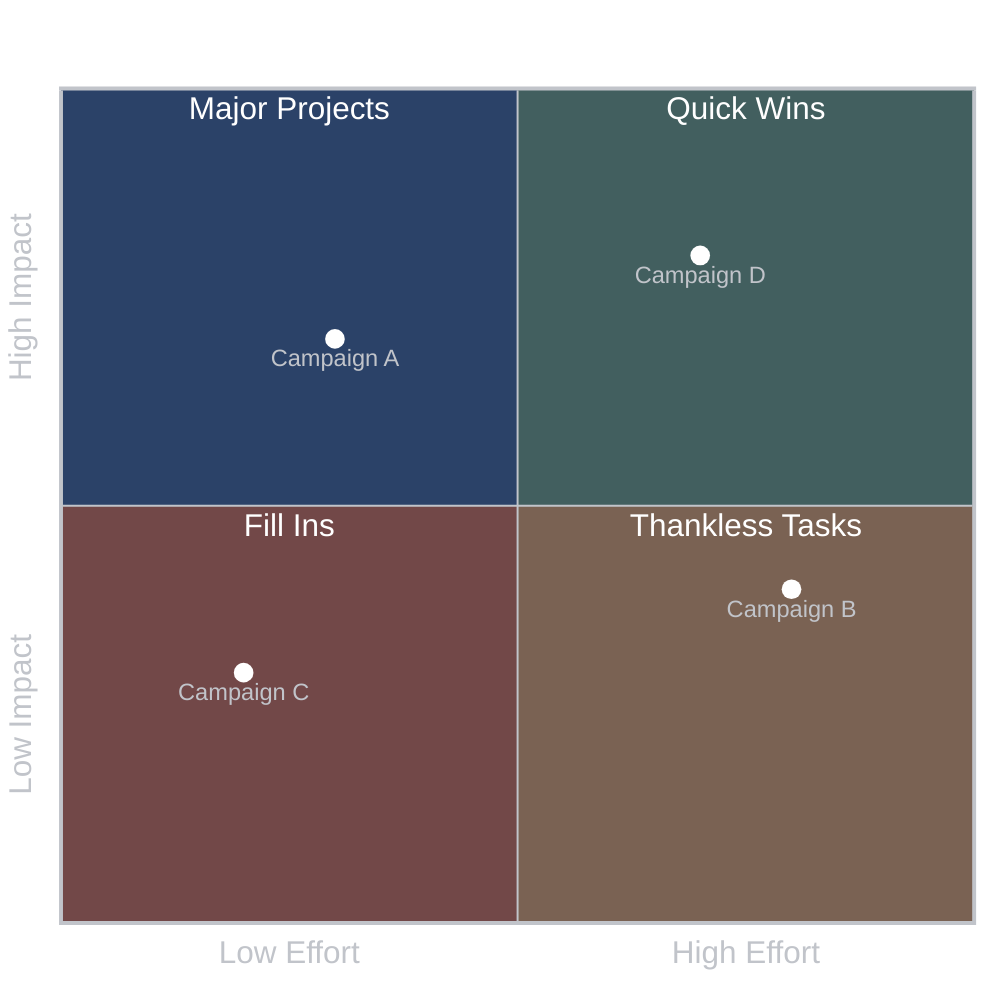

## Block Diagram Template


## Requirement Diagram Template

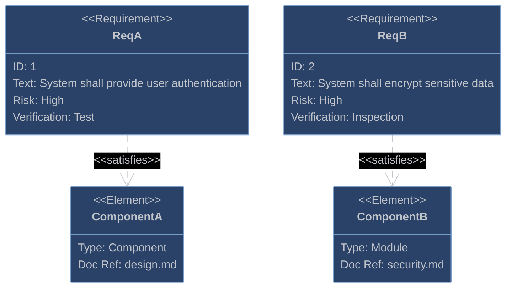

## Enhanced Style Reference

### Core Color Palette
- **Primary Blue**: Fill `#2b4268ff`, Stroke `#779DC9` - Main components, actors, primary nodes
- **Secondary Green**: Fill `#425f5fff`, Stroke `#8c9c81ff` - Secondary elements, success states, start nodes
- **Tertiary Purple**: Fill `#4d4962ff`, Stroke `#8983a5ff` - Decision points, conditions, alt blocks
- **Accent Brown**: Fill `#7a6253ff`, Stroke `#c7ac9bff` - Special processes, activations
- **Accent Red**: Fill `#724848ff`, Stroke `#ac9696ff` - Errors, critical items, end states
- **Accent Yellow**: Fill `#7a7253ff`, Stroke `#c7c19bff` - Warnings, milestones, highlights
- **Accent Teal**: Fill `#2b5f5fff`, Stroke `#6d9c9cff` - Alternative states, experimental
- **Neutral Gray**: Fill `#3a3f47ff`, Stroke `#6a6f77ff` - Notes, disabled states, neutral elements

### Text Colors
- **Primary Text**: `#C1C4CA` - Standard text color
- **Bright Text**: `#FFFFFF` - Titles, emphasis, critical labels
- **Muted Text**: `#95aea9ff` - Secondary information
- **Grid/Guide Lines**: `#4a4f57ff` - Subtle structural elements

### Semantic Color Mapping

#### Node Type Styling Rules
**IMPORTANT**: Apply these styles consistently across all diagrams:
- **Decision Nodes** (diamond shapes with `{}` in flowcharts): ALWAYS use Purple (`#4d4962ff`)
- **Process/Action Nodes** (rectangles with `[]`): Use Blue (`#2b4268ff`) for primary actions
- **Start/Entry Points**: Use Green (`#425f5fff`)
- **End/Exit Points**: Use Green (`#425f5fff`) for success, Red (`#724848ff`) for errors
- **Special/Important Processes**: Use Brown (`#7a6253ff`)
- **Data/Storage Nodes**: Use Gray (`#3a3f47ff`)

#### Process Flow
- **Start/Entry**: Green (`#425f5fff`)
- **Process/Action**: Blue (`#2b4268ff`)
- **Decision/Logic**: Purple (`#4d4962ff`)
- **Special/Key**: Brown (`#7a6253ff`)
- **Error/Critical**: Red (`#724848ff`)
- **Warning/Alert**: Yellow (`#7a7253ff`)
- **Info/Note**: Gray (`#3a3f47ff`)
- **Success/Complete**: Green (`#425f5fff`)

#### Git Branches
- **main/master**: Blue (`#2b4268ff`)
- **develop**: Green (`#425f5fff`)
- **feature**: Purple (`#4d4962ff`)
- **release**: Brown (`#7a6253ff`)
- **hotfix**: Red (`#724848ff`)
- **experimental**: Teal (`#2b5f5fff`)
- **docs**: Yellow (`#7a7253ff`)
- **archived**: Gray (`#3a3f47ff`)

#### Gantt Tasks
- **Default**: Blue (`#2b4268ff`)
- **Completed**: Green (`#425f5fff`)
- **Active**: Brown (`#7a6253ff`)
- **Critical**: Red (`#724848ff`)
- **Future**: Purple (`#4d4962ff`)
- **Milestone**: Yellow (`#7a7253ff`)

### Visual Hierarchy Guidelines

1. **Size & Position**
   - Larger elements = higher importance
   - Central/top position = primary focus
   - Peripheral = supporting information

2. **Color Intensity**
   - Bright text (#FFFFFF) = critical information
   - Standard text (#C1C4CA) = normal content
   - Muted text (#95aea9ff) = secondary details

3. **Border Styling**
   - 2px = standard emphasis
   - 3px = high emphasis
   - Dashed = optional/alternative paths

4. **Corner Radius**
   - 8px = standard rounded corners
   - 0px = sharp for technical/data elements

### Style Declaration Format

**CRITICAL**: All style declarations must follow this exact format:
```mermaid
style NODE_ID fill:#HEXCOLORff,stroke:#STROKECOLORff,stroke-width:2px,color:#C1C4CA,rx:8,ry:8
```

**Important Notes**:
- NO spaces after `fill:` or any other property
- Always include `ff` suffix for colors (full opacity)
- Standard stroke-width is `2px` (not 1px)
- Text color should be `#C1C4CA` for consistency
- Corner radius `rx:8,ry:8` for rounded rectangles

**Example Style Declarations**:
```mermaid
style A fill:#425f5fff,stroke:#8c9c81ff,stroke-width:2px,color:#C1C4CA,rx:8,ry:8
style B fill:#2b4268ff,stroke:#779DC9ff,stroke-width:2px,color:#C1C4CA,rx:8,ry:8
style C fill:#4d4962ff,stroke:#8983a5ff,stroke-width:2px,color:#C1C4CA,rx:8,ry:8
style D fill:#7a6253ff,stroke:#c7ac9bff,stroke-width:2px,color:#C1C4CA,rx:8,ry:8
style E fill:#724848ff,stroke:#ac9696ff,stroke-width:2px,color:#C1C4CA,rx:8,ry:8
```

### Best Practices

#### Complex Diagrams
- Use subgraphs to organize >20 nodes
- Apply consistent color coding by phase
- Minimize line crossings with proper layout
- Break very complex flows into linked diagrams

#### Accessibility
- Maintain 4.5:1 contrast ratio minimum
- Don't rely solely on color (add labels/patterns)
- Test with color blindness simulators
- Provide descriptive text for all elements

#### Performance
- Limit to ~50 nodes per diagram
- Use appropriate diagram type for data
- Cache rendered diagrams when possible
- Optimize complex calculations

### Quick Reference

```javascript
// Color definitions for copy-paste
const darkTheme = {
  // Backgrounds
  background: '#262B33',
  clusterBkg: '#22272f62',

  // Primary Palette
  blue: { fill: '#2b4268ff', stroke: '#779DC9ff' },
  green: { fill: '#425f5fff', stroke: '#8c9c81ff' },
  purple: { fill: '#4d4962ff', stroke: '#8983a5ff' },
  brown: { fill: '#7a6253ff', stroke: '#c7ac9bff' },
  red: { fill: '#724848ff', stroke: '#ac9696ff' },

  // Extended Palette
  yellow: { fill: '#7a7253ff', stroke: '#c7c19bff' },
  teal: { fill: '#2b5f5fff', stroke: '#6d9c9cff' },
  gray: { fill: '#3a3f47ff', stroke: '#6a6f77ff' },
  darkRed: { fill: '#855A5A', stroke: '#ac9696ff' },

  // Text
  text: {
    primary: '#C1C4CA',
    bright: '#FFFFFF',
    muted: '#95aea9ff'
  },

  // Lines
  lines: {
    default: '#C1C4CA',
    grid: '#4a4f57ff'
  }
};
```
