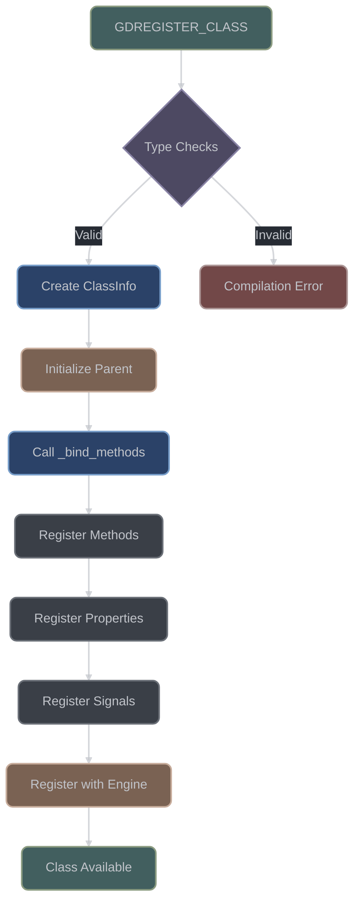

# ClassDB Internals

## Overview

The ClassDB system is the central registry and binding mechanism that bridges C++ classes with Godot's dynamic type system. It handles method registration, virtual dispatch, property management, and cross-binary communication between GDExtension libraries and the Godot engine.

**Key Source Files:**
- `include/godot_cpp/core/class_db.hpp` - Main ClassDB interface
- `src/core/class_db.cpp` - Implementation
- `include/godot_cpp/core/method_bind.hpp` - Method binding infrastructure
- `include/godot_cpp/classes/wrapped.hpp` - GDCLASS macro and base functionality

> **ClassDB Purpose**: ClassDB acts as the "reflection system" for C++ classes, making them discoverable and callable from GDScript. Without ClassDB registration, your C++ classes are invisible to Godot's scripting layer and editor.

## Core Architecture

### Static Storage System

The ClassDB maintains several static data structures for class management:

```cpp
// src/core/[class_db.cpp:43](https://github.com/godotengine/godot-cpp/blob/master/src/core/class_db.cpp#L43)
static std::unordered_map<StringName, ClassInfo> classes;  // Class registry
static std::unordered_map<StringName, const GDExtensionInstanceBindingCallbacks *> instance_binding_callbacks;
static std::vector<StringName> class_register_order;  // Tracks registration order for cleanup
static std::unordered_map<StringName, Object *> engine_singletons;
static std::mutex engine_singletons_mutex;  // Thread protection for singletons
```

### Registration Flow



1. **Class Registration Entry** (`ClassDB::_register_class`, [class_db.hpp:235](https://github.com/godotengine/godot-cpp/blob/master/include/godot_cpp/core/class_db.hpp#L235))
2. **Type Validation** (static_assert checks - must inherit from Object)
3. **ClassInfo Creation** (allocates metadata structure)
4. **Class Initialization** (`T::initialize_class()` - recursive parent init)
5. **Method Binding** (User's `_bind_methods()` called once)
6. **Godot Registration** (Cross-binary interface calls)

## ClassInfo Structure

The ClassInfo structure ([class_db.hpp:89](https://github.com/godotengine/godot-cpp/blob/master/include/godot_cpp/core/class_db.hpp#L89)) stores all metadata for a registered class:

| Field | Type | Purpose | Memory Impact |
|-------|------|---------|---------------|
| `name` | `StringName` | Class identifier | 8 bytes (interned) |
| `parent_name` | `StringName` | Inheritance chain | 8 bytes (interned) |
| `level` | `GDExtensionInitializationLevel` | Init timing | 4 bytes |
| `method_map` | `unordered_map<StringName, MethodBind*>` | Method registry | ~100 bytes/method |
| `virtual_methods` | `unordered_map<StringName, VirtualMethod>` | Virtual dispatch | ~50 bytes/virtual |
| `signal_names` | `set<StringName>` | Signal registry | ~40 bytes/signal |
| `property_names` | `set<StringName>` | Property registry | ~40 bytes/property |
| `parent_ptr` | `ClassInfo*` | Direct parent access | 8 bytes |

```cpp
struct ClassInfo {
    struct VirtualMethod {
        GDExtensionClassCallVirtual func;  // Function pointer for virtual call
        uint32_t hash;                      // Method signature hash for validation
    };

    StringName name;                        // Class name (interned for O(1) comparison)
    StringName parent_name;                 // Parent class name
    GDExtensionInitializationLevel level;   // When class initializes (CORE/SERVERS/SCENE/EDITOR)

    // Method storage - MethodBind pointers owned by ClassDB
    std::unordered_map<StringName, MethodBind *> method_map;

    // Virtual methods with hash-based validation
    std::unordered_map<StringName, VirtualMethod> virtual_methods;

    // Property and signal registries (sorted for editor)
    std::set<StringName> signal_names;
    std::set<StringName> property_names;
    std::set<StringName> constant_names;

    ClassInfo *parent_ptr = nullptr;  // Direct pointer to parent ClassInfo (avoids lookup)
};
```

> **Memory Strategy**: ClassInfo uses pointers and StringNames (interned strings) extensively to minimize memory usage. A typical game class with 20 methods, 10 properties, and 5 signals uses ~3KB.

### Memory Layout Implications

- Each ClassInfo consumes approximately 400-500 bytes base size
- Method bindings add ~100 bytes per method
- Virtual methods add ~50 bytes per override
- Properties and signals add ~40 bytes per registration

## GDCLASS Macro Deep Dive

The GDCLASS macro ([wrapped.hpp:184](https://github.com/godotengine/godot-cpp/blob/master/include/godot_cpp/classes/wrapped.hpp#L184)) generates extensive boilerplate for Godot integration:

> **GDCLASS Requirements**:
> - Must be first macro in class body (changes access to private)
> - Class must inherit from Object or its subclasses
> - Parent class must also use GDCLASS (or be an engine class)
> - Cannot be used with multiple inheritance

### Generated Components

#### 1. Type System Integration ([wrapped.hpp:242](https://github.com/godotengine/godot-cpp/blob/master/include/godot_cpp/classes/wrapped.hpp#L242))
```cpp
typedef m_class self_type;       // Current class type
typedef m_inherits parent_type;  // Parent class type
```

#### 2. Static Class Name ([wrapped.hpp:191](https://github.com/godotengine/godot-cpp/blob/master/include/godot_cpp/classes/wrapped.hpp#L191))
```cpp
static const char *get_class_static() {
    return #m_class;  // Stringified class name
}
```

#### 3. Method Binding Hook ([wrapped.hpp:200](https://github.com/godotengine/godot-cpp/blob/master/include/godot_cpp/classes/wrapped.hpp#L200))
```cpp
static void (*_get_bind_methods())() {
    return &m_class::_bind_methods;  // Pointer to binding function
}
```

#### 4. Virtual Method Detection System ([wrapped.hpp:204](https://github.com/godotengine/godot-cpp/blob/master/include/godot_cpp/classes/wrapped.hpp#L204))

For each virtual method, generates:
```cpp
static m_ret (_get_##m_name())(__VA_ARGS__) {
    return (PtrToArg<m_ret>::convert(nullptr));
}
```

This enables compile-time detection of virtual method overrides through function pointer comparison.

#### 5. Class Initialization Chain ([wrapped.hpp:245](https://github.com/godotengine/godot-cpp/blob/master/include/godot_cpp/classes/wrapped.hpp#L245))

```cpp
static void initialize_class() {
    static bool initialized = false;
    if (initialized) return;

    // Recursive parent initialization
    m_inherits::initialize_class();

    // Check if we have our own _bind_methods
    if (m_class::_get_bind_methods() != m_inherits::_get_bind_methods()) {
        _bind_methods();  // Call user's binding code

        // Register virtual methods
        m_inherits::register_virtuals<m_class, m_inherits>();
    }
    initialized = true;
}
```

### Instance Creation and Destruction ([wrapped.hpp:257](https://github.com/godotengine/godot-cpp/blob/master/include/godot_cpp/classes/wrapped.hpp#L257))

```cpp
static GDExtensionObjectPtr _gde_binding_create_callback(void *p_token, void *p_instance) {
    // Placement new into Godot-allocated memory
    return reinterpret_cast<GDExtensionObjectPtr>(memnew_placement(p_instance, m_class));
}

static void _gde_binding_free_callback(void *p_token, void *p_instance, void *p_binding) {
    // Explicit destructor call (no deallocation)
    reinterpret_cast<m_class *>(p_binding)->~m_class();
}
```

### GDExtension Binding Callbacks ([wrapped.hpp:401](https://github.com/godotengine/godot-cpp/blob/master/include/godot_cpp/classes/wrapped.hpp#L401))

```cpp
static constexpr GDExtensionInstanceBindingCallbacks _gde_binding_callbacks = {
    _gde_binding_create_callback,
    _gde_binding_free_callback,
    _gde_binding_reference_callback,  // Reference counting for RefCounted
};
```

## MethodBind Polymorphic Hierarchy

### Base MethodBind Class ([method_bind.hpp:49](https://github.com/godotengine/godot-cpp/blob/master/include/godot_cpp/method_bind.hpp#L49))

Core members that all method bindings share:

```cpp
class MethodBind {
protected:
    StringName name;                           // Method name
    StringName instance_class;                 // Owning class
    int argument_count = 0;                    // Number of arguments

    // Method characteristics
    bool _static = false;                      // Static method flag
    bool _const = false;                       // Const method flag
    bool _returns = false;                     // Has return value
    bool _vararg = false;                      // Variable arguments

    // Type information
    GDExtensionVariantType *argument_types;    // Argument type array
    std::vector<StringName> argument_names;    // Argument names
    std::vector<Variant> default_arguments;    // Default values

    uint32_t hint_flags = METHOD_FLAGS_DEFAULT;  // Method flags

public:
    // Pure virtual dispatch methods
    virtual Variant call(GDExtensionClassInstancePtr p_instance,
                        const GDExtensionConstVariantPtr *p_args,
                        GDExtensionInt p_arg_count,
                        GDExtensionCallError &r_error) const = 0;

    virtual void ptrcall(GDExtensionClassInstancePtr p_instance,
                        const GDExtensionConstTypePtr *p_args,
                        GDExtensionTypePtr r_ret) const = 0;
};
```

### Template Specialization Hierarchy

#### MethodBindT - Non-const Methods, No Return ([method_bind.hpp:290](https://github.com/godotengine/godot-cpp/blob/master/include/godot_cpp/method_bind.hpp#L290))

```cpp
template <typename... P>
class MethodBindT : public MethodBind {
    void (MB_T::*method)(P...);  // Member function pointer

    virtual Variant call(...) const override {
        // Convert Variant arguments to native types
        // Call method through pointer
        // No return value
    }

    virtual void ptrcall(...) const override {
        // Direct pointer call without Variant conversion
        call_with_ptr_args(instance, method, p_args, nullptr);
    }
};
```

#### MethodBindTC - Const Methods, No Return ([method_bind.hpp:366](https://github.com/godotengine/godot-cpp/blob/master/include/godot_cpp/method_bind.hpp#L366))

Similar to MethodBindT but stores const member function pointer:
```cpp
void (MB_T::*method)(P...) const;
```

#### MethodBindTR - Non-const Methods, With Return ([method_bind.hpp:443](https://github.com/godotengine/godot-cpp/blob/master/include/godot_cpp/method_bind.hpp#L443))

```cpp
template <typename R, typename... P>
class MethodBindTR : public MethodBind {
    R (MB_T::*method)(P...);

    virtual Variant call(...) const override {
        // Call and convert return value to Variant
        R ret = (instance->*method)(args...);
        return VariantCaster<R>::cast(ret);
    }
};
```

#### MethodBindTRC - Const Methods, With Return ([method_bind.hpp:525](https://github.com/godotengine/godot-cpp/blob/master/include/godot_cpp/method_bind.hpp#L525))

#### MethodBindTS/TRS - Static Methods ([method_bind.hpp:606](https://github.com/godotengine/godot-cpp/blob/master/include/godot_cpp/method_bind.hpp#L606))

Static methods don't need an instance pointer:
```cpp
template <typename... P>
class MethodBindTS : public MethodBind {
    void (*method)(P...);  // Function pointer, not member pointer
};
```

### VarArg Method Support ([method_bind.hpp:157](https://github.com/godotengine/godot-cpp/blob/master/include/godot_cpp/method_bind.hpp#L157))

Variable argument methods use a special binding class:

```cpp
template <typename T, typename R, bool should_returns>
class MethodBindVarArgT : public MethodBindVarArgBase<R, should_returns> {
    typedef R (T::*NativeCall)(const Variant **, GDExtensionInt, GDExtensionCallError &);
    NativeCall call_method;
};
```

## Template Metaprogramming Patterns

### Type Information Extraction ([type_info.hpp:103](https://github.com/godotengine/godot-cpp/blob/master/include/godot_cpp/core/type_info.hpp#L103))

The GetTypeInfo template extracts type metadata at compile time:

```cpp
template <typename T>
struct GetTypeInfo<T *> {
    static constexpr GDExtensionVariantType VARIANT_TYPE = GDEXTENSION_VARIANT_TYPE_OBJECT;
    static constexpr GDExtensionClassMethodArgumentMetadata METADATA = GDEXTENSION_METHOD_ARGUMENT_METADATA_NONE;

    static inline PropertyInfo get_class_info() {
        return PropertyInfo(GDEXTENSION_VARIANT_TYPE_OBJECT, "", PROPERTY_HINT_RESOURCE_TYPE, T::get_class_static());
    }
};
```

### Argument Type Detection ([binder_common.hpp:488](https://github.com/godotengine/godot-cpp/blob/master/include/godot_cpp/core/binder_common.hpp#L488))

Parameter pack expansion extracts argument types:

```cpp
template <typename... P>
GDExtensionVariantType call_get_argument_type(int p_arg) {
    GDExtensionVariantType type = GDEXTENSION_VARIANT_TYPE_NIL;
    int index = 0;

    // Parameter pack expansion trick
    using expand_type = int[];
    expand_type a{ 0, (call_get_argument_type_helper<P>(p_arg, index, type), 0)... };

    return type;
}

template <typename T>
void call_get_argument_type_helper(int p_arg, int &index, GDExtensionVariantType &type) {
    if (p_arg == index) {
        type = GetTypeInfo<T>::VARIANT_TYPE;
    }
    index++;
}
```

### Method Signature Validation

Compile-time validation using SFINAE and type traits:

```cpp
// Detect if method is const
template <typename T>
struct is_const_method : std::false_type {};

template <typename R, typename T, typename... Args>
struct is_const_method<R (T::*)(Args...) const> : std::true_type {};

// Detect return type
template <typename T>
struct method_return_type {
    using type = void;
};

template <typename R, typename T, typename... Args>
struct method_return_type<R (T::*)(Args...)> {
    using type = R;
};
```

## Method Binding Process

### bind_method Flow ([class_db.cpp:130](https://github.com/godotengine/godot-cpp/blob/master/src/core/class_db.cpp#L130))

1. **Validation Phase** (lines 133-156)
   ```cpp
   // Check class exists
   ERR_FAIL_COND_MSG(type == classes.end(), "Class doesn't exist: " + String(p_class_name));

   // Check for duplicates
   ERR_FAIL_COND_MSG(type->second.method_map.find(p_method->get_name()) != type->second.method_map.end(),
                     "Binding duplicate method: " + String(p_method->get_instance_class()) + "::" + String(p_method->get_name()));

   // Check virtual conflicts
   ERR_FAIL_COND_MSG(type->second.virtual_methods.find(p_method->get_name()) != type->second.virtual_methods.end(),
                     "Method already bound as virtual: " + String(p_method->get_instance_class()) + "::" + String(p_method->get_name()));
   ```

2. **Configuration Phase** (lines 158-180)
   ```cpp
   p_method->set_name(p_method_info.method_name);
   p_method->set_hint_flags(p_method_info.method_flags);

   // Extract argument names from MethodDefinition
   for (int i = 0; i < p_method_info.argument_count; i++) {
       p_method->set_argument_name(i, p_method_info.arguments[i]);
   }
   ```

3. **Registration Phase** (lines 182-186)
   ```cpp
   type->second.method_map[p_method->get_name()] = p_method;
   bind_method_godot(p_class_name, p_method);
   ```

### Cross-Binary Registration ([class_db.cpp:188](https://github.com/godotengine/godot-cpp/blob/master/src/core/class_db.cpp#L188))

```cpp
void ClassDB::bind_method_godot(const StringName &p_class_name, MethodBind *p_method) {
    GDExtensionClassMethodInfo method_info = {};

    // Convert name to native pointer
    method_info.name = p_method->get_name()._native_ptr();

    // Store method binding as userdata
    method_info.method_userdata = p_method;

    // Set dispatch functions
    method_info.call_func = MethodBind::bind_call;
    method_info.ptrcall_func = MethodBind::bind_ptrcall;

    // Configure metadata
    method_info.method_flags = p_method->get_hint_flags();
    method_info.has_return_value = p_method->has_return();

    // Argument configuration
    method_info.argument_count = p_method->get_argument_count();

    // Type information arrays (stack allocated for safety)
    GDExtensionClassMethodArgumentMetadata return_value_metadata = p_method->get_argument_meta(-1);
    method_info.return_value_info = p_method->get_argument_info(-1)._ptr();
    method_info.return_value_metadata = &return_value_metadata;

    // Register with Godot
    internal::gdextension_interface_classdb_register_extension_class_method(
        internal::library,
        p_class_name._native_ptr(),
        &method_info
    );
}
```

### Static Dispatch Functions ([method_bind.cpp:90](https://github.com/godotengine/godot-cpp/blob/master/include/godot_cpp/method_bind.cpp#L90))

```cpp
// Variant-based dispatch (for dynamic calls)
static void bind_call(void *p_method_userdata,
                     GDExtensionClassInstancePtr p_instance,
                     const GDExtensionConstVariantPtr *p_args,
                     GDExtensionInt p_argument_count,
                     GDExtensionVariantPtr r_return,
                     GDExtensionCallError *r_error) {
    const MethodBind *bind = reinterpret_cast<const MethodBind *>(p_method_userdata);
    Variant ret = bind->call(p_instance, p_args, p_argument_count, *r_error);

    if (r_return && bind->has_return()) {
        internal::gdextension_interface_variant_new_copy(r_return, ret._native_ptr());
    }
}

// Direct pointer dispatch (for performance)
static void bind_ptrcall(void *p_method_userdata,
                         GDExtensionClassInstancePtr p_instance,
                         const GDExtensionConstTypePtr *p_args,
                         GDExtensionTypePtr r_return) {
    const MethodBind *bind = reinterpret_cast<const MethodBind *>(p_method_userdata);
    bind->ptrcall(p_instance, p_args, r_return);
}
```

## Virtual Method System

### Registration Process ([class_db.cpp:331](https://github.com/godotengine/godot-cpp/blob/master/src/core/class_db.cpp#L331))

```cpp
void ClassDB::bind_virtual_method(const StringName &p_class,
                                  const StringName &p_method,
                                  GDExtensionClassCallVirtual p_call,
                                  uint32_t p_hash) {
    ClassInfo &type = classes[p_class];

    type.virtual_methods[p_method] = ClassInfo::VirtualMethod{
        p_call,  // Function pointer
        p_hash,  // Signature hash for validation
    };
}
```

### Virtual Method Resolution ([class_db.cpp:288](https://github.com/godotengine/godot-cpp/blob/master/src/core/class_db.cpp#L288))

```cpp
GDExtensionClassCallVirtual ClassDB::get_virtual_func(void *p_userdata,
                                                      GDExtensionConstStringNamePtr p_name,
                                                      uint32_t p_hash) {
    // Get class name from userdata
    const StringName *class_name = reinterpret_cast<const StringName *>(p_userdata);

    // Find class
    const ClassInfo *type = &classes[*class_name];

    // Walk up inheritance chain
    while (type != nullptr) {
        auto method_it = type->virtual_methods.find(*p_name);

        if (method_it != type->virtual_methods.end()) {
            // Validate hash to ensure signature match
            if (method_it->second.hash == p_hash) {
                return method_it->second.func;
            }
        }

        // Check parent class
        type = type->parent_ptr;
    }

    return nullptr;  // Not overridden
}
```

### BIND_VIRTUAL_METHOD Macro ([class_db.hpp:226](https://github.com/godotengine/godot-cpp/blob/master/include/godot_cpp/core/class_db.hpp#L226))

```cpp
#define BIND_VIRTUAL_METHOD(m_class, m_method, m_hash) \
{ \
    auto _call##m_method = [](GDExtensionObjectPtr p_instance, \
                             const GDExtensionConstTypePtr *p_args, \
                             GDExtensionTypePtr p_ret) -> void { \
        call_with_ptr_args(reinterpret_cast<m_class *>(p_instance), \
                          &m_class::m_method, p_args, p_ret); \
    }; \
    ::godot::ClassDB::bind_virtual_method(m_class::get_class_static(), \
                                          #m_method, \
                                          _call##m_method, \
                                          m_hash); \
}
```

### Virtual Method Override Detection

The GDCLASS macro generates function pointers for each virtual method. During `register_virtuals`, these are compared with parent pointers:

```cpp
// Check if virtual method is overridden
if ((void *)(Derived::_get_##m_name) != (void *)(Parent::_get_##m_name)) {
    // Method is overridden, register it
    BIND_VIRTUAL_METHOD(Derived, m_name, hash);
}
```

## Property Registration

### ADD_PROPERTY Macro Flow ([class_db.cpp:72](https://github.com/godotengine/godot-cpp/blob/master/src/core/class_db.cpp#L72))

```cpp
void ClassDB::add_property(const StringName &p_class,
                           const PropertyInfo &p_pinfo,
                           const StringName &p_setter,
                           const StringName &p_getter,
                           int p_index) {
    // Validation
    ClassInfo &type = classes[p_class];

    ERR_FAIL_COND_MSG(type.property_names.find(p_pinfo.name) != type.property_names.end(),
                      "Property already exists: " + String(p_class) + "::" + String(p_pinfo.name));

    // Setter validation (optional)
    if (p_setter != StringName()) {
        MethodBind *setter = type.method_map[p_setter];
        ERR_FAIL_NULL_MSG(setter, "Setter method not found: " + String(p_setter));
        ERR_FAIL_COND_MSG(setter->get_argument_count() != 1, "Setter must have exactly 1 argument");
    }

    // Getter validation (required)
    MethodBind *getter = type.method_map[p_getter];
    ERR_FAIL_NULL_MSG(getter, "Getter method not found: " + String(p_getter));
    ERR_FAIL_COND_MSG(getter->get_argument_count() != 0, "Getter must have 0 arguments");

    // Register with Godot
    type.property_names.insert(p_pinfo.name);

    GDExtensionPropertyInfo prop_info = {
        static_cast<GDExtensionVariantType>(p_pinfo.type),
        p_pinfo.name._native_ptr(),
        p_pinfo.class_name._native_ptr(),
        p_pinfo.hint,
        p_pinfo.hint_string._native_ptr(),
        p_pinfo.usage,
    };

    internal::gdextension_interface_classdb_register_extension_class_property_indexed(
        internal::library,
        p_class._native_ptr(),
        &prop_info,
        p_setter._native_ptr(),
        p_getter._native_ptr(),
        p_index
    );
}
```

### Property Groups and Subgroups

```cpp
void ClassDB::add_property_group(const StringName &p_class,
                                 const String &p_name,
                                 const String &p_prefix) {
    internal::gdextension_interface_classdb_register_extension_class_property_group(
        internal::library,
        p_class._native_ptr(),
        reinterpret_cast<GDExtensionConstStringPtr>(p_name._native_ptr()),
        reinterpret_cast<GDExtensionConstStringPtr>(p_prefix._native_ptr())
    );
}
```

## Signal System

### Signal Registration ([class_db.cpp:115](https://github.com/godotengine/godot-cpp/blob/master/src/core/class_db.cpp#L115))

```cpp
void ClassDB::add_signal(const StringName &p_class, const MethodInfo &p_signal) {
    ClassInfo &type = classes[p_class];

    // Check for duplicates
    ERR_FAIL_COND_MSG(type.signal_names.find(p_signal.name) != type.signal_names.end(),
                      "Signal already exists: " + String(p_class) + "::" + String(p_signal.name));

    // Convert to GDExtension format
    GDExtensionClassSignalInfo signal_info = {};
    signal_info.name = p_signal.name._native_ptr();
    signal_info.argument_count = p_signal.arguments.size();

    // Allocate argument info array
    std::vector<GDExtensionPropertyInfo> args;
    for (const PropertyInfo &arg : p_signal.arguments) {
        args.push_back({
            static_cast<GDExtensionVariantType>(arg.type),
            arg.name._native_ptr(),
            arg.class_name._native_ptr(),
            arg.hint,
            arg.hint_string._native_ptr(),
            arg.usage
        });
    }
    signal_info.arguments = args.data();

    // Register with Godot
    type.signal_names.insert(p_signal.name);
    internal::gdextension_interface_classdb_register_extension_class_signal(
        internal::library,
        p_class._native_ptr(),
        &signal_info
    );
}
```

### ADD_SIGNAL Macro

```cpp
#define ADD_SIGNAL(m_signal) \
    ::godot::ClassDB::add_signal(get_class_static(), m_signal)
```

## Memory Management

### MethodBind Lifecycle

1. **Creation** (binder_common.hpp template functions)
   ```cpp
   template <typename T, typename... P>
   MethodBind *create_method_bind(void (T::*p_method)(P...)) {
       MethodBind *bind = memnew((MethodBindT<T, P...>)(p_method));
       return bind;
   }
   ```

2. **Storage** ([class_db.cpp:182](https://github.com/godotengine/godot-cpp/blob/master/src/core/class_db.cpp#L182))
   ```cpp
   type->second.method_map[p_method->get_name()] = p_method;
   ```

3. **Deletion** ([class_db.cpp:426](https://github.com/godotengine/godot-cpp/blob/master/src/core/class_db.cpp#L426))
   ```cpp
   // During deinitialization
   for (auto &method : type.second.method_map) {
       memdelete(method.second);
   }
   ```

### Argument Type Arrays ([method_bind.cpp:67](https://github.com/godotengine/godot-cpp/blob/master/include/godot_cpp/method_bind.cpp#L67))

```cpp
void MethodBind::_generate_argument_types(int p_count) {
    argument_types = (GDExtensionVariantType *)memalloc(sizeof(GDExtensionVariantType) * p_count);

    for (int i = 0; i < p_count; i++) {
        argument_types[i] = gen_argument_type(i);
    }
}

// Destructor cleanup
MethodBind::~MethodBind() {
    if (argument_types) {
        memfree(argument_types);
    }
}
```

### Instance Memory Management

Godot allocates instance memory, godot-cpp constructs/destructs:

```cpp
// Construction ([wrapped.hpp:257](https://github.com/godotengine/godot-cpp/blob/master/include/godot_cpp/classes/wrapped.hpp#L257))
static GDExtensionObjectPtr _gde_binding_create_callback(void *p_token,
                                                         void *p_instance) {
    // Placement new - construct in Godot's memory
    return reinterpret_cast<GDExtensionObjectPtr>(
        memnew_placement(p_instance, m_class)
    );
}

// Destruction ([wrapped.hpp:263](https://github.com/godotengine/godot-cpp/blob/master/include/godot_cpp/classes/wrapped.hpp#L263))
static void _gde_binding_free_callback(void *p_token,
                                       void *p_instance,
                                       void *p_binding) {
    // Call destructor without freeing memory
    reinterpret_cast<m_class *>(p_binding)->~m_class();
}
```

## Error Conditions

### Compile-Time Errors

1. **Missing GDCLASS Macro** ([class_db.hpp:236](https://github.com/godotengine/godot-cpp/blob/master/include/godot_cpp/core/class_db.hpp#L236))
   ```cpp
   static_assert(TypesAreSame<typename T::self_type, T>::value,
                 "Class not declared properly, please use GDCLASS.");
   ```

2. **Missing _bind_methods** ([class_db.hpp:237](https://github.com/godotengine/godot-cpp/blob/master/include/godot_cpp/core/class_db.hpp#L237))
   ```cpp
   static_assert(!FunctionsAreSame<T::self_type::_bind_methods, T::parent_type::_bind_methods>::value,
                 "Class must declare 'static void _bind_methods'.");
   ```

3. **Abstract Class Misregistration** ([class_db.hpp:238](https://github.com/godotengine/godot-cpp/blob/master/include/godot_cpp/core/class_db.hpp#L238))
   ```cpp
   static_assert(!std::is_abstract_v<T> || is_abstract,
                 "Class is abstract, please use GDREGISTER_ABSTRACT_CLASS.");
   ```

### Runtime Errors

1. **Non-existent Class** ([class_db.cpp:134](https://github.com/godotengine/godot-cpp/blob/master/src/core/class_db.cpp#L134))
   ```cpp
   ERR_FAIL_COND_MSG(type == classes.end(),
                     "Class doesn't exist: " + String(p_class_name));
   ```

2. **Duplicate Method** ([class_db.cpp:141](https://github.com/godotengine/godot-cpp/blob/master/src/core/class_db.cpp#L141))
   ```cpp
   ERR_FAIL_COND_MSG(type->second.method_map.find(p_method->get_name()) != type->second.method_map.end(),
                     "Binding duplicate method: " + String(p_method->get_instance_class()) + "::" + String(p_method->get_name()));
   ```

3. **Virtual Method Conflict** ([class_db.cpp:146](https://github.com/godotengine/godot-cpp/blob/master/src/core/class_db.cpp#L146))
   ```cpp
   ERR_FAIL_COND_MSG(type->second.virtual_methods.find(p_method->get_name()) != type->second.virtual_methods.end(),
                     "Method already bound as virtual: " + String(p_method->get_instance_class()) + "::" + String(p_method->get_name()));
   ```

4. **Argument Count Mismatch** ([class_db.cpp:153](https://github.com/godotengine/godot-cpp/blob/master/src/core/class_db.cpp#L153))
   ```cpp
   ERR_FAIL_COND_MSG(p_method->get_argument_count() != p_method_info.argument_count,
                     "Argument count mismatch for method: " + String(p_method->get_instance_class()) + "::" + String(p_method->get_name()));
   ```

5. **Invalid Property Configuration** ([class_db.cpp:85](https://github.com/godotengine/godot-cpp/blob/master/src/core/class_db.cpp#L85))
   - Duplicate property names
   - Non-existent setter/getter methods
   - Incorrect setter argument count (must be 1)
   - Incorrect getter argument count (must be 0)

## Thread Safety

### Thread-Safe Operations

1. **Virtual Method Resolution** ([class_db.cpp:290](https://github.com/godotengine/godot-cpp/blob/master/src/core/class_db.cpp#L290))
   ```cpp
   // get_virtual_func is thread-safe - only reads data
   ```

2. **Singleton Access** ([class_db.hpp:172](https://github.com/godotengine/godot-cpp/blob/master/include/godot_cpp/core/class_db.hpp#L172))
   ```cpp
   static Object *get_singleton(const StringName &p_class) {
       std::lock_guard<std::mutex> lock(engine_singletons_mutex);
       // ... thread-safe access ...
   }
   ```

### Non-Thread-Safe Operations

1. **Class Registration** - Must occur during single-threaded initialization
2. **Method Binding** - Must occur during `_bind_methods()` callback
3. **Property/Signal Registration** - Must occur during initialization

### Synchronization Primitives

```cpp
// Singleton protection
static std::mutex engine_singletons_mutex;

// Reference counting for thread-safe object management
// Uses atomic operations in SafeRefCount (templates/safe_refcount.hpp)
```

## Cross-Binary Communication

### Function Pointer Tables

The ClassDB system bridges C++ methods to Godot through function pointer tables:

1. **Method Dispatch Table** ([method_bind.cpp:90](https://github.com/godotengine/godot-cpp/blob/master/include/godot_cpp/method_bind.cpp#L90))
   - `bind_call` - Variant-based dynamic dispatch
   - `bind_ptrcall` - Direct pointer dispatch for performance

2. **Virtual Method Table** ([class_db.cpp:288](https://github.com/godotengine/godot-cpp/blob/master/src/core/class_db.cpp#L288))
   - Runtime resolution through inheritance chain
   - Hash-based signature validation

3. **Property Access Table**
   - Setter/getter method pointers stored by name
   - Indexed property support for arrays

### ABI Stability

The system maintains ABI stability through:

1. **Opaque Pointers** - All cross-binary data uses opaque pointer types
2. **C Interface** - Pure C function pointers in GDExtension interface
3. **Version Negotiation** - Interface version checking during initialization
4. **Type Erasure** - Variant system for type-safe dynamic dispatch

### Performance Optimizations

1. **ptrcall Path** - Bypasses Variant conversion for known types
2. **Method Caching** - MethodBind pointers cached in ClassInfo
3. **Hash-based Lookups** - O(1) average case for method resolution
4. **Static Initialization** - One-time class setup cost

## Implementation Examples

### Basic Method Binding

```cpp
class MyClass : public Node {
    GDCLASS(MyClass, Node)

public:
    void my_method(int value, const String &text) {
        // Implementation
    }

    static void _bind_methods() {
        ClassDB::bind_method(D_METHOD("my_method", "value", "text"), &MyClass::my_method);
    }
};
```

### Virtual Method Override

```cpp
class MyNode : public Node {
    GDCLASS(MyNode, Node)

public:
    virtual void _ready() override {
        // Override implementation
    }

    static void _bind_methods() {
        // Virtual methods are automatically detected and registered
    }
};
```

### Property with Setter/Getter

```cpp
class MyResource : public Resource {
    GDCLASS(MyResource, Resource)

private:
    int value = 0;

public:
    void set_value(int p_value) { value = p_value; }
    int get_value() const { return value; }

    static void _bind_methods() {
        ClassDB::bind_method(D_METHOD("set_value", "value"), &MyResource::set_value);
        ClassDB::bind_method(D_METHOD("get_value"), &MyResource::get_value);
        ADD_PROPERTY(PropertyInfo(Variant::INT, "value"), "set_value", "get_value");
    }
};
```

## Performance Characteristics

### Memory Overhead

- **Per Class**: ~500 bytes base + methods/properties
- **Per Method**: ~100 bytes + argument metadata
- **Per Property**: ~40 bytes + getter/setter references
- **Per Signal**: ~40 bytes + argument metadata

### Runtime Performance

- **Method Dispatch**: 2-3 pointer dereferences
- **Virtual Resolution**: O(inheritance_depth) worst case
- **Property Access**: 2 method calls (getter/setter)
- **Signal Emission**: O(connected_callbacks)

### Optimization Opportunities

1. Use `ptrcall` path when possible (avoid Variant conversion)
2. Cache MethodBind pointers for repeated calls
3. Minimize virtual method overrides in hot paths
4. Use static methods when instance state not needed

## Conclusion

The ClassDB system represents a sophisticated binding layer that bridges C++ static typing with Godot's dynamic system while maintaining type safety, performance, and ABI stability. Its extensive use of template metaprogramming enables compile-time validation while the runtime registration system provides the flexibility needed for dynamic language interoperability.
