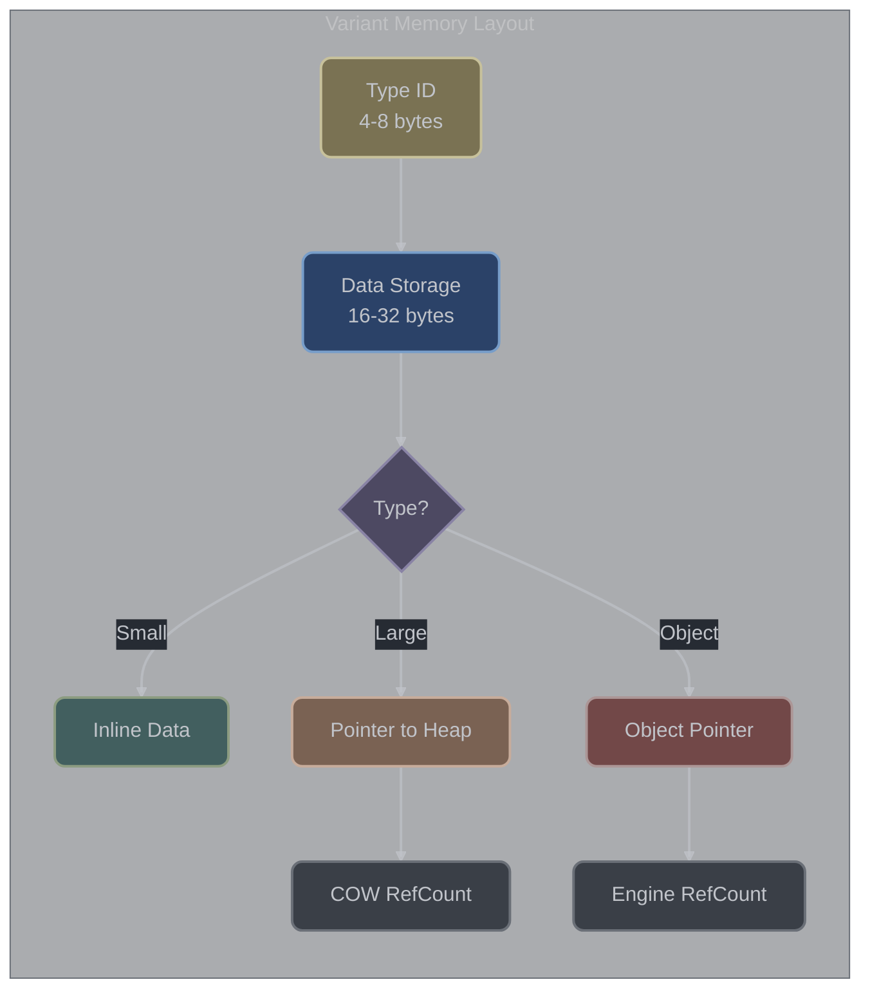

# Variant Implementation

## Overview

**Understanding Godot's universal data container:** The Variant type is Godot's solution to dynamic typing in a statically-typed C++ environment. Think of it as a "smart box" that can hold any Godot type - integers, strings, objects, arrays, dictionaries, or even custom classes. This flexibility is crucial for interfacing with GDScript, which is dynamically typed, and for creating generic APIs that work with unknown data types.

**Why variants exist:** In GDScript, you can write `var my_value = 42` and later `my_value = "hello"`. C++ doesn't naturally support this flexibility. Variants bridge this gap by providing a type-safe container that can hold any Godot type while preserving type information. This enables seamless data exchange between C++ extensions and GDScript code.

The Variant type is Godot's universal container that can hold any engine-supported type. In godot-cpp, it's implemented as an opaque byte array with all operations delegated through the GDExtension interface to maintain ABI stability.

**Key Source Files:**
- `include/godot_cpp/variant/variant.hpp` - Main Variant interface
- `src/variant/variant.cpp` - Implementation
- `include/godot_cpp/variant/variant_internal.hpp` - Internal access utilities
- `src/variant/variant_internal.cpp` - Internal implementation

> **When to Use Variant**:
> - **Use Variant**: For dynamic typing, interfacing with GDScript, storing heterogeneous collections
> - **Avoid Variant**: In performance-critical paths (10-50x slower than native types), when type is known at compile time
> - **Alternative**: Use typed containers (`TypedArray<T>`) or direct types when possible

## Memory Architecture

### Opaque Storage Structure

The Variant uses platform-dependent opaque storage ([variant.hpp:48](https://github.com/godotengine/godot-cpp/blob/master/include/godot_cpp/variant/variant.hpp#L48)):

```cpp
class Variant {
private:
    uint8_t opaque[GODOT_CPP_VARIANT_SIZE]{ 0 };  // Zero-initialized
};
```

### Platform-Specific Sizes

The `GODOT_CPP_VARIANT_SIZE` is determined at build time from `extension_api.json`:

| Platform | Size | Alignment | Stack Cost | Heap for Large Types |
|----------|------|-----------|------------|----------------------|
| 32-bit | 24 bytes | 4-byte | 6 ints | > 16 bytes |
| 64-bit | 40 bytes | 8-byte | 5 pointers | > 32 bytes |

> **Memory Strategy**: Small types (int, float, Vector2) are stored inline within the 24/40 bytes. Large types (Array, Dictionary, PackedArrays) store a pointer to heap-allocated data with COW semantics.

**Size extraction** (`binding_generator.py:358-359`):
```python
variant_size_source.append(f"#define GODOT_CPP_VARIANT_SIZE {builtin_sizes['Variant']}")
```

### Memory Layout Components

While the exact layout is opaque, the structure conceptually contains:



1. **Type Discriminator** (4-8 bytes)
   - Stores the Variant::Type enum value
   - Enables O(1) runtime type checking
   - First field for cache efficiency

2. **Data Storage** (16-32 bytes)
   - Inline storage for small types (no allocation)
   - Pointer storage for large/reference types
   - Union-like behavior but type-safe

3. **Reference Count** (where applicable)
   - Managed internally by the engine
   - COW for containers, RefCount for Objects
   - Not directly visible to C++ bindings

### Native Pointer Access

Access to the opaque storage ([variant.hpp:148](https://github.com/godotengine/godot-cpp/blob/master/include/godot_cpp/variant/variant.hpp#L148)):

```cpp
_FORCE_INLINE_ GDExtensionVariantPtr _native_ptr() const {
    return const_cast<uint8_t (*)[GODOT_CPP_VARIANT_SIZE]>(&opaque);
}
```

## Type System

### Supported Types

The Variant supports 40 distinct types ([variant.hpp:57](https://github.com/godotengine/godot-cpp/blob/master/include/godot_cpp/variant/variant.hpp#L57)):

| Category | Count | Storage | Performance | Common Use |
|----------|-------|---------|-------------|------------|
| Fundamental | 5 | Inline | Fastest | Basic values |
| Mathematical | 16 | Inline | Fast | Transforms, vectors |
| Engine | 9 | Mixed | Variable | Objects, collections |
| Packed Arrays | 10 | Heap/COW | Efficient | Bulk data |

#### Fundamental Types (5)
```cpp
NIL = 0,
BOOL = 1,
INT = 2,
FLOAT = 3,
STRING = 4,
```

#### Mathematical Types (16)
```cpp
VECTOR2 = 5,    VECTOR2I = 6,
RECT2 = 7,      RECT2I = 8,
VECTOR3 = 9,    VECTOR3I = 10,
TRANSFORM2D = 11,
VECTOR4 = 12,   VECTOR4I = 13,
PLANE = 14,
QUATERNION = 15,
AABB = 16,
BASIS = 17,
TRANSFORM3D = 18,
PROJECTION = 19,
```

#### Engine Types (9)
```cpp
COLOR = 20,
STRING_NAME = 21,
NODE_PATH = 22,
RID = 23,
OBJECT = 24,
CALLABLE = 25,
SIGNAL = 26,
DICTIONARY = 27,
ARRAY = 28,
```

#### Packed Arrays (10)
```cpp
PACKED_BYTE_ARRAY = 29,
PACKED_INT32_ARRAY = 30,
PACKED_INT64_ARRAY = 31,
PACKED_FLOAT32_ARRAY = 32,
PACKED_FLOAT64_ARRAY = 33,
PACKED_STRING_ARRAY = 34,
PACKED_VECTOR2_ARRAY = 35,
PACKED_VECTOR3_ARRAY = 36,
PACKED_COLOR_ARRAY = 37,
PACKED_VECTOR4_ARRAY = 38,
```

### Type Discrimination

Type checking ([variant.cpp:669](https://github.com/godotengine/godot-cpp/blob/master/src/variant/variant.cpp#L669)):

```cpp
Variant::Type Variant::get_type() const {
    return static_cast<Variant::Type>(
        internal::gdextension_interface_variant_get_type(_native_ptr())
    );
}
```

## Storage Mechanisms

### POD vs Reference Types

Types are categorized by storage requirements ([variant.cpp:743](https://github.com/godotengine/godot-cpp/blob/master/src/variant/variant.cpp#L743)):

#### Stack-Stored POD Types
No destructor needed, stored directly in Variant:
```cpp
static bool needs_deinit[Variant::VARIANT_MAX] = {
    false,  // NIL
    false,  // BOOL
    false,  // INT
    false,  // FLOAT
    // ... Vector2, Vector2i, Rect2, Rect2i, Vector3, Vector3i
    // ... Vector4, Vector4i, Plane, Quaternion, Color, RID
};
```

#### Reference/Heap Types
Require destruction, use heap allocation:
```cpp
    true,   // STRING
    true,   // STRING_NAME
    true,   // NODE_PATH
    // ... TRANSFORM2D, AABB, BASIS, TRANSFORM3D, PROJECTION
    true,   // OBJECT
    true,   // CALLABLE
    true,   // SIGNAL
    true,   // DICTIONARY
    true,   // ARRAY
    // ... All PACKED_*_ARRAY types
```

### Internal Storage Access

Direct internal access utilities ([variant_internal.hpp:201](https://github.com/godotengine/godot-cpp/blob/master/include/godot_cpp/variant/variant_internal.hpp#L201)):

```cpp
template <typename T>
class VariantInternal {
public:
    _FORCE_INLINE_ static T *get_internal_value(Variant *v) {
        return static_cast<T *>(
            get_internal_func[internal::VariantInternalType<T>::type](v)
        );
    }

    _FORCE_INLINE_ static const T *get_internal_value(const Variant *v) {
        return static_cast<const T *>(
            get_internal_func[internal::VariantInternalType<T>::type](
                const_cast<Variant *>(v)
            )
        );
    }
};
```

Function pointer initialization ([variant_internal.cpp:38](https://github.com/godotengine/godot-cpp/blob/master/src/variant/variant_internal.cpp#L38)):
```cpp
for (int i = 1; i < Variant::VARIANT_MAX; i++) {
    get_internal_func[i] = internal::gdextension_interface_variant_get_ptr_internal_getter(
        (GDExtensionVariantType)i
    );
}
```

## Type Conversion System

### Constructor-Based Conversions

Function pointer arrays for type conversions ([variant.cpp:44](https://github.com/godotengine/godot-cpp/blob/master/src/variant/variant.cpp#L44)):

```cpp
GDExtensionVariantFromTypeConstructorFunc from_type_constructor[Variant::VARIANT_MAX]{};
GDExtensionTypeFromVariantConstructorFunc to_type_constructor[Variant::VARIANT_MAX]{};
```

Initialization during setup ([variant.cpp:49](https://github.com/godotengine/godot-cpp/blob/master/src/variant/variant.cpp#L49)):
```cpp
from_type_constructor[i] = internal::gdextension_interface_get_variant_from_type_constructor(
    (GDExtensionVariantType)i
);
to_type_constructor[i] = internal::gdextension_interface_get_variant_to_type_constructor(
    (GDExtensionVariantType)i
);
```

### Conversion Matrix

The engine maintains a full conversion matrix for all type pairs:

#### Conversion Validation
```cpp
// Check if conversion possible (may lose data)
bool can_convert(Variant::Type p_to_type) const {
    return internal::gdextension_interface_variant_can_convert(
        get_type(), p_to_type
    );
}

// Check if conversion is lossless
bool can_convert_strict(Variant::Type p_to_type) const {
    return internal::gdextension_interface_variant_can_convert_strict(
        get_type(), p_to_type
    );
}
```

### Conversion Examples

#### Integer Conversions ([variant.cpp:274](https://github.com/godotengine/godot-cpp/blob/master/src/variant/variant.cpp#L274))
```cpp
Variant::operator int16_t() const {
    return static_cast<int16_t>(operator int64_t());  // Narrowing
}

Variant::operator int32_t() const {
    return static_cast<int32_t>(operator int64_t());  // Narrowing
}

Variant::operator int64_t() const {
    int64_t result;
    to_type_constructor[INT](
        &result,
        const_cast<GDExtensionVariantPtr>(_native_ptr())
    );
    return result;
}
```

#### Object Conversions ([variant.cpp:394](https://github.com/godotengine/godot-cpp/blob/master/src/variant/variant.cpp#L394))
```cpp
template <typename T>
Variant::operator T *() const {
    if (get_type() == OBJECT) {
        GDExtensionObjectPtr obj =
            internal::gdextension_interface_variant_get_ptr_object(
                _native_ptr()
            );
        return reinterpret_cast<T *>(
            internal::get_object_instance_binding(obj)
        );
    }
    return nullptr;
}
```

### Conversion Performance Matrix

| From\To | NIL | BOOL | INT | FLOAT | STRING | Object | Array | Dict |
|---------|-----|------|-----|-------|--------|--------|-------|------|
| NIL | - | O(1) | O(1) | O(1) | O(1) | O(1) | O(1) | O(1) |
| BOOL | O(1) | - | O(1) | O(1) | O(n) | X | X | X |
| INT | O(1) | O(1) | - | O(1) | O(n) | X | X | X |
| FLOAT | O(1) | O(1) | O(1) | - | O(n) | X | X | X |
| STRING | O(1) | O(n) | O(n) | O(n) | - | X | X | X |
| Object | O(1) | O(1) | X | X | O(n) | - | X | X |
| Array | O(1) | O(1) | X | X | O(n) | X | - | X |
| Dict | O(1) | O(1) | X | X | O(n) | X | X | - |

Legend: O(1)=constant, O(n)=linear, X=not allowed

## Copy-on-Write Implementation

### COW-Enabled Types

Reference-counted types with COW semantics:
- `String`, `StringName`, `NodePath`
- `Dictionary`, `Array`
- All `PackedArray` types
- Complex math types (`Transform2D`, `Basis`, `Transform3D`, `Projection`, `AABB`)

### Copy Semantics

#### Copy Constructor ([variant.cpp:83](https://github.com/godotengine/godot-cpp/blob/master/src/variant/variant.cpp#L83))
```cpp
Variant::Variant(const Variant &other) {
    internal::gdextension_interface_variant_new_copy(
        _native_ptr(),
        other._native_ptr()
    );
}
```

#### Move Constructor ([variant.cpp:87](https://github.com/godotengine/godot-cpp/blob/master/src/variant/variant.cpp#L87))
```cpp
Variant::Variant(Variant &&other) {
    std::swap(opaque, other.opaque);  // Optimized byte swap
}
```

#### Assignment Operators ([variant.cpp:653](https://github.com/godotengine/godot-cpp/blob/master/src/variant/variant.cpp#L653))
```cpp
Variant &Variant::operator=(const Variant &other) {
    clear();  // Release current value
    internal::gdextension_interface_variant_new_copy(
        _native_ptr(),
        other._native_ptr()
    );
    return *this;
}

Variant &Variant::operator=(Variant &&other) {
    std::swap(opaque, other.opaque);  // Optimized swap
    return *this;
}
```

### Reference Counting

Reference counting is entirely managed by the engine:

1. **Increment**: Happens during copy construction/assignment
2. **Decrement**: Happens during destruction/clear
3. **COW Trigger**: When modifying shared data (engine handles)

## Constructor and Destructor Patterns

### Typed Constructors

#### POD Type Construction ([variant.cpp:97](https://github.com/godotengine/godot-cpp/blob/master/src/variant/variant.cpp#L97))
```cpp
Variant::Variant(bool p_bool) {
    from_type_constructor[BOOL](_native_ptr(), &p_bool);
}

Variant::Variant(int64_t p_int) {
    from_type_constructor[INT](_native_ptr(), &p_int);
}

Variant::Variant(double p_float) {
    from_type_constructor[FLOAT](_native_ptr(), &p_float);
}
```

#### Reference Type Construction ([variant.cpp:110](https://github.com/godotengine/godot-cpp/blob/master/src/variant/variant.cpp#L110))
```cpp
Variant::Variant(const String &p_string) {
    from_type_constructor[STRING](_native_ptr(), &p_string);
}

Variant::Variant(const StringName &p_string_name) {
    from_type_constructor[STRING_NAME](_native_ptr(), &p_string_name);
}
```

#### Object Construction ([variant.cpp:152](https://github.com/godotengine/godot-cpp/blob/master/src/variant/variant.cpp#L152))
```cpp
Variant::Variant(const Object *p_object) {
    from_type_constructor[OBJECT](_native_ptr(), &p_object);
}
```

### Destructor Pattern ([variant.cpp:266](https://github.com/godotengine/godot-cpp/blob/master/src/variant/variant.cpp#L266))

```cpp
Variant::~Variant() {
    clear();
}

void Variant::clear() {
    if (needs_deinit[get_type()]) {
        internal::gdextension_interface_variant_destroy(_native_ptr());
    }
}
```

## Internal Access Patterns

### Direct Type Access

Specialized accessors for performance ([variant_internal.hpp:44](https://github.com/godotengine/godot-cpp/blob/master/include/godot_cpp/variant/variant_internal.hpp#L44)):

```cpp
// Integer access
_FORCE_INLINE_ static int64_t *get_int(Variant *v) {
    return static_cast<int64_t *>(
        get_internal_func[Variant::INT](v)
    );
}

// Float access
_FORCE_INLINE_ static double *get_float(Variant *v) {
    return static_cast<double *>(
        get_internal_func[Variant::FLOAT](v)
    );
}

// String access
_FORCE_INLINE_ static String *get_string(Variant *v) {
    return static_cast<String *>(
        get_internal_func[Variant::STRING](v)
    );
}

// Object access
_FORCE_INLINE_ static Object **get_object(Variant *v) {
    return static_cast<Object **>(
        get_internal_func[Variant::OBJECT](v)
    );
}
```

### Type-Safe Setters

Setting values with type safety ([variant_internal.hpp:216](https://github.com/godotengine/godot-cpp/blob/master/include/godot_cpp/variant/variant_internal.hpp#L216)):

```cpp
template <>
_FORCE_INLINE_ void VariantInternal::set<int64_t>(
    Variant *v,
    const int64_t &p_value
) {
    v->clear();
    internal::gdextension_interface_variant_new_copy(
        v->_native_ptr(),
        &Variant(p_value)
    );
}
```

## Operator Overloading

### Arithmetic Operators ([variant.cpp:797](https://github.com/godotengine/godot-cpp/blob/master/src/variant/variant.cpp#L797))

```cpp
// Addition
Variant Variant::operator+(const Variant &other) const {
    Variant result;
    internal::gdextension_interface_variant_evaluate(
        GDEXTENSION_VARIANT_OP_ADD,
        _native_ptr(),
        other._native_ptr(),
        result._native_ptr(),
        nullptr
    );
    return result;
}

// Multiplication
Variant Variant::operator*(const Variant &other) const {
    Variant result;
    internal::gdextension_interface_variant_evaluate(
        GDEXTENSION_VARIANT_OP_MULTIPLY,
        _native_ptr(),
        other._native_ptr(),
        result._native_ptr(),
        nullptr
    );
    return result;
}
```

### Comparison Operators ([variant.cpp:674](https://github.com/godotengine/godot-cpp/blob/master/src/variant/variant.cpp#L674))

```cpp
bool Variant::operator==(const Variant &other) const {
    bool result;
    internal::gdextension_interface_variant_evaluate(
        GDEXTENSION_VARIANT_OP_EQUAL,
        _native_ptr(),
        other._native_ptr(),
        &result,
        nullptr
    );
    return result;
}

bool Variant::operator<(const Variant &other) const {
    bool result;
    internal::gdextension_interface_variant_evaluate(
        GDEXTENSION_VARIANT_OP_LESS,
        _native_ptr(),
        other._native_ptr(),
        &result,
        nullptr
    );
    return result;
}
```

### Indexing Operators ([variant.cpp:916](https://github.com/godotengine/godot-cpp/blob/master/src/variant/variant.cpp#L916))

```cpp
Variant &Variant::operator[](const Variant &key) {
    return *VariantInternal::get_indexed_ptr(this, &key);
}

const Variant &Variant::operator[](const Variant &key) const {
    return *VariantInternal::get_indexed_ptr(
        const_cast<Variant *>(this),
        &key
    );
}
```

## Performance Characteristics

### Memory Overhead

| Type Category | Stack Size | Heap Usage | Reference Count |
|--------------|------------|------------|-----------------|
| NIL | 0 | 0 | No |
| BOOL | 1 byte | 0 | No |
| INT | 8 bytes | 0 | No |
| FLOAT | 8 bytes | 0 | No |
| Vector2/2i | 8-16 bytes | 0 | No |
| Vector3/3i | 12-24 bytes | 0 | No |
| STRING | pointer | variable | Yes |
| ARRAY | pointer | variable | Yes |
| DICTIONARY | pointer | variable | Yes |
| OBJECT | pointer | 0 | Yes (external) |
| PackedArrays | pointer | variable | Yes |

### Operation Costs

#### Construction Performance
```cpp
// Fast: POD types (direct copy)
Variant v(42);  // ~5-10 cycles

// Medium: Small structures
Variant v(Vector3(1, 2, 3));  // ~20-30 cycles

// Slow: Reference types (allocation + ref count)
Variant v(String("text"));  // ~100+ cycles
```

#### Type Checking
```cpp
// Single interface call
Variant::Type t = v.get_type();  // ~15-20 cycles
```

#### Conversion Costs
```cpp
// Fast: Compatible types
int64_t i = int_variant;  // ~10-15 cycles

// Slow: String parsing
int64_t i = string_variant;  // ~100+ cycles
```

#### Copy Operations
```cpp
// POD: Simple memory copy
Variant v2 = int_variant;  // ~10-15 cycles

// COW: Reference increment
Variant v2 = array_variant;  // ~20-30 cycles

// Move: Byte swap only
Variant v2 = std::move(v1);  // ~5-10 cycles
```

## String Encoding

### String Type Handling

The Variant handles three string types differently:

1. **String** - UTF-8 encoded, COW
2. **StringName** - Interned strings, COW
3. **NodePath** - Path strings, COW

### Encoding Conversions

String conversions handle encoding internally:

```cpp
// UTF-8 to Variant
Variant v(String::utf8("UTF-8 text"));

// Wide string support
Variant v(String(U"Unicode text"));

// StringName interning
Variant v(StringName("interned"));
```

## Error Handling

### Type Mismatch Handling

Invalid conversions return default values:

```cpp
// Returns 0 if not convertible to int
int64_t i = string_variant.operator int64_t();

// Returns nullptr if not an object
Object *obj = int_variant.operator Object*();
```

### Validation Methods

```cpp
// Type checking
bool is_nil() const { return get_type() == NIL; }
bool is_bool() const { return get_type() == BOOL; }
bool is_num() const {
    return get_type() == INT || get_type() == FLOAT;
}

// Conversion validation
bool can_convert(Type p_to_type) const;
bool can_convert_strict(Type p_to_type) const;
```

### Error States

The Variant has no explicit error state - operations that fail return default values or NIL variants.

## Thread Safety

### Non-Thread-Safe Operations

The Variant itself is **not thread-safe**:
- No mutex protection on operations
- Concurrent access undefined behavior
- User must synchronize access

### Thread-Safe Components

The engine provides thread-safe reference counting:
- Atomic increment/decrement
- COW ensures isolated modifications
- But Variant operations still need external synchronization

### Safe Patterns

```cpp
// Thread-local variants
thread_local Variant tl_variant;

// Mutex-protected access
std::mutex variant_mutex;
{
    std::lock_guard<std::mutex> lock(variant_mutex);
    shared_variant = new_value;
}

// Immutable sharing (read-only)
const Variant immutable = create_variant();
// Safe to read from multiple threads
```

## ABI Compatibility

### Opaque Design Benefits

1. **Version Independence**: Internal layout changes don't break bindings
2. **Platform Abstraction**: Different architectures handled transparently
3. **Engine Evolution**: New types can be added without breaking existing code

### Interface Stability

All operations go through stable C interface:

```cpp
// Stable function pointers
typedef void (*GDExtensionVariantFromTypeConstructorFunc)(
    GDExtensionUninitializedVariantPtr,
    GDExtensionConstTypePtr
);

typedef void (*GDExtensionTypeFromVariantConstructorFunc)(
    GDExtensionUninitializedTypePtr,
    GDExtensionVariantPtr
);
```

### Binary Compatibility Rules

1. **Never access opaque array directly**
2. **Always use interface functions**
3. **Size determined at compile time**
4. **Function pointers initialized at runtime**

## Implementation Examples

### Type-Safe Wrapper

```cpp
template <typename T>
class TypedVariant {
    Variant v;

public:
    TypedVariant(const T &value) : v(value) {}

    T get() const {
        if (v.get_type() != variant_type<T>::value) {
            return T{};  // Default value
        }
        return v.operator T();
    }

    bool is_valid() const {
        return v.get_type() == variant_type<T>::value;
    }
};
```

### Performance-Optimized Access

```cpp
// Fast path for known types
void process_variant(const Variant &v) {
    switch (v.get_type()) {
        case Variant::INT: {
            int64_t *val = VariantInternal::get_int(
                const_cast<Variant*>(&v)
            );
            // Direct access without conversion
            process_int(*val);
            break;
        }
        case Variant::FLOAT: {
            double *val = VariantInternal::get_float(
                const_cast<Variant*>(&v)
            );
            process_float(*val);
            break;
        }
        default:
            // Fallback to conversion
            process_generic(v);
    }
}
```

### Custom Variant Storage

```cpp
class VariantPool {
    std::vector<Variant> pool;
    std::queue<size_t> available;

public:
    size_t allocate(const Variant &v) {
        if (available.empty()) {
            pool.push_back(v);
            return pool.size() - 1;
        }
        size_t idx = available.front();
        available.pop();
        pool[idx] = v;
        return idx;
    }

    void release(size_t idx) {
        pool[idx].clear();
        available.push(idx);
    }
};
```

## Conclusion

The Variant implementation in godot-cpp provides a robust, type-safe universal container that maintains ABI stability through an opaque design. While this introduces some performance overhead compared to direct type manipulation, it ensures binary compatibility across engine versions and platforms. The sophisticated COW implementation and comprehensive type conversion system make it suitable for dynamic typing scenarios while the internal access patterns provide optimization opportunities for performance-critical code.
